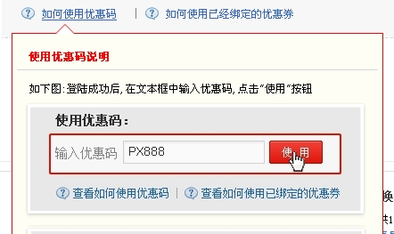

##CSS实现带箭头的DIV

##
## 毕业设计要做一个提示框：当鼠标放在某个链接上时，下边显示有提示功能的窗体。如下：

##
## 

##
## 具体代码实现如下：

##
##　　　 CSS：

	 1 .rhsyyhqDIV{
 2     position:absolute;
 3     top:555px;
 4     left:200px;
 5     font-size: 9pt;
 6     display:block;
 7     height:335px;
 8     width:405px;
 9     background-color:transparent;
10     display: none;
11 	}
12 
13 s{
14     position:absolute;
15     top:-20px;
16     left:50px;
17     display:block;
18     height:0;
19     width:0;
20     font-size: 0; 
21     line-height: 0;
22     border-color:transparent transparent #FA0505 transparent;
23     border-style:dashed dashed solid dashed;
24     border-width:10px;
25 	}
26 
27 i{
28     position:absolute;
29     top:-9px;
30     *top:-9px;
31     left:-10px;
32     display:block;
33     height:0;
34     width:0;
35     font-size: 0;
36     line-height: 0;
37     border-color:transparent transparent #FFFFFF transparent;
38     border-style:dashed dashed solid dashed;
39     border-width:10px;
40 	}
41 
42 .rhsyyhqDIV .content{
43     border:1px solid #FA0505;
44     -moz-border-radius:3px;
45     -webkit-border-radius:3px;
46     position:absolute;
47     background-color:#FEFEF4;
48     width:100%;
49     height:100%;
50     padding:5px;
51     *top:-2px;
52     *border-top:1px solid #FA0505;
53     *border-top:1px solid #FA0505;
54     *border-left:none;
55     *border-right:none;
56     *height:102px;
57 	}


##
##

##
##HTML

	 1     

 2         

 3             

 4                 使用优惠码说明
 5             

 6             

 7                 <ul>
 8                     <li> 如下图:登陆成功后,在文本框中输入优惠码,点击"使用"按钮</li>
 9                     <li></li>
10                     <li></li>
11                 </ul>
12             

13         

14         <s><i></i></s>
15     



##
##

##
## 