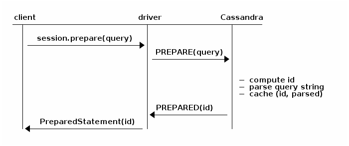
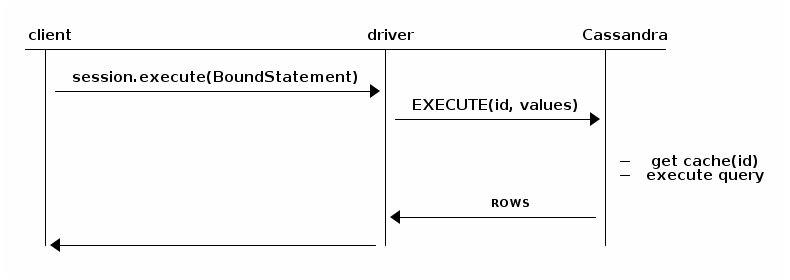

## 前言

接着上篇博客，我们来谈谈java操作cassandra; 上篇博客的环境：jdk1.7 + python2.7.10 + cassandra2.2.8;
由于2.2.8没有对应的驱动文档，那么我们就用3.0的驱动文档，而驱动则用2.1.10.3版本;

驱动文档：<http://docs.datastax.com/en/developer/java-driver/3.0/manual/>

路漫漫其修远兮，吾将上下而求索！

github：[https://github.com/youzhibing](https://github.com/youzhibing)

码云(gitee)：[https://gitee.com/youzhibing](https://gitee.com/youzhibing)

## 驱动下载

老规矩，创建maven工程，让maven来维护我们的jar，maven最重要的pom文件内容如下：

    
    
    <project xmlns="http://maven.apache.org/POM/4.0.0" xmlns:xsi="http://www.w3.org/2001/XMLSchema-instance"
        xsi:schemaLocation="http://maven.apache.org/POM/4.0.0 http://maven.apache.org/xsd/maven-4.0.0.xsd">
        <modelVersion>4.0.0</modelVersion>
    
        <groupId>com.huawei</groupId>
        <artifactId>cassandra</artifactId>
        <version>0.0.1-SNAPSHOT</version>
        <packaging>jar</packaging>
    
        <name>cassandra</name>
        <url>http://maven.apache.org</url>
    
        <properties>
            <project.build.sourceEncoding>UTF-8</project.build.sourceEncoding>
        </properties>
    
        <dependencies>
           <dependency>
                <groupId>com.datastax.cassandra</groupId>
                <artifactId>cassandra-driver-core</artifactId>
                <version>2.1.10.3</version>
            </dependency>
        </dependencies>
    </project>

## Session获取

我们先来看看官方给的Quick start案例

    
    
    Cluster cluster = null;
            try {
                cluster = Cluster.builder()                                                    // (1)
                        .addContactPoint("127.0.0.1")                   　　　　　　　　　　　　　 // cassandra服务器ip
                        .withCredentials("admin", "admin")                                     // 若没有启用账号认证，此处可以去掉
                        .build();
                Session session = cluster.connect();                                           // (2)
    
                ResultSet rs = session.execute("select release_version from system.local");    // (3)
                Row row = rs.one();
                System.out.println(row.getString("release_version"));                          // (4)
            } finally {
                if (cluster != null) cluster.close();                                          // (5)
            }

我们来看看代码中的(1) ~ (5)分别表示或者代表什么

(1)：Cluster对象是驱动程序的主入口点，它保存着真实Cassandra集群的状态(尤其是元数据)；Cluster是线程安全的，一个Cassandra集群创建一个Cluster的单例，整个应用用这一个单例即可

(2)：Session用来执行查询的，而且它也是线程安全的，同样也应该重复利用

(3)：利用execute来发送一个查询到Cassandra，execute返回一个Resultset(结果集),这个结果集就是必要的列的行集合(二维表，行是满足条件的记录，列是我们关注的某些字段)

(4)：从row中提取数据

(5)：当任务完成后，关闭cluster，关闭cluster的同时将会关闭它创建的全部session；这一步很重要，它会释放潜在的资源(TCP连接、线程池等)，在真实的应用中，我们应该在应用关闭(或应用卸载)的时候关闭cluster

如若大家有jdbc开发的经验，就会发现，上述代码似曾相识，上述代码中的session就相当于jdbc中的connection，是整个数据库操作的基础，那么我们将session的获取单独抽出来

    
    
    package com.huawei.cassandra.factory;
    
    import java.util.concurrent.locks.Lock;
    import java.util.concurrent.locks.ReentrantLock;
    
    import com.datastax.driver.core.Cluster;
    import com.datastax.driver.core.Session;
    
    public class SessionRepository
    {
        private static Session instance = null;
        private static Cluster cluster = null;
        private static Lock lock = new ReentrantLock();
        
        private SessionRepository(){}
        
        public static Session getSession()
        {
            if (null == instance)
            {
                try
                {
                    lock.lock();
                    
                    if (null == instance)
                    {
                        cluster = Cluster.builder()       
                                .addContactPoint("127.0.0.1")                
                                .withCredentials("admin", "admin")              
                                .build();
                        instance = cluster.connect();
                        // 也可以针对一个特定的keyspace获取一个session
                        // instance = cluster.connect("mycas");
                    }
                }
                finally
                {
                    lock.unlock();
                }
            }
            return instance;
        }
        
        public static void close()
        {
            if (null == cluster)
            {
                try
                {
                    lock.lock();
                    
                    if (null == cluster)
                    {
                        cluster.close();
                    }
                }
                finally
                {
                    lock.unlock();
                }
            }
        }
    }

View Code

拿到session了，那么请随意操作Cassandra吧！

## cassandra基本操作

###  创建表

在mycas下创建表student

    
    
    use mycas;
    create table student(
        id int,
        address text,
        name text,
        age int,
        height int,
        primary key(id,address,name)
    );
    
    insert into student(id,address,name,age,height) values(1,"guangdong","lixiao",32,172);

###  session直接执行cql

和jdbc类似，关键是cql的拼接，下例是插入一条记录，删、改、查和这类似，不一一列举了

    
    
    　　　　// 字符串注意单引号"
            String cql = "insert into mycas.student(id,address,name,age,height) values(" 
                    + student.getId() + ","" + student.getAddress() + "","" + student.getName()
                    + ""," + student.getAge() + "," + student.getHeight() + ");";
            System.out.println(cql);
            session.execute(cql);

###  Querybuilder

利用Querybuilder可以减轻cql的拼接，sql语句的拼接由驱动完成

####  查询一个student：

    
    
        @Override
        public Student getStudentByKeys(int id, String address, String name)
        {
            Student student = null;
            ResultSet rs = session.execute(
                    QueryBuilder.select("id", "address", "name", "age", "height")
                    .from("mycas", "student")
                    .where(QueryBuilder.eq("id", id))
                    .and(QueryBuilder.eq("address", address))
                    .and(QueryBuilder.eq("name", name)));
            Iterator<Row> rsIterator = rs.iterator();
            if (rsIterator.hasNext())
            {
                Row row = rsIterator.next();
                student = new Student();
                student.setAddress(row.getString("address"));
                student.setAge(row.getInt("age"));
                student.setHeight(row.getInt("height"));
                student.setId(row.getInt("id"));
                student.setName(row.getString("name"));
            }
            return student;
        }

####  保存一个student：

    
    
    　　@Override
        public void saveStudent(Student student)
        {
            session.execute(
                    QueryBuilder.insertInto("mycas", "student")
                    .values(new String[]{"id", "address", "name", "age", "height"},
                            new Object[]{student.getId(), student.getAddress(), 
                                student.getName(), student.getAge(), student.getHeight()}));
        }

####  修改一个student:

    
    
    @Override
        public void updateStudent(Student student)
        {
            session.execute(
                    QueryBuilder.update("mycas", "student")
                    .with(QueryBuilder.set("age", student.getAge()))
                    .and(QueryBuilder.set("height", student.getHeight()))
                    .where(QueryBuilder.eq("id", student.getId()))
                    .and(QueryBuilder.eq("address", student.getAddress()))
                    .and(QueryBuilder.eq("name", student.getName())));
        }

####  删除一个student：

    
    
    @Override
        public void removeStudent(int id, String address, String name)
        {
            session.execute(QueryBuilder.delete()
                    .from("mycas", "student")
                    .where(QueryBuilder.eq("id", id))
                    .and(QueryBuilder.eq("address", address))
                    .and(QueryBuilder.eq("name", name)));
        }

注意：驱动版本不同，Querybuilder的用法有些许不同，有些版本的某些方法变成非静态的了！

###  占位符

cassandra也有类似jdbc那样使用预编译占位符

<http://docs.datastax.com/en/developer/java-
driver/3.0/manual/statements/prepared/>

预编译的原理是怎样的了，上面的链接是驱动官方的解释，我来谈谈我的理解

当我们预编译statement的时候，Cassandra会解析query语句，缓存解析的结果并返回一个唯一的标志(`PreparedStatement对象保持着这个标志的内部引用，就相当于通过标志可以获取到query语句预编译后的内容`)：

当你绑定并且执行预编译statement的时候，驱动只会发送这个标志，那么Cassandra就会跳过解析query语句的过程：

所以，我们应该保证query语句只应该被预编译一次，缓存`PreparedStatement` 到我们的应用中（`PreparedStatement`
是线程安全的）；如果我们对同一个query语句预编译了多次，那么驱动会打印警告日志；如果一个query语句只执行一次，那么预编译不会提供性能上的提高，反而会降低性能，因为它是两个来回(结合上面两张图)，那么此时可以考虑用
[simple statement](http://docs.datastax.com/en/developer/java-
driver/3.0/manual/statements/simple/) 来代替

和jdbc的预编译非常类似，我们来看看实际代码

####  静态cql

    
    
    　　private static final String GET_STUDENT = "select id,address,name,age,height from mycas.student where id=? and address=? and name=?;";
    　　private static final String SAVE_STUDENT = "insert into mycas.student(id,address,name,age,height) values(?,?,?,?,?);";
    　　private static final String UPDATE_STUDENT = "update mycas.student set age=?, height=? where id=? and address=? and name=?;";
    　　private static final String REMOVE_STUDENT = "delete from mycas.student where id=? and address=? and name=?;";

####  查询一个student

    
    
    　　　　 Student student = null;
            PreparedStatement prepareStatement = session.prepare(GET_STUDENT);
            BoundStatement bindStatement = new BoundStatement(prepareStatement).bind(id, address, name);
            ResultSet rs = session.execute(bindStatement);
            Iterator<Row> rsIterator = rs.iterator();
            if (rsIterator.hasNext())
            {
                Row row = rsIterator.next();
                student = new Student();
                student.setAddress(row.getString("address"));
                student.setAge(row.getInt("age"));
                student.setHeight(row.getInt("height"));
                student.setId(row.getInt("id"));
                student.setName(row.getString("name"));
            }
            return student;

####  保存一个student

    
    
            PreparedStatement prepareStatement = session.prepare(SAVE_STUDENT);
            BoundStatement bindStatement = new BoundStatement(prepareStatement)
                .bind(student.getId(), student.getAddress(), student.getName(), student.getAge(), student.getHeight());
            session.execute(bindStatement);

####  修改一个student

    
    
    　　　　 PreparedStatement prepareStatement = session.prepare(UPDATE_STUDENT);
            BoundStatement bindStatement = new BoundStatement(prepareStatement)
                .bind(student.getAge(), student.getHeight(), student.getId(), student.getAddress(), student.getName());
            session.execute(bindStatement);

####  删除一个student

    
    
    　　　　 PreparedStatement prepareStatement = session.prepare(REMOVE_STUDENT);
            BoundStatement bindStatement = new BoundStatement(prepareStatement)
                .bind(id, address, name);
            session.execute(bindStatement);

###  批量batch

    
    
    public static void batch()
        {
            Session session = SessionRepository.getSession();
            BoundStatement insertBind1 = new BoundStatement(
                    session.prepare("insert into mycas.student(id,address,name,age,height) values(?,?,?,?,?);"))
                           .bind(3, "guangxi", "huangfeihong", 67, 175);
            
            BoundStatement insertBind2 = new BoundStatement(
                    session.prepare("insert into mycas.student(id,address,name,age,height) values(?,?,?,?,?);"))
                           .bind(4, "hunan", "youzhibing", 26, 160);
            
            BoundStatement updateBind = new BoundStatement(
                    session.prepare("update mycas.student set age=?, height=? where id=? and address=? and name=?;"))
                           .bind(72, 173, 3, "guangxi", "huangfeihong");
            
            BoundStatement deleteBind = new BoundStatement(
                    session.prepare("delete from mycas.student where id=? and address=? and name=?;"))
                           .bind(4, "hunan", "youzhibing");
            
            BatchStatement batchStatement = new BatchStatement();
            batchStatement.add(insertBind1);
            batchStatement.add(insertBind2);
            batchStatement.add(updateBind);
            batchStatement.add(deleteBind);
            session.execute(batchStatement);
        }

View Code

## 参考与代码附件

[java实现cassandra的增删改查](http://zhaoyanblog.com/archives/180.html)

[基本操作demo](http://files.cnblogs.com/files/youzhibing/src.rar)

