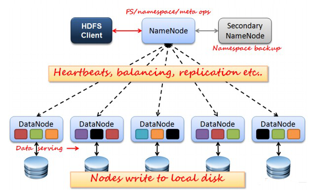
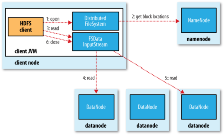
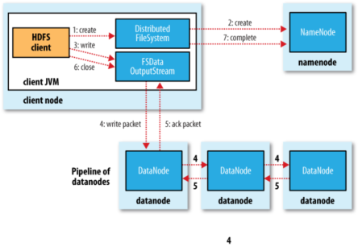

**HDFS介绍**

HDFS（Hadoop Distributed File System ）Hadoop分布式文件系统。是根据google发表的论文翻版的。

**什么是分布式文件系统**

分布式文件系统（Distributed File
System）是指文件系统管理的物理存储资源不一定直接连接在本地节点上，而是通过计算机网络与节点相连。分布式文件系统的设计基于客户机/服务器模式。

**[优点]**

**支持超大文件** 超大文件在这里指的是几百M，几百GB，甚至几TB大小的文件。

**检测和快速应对硬件故障**
在集群的环境中，硬件故障是常见的问题。因为有上千台服务器连接在一起，这样会导致高故障率。因此故障检测和自动恢复是hdfs文件系统的一个设计目标

**流式数据访问** 应用程序能以流的形式访问数据集。主要的是数据的吞吐量，而不是访问速度。

**简化的一致性模型**
大部分hdfs操作文件时，需要一次写入，多次读取。在hdfs中，一个文件一旦经过创建、写入、关闭后，一般就不需要修改了。这样简单的一致性模型，有利于提高吞吐量。

**[** **缺点** **]**

**低延迟数据访问**
如和用户进行交互的应用，需要数据在毫秒或秒的范围内得到响应。由于hadoop针对高数据吞吐量做了优化，牺牲了获取数据的延迟，所以对于低延迟来说，不适合用hadoop来做。

**大量的小文件**
Hdfs支持超大的文件，是通过数据分布在数据节点，数据的元数据保存在名字节点上。名字节点的内存大小，决定了hdfs文件系统可保存的文件数量。虽然现在的系统内存都比较大，但大量的小文件还是会影响名字节点的性能。

**多用户写入文件、修改文件** Hdfs的文件只能有一次写入，不支持写入，也不支持修改。只有这样数据的吞吐量才能大。

**不支持超强的事务** 没有像关系型数据库那样，对事务有强有力的支持。

**[HDFS结构]**

****

**NameNode** ：分布式文件系统中的管理者，主要负责管理文件系统的命名空间、集群配置信息和存储块的复制等。NameNode会将文件系统的Meta-
data存储在内存中，这些信息主要包括了文件信息、每一个文件对应的文件块的信息和每一个文件块在DataNode的信息等。

**SecondaryNameNode** ：合并fsimage和fsedits然后再发给namenode。

**DataNod** **e** ：是文件存储的基本单元，它将Block存储在本地文件系统中，保存了Block的Meta-
data同时周期性地将所有存在的Block信息发送给NameNode。

**Client** ：就是需要获取分布式文件系统文件的应用程序。

**fsimage** :元数据镜像文件（文件系统的目录树。）

**edits** ：元数据的操作日志（针对文件系统做的修改操作记录）

**Na** **meNode** **、DataNode和Client之间通信方式：**

client和namenode之间是通过rpc通信；

datanode和namenode之间是通过rpc通信；

client和datanode之间是通过简单的socket通信。

**Client读取HDFS中数据的流程**

1\. 客户端通过调用FileSystem对象的open()方法打开希望读取的文件。

2\. DistributedFileSystem通过使用RPC来调用namenode,以确定文件起始块的位置。 **[注1]**

3\. Client对输入流调用read()方法。

4\. 存储着文件起始块的natanoe地址的DFSInputStream **[** **注2]**
随即链接距离最近的datanode。通过对数据流反复调用read()方法，可以将数据从datanode传输到Client。 **[注3]**

5\. 到达快的末端时，DFSInputStream会关闭与该datanode的连接，然后寻找下一个快递最佳datanode。

6\.
Client读取数据是按照卡开DFSInputStream与datanode新建连接的顺序读取的。它需要询问namenode来检索下一批所需要的datanode的位置。一旦完成读取，调用FSDataInputStream调用close()方法。

**[注1** **]**
：对于每一个块，namenode返回存在该块副本的datanode地址。这些datanode根据他们于客户端的距离来排序，如果客户端本身就是一个datanode，并保存有响应数据块的一个副本时，该节点从本地datanode中读取数据。

**[注2]** :Di是tribute File
System类返回一个FSDataInputStream对象给Client并读取数据。FSDataInputStream类转而封装DFSInputStream对象，该对象管理datanode和namenode的I/O。

**[注3]**
:如果DFSInputStream在与datanode通信时遇到错误，它便会尝试从这个块的另外一个最临近datanode读取数据。它也会记住哪个故障的natanode，以保证以后不回反复读取该节点上后续的块。DFSInputStream也会通过校验和确认从datanode发来的数据是否完整。如果发现一个损坏的块，它就会在DFSinputStream视图从其他datanode读取一个块的副本之前通知namenode。

**C** **lient将数据写入HDFS流程**

1\. Client调用DistributedFileSystem对象的create()方法，创建一个文件输出流

2\. DistributedFileSystem对namenode创建一个RPC调用，在文件系统的命名空间中创建一个新文件。

3\.
Namenode执行各种不同的检查以确保这个文件不存在，并且客户端有创建该文件的权限。如果这些检查均通过，namenode就会为创建新文件记录一条记录，否则，文件创建失败，向Client抛出IOException，DistributedFileSystem向Client返回一个FSDataOutputStream队形，Client可以开始写入数据。

4\.
DFSOutputStream将它分成一个个的数据包，并写入内部队列。DataStreamer处理数据队列，它的责任时根据datanode列表来要求namenode分配适合新块来存储数据备份。这一组datanode构成一个管线
---
我们假设副本数为3，管路中有3个节点，DataStreamer将数据包流式床书到管线中第一个datanode，该dananode存储数据包并将它发送到管线中的第二个datanode，同样地，第二个datanode存储该数据包并且发送给管县中的第3个。

5\. DFSOutputStream也维护着一个内部数据包队列来等待datanode的收到确认回执（ack
queue）。当收到管道中所有datanode确认信息后，该数据包才会从确认队列删除。[注1]

6\. Client完成数据的写入后，回对数据流调用close()方法

7\. 将剩余所有的数据包写入datanode管线中，并且在练习namenode且发送文件写入完成信号之前。

**[** **注1** **]**
：如果在数据写入期间，datanode发生故障，则：1.关闭管线，确认把队列中的任何数据包添加回数据队列的最前端，一去到故障节点下游的datanode不回漏包。2.为存储在另一个正常datanode的当前数据块指定一个新的标志，并将给标志传给namenode，以便故障datanode在恢复后可以删除存储的部分数据块。3.从管线中删除故障数据节点，并且把余下的数据块写入管线中的两个正常的datanode。namenode注意到副本量不足时，会在另一个节点上创建一个新的副本。

