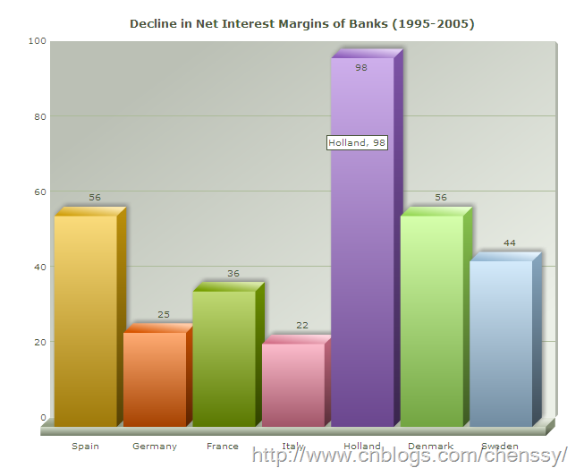
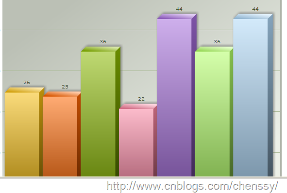
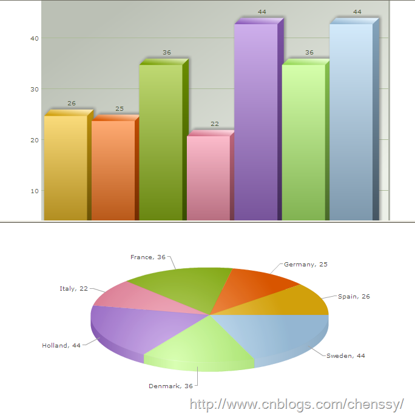
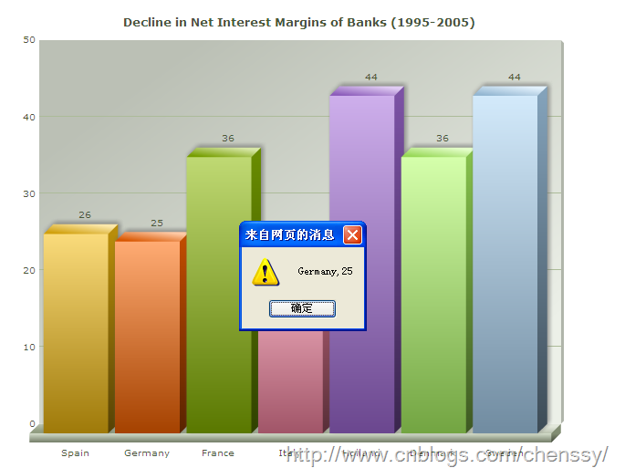

前面介绍的FusionCharts都是对FusionCharts的基本属性进行操作，下面几篇博文就FusionCharts的高级特性做一个介绍，包括：添加下钻链接、使用Style样式定制图表、网格组件的使用、导出为图片等等。

在我们开发的过程中，我们可能会需要这样一种需求。当客户点击图表的某个柱子时或者圆饼时，可以看到更加详细的信息。对于这样的需求我们称之为下钻。FusionCharts对下钻提供了非常好的支持。在前面我们就知道使用FusionCharts我们只需要关心数据是如何产生的，不需要关系图像是如何生成的，所以下钻对于FusionCharts是非常简单的。对于FusionCharts下钻而言我们只需要添加一个链接即可。

FusionCharts目前支持一下几种下钻形式。

1、 同一窗口实现钻取

2、 新窗口中实现钻取

3、 在指定的frame中实现钻取

4、 在弹出窗口实现钻取

5、 触发js函数

# 一、 同一窗口实现下钻

想要在FusionCharts中添加链接非常简单，在<set…/>元素中添加link属性即可。如下

    
    
    <chart caption="Decline in Net Interest Margins of Banks (1995-2005)">
        <set label="Spain" value="56" color="F6BD0F" link="../myFusionChart_02/newLink.html"/> 
        <set label="Germany" value="25" color="FF6600" link="showDetailFCS%3Fname%3DGermany"/> 
        <set label="France" value="36" color="8BBA00"link="../myFusionChart_02/newLink.html"/> 
        <set label="Italy" value="22" color="F984A1" link="showDetailFCS%3Fname%3DItaly"/> 
        <set label="Holland" value="98" color="A66EDD"link="../myFusionChart_02/newLink.html"/> 
        <set label="Denmark" value="56" color="B2FF66" link="../myFusionChart_02/newLink.html"/> 
        <set label="Sweden" value="44" color="AFD8F8" link="showDetailFCS%3Fname%3DSweden"/> 
    </chart>

如果把上面的数据用柱状图像来显示的话，就如下图。

当我们把鼠标放在柱子上面时，鼠标会变成链接的形式，点击就可以进入新的页面。

可能有朋友对上面某些link的形式不理解。其实在前面就已经提过由于xml对特殊字符?、&、=不能识别，所以FusionCharts对这些不能支持的特殊字符提供了转义的支持。所以如果link链接中存在如?、&等特殊字符，我们就需要进行解码操作了。

对于：link="showDetailFCS%3Fname%3DSweden"转义之后就会变成：

link="showDetailFCS?name=Sweden"。

# 二、 新窗口中实现下钻

要在新窗口中实现钻取，只需要在link属性的链接值中添加n-即可。如：

<set label="France" value="36"
color="8BBA00"link="n-../myFusionChart_02/newLink.html"/>

Xml Example：

    
    
    <chart caption="Decline in Net Interest Margins of Banks (1995-2005)">
        <set label="Spain" value="56" color="F6BD0F" link="n-../myFusionChart_02/newLink.html"/> 
        <set label="Germany" value="25" color="FF6600" link="n-../myFusionChart_02/newLink.html"/> 
        <set label="France" value="36" color="8BBA00"link="n-../myFusionChart_02/newLink.html"/> 
        <set label="Italy" value="22" color="F984A1" link="n-../myFusionChart_02/newLink.html"/> 
        <set label="Holland" value="98" color="A66EDD"link="n-../myFusionChart_02/newLink.html"/> 
        <set label="Denmark" value="56" color="B2FF66" link="n-../myFusionChart_02/newLink.html"/> 
        <set label="Sweden" value="44" color="AFD8F8" link="n-../myFusionChart_02/newLink.html"/> 
    </chart>

# 三、 在指定的frame中实现钻取

要在frame中显示钻取图像，需要在link属性中添加F-name，其中name表明frame的名称。所以link为:F-frameName..
/myFusionChart_02/newLink.html。

Example XML:

    
    
    <chart caption="Decline in Net Interest Margins of Banks (1995-2005)">
        <set label="Spain" value="26" color="F6BD0F" link="F-newLinkFrame-../myFusionChart_02/newLink.html"/> 
        <set label="Germany" value="25" color="FF6600" link="F-newLinkFrame-../myFusionChart_02/newLink.html"/> 
        <set label="France" value="36" color="8BBA00"link="F-newLinkFrame-../myFusionChart_02/newLink.html"/> 
        <set label="Italy" value="22" color="F984A1" link="F-newLinkFrame-../myFusionChart_02/newLink.html"/> 
        <set label="Holland" value="44" color="A66EDD"link="F-newLinkFrame-../myFusionChart_02/newLink.html"/> 
        <set label="Denmark" value="36" color="B2FF66" link="F-newLinkFrame-../myFusionChart_02/newLink.html"/> 
        <set label="Sweden" value="44" color="AFD8F8" link="F-newLinkFrame-../myFusionChart_02/newLink.html"/> 
    </chart>

Html：

    
    
    <html>
    <head>
    </head>
    <frameset rows="350,*" cols="*" frameborder="YES" border="1" framespacing="0">
    <frame src="../myFusionChart_02/myFusionChart_02.html" name="myFusionChartFrame" scrolling="Auto" noresize >
    <frame src="" name="newLinkFrame" scrolling="Auto" noresize>
    </frameset>
    </html>

点击之前

点击之后

# 四、 在弹出窗口实现钻取

在弹出窗口实现钻取使用p-。例如

<set label="Spain" value="26" color="F6BD0F"
link="P-111111,width=600,height=500,toolbar=no,
scrollbars=no,resizable=no-../myFusionChart_02/newLink.html"/>

这里P-表示在弹出窗口中显示。

111111表示弹出窗口的名字。

width=600,height=500,toolbar=no, scrollbars=no:弹出窗口的各个属性值。

resizable=no-../myFusionChart_02/newLink.html 链接的内容

可指定弹出窗口的属性：

height：弹出窗口高度，pixels

width: 宽度

resizable：窗口大小是否可变，若=yes表示可通过拖动边或角进行窗口的放大或缩小；Value = yes or no, 1 or 0.

Scrollbars：是否显示横向和纵向滚动条，Value = yes or no, 1 or 0.

Menubar：是否在顶部显示菜单栏，Value = yes or no, 1 or 0.

Toolbar：是否显示工具条，包括前进、后退、停止等工具按钮，Value = yes or no, 1 or 0.

Location：是否显示url地址栏，Value = yes or no, 1 or 0.

Directories：是否显示附加工具条，Value = yes or no, 1 or 0.

Status：是否在页面下方显示状态栏， Value = yes or no, 1 or 0.

Left：指定弹出窗口距左侧宽度，单位pixels，此属性应用于IE，Netscape用screenX

Top：指定弹出窗口距顶部宽度，单位pixels，此属性应用于IE，Netscape用screenY

Fullscreen：是否以全屏打开，只用于ie；

    
    
    <chart caption="Decline in Net Interest Margins of Banks (1995-2005)">
        <set label="Spain" value="26" color="F6BD0F" link="P-111111,width=600,height=500,toolbar=no, scrollbars=no,resizable=no-../myFusionChart_02/newLink.html"/> 
        <set label="Germany" value="25" color="FF6600" link="P-111111,width=600,height=500,toolbar=no, scrollbars=no,resizable=no-../myFusionChart_02/newLink.html"/> 
        <set label="France" value="36" color="8BBA00"link="P-111111,width=600,height=500,toolbar=no, scrollbars=no,resizable=no-../myFusionChart_02/newLink.html"/> 
        <set label="Italy" value="22" color="F984A1" link="P-111111,width=600,height=500,toolbar=no, scrollbars=no,resizable=no-../myFusionChart_02/newLink.html"/> 
        <set label="Holland" value="44" color="A66EDD"link="P-111111,width=600,height=500,toolbar=no, scrollbars=no,resizable=no-../myFusionChart_02/newLink.html"/> 
        <set label="Denmark" value="36" color="B2FF66" link="P-111111,width=600,height=500,toolbar=no, scrollbars=no,resizable=no-../myFusionChart_02/newLink.html"/> 
        <set label="Sweden" value="44" color="AFD8F8" link="P-111111,width=600,height=500,toolbar=no, scrollbars=no,resizable=no-../myFusionChart_02/newLink.html"/> 
    </chart>

# 五、 触发js函数

除了使用上面的链接形式，FusionCharts还支持javascript函数来触发。使用方法

<set label="USA" value="235" link="j- showData (" Spain’,26)"/>

j-：触发js函数myJS(),注意，其中不能用分号。

或者

<set label="USA" value="235" link=" JavaScript:showData("Spain,26")"/>

FusionCharts v3.1以上版本，还可用下面这种形式j-{user function name}-{parameter}：

<set label="USA" value="235" link="j- showData – Spain,26"/>

Example XML

    
    
    <chart caption="Decline in Net Interest Margins of Banks (1995-2005)">
        <set label="Spain" value="26" color="F6BD0F" link="JavaScript:showData("Spain,26")"/> 
        <set label="Germany" value="25" color="FF6600"link="JavaScript:showData("Germany,25")"/> 
        <set label="France" value="36" color="8BBA00"link="JavaScript:showData("France,36")"/> 
        <set label="Italy" value="22" color="F984A1" link="JavaScript:showData("Italy,22")"/> 
        <set label="Holland" value="44" color="A66EDD"link="JavaScript:showData("Holland,44")"/> 
        <set label="Denmark" value="36" color="B2FF66"link="JavaScript:showData("Denmark,36")"/> 
        <set label="Sweden" value="44" color="AFD8F8" link="JavaScript:showData("Sweden,44")"/> 
    </chart>

HTML

    
    
    <html>
        <head>
            <title>这是第一个fusionChart 图形</title>
            
            
        </head>
        <body bgcolor="#ffffff">
            


             
        </body>
    </html>

