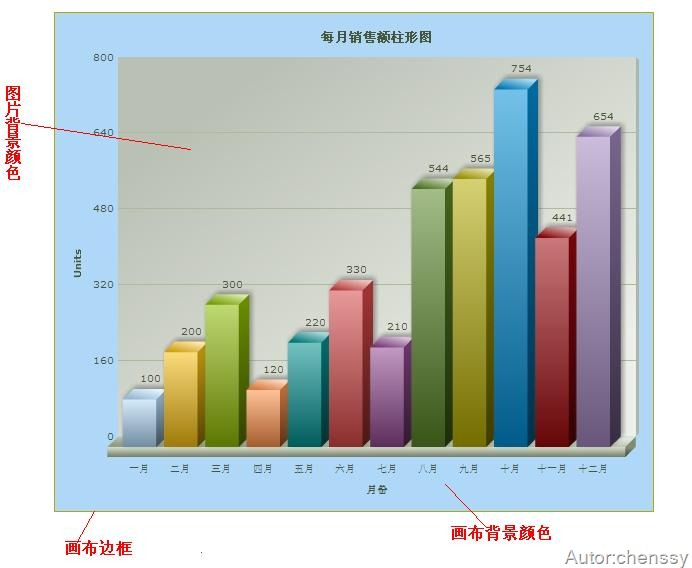
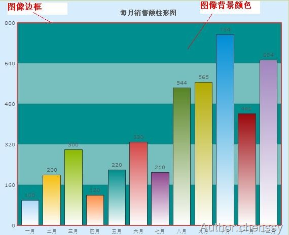
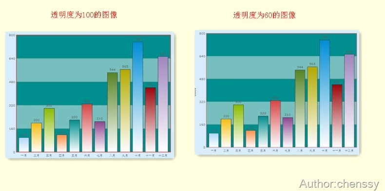
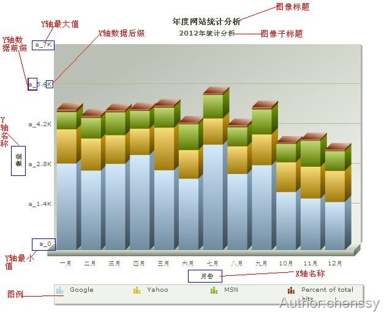
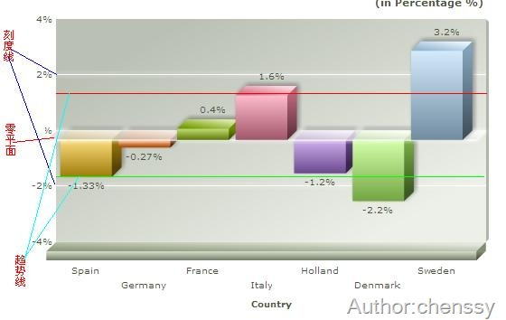
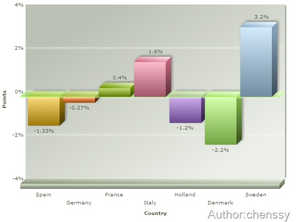
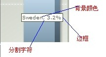
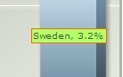

##FusionCharts简单教程(三)-----FusionCharts的基本属性

##
## 通过前面两章的讲解我们可以制作出简单的图像，但是有时候我们需要对图像进行一个精确的规划，比如设置背景颜色、设置提示信息、设置间隔颜色等等，这时就需要我们对FusionCharts的细节有比较详细的了解，只有了解了这些最基本的元素才能制作出我们想要的图像。  

##
## FusionCharts的基本元素主要包括如下几个方面：图像背景和画布、图形标签、刻度线标签、提示信息、数据。  一、图像背景和画布。  

##
## 这个标签类主要是用于设置图像的背景、边框和对整个画布进行设置。  

##
##   

##
##                              

##
##属性名称                              

##
##属性说明                              

##
##示例或说明                                            

##
##bgColor                              

##
##背景颜色                              

##
##bgColor="999999,FFFFF渐变 bgColor=’999999’ 单色                                            

##
##bgAlpha                              

##
##背景透明度                              

##
##设置范围在1-100                                            

##
##showBorder                              

##
##图表外是否显示边框                              

##
##默认二维图表显示，三维不显示                                            

##
##borderColor                              

##
##边框颜色                              

##
##十六进制表示去掉前面的#号                                            

##
##borderThickness                              

##
##边框线的粗细                              

##
##像素表示                                            

##
##borderAlpha                              

##
##边框透明度                                                      

##
##bgSWF                              

##
##背景图片或动画                              

##
##保证此图片和SWF文件在同一个文件夹                                            

##
##bgSWFAlpha                              

##
##设置背景图片的透明度                                   上面是对整个画布进行控制、设置，其实我们还可以对二维的图像进行设置，其中包括：背景图片、边框以及透明度。  

##
##   

##
##  

##
##                              

##
##属性名称                              

##
##属性说明                              

##
##示例或说明                                            

##
##canvasbgColor                              

##
##图表背景颜色                              

##
##可设置单色也可以使用梯度设置渐变色                                            

##
##canvasbgAlpha                              

##
##图表背景透明度                              

##
##设置范围在1-100                                            

##
##canvasBorderColor                              

##
##图表背景边框颜色                                                      

##
##canvasBorderThickness                              

##
##图表背景边框线粗细                                                      

##
##canvasBorderAlpha                              

##
##图表背景边框透明度                                  

##
## 对于透明度而已，它会随着值的变大而越不明显。下面是透明度为100和60的比较(注意边框的变化)，  

##
##   二、图形标签  

##
## 图形标签主要是用于表现图像的数据轴、名称、字体等等及其相关的属性的设置。  
##2.1图表名称  

##
## 通过图表的名称属性我们可以设置图形的名称、子名称、X、Y轴的名称。  

##
##                                

##
##属性名称                              

##
##属性说明                              

##
##示例或说明                                            

##
##caption                              

##
##标题                                                      

##
##subcaption                              

##
##子标题                                                      

##
##xAxisName                              

##
##X轴名称                                                      

##
##yAxisName                              

##
##Y轴名称                                                      

##
##rotateYAxisName                              

##
##Y轴名称是否旋转的显示                                                      

##
##rotateNames                              

##
##X轴名称是否旋转的显示                              

##
##slantLabels=’1’时，斜45度，否则斜90度竖排                        
##2.2字体属性  

##
##                               

##
##属性名称                              

##
##属性说明                              

##
##示例或说明                                            

##
##outCnvbaseFont                              

##
##Canvas外面的字体                              

##
##即标题、子标题、X/Y轴名称字体                                            

##
##outCnvbaseFontSize                              

##
##Canvas外面的字体大小                              

##
##范围在0-72                                            

##
##outCnvbaseFontColor                              

##
##Canvas外面的字体颜色                                                      

##
##baseFont                              

##
##Canvas里面的字体                                                      

##
##baseFontSize                              

##
##Canvas里面的字体大小                                                      

##
##baseFontColor                              

##
##Canvas里面的字体颜色                                  
##2.3数据轴属性  

##
##                               

##
##属性名称                              

##
##属性说明                              

##
##示例或说明                                            

##
##showLabels                              

##
##是否显示X轴标签名称                              

##
##默认显示                                            

##
##showYAxisValues                              

##
##是否显示Y轴标签名称                              

##
##默认显示                                            

##
##numberPrefix                              

##
##Y轴数据加上前缀                              

##
##如numberPrefix = ‘a’                                            

##
##numberSuffix                              

##
##Y轴数据加上后缀                              

##
##如numberPrefix = ‘b’                                            

##
##formatNumberScale                              

##
##是否格式化数字,默认为1(True),自动的给你的数字加上K（千）或M（百万）；若取0,则不加K或M                              

##
##formatNumberScale=’0’即可去除掉这个’k’                                            

##
##labelDisplay                              

##
##标签显示格式                              

##
##WRAP（重叠）ROTATE（旋转）Stagger（交错）                                            

##
##slantLabels                              

##
##标签旋转显示时的倾斜角度                                                      

##
##staggerLines                              

##
##标签交错显示时的交错行数                                                      

##
##labelStep                              

##
##横轴标签隔几个显示                                                      

##
##yAxisValuesStep                              

##
##纵轴标签隔几个显示                                                      

##
##yAxisMinValue                              

##
##Y轴坐标的最小值                                                      

##
##yAxisMaxValue                              

##
##Y轴坐标的最大值                                                      

##
##xAxisMinValue                              

##
##X轴坐标的最小值                                                      

##
##xAxisMaxValue                              

##
##X轴坐标的最大值                                  
##2.4图例相关属性  

##
##                               

##
##属性名称                              

##
##属性说明                              

##
##示例或说明                                            

##
##showLegend                              

##
##是否显示图例说明                              

##
##默认显示                                            

##
##legendPosition                              

##
##设置图例说明的位置                                                      

##
##legendBgColor                              

##
##设置图例说明的背景颜色                                                      

##
##legendBgAlpha                              

##
##设置图例说明的背景透明度                                                      

##
##legendBorderColor                              

##
##设置图例说明的边框颜色                                                      

##
##legendBorderThickness                              

##
##设置图例说明的边框粗细                                                      

##
##legendBorderAlpha                              

##
##设置图例说明的边框透明度                                                      

##
##legendShadow                              

##
##是否显示为图例说明显示阴影                                                      

##
##legendScrollBgColor                              

##
##设置图例说明滚动条的背景颜色                              

##
##当图例说明中有很多事件时                                            

##
##legendScrollBarColor                              

##
##设置图例说明滚动条的颜色                              

##
##当图例说明中有很多事件时                                            

##
##egendScrollBtnColor                              

##
##设置图例说明滚动条的按钮的颜色                              

##
##当图例说明中有很多事件时                        
##2.53D图表属性  

##
##                               

##
##属性名称                              

##
##属性说明                              

##
##示例或说明                                            

##
##view2D()                              

##
##以二维的形式显示                              

##
##3D图表已有的方法接口                                            

##
##view3D()                              

##
##以三维的形式显示                              

##
##3D图表已有的方法接口                                            

##
##resetView()                              

##
##重置，恢复到原先的角度                              

##
##3D图表已有的方法接口                                            

##
##rotateView(x,y)                              

##
##旋转到所选的角度                              

##
##3D图表已有的方法接口                                            

##
##getViewAngles()                              

##
##获得当前图表所处的横纵角度                              

##
##var a=getViewAngles();            

##
##alert(a.xAng); alert(a.yAng);                                            

##
##cameraAngX                              

##
##设置图表角度（横轴角度）                              

##
##0 to 360/0 to -360默认为30度                                            

##
##cameraAngY                              

##
##设置图表角度（纵轴角度）                              

##
##0 to 360/0 to -360默认为-45度                                            

##
##startAngX                              

##
##设置图表开始的角度（横轴角度）                              

##
##0 to 360/0 to -360                                            

##
##endAngX                              

##
##设置图表结束的角度（横轴角度）                              

##
##0 to 360/0 to -360                                            

##
##startAngY                              

##
##设置图表开始的角度（纵轴角度）                              

##
##0 to 360/0 to -360                                            

##
##endAngY                              

##
##设置图表结束的角度（纵轴角度）                              

##
##0 to 360/0 to -360                                            

##
##dynamicShading                              

##
##是否设置光源影响                                                      

##
##lightAngX                              

##
##设置光源的角度（横轴角度）                              

##
##0 to 360/0 to -360                                            

##
##lightAngY                              

##
##设置光源的角度（纵轴角度）                              

##
##0 to 360/0 to -360                                            

##
##YZWallDepth                              

##
##设置yz面的深度                                                      

##
##ZXWallDepth                              

##
##设置zx面的深度                                                      

##
##XYWallDepth                              

##
##设置xy面的深度                                                      

##
##clustered                              

##
##图表是否嵌入显示                              

##
##默认前后重叠显示                        三、刻度线  

##
## 在刻度线标签中我们可以设置零平面、刻度线和趋势线。  

##
##   
##3.1零平面  

##
##                               

##
##属性名称                              

##
##属性说明                              

##
##示例或说明                                            

##
##zeroPlaneColor                              

##
##设置零线（面）的颜色                                                      

##
##zeroPlaneThickness                              

##
##设置零线（面）的粗细                                                      

##
##zeroPlaneAlpha                              

##
##设置零线（面）的透明度                                                      

##
##zeroPlaneShowBorder                              

##
##是否显示零面的外框                              

##
##只针对3D图表                                            

##
##zeroPlaneBorderColor                              

##
##设置零面外框的颜色                              

##
##只针对3D图表                        
##3.2刻度线  

##
##                               

##
##属性名称                              

##
##属性说明                              

##
##示例或说明                                            

##
##divLineColor                              

##
##设置div的颜色                                                      

##
##divLineThickness                              

##
##设置div的线条粗细                              

##
##1-5                                            

##
##divLineAlpha                              

##
##设置div的线条透明度                              

##
##1-100                                            

##
##divLineIsDashed                              

##
##设置div是否虚线显示                                                      

##
##showAlternateHGridColor                              

##
##设置div块是否高亮显示                                                      

##
##vDivLineColor                              

##
##设置垂直div的颜色                                                      

##
##vDivLineThickness                              

##
##设置垂直div的线条粗细                                                      

##
##vDivLineAlpha                              

##
##设置垂直div的线条透明度                                                      

##
##vDivLineIsDashed                              

##
##设置垂直div是否虚线显示                                                      

##
##showAlternateVGridColor                              

##
##设置垂直div块是否高亮显示                              

##
##alternateVGridAlpha (透明度)                        

##
##   

##
## 上面图像将零平面颜色设置为绿色、刻度线颜色为白色、粗细为1、虚线显示(如果虚线实现，粗细最好<=2否则就不清晰)。  
##3.3趋势线  

##
##                               

##
##属性名称                              

##
##属性说明                              

##
##示例或说明                                            

##
##dashed                              

##
##是否虚线显示                              

##
##默认实线显示                                            

##
##dashLen                              

##
##设置虚线长度                                                      

##
##dashGap                              

##
##设置虚线间隙宽度                                                      

##
##startValue                              

##
##起始值                              

##
##单个时一条横线，有结束值时，两点连线                                            

##
##endValue                              

##
##结束值                                                      

##
##displayvalue                              

##
##线标示                                                      

##
##valueOnRight                              

##
##设置displayvalue显示右边                              

##
##valueOnRight ="1"                                            

##
##color                              

##
##设置线颜色                                  四、提示信息  

##
## 当我们将鼠标放在某快数据区域的时候，提示信息就会显示相应的提示内容，包括数据、所属“单位”、以及一些用户设置的信息。通过如下几个属性我们定制自己的提示信息。  

##
##                                  

##
##属性名称                              

##
##属性说明                              

##
##示例或说明                                            

##
##showToolTip                              

##
##鼠标放上去是否显示提示                              

##
##Set属性里可自定义设置toolText                                            

##
##toolText                              

##
##自定义提示框显示的内容                                                      

##
##toolTipBorderColor                              

##
##提示框边框的颜色                                                      

##
##toolTipBgColor                              

##
##提示框背景颜色                                  

##
##  五、数据格式  

##
##                               

##
##decimals                              

##
##设置小数点后面保留的位数                                                      

##
##forceDecimals                              

##
##是否强制保留小数点后面的decimals设置的位数                                                      

##
##formatNumberScale                              

##
##是否按默认的数据格式显示                                                      

##
##decimalSeparator                              

##
##小数点的分隔表示方式                              

##
##默认‘.’                                            

##
##thousandSeparator                              

##
##千分位的分隔表示方式                              

##
##默认‘,’                                            

##
##numberScaleValue                              

##
##两个联合一起使用，定义数据标度                              

##
##numberScaleValue="1000,1000,1000"                                            

##
##numberScaleUnit                              

##
##numberScaleUnit="K,M,B"                                            

##
##numberPrefix                              

##
##数字显示的前缀                              

##
##numberPrefix="$"                                            

##
##numberSuffix                              

##
##数字显示的后缀                               