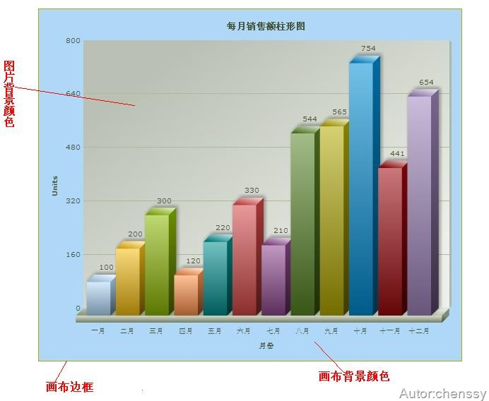
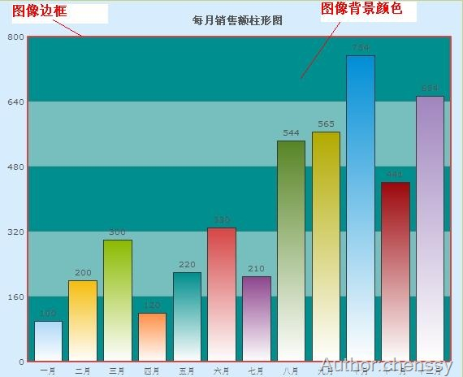
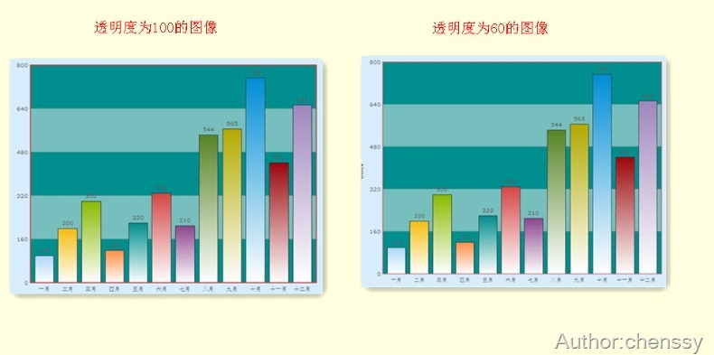
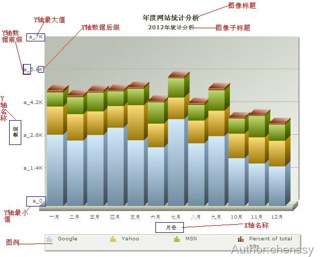
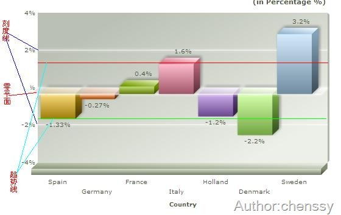
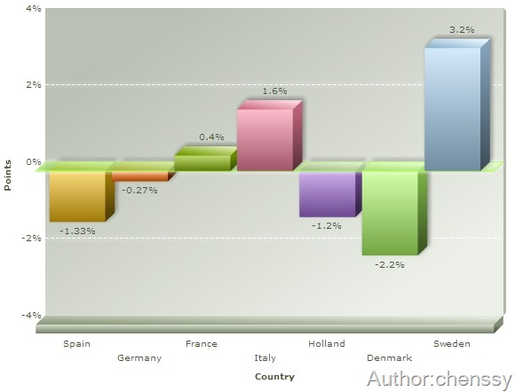
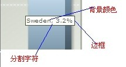
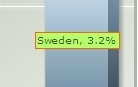

通过前面两章的讲解我们可以制作出简单的图像，但是有时候我们需要对图像进行一个精确的规划，比如设置背景颜色、设置提示信息、设置间隔颜色等等，这时就需要我们对FusionCharts的细节有比较详细的了解，只有了解了这些最基本的元素才能制作出我们想要的图像。

FusionCharts的基本元素主要包括如下几个方面：图像背景和画布、图形标签、刻度线标签、提示信息、数据。

# 一、图像背景和画布。

这个标签类主要是用于设置图像的背景、边框和对整个画布进行设置。

  
  
<table>  
<tr>  
<td>

属性名称

</td>  
<td>

属性说明

</td>  
<td>

示例或说明

</td> </tr>  
<tr>  
<td>

bgColor

</td>  
<td>

背景颜色

</td>  
<td>

bgColor="999999,FFFFF渐变 bgColor=’999999’ 单色

</td> </tr>  
<tr>  
<td>

bgAlpha

</td>  
<td>

背景透明度

</td>  
<td>

设置范围在1-100

</td> </tr>  
<tr>  
<td>

showBorder

</td>  
<td>

图表外是否显示边框

</td>  
<td>

默认二维图表显示，三维不显示

</td> </tr>  
<tr>  
<td>

borderColor

</td>  
<td>

边框颜色

</td>  
<td>

十六进制表示去掉前面的#号

</td> </tr>  
<tr>  
<td>

borderThickness

</td>  
<td>

边框线的粗细

</td>  
<td>

像素表示

</td> </tr>  
<tr>  
<td>

borderAlpha

</td>  
<td>

边框透明度

</td>  
<td>

</td> </tr>  
<tr>  
<td>

bgSWF

</td>  
<td>

背景图片或动画

</td>  
<td>

保证此图片和SWF文件在同一个文件夹

</td> </tr>  
<tr>  
<td>

bgSWFAlpha

</td>  
<td>

设置背景图片的透明度

</td>  
<td>

</td> </tr> </table> 上面是对整个画布进行控制、设置，其实我们还可以对二维的图像进行设置，其中包括：背景图片、边框以及透明度。

  
  
<table>  
<tr>  
<td>

属性名称

</td>  
<td>

属性说明

</td>  
<td>

示例或说明

</td> </tr>  
<tr>  
<td>

canvasbgColor

</td>  
<td>

图表背景颜色

</td>  
<td>

可设置单色也可以使用梯度设置渐变色

</td> </tr>  
<tr>  
<td>

canvasbgAlpha

</td>  
<td>

图表背景透明度

</td>  
<td>

设置范围在1-100

</td> </tr>  
<tr>  
<td>

canvasBorderColor

</td>  
<td>

图表背景边框颜色

</td>  
<td>

</td> </tr>  
<tr>  
<td>

canvasBorderThickness

</td>  
<td>

图表背景边框线粗细

</td>  
<td>

</td> </tr>  
<tr>  
<td>

canvasBorderAlpha

</td>  
<td>

图表背景边框透明度

</td>  
<td>

</td> </tr> </table>

对于透明度而已，它会随着值的变大而越不明显。下面是透明度为100和60的比较(注意边框的变化)，

# 二、图形标签

图形标签主要是用于表现图像的数据轴、名称、字体等等及其相关的属性的设置。

## 2.1图表名称

通过图表的名称属性我们可以设置图形的名称、子名称、X、Y轴的名称。

  
  
<table>  
<tr>  
<td>

属性名称

</td>  
<td>

属性说明

</td>  
<td>

示例或说明

</td> </tr>  
<tr>  
<td>

caption

</td>  
<td>

标题

</td>  
<td>

</td> </tr>  
<tr>  
<td>

subcaption

</td>  
<td>

子标题

</td>  
<td>

</td> </tr>  
<tr>  
<td>

xAxisName

</td>  
<td>

X轴名称

</td>  
<td>

</td> </tr>  
<tr>  
<td>

yAxisName

</td>  
<td>

Y轴名称

</td>  
<td>

</td> </tr>  
<tr>  
<td>

rotateYAxisName

</td>  
<td>

Y轴名称是否旋转的显示

</td>  
<td>

</td> </tr>  
<tr>  
<td>

rotateNames

</td>  
<td>

X轴名称是否旋转的显示

</td>  
<td>

slantLabels=’1’时，斜45度，否则斜90度竖排

</td> </tr> </table>

## 2.2字体属性  
  
<table>  
<tr>  
<td>

属性名称

</td>  
<td>

属性说明

</td>  
<td>

示例或说明

</td> </tr>  
<tr>  
<td>

outCnvbaseFont

</td>  
<td>

Canvas外面的字体

</td>  
<td>

即标题、子标题、X/Y轴名称字体

</td> </tr>  
<tr>  
<td>

outCnvbaseFontSize

</td>  
<td>

Canvas外面的字体大小

</td>  
<td>

范围在0-72

</td> </tr>  
<tr>  
<td>

outCnvbaseFontColor

</td>  
<td>

Canvas外面的字体颜色

</td>  
<td>

</td> </tr>  
<tr>  
<td>

baseFont

</td>  
<td>

Canvas里面的字体

</td>  
<td>

</td> </tr>  
<tr>  
<td>

baseFontSize

</td>  
<td>

Canvas里面的字体大小

</td>  
<td>

</td> </tr>  
<tr>  
<td>

baseFontColor

</td>  
<td>

Canvas里面的字体颜色

</td>  
<td>

</td> </tr> </table>

## 2.3数据轴属性  
  
<table>  
<tr>  
<td>

属性名称

</td>  
<td>

属性说明

</td>  
<td>

示例或说明

</td> </tr>  
<tr>  
<td>

showLabels

</td>  
<td>

是否显示X轴标签名称

</td>  
<td>

默认显示

</td> </tr>  
<tr>  
<td>

showYAxisValues

</td>  
<td>

是否显示Y轴标签名称

</td>  
<td>

默认显示

</td> </tr>  
<tr>  
<td>

numberPrefix

</td>  
<td>

Y轴数据加上前缀

</td>  
<td>

如numberPrefix = ‘a’

</td> </tr>  
<tr>  
<td>

numberSuffix

</td>  
<td>

Y轴数据加上后缀

</td>  
<td>

如numberPrefix = ‘b’

</td> </tr>  
<tr>  
<td>

formatNumberScale

</td>  
<td>

是否格式化数字,默认为1(True),自动的给你的数字加上K（千）或M（百万）；若取0,则不加K或M

</td>  
<td>

formatNumberScale=’0’即可去除掉这个’k’

</td> </tr>  
<tr>  
<td>

labelDisplay

</td>  
<td>

标签显示格式

</td>  
<td>

WRAP（重叠）ROTATE（旋转）Stagger（交错）

</td> </tr>  
<tr>  
<td>

slantLabels

</td>  
<td>

标签旋转显示时的倾斜角度

</td>  
<td>

</td> </tr>  
<tr>  
<td>

staggerLines

</td>  
<td>

标签交错显示时的交错行数

</td>  
<td>

</td> </tr>  
<tr>  
<td>

labelStep

</td>  
<td>

横轴标签隔几个显示

</td>  
<td>

</td> </tr>  
<tr>  
<td>

yAxisValuesStep

</td>  
<td>

纵轴标签隔几个显示

</td>  
<td>

</td> </tr>  
<tr>  
<td>

yAxisMinValue

</td>  
<td>

Y轴坐标的最小值

</td>  
<td>

</td> </tr>  
<tr>  
<td>

yAxisMaxValue

</td>  
<td>

Y轴坐标的最大值

</td>  
<td>

</td> </tr>  
<tr>  
<td>

xAxisMinValue

</td>  
<td>

X轴坐标的最小值

</td>  
<td>

</td> </tr>  
<tr>  
<td>

xAxisMaxValue

</td>  
<td>

X轴坐标的最大值

</td>  
<td>

</td> </tr> </table>

## 2.4图例相关属性  
  
<table>  
<tr>  
<td>

属性名称

</td>  
<td>

属性说明

</td>  
<td>

示例或说明

</td> </tr>  
<tr>  
<td>

showLegend

</td>  
<td>

是否显示图例说明

</td>  
<td>

默认显示

</td> </tr>  
<tr>  
<td>

legendPosition

</td>  
<td>

设置图例说明的位置

</td>  
<td>

</td> </tr>  
<tr>  
<td>

legendBgColor

</td>  
<td>

设置图例说明的背景颜色

</td>  
<td>

</td> </tr>  
<tr>  
<td>

legendBgAlpha

</td>  
<td>

设置图例说明的背景透明度

</td>  
<td>

</td> </tr>  
<tr>  
<td>

legendBorderColor

</td>  
<td>

设置图例说明的边框颜色

</td>  
<td>

</td> </tr>  
<tr>  
<td>

legendBorderThickness

</td>  
<td>

设置图例说明的边框粗细

</td>  
<td>

</td> </tr>  
<tr>  
<td>

legendBorderAlpha

</td>  
<td>

设置图例说明的边框透明度

</td>  
<td>

</td> </tr>  
<tr>  
<td>

legendShadow

</td>  
<td>

是否显示为图例说明显示阴影

</td>  
<td>

</td> </tr>  
<tr>  
<td>

legendScrollBgColor

</td>  
<td>

设置图例说明滚动条的背景颜色

</td>  
<td>

当图例说明中有很多事件时

</td> </tr>  
<tr>  
<td>

legendScrollBarColor

</td>  
<td>

设置图例说明滚动条的颜色

</td>  
<td>

当图例说明中有很多事件时

</td> </tr>  
<tr>  
<td>

egendScrollBtnColor

</td>  
<td>

设置图例说明滚动条的按钮的颜色

</td>  
<td>

当图例说明中有很多事件时

</td> </tr> </table>

## 2.53D图表属性  
  
<table>  
<tr>  
<td>

属性名称

</td>  
<td>

属性说明

</td>  
<td>

示例或说明

</td> </tr>  
<tr>  
<td>

view2D()

</td>  
<td>

以二维的形式显示

</td>  
<td>

3D图表已有的方法接口

</td> </tr>  
<tr>  
<td>

view3D()

</td>  
<td>

以三维的形式显示

</td>  
<td>

3D图表已有的方法接口

</td> </tr>  
<tr>  
<td>

resetView()

</td>  
<td>

重置，恢复到原先的角度

</td>  
<td>

3D图表已有的方法接口

</td> </tr>  
<tr>  
<td>

rotateView(x,y)

</td>  
<td>

旋转到所选的角度

</td>  
<td>

3D图表已有的方法接口

</td> </tr>  
<tr>  
<td>

getViewAngles()

</td>  
<td>

获得当前图表所处的横纵角度

</td>  
<td>

var a=getViewAngles();

alert(a.xAng); alert(a.yAng); ****

</td> </tr>  
<tr>  
<td>

cameraAngX

</td>  
<td>

设置图表角度（横轴角度）

</td>  
<td>

0 to 360/0 to -360默认为30度

</td> </tr>  
<tr>  
<td>

cameraAngY

</td>  
<td>

设置图表角度（纵轴角度）

</td>  
<td>

0 to 360/0 to -360默认为-45度

</td> </tr>  
<tr>  
<td>

startAngX

</td>  
<td>

设置图表开始的角度（横轴角度）

</td>  
<td>

0 to 360/0 to -360

</td> </tr>  
<tr>  
<td>

endAngX

</td>  
<td>

设置图表结束的角度（横轴角度）

</td>  
<td>

0 to 360/0 to -360

</td> </tr>  
<tr>  
<td>

startAngY

</td>  
<td>

设置图表开始的角度（纵轴角度）

</td>  
<td>

0 to 360/0 to -360

</td> </tr>  
<tr>  
<td>

endAngY

</td>  
<td>

设置图表结束的角度（纵轴角度）

</td>  
<td>

0 to 360/0 to -360

</td> </tr>  
<tr>  
<td>

dynamicShading

</td>  
<td>

是否设置光源影响

</td>  
<td>

</td> </tr>  
<tr>  
<td>

lightAngX

</td>  
<td>

设置光源的角度（横轴角度）

</td>  
<td>

0 to 360/0 to -360

</td> </tr>  
<tr>  
<td>

lightAngY

</td>  
<td>

设置光源的角度（纵轴角度）

</td>  
<td>

0 to 360/0 to -360

</td> </tr>  
<tr>  
<td>

YZWallDepth

</td>  
<td>

设置yz面的深度

</td>  
<td>

</td> </tr>  
<tr>  
<td>

ZXWallDepth

</td>  
<td>

设置zx面的深度

</td>  
<td>

</td> </tr>  
<tr>  
<td>

XYWallDepth

</td>  
<td>

设置xy面的深度

</td>  
<td>

</td> </tr>  
<tr>  
<td>

clustered

</td>  
<td>

图表是否嵌入显示

</td>  
<td>

默认前后重叠显示

</td> </tr> </table>

# 三、刻度线

在刻度线标签中我们可以设置零平面、刻度线和趋势线。

## 3.1零平面  
  
<table>  
<tr>  
<td>

属性名称

</td>  
<td>

属性说明

</td>  
<td>

示例或说明

</td> </tr>  
<tr>  
<td>

zeroPlaneColor

</td>  
<td>

设置零线（面）的颜色

</td>  
<td>

</td> </tr>  
<tr>  
<td>

zeroPlaneThickness

</td>  
<td>

设置零线（面）的粗细

</td>  
<td>

</td> </tr>  
<tr>  
<td>

zeroPlaneAlpha

</td>  
<td>

设置零线（面）的透明度

</td>  
<td>

</td> </tr>  
<tr>  
<td>

zeroPlaneShowBorder

</td>  
<td>

是否显示零面的外框

</td>  
<td>

只针对3D图表

</td> </tr>  
<tr>  
<td>

zeroPlaneBorderColor

</td>  
<td>

设置零面外框的颜色

</td>  
<td>

只针对3D图表

</td> </tr> </table>

## 3.2刻度线  
  
<table>  
<tr>  
<td>

属性名称

</td>  
<td>

属性说明

</td>  
<td>

示例或说明

</td> </tr>  
<tr>  
<td>

divLineColor

</td>  
<td>

设置div的颜色

</td>  
<td>

</td> </tr>  
<tr>  
<td>

divLineThickness

</td>  
<td>

设置div的线条粗细

</td>  
<td>

1-5

</td> </tr>  
<tr>  
<td>

divLineAlpha

</td>  
<td>

设置div的线条透明度

</td>  
<td>

1-100

</td> </tr>  
<tr>  
<td>

divLineIsDashed

</td>  
<td>

设置div是否虚线显示

</td>  
<td>

</td> </tr>  
<tr>  
<td>

showAlternateHGridColor

</td>  
<td>

设置div块是否高亮显示

</td>  
<td>

</td> </tr>  
<tr>  
<td>

vDivLineColor

</td>  
<td>

设置垂直div的颜色

</td>  
<td>

</td> </tr>  
<tr>  
<td>

vDivLineThickness

</td>  
<td>

设置垂直div的线条粗细

</td>  
<td>

</td> </tr>  
<tr>  
<td>

vDivLineAlpha

</td>  
<td>

设置垂直div的线条透明度

</td>  
<td>

</td> </tr>  
<tr>  
<td>

vDivLineIsDashed

</td>  
<td>

设置垂直div是否虚线显示

</td>  
<td>

</td> </tr>  
<tr>  
<td>

showAlternateVGridColor

</td>  
<td>

设置垂直div块是否高亮显示

</td>  
<td>

alternateVGridAlpha (透明度)

</td> </tr> </table>

上面图像将零平面颜色设置为绿色、刻度线颜色为白色、粗细为1、虚线显示(如果虚线实现，粗细最好<=2否则就不清晰)。

## 3.3趋势线  
  
<table>  
<tr>  
<td>

属性名称

</td>  
<td>

属性说明

</td>  
<td>

示例或说明

</td> </tr>  
<tr>  
<td>

dashed

</td>  
<td>

是否虚线显示

</td>  
<td>

默认实线显示

</td> </tr>  
<tr>  
<td>

dashLen

</td>  
<td>

设置虚线长度

</td>  
<td>

</td> </tr>  
<tr>  
<td>

dashGap

</td>  
<td>

设置虚线间隙宽度

</td>  
<td>

</td> </tr>  
<tr>  
<td>

startValue

</td>  
<td>

起始值

</td>  
<td>

单个时一条横线，有结束值时，两点连线

</td> </tr>  
<tr>  
<td>

endValue

</td>  
<td>

结束值

</td>  
<td>

</td> </tr>  
<tr>  
<td>

displayvalue

</td>  
<td>

线标示

</td>  
<td>

</td> </tr>  
<tr>  
<td>

valueOnRight

</td>  
<td>

设置displayvalue显示右边

</td>  
<td>

valueOnRight ="1"

</td> </tr>  
<tr>  
<td>

color

</td>  
<td>

设置线颜色

</td>  
<td>

</td> </tr> </table>

# 四、提示信息

当我们将鼠标放在某快数据区域的时候，提示信息就会显示相应的提示内容，包括数据、所属“单位”、以及一些用户设置的信息。通过如下几个属性我们定制自己的提示信息。

  
  
<table>  
<tr>  
<td>

属性名称

</td>  
<td>

属性说明

</td>  
<td>

示例或说明

</td> </tr>  
<tr>  
<td>

showToolTip

</td>  
<td>

鼠标放上去是否显示提示

</td>  
<td>

Set属性里可自定义设置toolText

</td> </tr>  
<tr>  
<td>

toolText

</td>  
<td>

自定义提示框显示的内容

</td>  
<td>

</td> </tr>  
<tr>  
<td>

toolTipBorderColor

</td>  
<td>

提示框边框的颜色

</td>  
<td>

</td> </tr>  
<tr>  
<td>

toolTipBgColor

</td>  
<td>

提示框背景颜色

</td>  
<td>

</td> </tr> </table>

# 五、数据格式  
  
<table>  
<tr>  
<td>

decimals

</td>  
<td>

设置小数点后面保留的位数

</td>  
<td>

</td> </tr>  
<tr>  
<td>

forceDecimals

</td>  
<td>

是否强制保留小数点后面的decimals设置的位数

</td>  
<td>

</td> </tr>  
<tr>  
<td>

formatNumberScale

</td>  
<td>

是否按默认的数据格式显示

</td>  
<td>

</td> </tr>  
<tr>  
<td>

decimalSeparator

</td>  
<td>

小数点的分隔表示方式

</td>  
<td>

默认‘.’

</td> </tr>  
<tr>  
<td>

thousandSeparator

</td>  
<td>

千分位的分隔表示方式

</td>  
<td>

默认‘,’

</td> </tr>  
<tr>  
<td>

numberScaleValue

</td>  
<td>

两个联合一起使用，定义数据标度

</td>  
<td>

numberScaleValue="1000,1000,1000"

</td> </tr>  
<tr>  
<td>

numberScaleUnit

</td>  
<td>

numberScaleUnit="K,M,B"

</td> </tr>  
<tr>  
<td>

numberPrefix

</td>  
<td>

数字显示的前缀

</td>  
<td>

numberPrefix="$"

</td> </tr>  
<tr>  
<td>

numberSuffix

</td>  
<td>

数字显示的后缀

</td>  
<td>

</td> </tr> </table>

