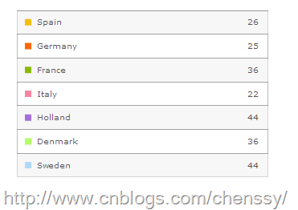
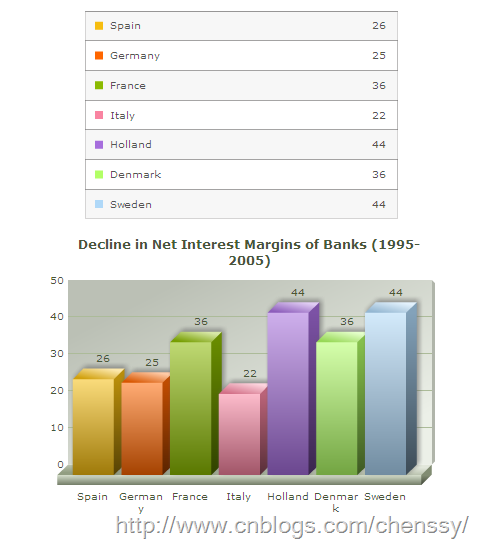

有时候我们会觉得使用图像不够直接，对于数据的显示没有表格那样直接明了。所以这里就介绍如何使用网格组件、将网格与图像结合起来。网格组件能够将FusionCharts中的单序列数据以列表的形式展示出来，同时也能够与单序列的图表进行一个不错的结合，形成一个不错的组合。

# 一、 创建网格

首先我们需要创建一个带有网格的页面，其实这个页面和创建图表的页面毫无区别，只不过是需要改变SWF文件即可。网格组件的SWF文件为：SSGrid.swf。

    
    
    <body bgcolor="#ffffff">
            


             
        </body>

然后是单序列的数据文件。Data.xml

    
    
    <chart caption="Decline in Net Interest Margins of Banks (1995-2005)">
        <set label="Spain" value="26" color="F6BD0F"/> 
        <set label="Germany" value="25" color="FF6600"/> 
        <set label="France" value="36" color="8BBA00"/> 
        <set label="Italy" value="22" color="F984A1"/> 
        <set label="Holland" value="44" color="A66EDD"/> 
        <set label="Denmark" value="36" color="B2FF66"/> 
        <set label="Sweden" value="44" color="AFD8F8"/> 
    </chart>

从上面可以看书其实创建网格组件与创建其他的图像是没有任何区别的，仅仅只需要跟换相应的SWF文件即可。

# 二、 与图像组合使用

网格组件与图像的组合是一个比较好的组合方式。至于使用我们可以理解成是使用了两个不同的图像罢了，只不过他们公用一个相同的数据文件，而不是两个不同的数据文件。如下：

    
    
    <body bgcolor="#ffffff">
            


             
            


             
        </body>

数据文件依然使用上面那个。

至于网格组件的参数设置我们可以在xml中数据文件中设置，详情请参考：[FusionCharts简单教程(三)-----FusionCharts的基本属性](http://www.cnblogs.com/chenssy/p/3263482.html)

