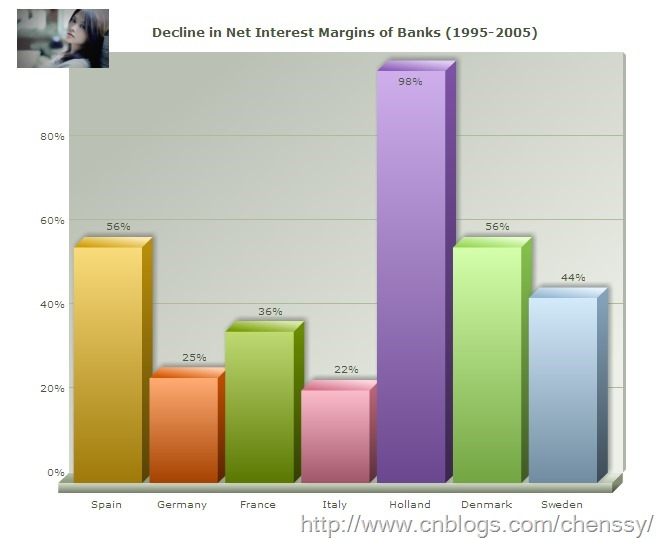
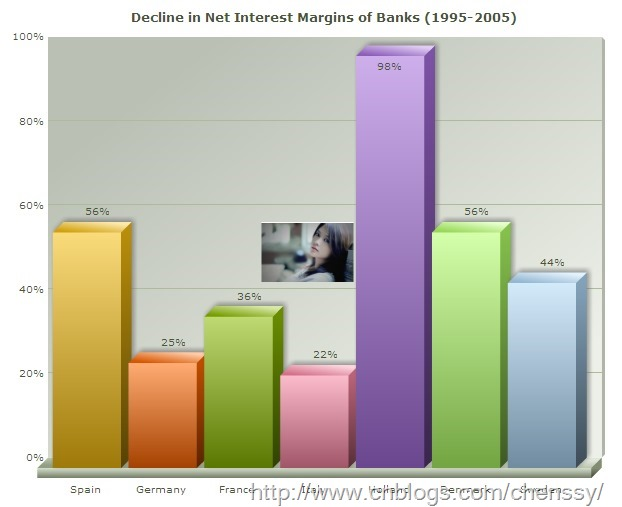
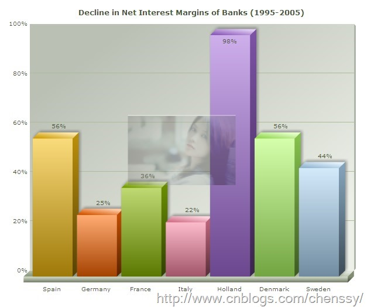

# 一、加载外部文件Logo

在使用FusionCharts时，我们可能需要在加载图像的时候需要在图表中显示标识、图片等等。这里我们可以使用logoURL属性来实现。如：

    
    
    <chart caption="Decline in Net Interest Margins of Banks (1995-2005)"  numberSuffix="%25" logoURL="../FusionCharts/11111.png">
        <set label="Spain" value="56" color="F6BD0F" /> 
        <set label="Germany" value="25" color="FF6600" /> 
        <set label="France" value="36" color="8BBA00"/> 
        <set label="Italy" value="22" color="F984A1" /> 
        <set label="Holland" value="98" color="A66EDD"/> 
        <set label="Denmark" value="56" color="B2FF66" /> 
        <set label="Sweden" value="44" color="AFD8F8" /> 
    </chart>

注意：由于安全原因 Flash
Player播放器不允许用户加载有绝对路径的跨域文件。因此，你的标注、图片、图像等Logo文件应该处于与SWF相同的文件域，同时需要使用相对路径来加载。

# 二、设置Logo位置

logo标识的的默认位置是左上方，我们可以利用<logoPosition…/>属性来进行配置。其中<logoPosition../>有TR、TL、BR、BL、CC四个值。

TR：Top-right of the chart

TL：Top-left of the chart

BL：Bottom-left of the chart

BR：Bottom-right of the chart

CC：Center of the chart Configuring logo opacity and scale

当logoPosition=’cc’时。

# 三、添加超级链接

除了设置logo的位置外，我们还可以为logo标识添加超级链接，具体操作如下

    
    
    <chart ... logoLink="link in FusionCharts format">

这个链接可以在当前窗口、新窗口、弹出窗口，甚至在可以调用javascript的函数进行打开操作。

# 四、改变Logo属性

在这里我们可以对logo的大小、透明度进行控制。

logoAlpha：透明度。该值越大图片越清晰。

logoScale：规模：该值已100为单位来对logo进行控制。200表示放大两倍，50表示缩小一倍，以此类推。

    
    
    <chart caption="Decline in Net Interest Margins of Banks (1995-2005)"  numberSuffix="%25" 
        logoURL="../FusionCharts/11111.png" logoPosition ="cc" logoAlpha="30" logoScale="200">
        <set label="Spain" value="56" color="F6BD0F" /> 
        <set label="Germany" value="25" color="FF6600" /> 
        <set label="France" value="36" color="8BBA00"/> 
        <set label="Italy" value="22" color="F984A1" /> 
        <set label="Holland" value="98" color="A66EDD"/> 
        <set label="Denmark" value="56" color="B2FF66" /> 
        <set label="Sweden" value="44" color="AFD8F8" /> 
    </chart>

