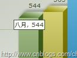
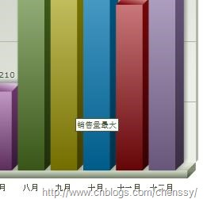
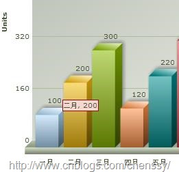
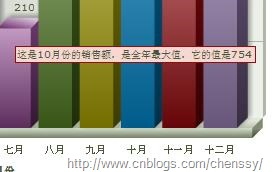
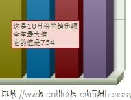
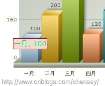

##FusionCharts简单教程(六)-----如何自定义图表上的工具提示

##
## 所谓图表上的工具提示就是当鼠标放在某个特定的数据块上时所显示的提示信息。如下：  

##
##   禁用显示工具提示  

##
## 在默认情况下工具提示功能是显示的，但是有时候我们并不是很想需要这个功能提示功能，这个时候我们就希望能够禁用该功能。我们可以通过设置showToolTip="0"来禁用工具提示。  自定义文本  

##
## 我们可以通过<set…/>元素的tooltext属性来给某个数据点设置特定的工具提供，也就是自定义文本显示。     	<graph caption="每月销售额柱形图" xAxisName="月份" yAxisName="Units" showNames="1" decimalPrecision="0" formatNumberScale="0">
    ......
    <set name="八月" value="544" color="588526" />
    <set name="九月" value="565" color="B3AA00" />
    <set name="十月" value="754" color="008ED6"  toolText="销售量最大"/>
    <set name="十一月" value="441" color="9D080D" />
    <set name="十二月" value="654" color="A186BE" />
</graph>



##
## 

自定义背景颜色和边框


##
## 对于一个白色背景、黑色文字和黑色背景而已还真不是特别的“漂亮”，好在FusionCharts提供了toolTipBorderColor和toolTipBgColor这两个属性用来帮助我们自定义工具提示的背景色和边框颜色。


  	<graph caption="每月销售额柱形图" xAxisName="月份" yAxisName="Units" showNames="1"  toolTipBorderColor="9D080D" toolTipBgColor="F7D7D1">
    ......
</graph>





##
## 


##
## 对于字体的设置，我们需要使用自定义样式来进行改变。这个下面在介绍。

多行提示


##
## 如果某个工具提示的内容太多，那么这个提示信息就会显示的特别的长。


##
## 


##
## 对于这样的提示信息我们是非常不愿意见到的。这里我们就希望它能够多行、分段显示。这里我们可以通过使用伪代码{BR	}来进行分段处理。


##
## 

使用自定义样式改变字体样式


##
## 在XML中，我们能够利用样式来改变文本的字体样式。


  	<graph caption="每月销售额柱形图" xAxisName="月份" yAxisName="Units" showNames="1"  toolTipBorderColor="9D080D" toolTipBgColor="F7D7D1">
    <set name="一月" value="100" color="AFD8F8" />
    <set name="二月" value="200" color="F6BD0F" />
    .......
    <set name="十二月" value="654" color="A186BE" />
    <styles>
       <definition>
               <style name="myToolTipFont" type="font" font="Verdana" size="14" color="008ED6F"/>
           </definition>
           <application>
               <apply toObject="ToolTip" styles="myToolTipFont" />
           </application>
        </styles>
</graph>



##
## 


##
##


##
## 下篇将介绍如何在FusionCharts中Style