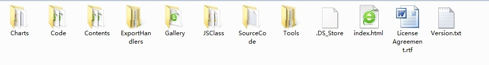

##FusionCharts简单教程（一）---建立第一个FusionCharts图形

##
## 由于项目需求需要做一个报表，选择FusionCharts作为工具使用。由于以前没有接触过报表，网上也没有比较详细的fusionCharts教程，所以决定好好研究FusionCharts，同时做一个比较简单的教程提供参考。由于能力有限(应届毕业生的菜鸟而已)，所以教程(学习笔记而已)不免会有错误，望别喷，望指正。当然肯定避免不了会参考其他资料的。
一、FusionCharts简介和安装使用
##1．1、简介

##
##FusionCharts是InfoSoft Global公司的一个产品,而FusionCharts Free则是FusionCharts提供的一个免费版本，虽然免费，功能依然强大，图形类型依然丰富。这里介绍了都是基于FusionCharts Free的。

##
## FusionCharts free 是一个跨平台，跨浏览器的flash图表组件解决方案，能够被 ASP、.NET, PHP, JSP, ColdFusion, Ruby on Rails, 简单 HTML 页面甚至PPT调用。我们不需要知道任何Flash的知识，只需要了解你所用的编程语言而已。

##
## FusionCharts功能强大，那么它到底能够做什么呢？下面一一展示。

##
## 3D/2D 柱形图

##
## 

##
## 

##
## 曲线图

##
## 

##
## 3D/2D饼图、环图

##
## 

##
## 

##
## 区域图

##
## 

##
## 堆栈图

##
## 

##
## 联合图

##
## 

##
## 上面只是一些功能的展示，FusionCharts还能够做更多的事情，这里就不一一介绍了。下面介绍如何安装使用FusionCharts。
##1.2 文档结构

##
## 将下载的FusionCharts解压到任意目录，得到的解压文件夹里面会包含类似于此的文档结构。

##
## 

##
## Charts ：里面包含着所有的SWF文件，如果你的Web项目需要创建图像，则导入相应的SWF文件即可。

##
## Code ：里面包含了所有的示例代码。

##
## Contents ：包含了文档，也就是API，包含了FusionCharts的使用方法。

##
## Gallery ：包含了一些图像的创建例子。

##
## JSClass：FusionCharts javascript文件就放在这个目录下，这些文件能够帮组我们以一种友好的方式将图像插入到页面中。
##1.3安装使用

##
## 在了解了FusionCharts的文档结构后，下面来讲解如何将FusionCharts应用到应用程序中。其实FusionCharts的使用方法非常简单。只需要三个步骤就可以搞定。

##
## 1、 导入你要创建图像相对应的SWF文件。

##
## 2、 编写XML数据文件。

##
## 3、 编写HTML文件，这个文件要包含显示图像的相应代码。
二、我的第一个FusionCharts

##
## 介绍了这么久，终于可以创建第一个图像了。我将以一种比较简单的方式来创建一个3D柱状的图形，用来显示每个月某件商品的销售情况。
##2.1、创建工程

##
## 新建文件夹，命名为FusionCharts，然后在新建两个文件夹分别命名为FusionCharts、datas。这两个文件分别用于存放SWF文件和xml数据文件。
##2.2、导入文件

##
## 将相应的3D柱状图像的SWF：Column3D.swf复制到FusionCharts文件夹中。
##2.3、创建XML数据文件

##
## 创建XML文件：Data1.xml，并将其放入到datas文件夹中。文件内容如下：
<chart yAxisName="销售个数" caption="2012年年度销售情况统计分析" useRoundEdges="1" bgColor="FFFFFF,FFFFFF" showBorder="0">
    <set label="一月" value="25000"  /> 
    <set label="二月" value="35000" /> 
    <set label="三月" value="42300" /> 
    <set label="四月" value="35300" /> 
    <set label="五月" value="31300" />
    <set label="六月" value="25000"  /> 
    <set label="七月" value="35000" /> 
    <set label="八月" value="42300" /> 
    <set label="九月" value="35300" /> 
    <set label="10月" value="31300" />
    <set label="11月" value="25000"  /> 
    <set label="12月" value="35000" /> 
</chart>

##
## 对于这个XML文件这里简单介绍一下。

##
## <chart>元素作为root元素，他有一些基本属性，如：设置x、y轴名称，报表标题、数值格式。在<chart>元素中有很多的<set>元素，这个元素用来描述设定的数据，label表示名称、value表示值。
##2.4、编写HTML文件代码
	<html>   
	   <head>   
	      <title>My First FusionCharts</title>   
	   </head>   
	   <body bgcolor="#ffffff">   
	      <OBJECT classid="clsid:D27CDB6E-AE6D-11cf-96B8-444553540000" codebase=http://download.macromedia.com/pub/shockwave/cabs/flash/swflash.cab#version=6,0,0,0" width="600" height="500" id="Column3D" >   
	         <param name="movie" value="../FusionCharts/Column3D.swf" />   
	         <param name="FlashVars" value="&amp;dataURL=../datas/Data.xml&amp;chartWidth=600&amp;chartHeight=500">   
	         <param name="quality" value="high" />   
			<embed src="../FusionCharts/Column3D.swf" flashVars="&amp;dataURL=../datas/Data.xml&amp;chartWidth=600&amp;chartHeight=500" quality="high" width="600" height="500" name="Column3D" type="application/x-shockwave-flash" pluginspage="http://www.macromedia.com/go/getflashplayer" />   
	      </object>   
	</body>   
</html> 

##
## 生成的图像：

##
## 

##
## 下篇将介绍如何使用js来加载FusionCharts和使用dataXML加载数据。