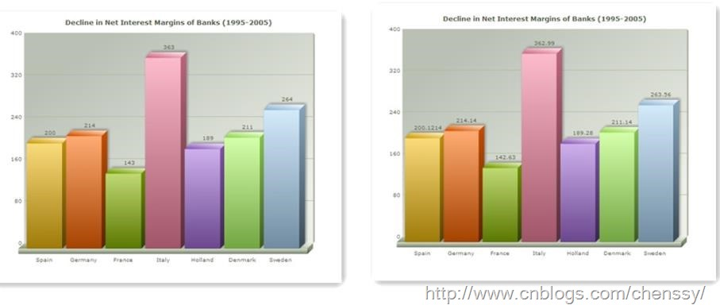
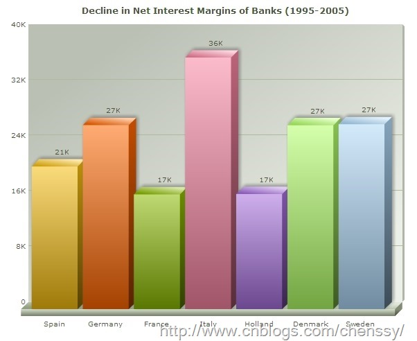
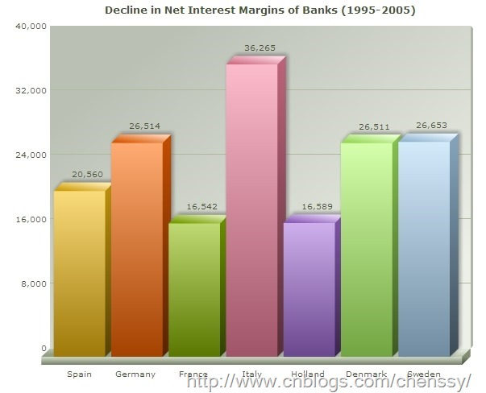
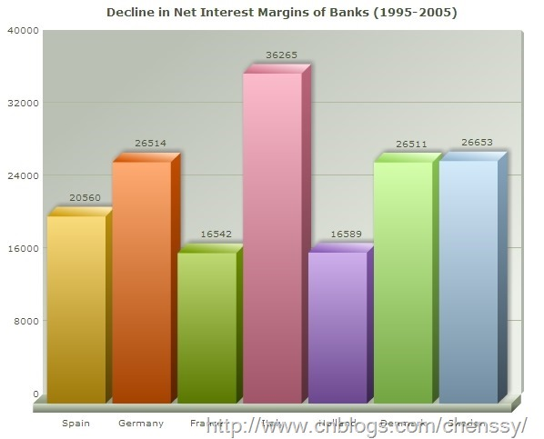
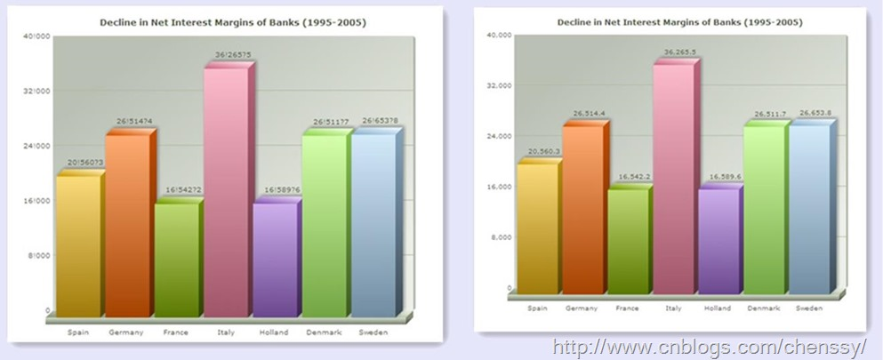
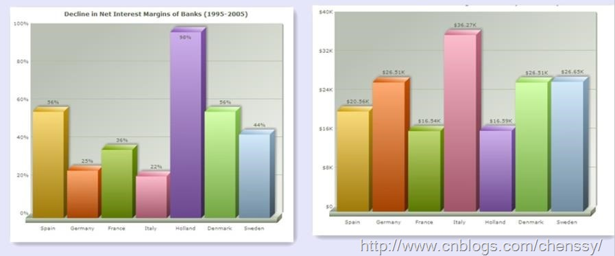

##FusionCharts简单教程（四）-----基本数字格式

##
## 在统计图例中什么是最基本，最重要的元素？那就是数据。一个数据的统计图像那就是一堆空白。但是数据存在多种形式，比如小数，比如千分位等等。又如若一个数据是12.000000001，对于数据要求不是很严格的，你不会这么显示吧？所以在统计报表中我们经常需要对数据进行一些格式的控制。  一、 控制小数位  

##
## FusionCharts中有一个可以控制小数点的保留位置的属性：decimalPrecision，该属性后面的值表示保留的小数点位数。例如：当decimalPrecision="0’,时，那么像12.14、15.1111、15.68，最后的显示都将是12、15、16。它的规则是四舍五入。如：  

##
##   二、 格式化数据  

##
## 在默认情况下，FusionCharts会给那些较大的数据添加K(千)、M(百万)符号，如下  

##
##   

##
## 上面的显示数据其真实输入：20560、26514、16542、36265、16589、26511、26653，由于这些数据较大，所以FusionCharts会自动给这些数据转化为以千、或者百万为单位的数据。  

##
## 当然如果想看到具体的数据， 你需要增加这两个元素属性：formatNumberScale="0" decimalPrecision="0"。如下：  

##
##   

##
## 上面的图像虽然现实了真实、具体的数据，但是他们都带有一个,号，FunshionCharts会使用逗号来分隔这些数据，如果我们也不想看到逗号，则可以使用formatNumber=’0’。这里需要注意一点，如果我们使用formatNumber=’0’，那么我们也不能格式化小数位了。  

##
##   三、 自定义分隔符  

##
##在前面两节中我们看到FusionCharts是使用，来分隔千分位的，使用.来分隔小数点位的。在FusionCharts中我们可以使用decimalSeparator和thousandSeparator来指定分隔符。其中thousandSeparator是指定千分位的，decimalSeparator指定小数点位的。  

##
##这里我们使用?来分隔小数点位，!来分隔千分位： decimalSeparator="?" thousandSeparator="!"  

##
##   

##
## 注意在显示时需要添加：formatNumberScale="0"元素。不能格式化数据的。  四、 增加数据前缀和后缀  

##
## 有时候我们需要给我们的数据添加前缀或者后缀。例如money我们需要添加前缀：￥、$，统计时需要添加百分号%等等。  

##
## FusionCharts使用numberPrefix来添加前缀，numberSuffix来添加后缀。如：  

##
## 如果我们设置numberPrefix="$"，那么会在所有的数字前面就会加上“$”，就像这样：$ 20560, $26514。       如果我们设置numberSuffix="%25"，那么会在所以的数字后面加上“%”，就像这样：25%，89%。  

##
##   

##
## 我们注意到了%在FusionCharts显示”%”时是经过转码了。转码下篇进行详细的讲解。