# [Hadoop小文件存储方案](https://www.cnblogs.com/ballwql/p/8944025.html)

## HDFS总体架构

在介绍文件存储方案之前，我觉得有必要先介绍下关于HDFS存储架构方面的一些知识，在对架构有初步了解后，才会明白为什么要单独针对小文件展开介绍，小文件存储和其它文件存储区别在什么地方。

这里我只是就Hadoop生态中的存储层展开介绍，对于其它部分本文暂未描述。众所周知，HDFS是目前非常流行的分布式文件存储系统，其逻辑架构如下图所示：  
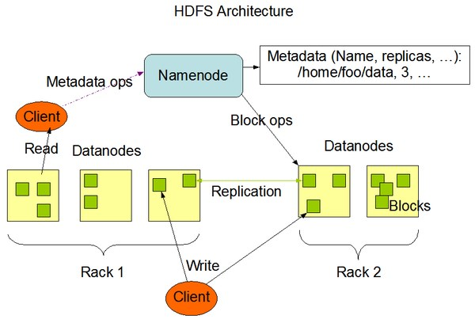

HDFS也是典型的Master/Slave结构，其中，Master相当于Namenode，Slave相当于Datanode。

Namenode
负责元数据管理，维护文件和目录树，响应Client请求；Datanode负责实际数据存储。至于什么是元数据，是怎么管理的，后续会单独写一篇文章来介绍

Block是文件块，HDFS中是以Block为单位进行文件的管理的，一个文件可能有多个块，每个块默认是3个副本，这些块分别存储在不同机器上。块与文件之前的映射关系会定时上报Namenode。HDFS中一个块的默认大小是64M，其大小由参数`dfs.block.size`控制。这里面先引申几个问题出来：

>   * **问题1：块大小要怎么设置为一个合理值，过大设置和过小设置有什么影响？**

>

>   * **问题2：如果一个文件小于所设置的块大小，实际占用空间会怎样？**

>

>   * **问题3：一个Namenode最多能管理多少个块，什么时候会达到瓶颈？**

>

针对这些问题，后面会展开介绍，这里还是先关注下架构方面。针对块方面，有几个单位概念需要弄清楚： **Block、Packet和Chunk**
。Block上面有描述，Packet和Chunk如下：

> 1 **Packet** :
其比块要小很多，可以理解为Linux操作系统最小盘块概念，一般为64KB，由参数`dfs.write.packet.size`控制，是client向Datanode写入数据的粒度，即client向Datanode写数据时不是一次以Block为单位写的，而是被分成若干Packet，放入pipeline顺序追加写入到Block中，示意图如下：

> 2 **Chunk** :
比Packet更小，是针对Packet数据校验粒度来设计的，一般是512B,由参数`io.bytes.per.checksum`控制，同时还带有一个4B的校验值，所以可以认为一个Chunk是516B

上面说到Chunk是针对数据校验的，那一个Packet有多少个chunk校验呢，如果Packet默认是64KB,
那计算公式为：`chunk个数=64KB/516B=128`。也就是对于一个Packet来说，数据值与校验值比例大概为 **128:1** ,
对于一个块来说，假设是64M，会对应512KB的校验文件。

Packet的示意图中还一个Header信息，实际存储的是Packet的元数据信息，包括Packet在block中的offset, 数据长度，校验编码等。

## HDFS写流程

了解块相关概念后，再介绍下HDFS的写入流程，如下图所示：

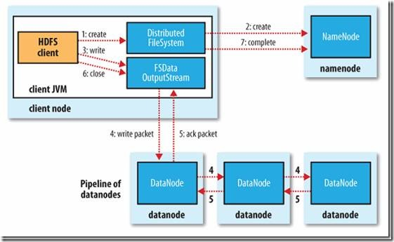

>   1. client向Namenode发起写文件RPC请求；

>   2.
Namenode检查要写的文件是否已存在元数据中，存在则拒绝写入；同时检查写入用户权限，如无权限也拒绝写入；若文件不存在且有权限写入，则Namenode会创建一条文件记录，响应client端允许写入文件；

>   3.
client根据文件大小分成若干块，并在Namenode中申请块所存放的Datanode位置，如果是3副本存储，则Namenode会选择3台符合条件的结点放到结点队列中；client实际向Datanode写数据时是以Packet为单位来写到Block的，这里面会涉及两个队列，分别为:
**data packet队列** 和 **ack packet队列** ，Packet会同时入数据队列和ack队列；

>   4.
通过DataStreamer对象将数据写入pipeline中的第一个Datanode,并依次写入到其它两个结点；当三个结点packet都写成功后，会将packets
从ack queue中删除；

>   5. 写操作完成后，client调用close()关闭写操作，并通知Namenode关闭写操作，至此，整个写操作完成。

>

packet写入流示意图如下所示：

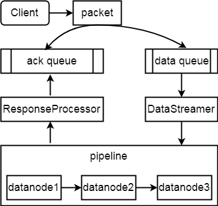

## HDFS读流程

HDFS的读流程比较简单，流程程如下所示：

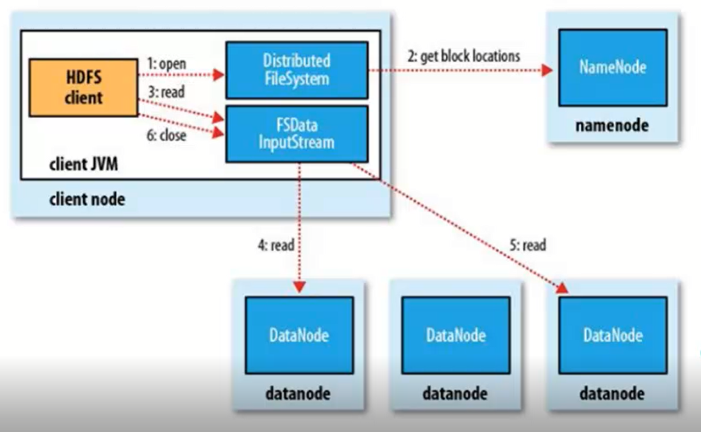

>   1. client 向Namenode发起读文件RPC请求；

>   2. Namenode返回相应block所在datanode的位置信息；

>   3. client通过位置信息调用FSDataInputStream
API的Read方法从datanode中并行读取block信息，如图中4和5所示，选择block的其中一副本返回client。

>

## HDFS块信息介绍

在对HDFS的读写流程有一个基础了解后，下面针对文件块存储相关内容展开介绍。了解块的设计、存储和元数据相关知识对于设计小文件存储方案也至关重要。

### HDFS块设计原则

有人可能会问，集群存储有大文件也有小文件，那块大小该如何设计呢，这里应该要考虑2个准则：

> 1.减少内存占用：对于Namenode来说，单机内存毕竟有限，文件块越多，元数据信息越大，占用内存越多，如果文件数量级很大的话，单机将无法管理；

> 2.减少硬盘寻道时间： 数据块在硬盘为连续存储，对于普通SATA盘，随机寻址较慢，
如果块设置过小，一个文件的块总数会越多，意味着硬盘寻址时间会加长，自然吞吐量无法满足要求；如果块设置过大，一方面对于普通盘来说IO性能也比较差，加载时会很慢，另一方面，块过大，对于多副本来说，在副本出问题时，系统恢复时间越长。

所以设置合理的块大小也很重要，一般来说根据集群的需求来设定，比如对于使用到HBase的场景，一般数据量会比较大，块不宜设置太小，参考值一般为128MB或256MB，这样能尽量避免频繁块刷写和块元数据信息的膨胀；对于存储小文件的场景，如图片，块可设置成默认64MB大小，一个块中存储多个图片文件，后面会详细介绍。

### HDFS块存储原则

块在HDFS中是怎么存储的呢，上面有提到多副本机制，即一个块在HDFS中是根据 **dfs.replication**
参数所设置的值来确定副本数的，默认为3。三个副本是随机存储三台数据结点Datanode上，三个结点的选取遵循机架感知策略，通过
**topology.script.file.name** 来设置，
如果配置中未配置机架感知，Namenode是无法知道机房网络拓扑，所以会随机选取3台结点进行块存储，如果设置了机架感知，则在存储时会在同机架存储2副本，不同机架放第3个副本，这样一旦一个机架出现问题，还能保证一个副本是可用的。

如果一个文件只有几K，且小于HDFS块大小，实际在HDFS占用的空间会是多少呢？答案是文件大小即为实际占用空间，对于几K的文件实际占用的空间大小也为几K，不会占用一个块空间。

### HDFS块元数据信息

上面提到，在存储的文件数量级很大时，单机Namenode内存消耗会急剧增大，易触发单机瓶颈，那么到底一个Namenode可以管理多少量级的元数据呢，其实这个可以有一个公式来初略估算。这里首先要了解一个概念，元数据包括哪些，正常元数据包括三个部分：
**文件、目录和块** 。这三部分在元数据中各占用多少空间呢，下面是一个初略的计算：

>   1. 单条元数据大小：文件约250B，目录约290B，块约368B(152B+72*副本数3)

>   2. 集群元数据总条数：文件数约10000个，目录约5000个，块约20000个

>   3. 总占用内存大小： 250B _10000+290B_ 5000+368B*20000=10.78M

>

实际内存消耗会比这多，因为还有其它一些信息需要存储，总体内存消耗可根据上述公式来估算，这样你就知道你集群Namenode能承受多少文件，目录和块元数据信息的存储。也能及时发现内存瓶颈，做到精细化监控运营管理。

上述介绍的三个方面也分别解答了上面提到的三个问题，具体细节这里也不过多展开。下面正式展开对小文件存储方面的介绍

## HDFS小文件存储方案

针对小文件问题，HDFS自身也有考虑这种场景，目前已知的主要有三种方案来实现这种存储，分别如下：

> HAR  
> SequenceFile  
> CombinedFile

### HAR存储方案

HAR熟称Hadoop归档文件，文件以*.har结尾。归档的意思就是将多个小文件归档为一个文件，归档文件中包含元数据信息和小文件内容，即从一定程度上将Namenode管理的元数据信息下沉到Datanode上的归档文件中，避免元数据的膨胀。

归档文件是怎么生成的呢，主要还是依赖于MapReduce原理将小文件内容进行归并。归档文件的大概组成如下所示：

图中，左边是原始小文件，右边是har组成。主要包括：`_masterindex`、`_index`、`part-0...part-n`。其中_masterindex和_index就是相应的元数据信息，part-0...part-
n就是相应的小文件内容。实际在集群中的存储结构如下：

通过`hadoop archive`命令创建归档文件，-archiveName指定文件名,
-p指定原文件路径，-r指定要归档的小文件,最后指定hdfs中归档文件存放路径，如下所示：

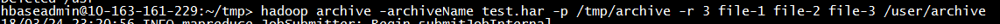

创建后，会在/usr/archive目录下生成test.har目录，这里大家可能会有疑惑，上面不是说Har是一个文件吗，这里怎么又是目录了呢，其实我们所说的归档文件是逻辑上的概念，而实际的har是一个目录，是一个物理存储概念，所以大家只要记住在实际存储时生成的Har实际上是一个目录就行了。这个目录中会存放元数据，实际文件内容。如下图所示，_index文件的每一行表示的是小文件在part开头的映射关系，包括起始和结束位置，是在哪个part文件等，这样在读取har中的小文件时，根据offset位置可直接得到小文件内容，如图part-0文件内容所示：

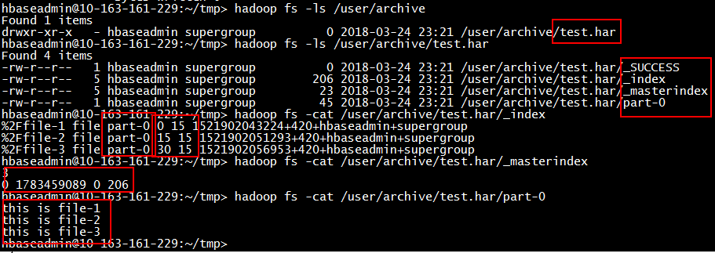

要从HAR读取一个小文件的话，需要用distcp方式，原理也是mapreduce, 指定har路径和输出路径，命令如下：  
`hadoop distcp har:///user/archive/test.har/file-1 /tmp/archive/output`

HAR总体比较简单，它有什么缺点呢?

> 1.archive文件一旦创建不可修改即不能append，如果其中某个小文件有问题，得解压处理完异常文件后重新生成新的archive文件;

> 2.对小文件归档后，原文件并未删除，需要手工删除;

> 3.创建HAR和解压HAR依赖MapReduce，查询文件时耗很高;

> 4.归档文件不支持压缩。

### SequenceFile存储方案

SequenceFile本质上是一种二进制文件格式，类似key-value存储，通过map/reducer的input/output
format方式生成。文件内容由Header、Record/Block、SYNC标记组成，根据压缩的方式不同，组织结构也不同，主要分为Record组织模式和Block组织模式。

#### Record组织模式

Record组织模式又包含两种：未压缩状态CompressionType.NONE,
和压缩状态CompressionType.RECORD，未压缩是指不对数据记录进行压缩，压缩态是指对每条记录的value进行压缩，其逻辑结构如下所示：

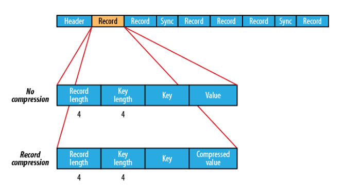

Record结构中包含Record长度、key长度、key值和value值。Sync充斥在Record之间，其作用主要是用于文件位置定位，具体定位方式是：如果提供的文件读取位置不是记录的边界可能在一个Record中间，在实际定位时会定位到所提供位置处之后的第一个Sync边界位置，并从该Sync点往后读相应长度的数据，如果提供的读取位置往后没有Sync边界点，则直接跳转文件末尾；如果提供的文件读取位置是Record边界，则直接从该位置开始读取指定长度的数据。另一种文件定位方式是seek,
这种方式则要求所提供的读取位置是record的边界位置，不然在读取迭代读取下一个位置时会出错。

#### Block组织模式

Block组织模式，其压缩态为CompressionType.BLOCK。与Record模式不同的时，Block是以块为单位进行压缩，即将多条Record写到一个块中，当达到一定大小时，对该块进行压缩，很显然，块的压缩效率会比Record要高很多，避免大量消费IO和CPU等资源。其逻辑结构如下：

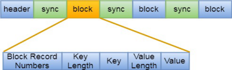

从上图中可看出，组织方式变成了块，一个块中又包含了块的记录数，key长度，key值，value长度，value值。每个块之间也有Sync标记，作用同Record方式。

两中模式中，都有header标记，包含了些如版本信息、KEY类名、VALUE类名、是否压缩标记、是否块压缩标记、编码类、元数据信息和Sync标记，其结构如下：

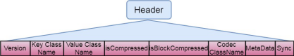

#### SequenceFile示例

这里以存储5个小的图片文件为例，演示下如何创建SequenceFile。首先将图片文件上传至hdfs的一个目录。

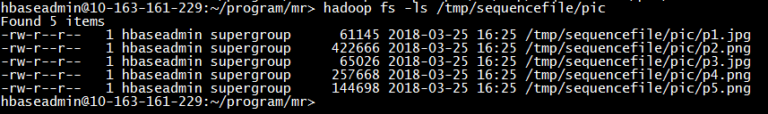

其次，编写一个MR程序来对上述图片进行转换，将生成的文件存放到/tmp/sequencefile/seq下，MR程序源码在附件SmallFiles.zip中，可自行查看，如下所示：

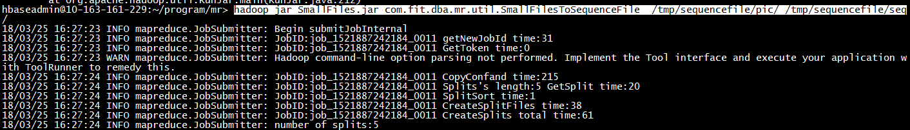

转换后，会在/tmp/sequencefile/seq目录生成一个part-r-00000文件，这个文件里面就包含了上述5个图片文件的内容，如下所示：

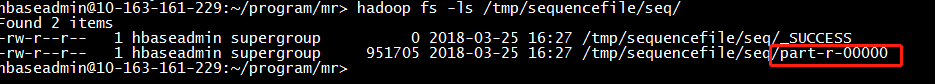

如果要从该SequenceFile中获取所有图片文件，再通过MR程序从文件中将图片文件取出，如下所示：

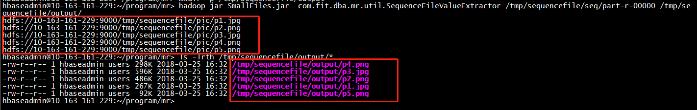

#### SequenceFile优缺点

##### 优点

>   * A.支持基于记录或块的数据压缩;

>   * B. 支持splitable,能够作为mr 的输入分片;

>   * C. 不用考虑具体存储格式，写入读取较简单.

>

##### 缺点

>   * A. 需要一个合并文件的过程

>   * B. 依赖于MapReduce

>   * C. 二进制文件，合并后不方便查看

>

### CombinedFile存储方案

其原理也是基于Map/Reduce将原文件进行转换，通过CombineFileInputFormat类将多个文件分别打包到一个split中，每个mapper处理一个split,
提高并发处理效率，对于有大量小文件的场景，通过这种方式能快速将小文件进行整合。最终的合并文件是将多个小文件内容整合到一个文件中，每一行开始包含每个小文件的完整hdfs路径名，这就会出现一个问题，如果要合并的小文件很多，那么最终合并的文件会包含过多的额外信息，浪费过多的空间，所以这种方案目前相对用得比较少，下面是使用CombineFile的示例：

    
    
    hbaseadmin@10-163-161-229:~/program/mr/input> ls
    hbaseadmin@10-163-161-229:~/program/mr/input> touch file-1 file-2 file-3
    hbaseadmin@10-163-161-229:~/program/mr/input> echo "this is file-1" >file-1
    hbaseadmin@10-163-161-229:~/program/mr/input> echo "this is file-2" >file-2
    hbaseadmin@10-163-161-229:~/program/mr/input> echo "this is file-3" >file-3
    hbaseadmin@10-163-161-229:~/program/mr> hadoop fs -put input /tmp/combinefile/
    
    hbaseadmin@10-163-161-229:~/program/mr> hadoop jar SmallFiles.jar  com.fit.dba.mr.util.CombineFileTest /tmp/combinefile/input/ /tmp/combinefile/output
    
    hbaseadmin@10-163-161-229:~/program/mr> hadoop fs -ls /tmp/combinefile/output
    Found 2 items
    -rw-r--r--   1 hbaseadmin supergroup          0 2018-03-25 17:26 /tmp/combinefile/output/_SUCCESS
    -rw-r--r--   1 hbaseadmin supergroup        213 2018-03-25 17:26 /tmp/combinefile/output/part-r-00000
    hbaseadmin@10-163-161-229:~/program/mr> hadoop fs -ls /tmp/combinefile/output/part-r-00000
    Found 1 items
    -rw-r--r--   1 hbaseadmin supergroup        213 2018-03-25 17:26 /tmp/combinefile/output/part-r-00000
    hbaseadmin@10-163-161-229:~/program/mr> hadoop fs -cat /tmp/combinefile/output/part-r-00000
    hdfs://10-163-161-229:9000/tmp/combinefile/input/file-1 this is file-1
    hdfs://10-163-161-229:9000/tmp/combinefile/input/file-2 this is file-2
    hdfs://10-163-161-229:9000/tmp/combinefile/input/file-3 this is file-3

上述用到的转换程序也在附件CombineFileTest.java中。其优点是适用于处理大量比block小的文件和内容比较少的文件合并，尤其是文本类型/sequencefile等文件合并，其缺点是：如果没有合理的设置maxSplitSize，minSizeNode，minSizeRack，则可能会导致一个map任务需要大量访问非本地的Block造成网络开销，反而比正常的非合并方式更慢。

### 总结

上面介绍了三种基于HDFS自身的一些方案，每种方案各有优缺点，其核心思想都是基于map/reduce的方式将多个文件合并成一个文件。在实际使用中，单纯用上述方案还是不太方便，下面简要介绍下目前其它的一些小文件存储方案。

## 其它小文件存储方案

### 基于HBase的小文件存储方案

HBase我们知道主要是key/value存储结构，一个key对应多个列族的多个列值。从2.0版本开始，HBase多了一个MOB的结构，具体参考HBase-11339。具体是什么概念呢，先来看下示意图：

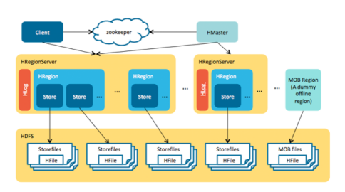

上图是一个关于HBase的架构图，包含HBase的几个组件master、regionserver、hdfs、hfile等。MOB
FILE类似StoreFile, 它作为一个单独的对象存储小文件。MOB具体结构如下所示：

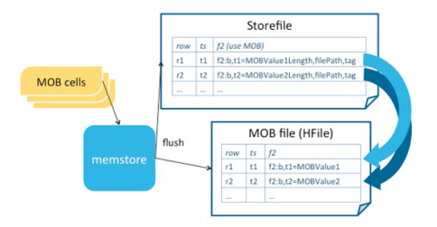

MOB是由StoreFile和MOB
File共同组成。其中，StoreFile存放的数据和HBase正常存储的数据一样，key/value结构，不过value中存储的是关于MOB文件的长度，存放路径等元数据信息，在MOB
File中存储的是具体的MOB文件内容，这样通过StoreFile中的key/value可以找到MOB所存放的文件具体位置和大小，最终得到文件内容。

MOB是怎么设置呢，在创建表时我们指定表的MOB属性，如下所示：  
`create "t1", {NAME => "f1", IS_MOB => true, MOB_THRESHOLD => 102400}`

其中，MOB_THRESHOLD表示MOB对象所能存储的文件对象上限阈值，推荐是存储小于10M的文件。对于MOB的表，我们可以手动触发压缩，有
**compact_mob** 和 **major_compact_mob** 两种方式。如下所示：  
`compact_mob "t1" compact_mob "t1","cf1" major_compact_mob "t1"
major_compact_mob "t1","cf1"`

MOB的出现大大提高了我们使用HBase存储小文件的效率，这样无须关注底层HDFS是怎么存储的，只要关注上层逻辑即可，HBase的强大优势也能保证存储的高可靠和稳定性，管理也方便。

### 基于打包构建索引方案

这种方案是目前兄弟部门正在使用的一个小图片存储方案，也是基于HDFS存储实际图片，基于HBase存储元数据信息。这个方案中，主要也是基于压缩的思路，将多个小图上片压缩成一个tar文件存放至HDFS上，通过HBASE记录文件名和HDFS文件的位置映射关系，架构示意图如下：

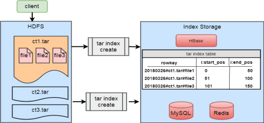

其具体思路是：

> 1.业务部门将图片上传至一个中转机，图片按日期目录存储，不同日期上传的图片放到相应日期目录；  
> 2.定期用脚本去将日期目录打包成tar，一天的图片打包成一个以日期命名的tar,
tar文件解压后是直接图片文件，即不带日期那层目录，上传至HDFS指定目录；  
> 3.通过tar文件解析程序获取tar文件中各图片文件在tar中的偏移量和长度，这个解析程序最开始是由国外一个程序员Tom
Wallroth写的工具,具体地址可以访问:<http://github.com/devsnd/tarindexer>。
这个工具可以直接在tar文件上解析tar中各文件的偏移量和长度，很方便。  
> 4.得到图片文件在tar的偏移量和长度后，设计HBase rowkey,
将图片名和tar路径设计到rowkey中，并通过在rowkey前缀加盐方式使rowkey随机散列分布在HBase中，避免热点现象；HBase的value存储的是文件的偏移量和长度。这样HBase中就保存了文件的元数据信息；

>

>   1. 业务方查询具体某个图片时，根据图片的日期和图片名，先计算出HBase
rowkey,再去HBase获取该图片的偏移量和长度；通过偏移量和长度通过HDFS的API去读取HDFS的文件。

>

### 其它方案对比

下面针对目前行业内用到的其它一些方案作下对比，如下图所示。

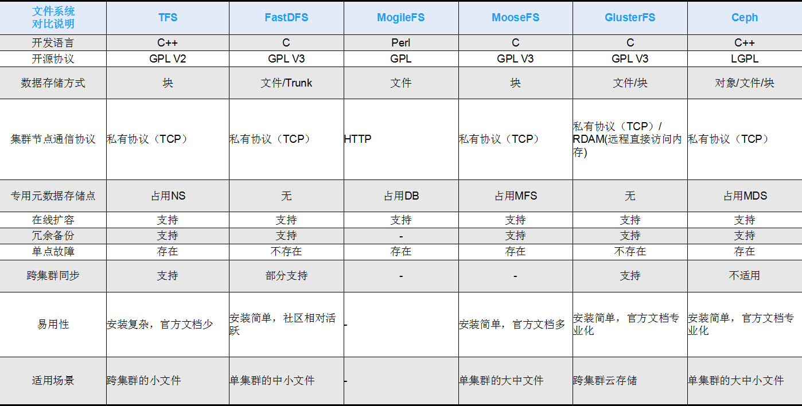

总体来说，淘宝的TFS是功能最全的，同时支持大小文件的存储；Ceph也是一种流行的分布式文件存储方案，组内对其调研后感觉比较复杂，不太好管理，不太稳定；FastDFS比较简单，适合存储一些使用场景简单的文件，不太灵活；其它几种没用过，大家可自行上网参阅相关资料。

## 总结

本文介绍了关于HDFS小文件存储的方案，不同方案各具特点，在使用时要根据实际业务场景进行设计，对于既要存储大文件又要存储小文件的场景，我建议在上层作一个逻辑处理层，在存储时先判断是大文件还是小文件，再决定是否用打包压缩还是直接上传至HDFS，可借鉴TFS方案。

## 参考

[1](../md/img/ggzhangxiaochao/275962-20180520092249168-289106015.jpg)
<http://hadoop.apache.org/docs/stable/hadoop-project-dist/hadoop-
hdfs/HdfsDesign.html>

## 附件

关于文章中用的MR转换程序如下所示：  
<https://github.com/ballwql/common-tool/tree/master/java>

