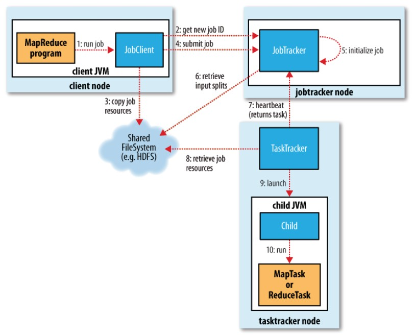

在执行一个Job的时候，Hadoop会将输入数据划分成N个Split，然后启动相应的N个Map程序来分别处理它们。  
数据如何划分？Split如何调度（如何决定处理Split的Map程序应该运行在哪台TaskTracker机器上）？划分后的数据又如何读取？这就是本文所要讨论的问题。  
  
先从一张经典的MapReduce工作流程图出发：  
  
  
  
1、运行mapred程序；  
2、本次运行将生成一个Job，于是JobClient向JobTracker申请一个JobID以标识这个Job；  
3、JobClient将Job所需要的资源提交到HDFS中一个以JobID命名的目录中。这些资源包括JAR包、配置文件、InputSplit、等；  
4、JobClient向JobTracker提交这个Job；  
5、JobTracker初始化这个Job；  
6、JobTracker从HDFS获取这个Job的Split等信息；  
7、JobTracker向TaskTracker分配任务；  
8、TaskTracker从HDFS获取这个Job的相关资源；  
9、TaskTracker开启一个新的JVM；  
10、TaskTracker用新的JVM来执行Map或Reduce；  
……  
对于之前提到的三个问题，这个流程中的几个点需要展开一下。  
  
首先是“数据如何划分”的问题。  
在第3步中，JobClient向HDFS提交的资源就包含了InputSplit，这就是数据划分的结果。也就是说，数据划分是在JobClient上完成的。在这里，JobClient会使用指定的InputFormat将输入数据做一次划分，形成若干个Split。  
  
InputFormat是一个interface。用户在启动MapReduce的时候需要指定一个InputFormat的implement。InputFormat只包含了两个接口函数：  
InputSplit[] getSplits(JobConf job, int numSplits) throws IOException;  
RecordReader<K, V> getRecordReader(InputSplit split, JobConf job, Reporter
reporter) throws IOException;  
getSplits就是现在要使用的划分函数。job参数是任务的配置集合，从中可以取到用户在启动MapReduce时指定的输入文件路径。而numSplits参数是一个Split数目的建议值，是否考虑这个值，由具体的InputFormat实现来决定。  
返回的是InputSplit数组，它描述了所有的Split信息，一个InputSplit描述一个Split。  
  
InputSplit也是一个interface，具体返回什么样的implement，这是由具体的InputFormat来决定的。InputSplit也只有两个接口函数：  
long getLength() throws IOException;  
String[] getLocations() throws IOException;  
这个interface仅仅描述了Split有多长，以及存放这个Split的Location信息（也就是这个Split在HDFS上存放的机器。它可能有多个replication，存在于多台机器上）。除此之外，就再没有任何直接描述Split的信息了。比如：Split对应于哪个文件？在文件中的起始和结束位置是什么？等等重要的特征都没有描述到。  
为什么会这样呢？因为关于Split的那些描述信息，对于MapReduce框架来说是不需要关心的。框架只关心Split的长度（主要用于一些统计信息）和Split的Location（主要用于Split的调度，后面会细说）。  
而Split中真正重要的描述信息还是只有InputFormat会关心。在需要读取一个Split的时候，其对应的InputSplit会被传递到InputFormat的第二个接口函数getRecordReader，然后被用于初始化一个RecordReader，以解析输入数据。也就是说，描述Split的重要信息都被隐藏了，只有具体的InputFormat自己知道。它只需要保证getSplits返回的InputSplit和getRecordReader所关心的InputSplit是同样的implement就行了。这就给InputFormat的实现提供了巨大的灵活性。  
  
最常见的FileInputFormat（implements InputFormat）使用FileSplit（implements
InputSplit）来描述Split。而FileSplit中有以下描述信息：  
private Path file; // Split所在的文件  
private long start; // Split的起始位置  
private long length; // Split的长度，getLength()会返回它  
private String[] hosts; // Split所在的机器名称，getLocations()会返回它  
然后，配套使用的RecordReader将从FileSplit中获取信息，解析文件名为FileSplit.file的文件中从FileSplit.start到FileSplit.start+FileSplit.length之间的内容。  
至于具体的划分策略，FileInputFormat默认为文件在HDFS上的每一个Block生成一个对应的FileSplit。那么自然，FileSplit.start就是对应Block在文件中的Offset、FileSplit.length就是对应Block的Length、FileSplit.hosts就是对应Block的Location。  
但是可以设置“mapred.min.split.size”参数，使得Split的大小大于一个Block，这时候FileInputFormat会将连续的若干个Block分在一个Split中、也可能会将一个Block分别划在不同的Split中（但是前提是一个Split必须在一个文件中）。Split的Start、Length都好说，都是划分前就定好的。而Split的Location就需要对所有划在其中的Block的Location进行整合，尽量寻找它们共有的Location。而这些Block很可能并没有共同的Location，那么就需要找一个距离这些Block最近的Location作为Split的Location。  
  
还有CombineFileInputFormat（implements
InputFormat），它可以将若干个Split打包成一个，目的是避免过多的Map任务（因为Split的数目决定了Map的数目）。虽然说设置“mapred.min.split.size”参数也可以让FileInputFormat做到这一点，但是FileSplit取的是连续的Block，大多数情况下这些Block可能并不会有共同的Location。  
CombineFileInputFormat使用CombineFileSplit（implements
InputSplit）来描述Split。CombineFileSplit的成员如下：  
private Path[] paths; // 每个子Split对应一个文件  
private long[] startoffset; // 每个子Split在对应文件中的起始位置  
private long[] lengths; // 每个子Split的长度  
private String[] locations; // Split所在的机器名称，getLocations()会返回它  
private long totLength; // 所有子Split长度之和，getLength()会返回它  
其中前三个数组一定是长度相等并且一一对应的，描述了每一个子Split的信息。而locations，注意它并没有描述每一个子Split，而描述的是整个Split。这是因为CombineFileInputFormat在打包一组子Split时，会考虑子Split的Location，尽量将在同一个Location（或者临近位置）出现的Split打包在一起，生成一个CombineFileSplit。而打包以后的locations自然就是由所有子Split的Location整合而来。  
同样，配套使用的RecordReader将从CombineFileSplit中获取信息，解析每一个文件名为CombineFileSplit.paths的文件中从CombineFileSplit.startoffset到CombineFileSplit.startoffset+CombineFileSplit.lengths之间的内容。  
具体到划分策略，CombineFileSplit先将输入文件拆分成若干个子Split，每个子Split对应文件在HDFS的一个Block。然后按照“mapred.max.split.size”配置，将Length之和不超过这个值的拥有共同Location的几个子Split打包起来，得到一个CombineFileSplit。最后可能会剩下一些子Split，它们不满足拥有共同Location这个条件，那么打包它们的时候就需要找一个距离这些子Split最近的Location作为Split的Location。  
  
有时候，可能输入文件是不可以划分的（比如它是一个tar.gz，划分会导致它无法解压），这也是设计InputFormat时需要考虑的。可以重载FileInputFormat的isSplitable()函数来告知文件不可划分，或者干脆就从头实现自己的InputFormat。  
由于InputSplit接口是非常灵活的，还可以设计出千奇百怪的划分方式。  
  
接下来就是“Split如何调度”的问题。  
前面在划分输入数据的时候，不断提到Location这个东西。InputSplit接口中有getLocations()、InputFormat的implement在生成InputSplit的时候需要关心对应Block的Location，并且当多个Block需要放到一个InputSplit的时候还需要对Location做合并。  
那么这个Location到底用来做什么呢？它主要就是用来给Split的调度提供参考。  
  
先简单介绍一下JobTracker是怎样将一个Split所对应的Map任务分派给TaskTracker的。在前面的流程图中，第6步JobTracker会从HDFS获取Job的Split信息，这将生成一系列待处理的Map和Reduce任务。JobTracker并不会主动的为每一个TaskTracker划分一个任务子集，而是直接把所有任务都放在跟Job对应的待处理任务列表中。  
TaskTracker定期向JobTracker发送心跳，除了保持活动以外，还会报告TaskTracker当前可以执行的Map和Reduce的剩余配额（TaskTracker总的配额由“mapred.tasktracker.map.tasks.maximun”和“mapred.tasktracker.reduce.tasks.maximun”来配置）。如果JobTracker有待处理的任务，TaskTracker又有相应的配额，则JobTracker会在心跳的应答中给JobTracker分配任务（优先分配Map任务）。  
在分配Map任务时，Split的Location信息就要发挥作用了。JobTracker会根据TaskTracker的地址来选择一个Location与之最接近的Split所对应的Map任务（注意一个Split可以有多个Location）。这样一来，输入文件中Block的Location信息经过一系列的整合（by
InputFormat）和传递，最终就影响到了Map任务的分配。其结果是Map任务倾向于处理存放在本地的数据，以保证效率。  
当然，Location仅仅是JobTracker在分配Map任务时所考虑的因素之一。JobTracker在选择任务之前，需要先选定一个Job（可能正有多个Job等待处理），这取决于具体TaskScheduler的调度策略。然后，JobTracker又会优先选择因为失败而需要重试的任务，而重试任务又尽量不要分配到它曾经执行失败过的机器上。  
JobTracker在分配Reduce任务时并不考虑Location，因为大部分情况下，Reduce处理的是所有Map的输出，这些Map遍布在Hadoop集群的每一个角落，考虑Location意义不大。  
  
最后就是“划分后的数据如何读取”的问题。  
接下来，在前面的流程图的第10步，TaskTracker就要启动一个新的JVM来执行Map程序了。在Map执行的时候，会使用InputFormat.getRecordReader()所返回的RecordReader对象来读取Split中的每一条记录（getRecordReader函数中会使用InputSplit对RecordReader进行初始化）。  
咋一看，RecordReader似乎会使用Split的Location信息来决定数据应该从哪里去读。但是事实并非如此。前面也说过，Split的Location很可能是被InputFormat整合过的，可能并不是Block真正的Location（就算是，也没法保证从InputSplit在JobClient上被生成到现在的这段时间之内，Block没有被移动过）。  
说白了，Split的Location其实是InputFormat期望这个Split被处理的Location，它完全可以跟实际Block的Location没有半点关系。InputFormat甚至可以将Split的Location定义为“距离Split所包含的所有Block的Location最远的那个Location”，只不过大多数时候我们肯定是希望Map程序在本地就能读取到输入数据的。  
  
所以说，RecordReader并不关心Split的Location，只管Open它的Path。前面说过，RecordReader是由具体的InputFormat创建并返回的，它跟对应的InputFormat所使用的InputSplit必定是配对的。比如，对应于FileSplit，RecordReader要读取FileSplit.file文件中的相应区间、对应于CombineFileSplit，RecordReader要读取CombineFileSplit.paths中的每个文件的相应区间。  
  
RecordReader对一个Path的Open操作由DFSClient来完成，它会向HDFS的NameNode获取对应文件在对应区间上的Block信息：依次有哪些Block、每个Block各自的Location。而要读写一个Block的时候，DFSClient总是使用NameNode返回的第一个Location，除非读写失败才会依次选择后面的Location。  
而NameNode在处理Open请求时（getBlockLocations），在得到一个Block有哪些Location之后，会以DFSClient所在的地址为依据，对这些Location进行排序，距离越小的越排在前。而DFSClient又总是会选择排在前面的Location，所以，最终RecordReader会倾向于读取本地的数据（如果有的话）。  
  
但是，不管Block是不是本地的，DFSClient都会向DataNode建立连接，然后请求数据。并不会因为Block是本地的而直接读磁盘上的文件，因为这些文件都是由DataNode来管理的，需要通过DataNode来找到Block所对应的物理文件、也需要由DataNode来协调对文件的并发读写。所以本地与非本地的差别仅仅在于网络传输上，前者是仅仅在本地网络协议栈上面绕一圈、而后者则是真正的网络通讯。在Block离得不远、且网络比较畅通的情况下，非Local并不意味着太大的开销。  
所以Hadoop优先追求Map的Data-local，也就是输入数据存放在本地。如果不能满足，则退而求其次，追求Rack-
local，也就是输入数据存放在同一机架的其他机器上，这样的话网络开销对性能影响一般不会太大。而如果这两种情况都不能满足，则网络传输可能会带来较大的开销，Hadoop会尽量去避免。这也就是之前提到的，在属于同一Split的Block没有共同Location的情况下，要计算一下离它们最近的Location的原因。  
  

在执行一个Job的时候，Hadoop会将输入数据划分成N个Split，然后启动相应的N个Map程序来分别处理它们。  
数据如何划分？Split如何调度（如何决定处理Split的Map程序应该运行在哪台TaskTracker机器上）？划分后的数据又如何读取？这就是本文所要讨论的问题。  
  
先从一张经典的MapReduce工作流程图出发：  
  
  
  
1、运行mapred程序；  
2、本次运行将生成一个Job，于是JobClient向JobTracker申请一个JobID以标识这个Job；  
3、JobClient将Job所需要的资源提交到HDFS中一个以JobID命名的目录中。这些资源包括JAR包、配置文件、InputSplit、等；  
4、JobClient向JobTracker提交这个Job；  
5、JobTracker初始化这个Job；  
6、JobTracker从HDFS获取这个Job的Split等信息；  
7、JobTracker向TaskTracker分配任务；  
8、TaskTracker从HDFS获取这个Job的相关资源；  
9、TaskTracker开启一个新的JVM；  
10、TaskTracker用新的JVM来执行Map或Reduce；  
……  
对于之前提到的三个问题，这个流程中的几个点需要展开一下。  
  
首先是“数据如何划分”的问题。  
在第3步中，JobClient向HDFS提交的资源就包含了InputSplit，这就是数据划分的结果。也就是说，数据划分是在JobClient上完成的。在这里，JobClient会使用指定的InputFormat将输入数据做一次划分，形成若干个Split。  
  
InputFormat是一个interface。用户在启动MapReduce的时候需要指定一个InputFormat的implement。InputFormat只包含了两个接口函数：  
InputSplit[] getSplits(JobConf job, int numSplits) throws IOException;  
RecordReader<K, V> getRecordReader(InputSplit split, JobConf job, Reporter
reporter) throws IOException;  
getSplits就是现在要使用的划分函数。job参数是任务的配置集合，从中可以取到用户在启动MapReduce时指定的输入文件路径。而numSplits参数是一个Split数目的建议值，是否考虑这个值，由具体的InputFormat实现来决定。  
返回的是InputSplit数组，它描述了所有的Split信息，一个InputSplit描述一个Split。  
  
InputSplit也是一个interface，具体返回什么样的implement，这是由具体的InputFormat来决定的。InputSplit也只有两个接口函数：  
long getLength() throws IOException;  
String[] getLocations() throws IOException;  
这个interface仅仅描述了Split有多长，以及存放这个Split的Location信息（也就是这个Split在HDFS上存放的机器。它可能有多个replication，存在于多台机器上）。除此之外，就再没有任何直接描述Split的信息了。比如：Split对应于哪个文件？在文件中的起始和结束位置是什么？等等重要的特征都没有描述到。  
为什么会这样呢？因为关于Split的那些描述信息，对于MapReduce框架来说是不需要关心的。框架只关心Split的长度（主要用于一些统计信息）和Split的Location（主要用于Split的调度，后面会细说）。  
而Split中真正重要的描述信息还是只有InputFormat会关心。在需要读取一个Split的时候，其对应的InputSplit会被传递到InputFormat的第二个接口函数getRecordReader，然后被用于初始化一个RecordReader，以解析输入数据。也就是说，描述Split的重要信息都被隐藏了，只有具体的InputFormat自己知道。它只需要保证getSplits返回的InputSplit和getRecordReader所关心的InputSplit是同样的implement就行了。这就给InputFormat的实现提供了巨大的灵活性。  
  
最常见的FileInputFormat（implements InputFormat）使用FileSplit（implements
InputSplit）来描述Split。而FileSplit中有以下描述信息：  
private Path file; // Split所在的文件  
private long start; // Split的起始位置  
private long length; // Split的长度，getLength()会返回它  
private String[] hosts; // Split所在的机器名称，getLocations()会返回它  
然后，配套使用的RecordReader将从FileSplit中获取信息，解析文件名为FileSplit.file的文件中从FileSplit.start到FileSplit.start+FileSplit.length之间的内容。  
至于具体的划分策略，FileInputFormat默认为文件在HDFS上的每一个Block生成一个对应的FileSplit。那么自然，FileSplit.start就是对应Block在文件中的Offset、FileSplit.length就是对应Block的Length、FileSplit.hosts就是对应Block的Location。  
但是可以设置“mapred.min.split.size”参数，使得Split的大小大于一个Block，这时候FileInputFormat会将连续的若干个Block分在一个Split中、也可能会将一个Block分别划在不同的Split中（但是前提是一个Split必须在一个文件中）。Split的Start、Length都好说，都是划分前就定好的。而Split的Location就需要对所有划在其中的Block的Location进行整合，尽量寻找它们共有的Location。而这些Block很可能并没有共同的Location，那么就需要找一个距离这些Block最近的Location作为Split的Location。  
  
还有CombineFileInputFormat（implements
InputFormat），它可以将若干个Split打包成一个，目的是避免过多的Map任务（因为Split的数目决定了Map的数目）。虽然说设置“mapred.min.split.size”参数也可以让FileInputFormat做到这一点，但是FileSplit取的是连续的Block，大多数情况下这些Block可能并不会有共同的Location。  
CombineFileInputFormat使用CombineFileSplit（implements
InputSplit）来描述Split。CombineFileSplit的成员如下：  
private Path[] paths; // 每个子Split对应一个文件  
private long[] startoffset; // 每个子Split在对应文件中的起始位置  
private long[] lengths; // 每个子Split的长度  
private String[] locations; // Split所在的机器名称，getLocations()会返回它  
private long totLength; // 所有子Split长度之和，getLength()会返回它  
其中前三个数组一定是长度相等并且一一对应的，描述了每一个子Split的信息。而locations，注意它并没有描述每一个子Split，而描述的是整个Split。这是因为CombineFileInputFormat在打包一组子Split时，会考虑子Split的Location，尽量将在同一个Location（或者临近位置）出现的Split打包在一起，生成一个CombineFileSplit。而打包以后的locations自然就是由所有子Split的Location整合而来。  
同样，配套使用的RecordReader将从CombineFileSplit中获取信息，解析每一个文件名为CombineFileSplit.paths的文件中从CombineFileSplit.startoffset到CombineFileSplit.startoffset+CombineFileSplit.lengths之间的内容。  
具体到划分策略，CombineFileSplit先将输入文件拆分成若干个子Split，每个子Split对应文件在HDFS的一个Block。然后按照“mapred.max.split.size”配置，将Length之和不超过这个值的拥有共同Location的几个子Split打包起来，得到一个CombineFileSplit。最后可能会剩下一些子Split，它们不满足拥有共同Location这个条件，那么打包它们的时候就需要找一个距离这些子Split最近的Location作为Split的Location。  
  
有时候，可能输入文件是不可以划分的（比如它是一个tar.gz，划分会导致它无法解压），这也是设计InputFormat时需要考虑的。可以重载FileInputFormat的isSplitable()函数来告知文件不可划分，或者干脆就从头实现自己的InputFormat。  
由于InputSplit接口是非常灵活的，还可以设计出千奇百怪的划分方式。  
  
接下来就是“Split如何调度”的问题。  
前面在划分输入数据的时候，不断提到Location这个东西。InputSplit接口中有getLocations()、InputFormat的implement在生成InputSplit的时候需要关心对应Block的Location，并且当多个Block需要放到一个InputSplit的时候还需要对Location做合并。  
那么这个Location到底用来做什么呢？它主要就是用来给Split的调度提供参考。  
  
先简单介绍一下JobTracker是怎样将一个Split所对应的Map任务分派给TaskTracker的。在前面的流程图中，第6步JobTracker会从HDFS获取Job的Split信息，这将生成一系列待处理的Map和Reduce任务。JobTracker并不会主动的为每一个TaskTracker划分一个任务子集，而是直接把所有任务都放在跟Job对应的待处理任务列表中。  
TaskTracker定期向JobTracker发送心跳，除了保持活动以外，还会报告TaskTracker当前可以执行的Map和Reduce的剩余配额（TaskTracker总的配额由“mapred.tasktracker.map.tasks.maximun”和“mapred.tasktracker.reduce.tasks.maximun”来配置）。如果JobTracker有待处理的任务，TaskTracker又有相应的配额，则JobTracker会在心跳的应答中给JobTracker分配任务（优先分配Map任务）。  
在分配Map任务时，Split的Location信息就要发挥作用了。JobTracker会根据TaskTracker的地址来选择一个Location与之最接近的Split所对应的Map任务（注意一个Split可以有多个Location）。这样一来，输入文件中Block的Location信息经过一系列的整合（by
InputFormat）和传递，最终就影响到了Map任务的分配。其结果是Map任务倾向于处理存放在本地的数据，以保证效率。  
当然，Location仅仅是JobTracker在分配Map任务时所考虑的因素之一。JobTracker在选择任务之前，需要先选定一个Job（可能正有多个Job等待处理），这取决于具体TaskScheduler的调度策略。然后，JobTracker又会优先选择因为失败而需要重试的任务，而重试任务又尽量不要分配到它曾经执行失败过的机器上。  
JobTracker在分配Reduce任务时并不考虑Location，因为大部分情况下，Reduce处理的是所有Map的输出，这些Map遍布在Hadoop集群的每一个角落，考虑Location意义不大。  
  
最后就是“划分后的数据如何读取”的问题。  
接下来，在前面的流程图的第10步，TaskTracker就要启动一个新的JVM来执行Map程序了。在Map执行的时候，会使用InputFormat.getRecordReader()所返回的RecordReader对象来读取Split中的每一条记录（getRecordReader函数中会使用InputSplit对RecordReader进行初始化）。  
咋一看，RecordReader似乎会使用Split的Location信息来决定数据应该从哪里去读。但是事实并非如此。前面也说过，Split的Location很可能是被InputFormat整合过的，可能并不是Block真正的Location（就算是，也没法保证从InputSplit在JobClient上被生成到现在的这段时间之内，Block没有被移动过）。  
说白了，Split的Location其实是InputFormat期望这个Split被处理的Location，它完全可以跟实际Block的Location没有半点关系。InputFormat甚至可以将Split的Location定义为“距离Split所包含的所有Block的Location最远的那个Location”，只不过大多数时候我们肯定是希望Map程序在本地就能读取到输入数据的。  
  
所以说，RecordReader并不关心Split的Location，只管Open它的Path。前面说过，RecordReader是由具体的InputFormat创建并返回的，它跟对应的InputFormat所使用的InputSplit必定是配对的。比如，对应于FileSplit，RecordReader要读取FileSplit.file文件中的相应区间、对应于CombineFileSplit，RecordReader要读取CombineFileSplit.paths中的每个文件的相应区间。  
  
RecordReader对一个Path的Open操作由DFSClient来完成，它会向HDFS的NameNode获取对应文件在对应区间上的Block信息：依次有哪些Block、每个Block各自的Location。而要读写一个Block的时候，DFSClient总是使用NameNode返回的第一个Location，除非读写失败才会依次选择后面的Location。  
而NameNode在处理Open请求时（getBlockLocations），在得到一个Block有哪些Location之后，会以DFSClient所在的地址为依据，对这些Location进行排序，距离越小的越排在前。而DFSClient又总是会选择排在前面的Location，所以，最终RecordReader会倾向于读取本地的数据（如果有的话）。  
  
但是，不管Block是不是本地的，DFSClient都会向DataNode建立连接，然后请求数据。并不会因为Block是本地的而直接读磁盘上的文件，因为这些文件都是由DataNode来管理的，需要通过DataNode来找到Block所对应的物理文件、也需要由DataNode来协调对文件的并发读写。所以本地与非本地的差别仅仅在于网络传输上，前者是仅仅在本地网络协议栈上面绕一圈、而后者则是真正的网络通讯。在Block离得不远、且网络比较畅通的情况下，非Local并不意味着太大的开销。  
所以Hadoop优先追求Map的Data-local，也就是输入数据存放在本地。如果不能满足，则退而求其次，追求Rack-
local，也就是输入数据存放在同一机架的其他机器上，这样的话网络开销对性能影响一般不会太大。而如果这两种情况都不能满足，则网络传输可能会带来较大的开销，Hadoop会尽量去避免。这也就是之前提到的，在属于同一Split的Block没有共同Location的情况下，要计算一下离它们最近的Location的原因。

