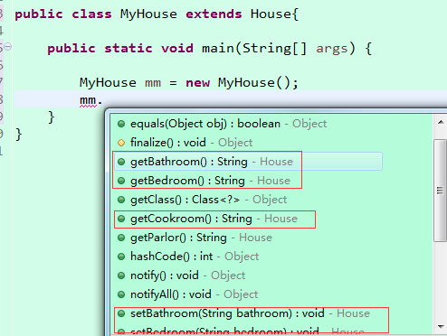
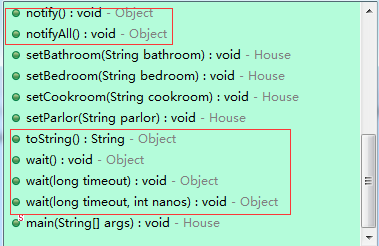
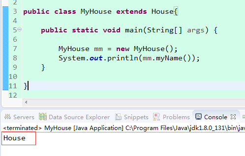

> _业内经常说的一句话是不要重复造轮子，但是有时候，只有自己造一个轮子了，才会深刻明白什么样的轮子适合山路，什么样的轮子适合平地！_

>

> __我将会持续更新java基础知识，欢迎关注。__

> 往期章节：

>

> [JAVA基础第一章-初识java](https://www.cnblogs.com/JJJ1990/p/10095399.html)

_至今记得若干年 前，去面试排了半天的队，到我的时候，面试官问我的第一个问题，java三大特性是什么~我支支吾吾的没有答全~0.0_

**什么是封装？**

举个例子：有一个房子，房子里面有厨房，卫生间，卧室，客厅等房间，每一个房间都有各自的用途，而客人要来我家吃饭也好，闲聊也好，那么他只能从我家的门（对外暴露的接口）进来，那这个房子就代表一个“封装”。

封装（Encapsulation）是面向对象方法的重要原则，就是把对象的属性和操作（或服务）结合为一个独立的整体，并尽可能隐藏对象的内部实现细节。

封装时的权限控制符区别如下:

具体到java代码如下：

    
    
     1  /*
     2   * 封装演示
     3    */
     4  public class House 
     5 {
     6     
     7      // 私有化属性
     8      private String cookroom;
     9      private String bathroom;
    10      private String bedroom;
    11      private String parlor;
    12      
    13     public String getCookroom() {
    14         return cookroom;
    15     }
    16     public void setCookroom(String cookroom) {
    17         this.cookroom = cookroom;
    18     }
    19     public String getBathroom() {
    20         return bathroom;
    21     }
    22     public void setBathroom(String bathroom) {
    23         this.bathroom = bathroom;
    24     }
    25     public String getBedroom() {
    26         return bedroom;
    27     }
    28     public void setBedroom(String bedroom) {
    29         this.bedroom = bedroom;
    30     }
    31     public String getParlor() {
    32         return parlor;
    33     }
    34     public void setParlor(String parlor) {
    35         this.parlor = parlor;
    36     }
    37 }

所以，在这里我们可以看到这个House 类就是一个封装的体现。

**什么是继承？**

俗话说，龙生龙，凤生凤，老鼠的儿子会打洞，这就是继承的一种表现。就像我们每个人会继承父母的相貌等基因，甚至财富，人脉等资源。

同样在java代码中类与类，接口与接口之间都存在继承，要想继承另一个类，那么 **extends** 是必不可少的。

唯一要注意的是，java所倡导的继承是单继承，就像我们每一个人，只会有一个亲生父亲（ _当然马云爸爸，要认我做儿子的话，我也是无法拒绝的0.0_
），所以java类只能通过关键字 **extends** 继承另外一个类，或者一个接口通过 关键字 **extends** 继承另外一个接口。

而类与接口之间，只能是类实现接口，通过关键字 **implements** 完成类实现接口。

具体java代码如下：

    
    
    1 public class MyHouse extends House{
    2   //我的房子啥都没有~
    3     
    4 }

从上面代码看到，新建MyHouse类啥都没有，我只是继承了House，但是请看下图,我可以通过new一个MyHouse对象去调用House的方法属性，这就是继承的魅力

最后还要强调的一点就是继承和 **final** 关键字的关系：

final 可以修饰类，代表当前被修饰类不能被继承；

可以修饰变量，就变成了类的常量，这个变量一旦被初始化便不可改变；

可以修饰方法，代表子类不能复写或者说不能改变被修饰的方法中的代码，但是可以直接拿来使用；

**注：万物皆对象，其实我们每新建一个类，都是已经默认继承了Object类了，我们新建一个类之后，可以看到有一些默认的方法，如下图中我圈中的部分，都是来自于Object类的。**

**什么是多态？**

java中的多态具体分为2大类：覆写（又叫重写）和重载

**覆写**

覆写的存在的前提条件就是首先要有继承，比如前面我们写的Myhouse继承House，我在House类中新增一个方法名为myName，之前的代码不做变化，新增代码如下：

    
    
    1     public String myName()
    2     {
    3         return "House";
    4     }

这个时候我通过Myhouse对象调用myName方法，通过输出到控制台可以看到，输出的结果为house，因为我们继承了父类

下面我们在子类中覆写这个方法，代码如下

    
    
     1 public class MyHouse extends House{
     2 
     3     public static void main(String[] args) {
     4         
     5         MyHouse mm = new MyHouse();
     6         System.out.println(mm.myName());
     7     }
     8     public String myName()
     9     {
    10         return "myHouse";
    11     }
    12 }

这个时候再运行程序，得到的结果就是 myHouse，而不再是House。

所以呢，覆写就是当子类定义了和父类在方法名称、返回值类型、参数类型及个数完全相同的方法的时候，称为方法的覆写。

在进行方法覆写的时候有一点需要注意：被子类所覆写的方法不能拥有比父类更严格的访问控制权限。

如果此时父类之中的方法是default权限，那么子类覆写的时候只能是default或public权限，而如果父类的方法是public，那么子类之中方法的访问权限只能是public。

当一个子类覆写了一个父类方法的时候，子类要想调用父类的被覆写过的方法，要在方法前要加上 **super** 关键字

**重载**

重载，简单说，就是函数或者方法有相同的名称，但是参数列表不相同的情形，这样的同名不同参数的函数或者方法之间，互相称之为重载函数或者方法。

关于重载是不是多态这部分，其实有很多人还进行过争论，有人认为他不是面向对象，只是面向方法，违背了最基本要求。

我个人理解，重载是不是多态 关键是你给多态的定义是什么 _如果多态的定义是同一事物具有的不同反应 那重载也算多态 也就是所谓的广义多态 。_

具体的代码表现如下，同名的myName方法有4个，在调用的时候我们只需要传入不同的参数即可调用相应的方法：

    
    
     1 public class MyHouse extends House{
     2 
     3     public static void main(String[] args) {
     4         
     5         MyHouse mm = new MyHouse();
     6         System.out.println(mm.myName());
     7     }
     8     public String myName()
     9     {
    10         return "myHouse";
    11     }
    12     
    13     public String myName(String args)
    14     {
    15         return "myHouse" + args;
    16     }
    17     
    18     public String myName(String args,String args1)
    19     {
    20         return "myHouse" + args;
    21     }
    22     
    23     public String myName(int i)
    24     {
    25         
    26         return "myHouse" + i;
    27     }
    28 }

**文中若有不正之处，欢迎批评指正！**

