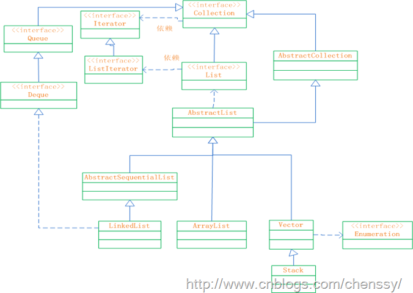
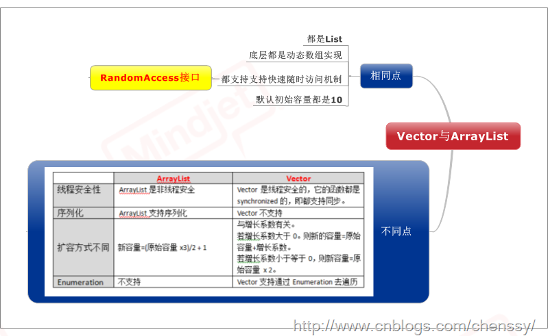

前面LZ已经充分介绍了有关于List接口的大部分知识，如ArrayList、LinkedList、Vector、Stack，通过这几个知识点可以对List接口有了比较深的了解了。只有通过归纳总结的知识才是你的知识。所以下面LZ就List接口做一个总结。推荐阅读：

[java提高篇（二一）-----ArrayList](http://www.cnblogs.com/chenssy/p/3498468.html)

[java提高篇（二二）-----LinkedList](http://www.cnblogs.com/chenssy/p/3514524.html)

[java提高篇（二九）-----Vector](http://www.cnblogs.com/chenssy/p/3802826.html)

[Java提高篇（三一）-----Stack](http://www.cnblogs.com/chenssy/p/3833341.html)

## 一、List接口概述

List接口，成为有序的Collection也就是序列。该接口可以对列表中的每一个元素的插入位置进行精确的控制，同时用户可以根据元素的整数索引（在列表中的位置）访问元素，并搜索列表中的元素。
下图是List接口的框架图：

通过上面的框架图，可以对List的结构了然于心，其各个类、接口如下：

**Collection：** Collection 层次结构 中的根接口。它表示一组对象，这些对象也称为 collection
的元素。对于Collection而言，它不提供任何直接的实现，所有的实现全部由它的子类负责。

**AbstractCollection：** 提供 Collection
接口的骨干实现，以最大限度地减少了实现此接口所需的工作。对于我们而言要实现一个不可修改的 collection，只需扩展此类，并提供 iterator 和
size 方法的实现。但要实现可修改的 collection，就必须另外重写此类的 add 方法（否则，会抛出
UnsupportedOperationException），iterator 方法返回的迭代器还必须另外实现其 remove 方法。

**Iterator：** 迭代器。

**ListIterator：** 系列表迭代器，允许程序员按任一方向遍历列表、迭代期间修改列表，并获得迭代器在列表中的当前位置。

**List：** 继承于Collection的接口。它代表着有序的队列。

**AbstractList：** List 接口的骨干实现，以最大限度地减少实现“随机访问”数据存储（如数组）支持的该接口所需的工作。

**Queue：** 队列。提供队列基本的插入、获取、检查操作。

**Deque：** 一个线性 collection，支持在两端插入和移除元素。大多数 Deque
实现对于它们能够包含的元素数没有固定限制，但此接口既支持有容量限制的双端队列，也支持没有固定大小限制的双端队列。

**AbstractSequentialList：** 提供了 List
接口的骨干实现，从而最大限度地减少了实现受“连续访问”数据存储（如链接列表）支持的此接口所需的工作。从某种意义上说，此类与在列表的列表迭代器上实现“随机访问”方法。

**LinkedList：** List 接口的链接列表实现。它实现所有可选的列表操作。

**ArrayList：** List 接口的大小可变数组的实现。它实现了所有可选列表操作，并允许包括 null 在内的所有元素。除了实现 List
接口外，此类还提供一些方法来操作内部用来存储列表的数组的大小。

**Vector：** 实现可增长的对象数组。与数组一样，它包含可以使用整数索引进行访问的组件。

**Stack：** 后进先出（LIFO）的对象堆栈。它通过五个操作对类 Vector 进行了扩展 ，允许将向量视为堆栈。

**Enumeration：** 枚举，实现了该接口的对象，它生成一系列元素，一次生成一个。连续调用 nextElement 方法将返回一系列的连续元素。

## 二、使用场景

**学习知识的根本目的就是使用它。**
每个知识点都有它的使用范围。集合也是如此，在Java中集合的家族非常庞大，每个成员都有最适合的使用场景。在刚刚接触List时，LZ就说过
**如果涉及到“栈”、“队列”、“链表”等操作，请优先考虑用List。** 至于是那个List则分如下：

1、对于需要快速插入、删除元素，则需使用LinkedList。

2、对于需要快速访问元素，则需使用ArrayList。

3、对于“单线程环境”或者“多线程环境，但是List仅被一个线程操作”，需要考虑使用非同步的类，如果是“多线程环境，切List可能同时被多个线程操作”，考虑使用同步的类（如Vector）。

### 2.1ArrayList、LinkedList性能分析

在List中我们使用最普遍的就是LinkedList和ArrayList，同时我们也了解了他们两者之间的使用场景和区别。

    
    
    public class ListTest {
        private static final int COUNT = 100000;
        
        private static ArrayList arrayList = new ArrayList<>();
        private static LinkedList linkedList = new LinkedList<>();
        private static Vector vector = new Vector<>();
        
        public static void insertToList(List list){
            long startTime = System.currentTimeMillis();
    
            for(int i = 0 ; i < COUNT ; i++){
                list.add(0,i);
            }
            
            long endTime = System.currentTimeMillis();
            System.out.println("插入 " + COUNT + "元素" + getName(list) + "花费 " + (endTime - startTime) + " 毫秒");
        }
        
        public static void deleteFromList(List list){
            long startTime = System.currentTimeMillis();
            
            for(int i = 0 ; i < COUNT ; i++){
                list.remove(0);
            }
            
            long endTime = System.currentTimeMillis();
            System.out.println("删除" + COUNT + "元素" + getName(list) + "花费 " + (endTime - startTime) + " 毫秒");
        }
        
        public static void readList(List list){
            long startTime = System.currentTimeMillis();
            
            for(int i = 0 ; i < COUNT ; i++){
                list.get(i);
            }
            
            long endTime = System.currentTimeMillis();
            System.out.println("读取" + COUNT + "元素" + getName(list) + "花费 " + (endTime - startTime) + " 毫秒");
        }
    
        private static String getName(List list) {
            String name = "";
            if(list instanceof ArrayList){
                name = "ArrayList";
            }
            else if(list instanceof LinkedList){
                name = "LinkedList";
            }
            else if(list instanceof Vector){
                name = "Vector";
            }
            return name;
        }
        
        public static void main(String[] args) {
            insertToList(arrayList);
            insertToList(linkedList);
            insertToList(vector);
            
            System.out.println("--------------------------------------");
            
            readList(arrayList);
            readList(linkedList);
            readList(vector);
            
            System.out.println("--------------------------------------");
            
            deleteFromList(arrayList);
            deleteFromList(linkedList);
            deleteFromList(vector);
        }
    }

运行结果:

    
    
    插入 100000元素ArrayList花费 3900 毫秒
    插入 100000元素LinkedList花费 15 毫秒
    插入 100000元素Vector花费 3933 毫秒
    --------------------------------------
    读取100000元素ArrayList花费 0 毫秒
    读取100000元素LinkedList花费 8877 毫秒
    读取100000元素Vector花费 16 毫秒
    --------------------------------------
    删除100000元素ArrayList花费 4618 毫秒
    删除100000元素LinkedList花费 16 毫秒
    删除100000元素Vector花费 4759 毫秒

从上面的运行结果我们可以清晰的看出ArrayList、LinkedList、Vector增加、删除、遍历的效率问题。下面我就插入方法add(int
index, E element),delete、get方法各位如有兴趣可以研究研究。

首先我们先看三者之间的源码：

ArrayList

    
    
    public void add(int index, E element) {
            rangeCheckForAdd(index);   //检查是否index是否合法
    
            ensureCapacityInternal(size + 1);  //扩容操作
            System.arraycopy(elementData, index, elementData, index + 1, size - index);    //数组拷贝
            elementData[index] = element;   //插入
            size++;
        }

rangeCheckForAdd、ensureCapacityInternal两个方法没有什么影响，真正产生影响的是System.arraycopy方法，该方法是个JNI函数，是在JVM中实现的。声明如下：

    
    
    public static native void arraycopy(Object src, int srcPos, Object dest, int destPos, int length);

目前LZ无法看到源码，具体的实现不是很清楚，不过[System.arraycopy源码分析](http://gutspot.com/2011/11/16/system-
arraycopy%E6%BA%90%E7%A0%81%E5%88%86%E6%9E%90/)对其进行了比较清晰的分析。但事实上我们只需要了解该方法会移动index后面的所有元素即可，这就意味着ArrayList的add(int
index, E element)方法会引起index位置之后所有元素的改变，这真是牵一处而动全身。

LinkedList

    
    
    public void add(int index, E element) {
            checkPositionIndex(index);
    
            if (index == size)     //插入位置在末尾
                linkLast(element);
            else                   
                linkBefore(element, node(index));
        }

该方法比较简单，插入位置在末尾则调用linkLast方法，否则调用linkBefore方法，其实linkLast、linkBefore都是非常简单的实现，就是在index位置插入元素，至于index具体为知则有node方法来解决，同时node对index位置检索还有一个加速作用，如下：

    
    
    Node<E> node(int index) {
            if (index < (size >> 1)) {    //如果index 小于 size/2 则从头开始查找
                Node<E> x = first;
                for (int i = 0; i < index; i++)
                    x = x.next;
                return x;
            } else {   //如果index 大于 size/2 则从尾部开始查找
                Node<E> x = last;
                for (int i = size - 1; i > index; i--)
                    x = x.prev;
                return x;
            }
        }

所以linkedList的插入动作比ArrayList动作快就在于两个方面。1：linkedList不需要执行元素拷贝动作，没有牵一发而动全身的大动作。2:查找插入位置有加速动作即：若index
< 双向链表长度的1/2，则从前向后查找; 否则，从后向前查找。

Vector

Vector的实现机制和ArrayList一样，同样是使用动态数组来实现的，所以他们两者之间的效率差不多，add的源码也一样，如下：

    
    
    public void add(int index, E element) {
            insertElementAt(element, index);
        }
        
        public synchronized void insertElementAt(E obj, int index) {
            modCount++;
            if (index > elementCount) {
                throw new ArrayIndexOutOfBoundsException(index
                                                         + " > " + elementCount);
            }
            ensureCapacityHelper(elementCount + 1);
            System.arraycopy(elementData, index, elementData, index + 1, elementCount - index);
            elementData[index] = obj;
            elementCount++;
        }

上面是针对ArrayList、LinkedList、Vector三者之间的add（int index,E
element)方法的解释，解释了LinkedList的插入动作要比ArrayList、Vector的插入动作效率为什么要高出这么多！至于delete、get两个方法LZ就不多解释了。

_同时LZ在写上面那个例子时发现了一个非常有趣的现象，就是linkedList在某些时候执行add方法时比ArrayList方法会更慢！至于在什么情况？为什么会慢LZ下篇博客解释，当然不知道这个情况各位是否也遇到过？？_

### 2.2、Vector和ArrayList的区别

## 四、更多

[java提高篇（二一）-----ArrayList](http://www.cnblogs.com/chenssy/p/3498468.html)

[java提高篇（二二）-----LinkedList](http://www.cnblogs.com/chenssy/p/3514524.html)

[java提高篇（二九）-----Vector](http://www.cnblogs.com/chenssy/p/3802826.html)

[Java提高篇（三一）-----Stack](http://www.cnblogs.com/chenssy/p/3833341.html)

* * *

**\-----原文出自:**[
**<http://cmsblogs.com/?p=1201>**](http://cmsblogs.com/?p=1201
"http://cmsblogs.com/?p=1201") **,请尊重作者辛勤劳动成果,转载说明出处.**

**\-----个人站点:**[ **http://cmsblogs.com**](http://cmsblogs.com)

