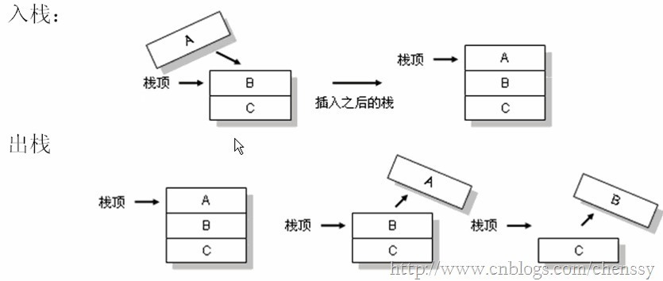

##Java提高篇（三一）-----Stack

##
##在Java中Stack类表示后进先出（LIFO）的对象堆栈。栈是一种非常常见的数据结构，它采用典型的先进后出的操作方式完成的。每一个栈都包含一个栈顶，每次出栈是将栈顶的数据取出，如下：

##
## 

##
##Stack通过五个操作对Vector进行扩展，允许将向量视为堆栈。这个五个操作如下：             操作          说明                           empty()                        测试堆栈是否为空。                                  peek()                        查看堆栈顶部的对象，但不从堆栈中移除它。                                  pop()                        移除堆栈顶部的对象，并作为此函数的值返回该对象。                                  push(E item)                        把项压入堆栈顶部。                                  search(Object o)                        返回对象在堆栈中的位置，以 1 为基数。               

##
##Stack继承Vector，他对Vector进行了简单的扩展：   	public class Stack<E> extends Vector<E>

##
## Stack的实现非常简单，仅有一个构造方法，五个实现方法（从Vector继承而来的方法不算与其中），同时其实现的源码非常简单  	/**     * 构造函数     */    public Stack() {    	}    /**     *  push函数：将元素存入栈顶     */    public E push(E item) {        // 将元素存入栈顶。        // addElement()的实现在Vector.java中        addElement(item);        return item;    	}    /**     * pop函数：返回栈顶元素，并将其从栈中删除     */    public synchronized E pop() {        E    obj;        int    len = size();        obj = peek();        // 删除栈顶元素，removeElementAt()的实现在Vector.java中        removeElementAt(len - 1);        return obj;    	}    /**     * peek函数：返回栈顶元素，不执行删除操作     */    public synchronized E peek() {        int    len = size();        if (len == 0)            throw new EmptyStackException();        // 返回栈顶元素，elementAt()具体实现在Vector.java中        return elementAt(len - 1);    	}    /**     * 栈是否为空     */    public boolean empty() {        return size() == 0;    	}    /**     *  查找“元素o”在栈中的位置：由栈底向栈顶方向数     */    public synchronized int search(Object o) {        // 获取元素索引，elementAt()具体实现在Vector.java中        int i = lastIndexOf(o);        if (i >= 0) {            return size() - i;        	}        return -1;    	}

##
##Stack的源码很多都是基于Vector，所以这里不再累述，更多详情请参考：Java提高篇（二九）-----Vector