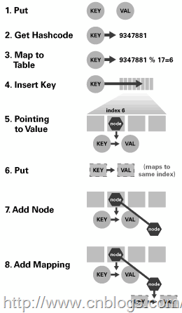

##Java提高篇（三三）-----Map总结

##
##在前面LZ详细介绍了HashMap、HashTable、TreeMap的实现方法，从数据结构、实现原理、源码分析三个方面进行阐述，对这个三个类应该有了比较清晰的了解,下面LZ就Map做一个简单的总结。

##
##推荐阅读：

##
##java提高篇（二三）—–HashMap

##
##java提高篇（二五）—–HashTable

##
##Java提高篇（二六）-----hashCode

##
##Java提高篇（二七）—–TreeMap
##一、Map概述

##
##首先先看Map的结构示意图

##
## 

##
##Map：“键值”对映射的抽象接口。该映射不包括重复的键，一个键对应一个值。

##
##SortedMap：有序的键值对接口，继承Map接口。

##
##NavigableMap：继承SortedMap，具有了针对给定搜索目标返回最接近匹配项的导航方法的接口。

##
##AbstractMap：实现了Map中的绝大部分函数接口。它减少了“Map的实现类”的重复编码。

##
##Dictionary：任何可将键映射到相应值的类的抽象父类。目前被Map接口取代。

##
##TreeMap：有序散列表，实现SortedMap 接口，底层通过红黑树实现。

##
##HashMap：是基于“拉链法”实现的散列表。底层采用“数组+链表”实现。

##
##WeakHashMap：基于“拉链法”实现的散列表。

##
##HashTable：基于“拉链法”实现的散列表。

##
##总结如下：

##
## 

##
##他们之间的区别：

##
## 
##二、内部哈希： 哈希映射技术

##
##几乎所有通用Map都使用哈希映射技术。对于我们程序员来说我们必须要对其有所了解。

##
##哈希映射技术是一种就元素映射到数组的非常简单的技术。由于哈希映射采用的是数组结果，那么必然存在一中用于确定任意键访问数组的索引机制，该机制能够提供一个小于数组大小的整数，我们将该机制称之为哈希函数。在Java中我们不必为寻找这样的整数而大伤脑筋，因为每个对象都必定存在一个返回整数值的hashCode方法，而我们需要做的就是将其转换为整数，然后再将该值除以数组大小取余即可。如下   	int hashValue = Maths.abs(obj.hashCode()) % size;	下面是HashMap、HashTable的：  	----------HashMap------------//计算hash值static int hash(int h) {    h ^= (h >>> 20) ^ (h >>> 12);    return h ^ (h >>> 7) ^ (h >>> 4);	}//计算key的索引位置static int indexFor(int h, int length) {        return h &amp; (length-1);	}-----HashTable--------------int index = (hash &amp; 0x7FFFFFFF) % tab.length;     //确认该key的索引位置	 位置的索引就代表了该节点在数组中的位置。下图是哈希映射的基本原理图：	 	在该图中1-4步骤是找到该元素在数组中位置，5-8步骤是将该元素插入数组中。在插入的过程中会遇到一点点小挫折。在众多肯能存在多个元素他们的hash值是一样的，这样就会得到相同的索引位置，也就说多个元素会映射到相同的位置，这个过程我们称之为“冲突”。解决冲突的办法就是在索引位置处插入一个链接列表，并简单地将元素添加到此链接列表。当然也不是简单的插入，在HashMap中的处理过程如下：获取索引位置的链表，如果该链表为null，则将该元素直接插入，否则通过比较是否存在与该key相同的key，若存在则覆盖原来key的value并返回旧值，否则将该元素保存在链头（最先保存的元素放在链尾）。下面是HashMap的put方法，该方法详细展示了计算索引位置，将元素插入到适当的位置的全部过程：  	public V put(K key, V value) {        //当key为null，调用putForNullKey方法，保存null与table第一个位置中，这是HashMap允许为null的原因        if (key == null)            return putForNullKey(value);        //计算key的hash值        int hash = hash(key.hashCode());                         //计算key hash 值在 table 数组中的位置        int i = indexFor(hash, table.length);                    //从i出开始迭代 e,判断是否存在相同的key        for (Entry<K, V> e = table[i]; e != null; e = e.next) {            Object k;            //判断该条链上是否有hash值相同的(key相同)            //若存在相同，则直接覆盖value，返回旧value            if (e.hash == hash &amp;&amp; ((k = e.key) == key || key.equals(k))) {                V oldValue = e.value;    //旧值 = 新值                e.value = value;                e.recordAccess(this);                return oldValue;     //返回旧值            	}        	}        //修改次数增加1        modCount++;        //将key、value添加至i位置处        addEntry(hash, key, value, i);        return null;    	}	HashMap的put方法展示了哈希映射的基本思想，其实如果我们查看其它的Map，发现其原理都差不多！
##三、Map优化

##
##首先我们这样假设，假设哈希映射的内部数组的大小只有1，所有的元素都将映射该位置（0），从而构成一条较长的链表。由于我们更新、访问都要对这条链表进行线性搜索，这样势必会降低效率。我们假设，如果存在一个非常大数组，每个位置链表处都只有一个元素，在进行访问时计算其 index 值就会获得该对象，这样做虽然会提高我们搜索的效率，但是它浪费了控件。诚然，虽然这两种方式都是极端的，但是它给我们提供了一种优化思路：使用一个较大的数组让元素能够均匀分布。在Map有两个会影响到其效率，一是容器的初始化大小、二是负载因子。3.1、调整实现大小

##
##在哈希映射表中，内部数组中的每个位置称作“存储桶”(bucket)，而可用的存储桶数（即内部数组的大小）称作容量 (capacity)，我们为了使Map对象能够有效地处理任意数的元素，将Map设计成可以调整自身的大小。我们知道当Map中的元素达到一定量的时候就会调整容器自身的大小，但是这个调整大小的过程其开销是非常大的。调整大小需要将原来所有的元素插入到新数组中。我们知道index = hash(key) % length。这样可能会导致原先冲突的键不在冲突，不冲突的键现在冲突的，重新计算、调整、插入的过程开销是非常大的，效率也比较低下。所以，如果我们开始知道Map的预期大小值，将Map调整的足够大，则可以大大减少甚至不需要重新调整大小，这很有可能会提高速度。下面是HashMap调整容器大小的过程，通过下面的代码我们可以看到其扩容过程的复杂性：  	void resize(int newCapacity) {            Entry[] oldTable = table;    //原始容器            int oldCapacity = oldTable.length;    //原始容器大小            if (oldCapacity == MAXIMUM_CAPACITY) {     //是否超过最大值：1073741824                threshold = Integer.MAX_VALUE;                return;            	}            //新的数组：大小为 oldCapacity * 2            Entry[] newTable = new Entry[newCapacity];                transfer(newTable, initHashSeedAsNeeded(newCapacity));            table = newTable;           /*            * 重新计算阀值 =  newCapacity * loadFactor >  MAXIMUM_CAPACITY + 1 ?             *                         newCapacity * loadFactor :MAXIMUM_CAPACITY + 1            */            threshold = (int)Math.min(newCapacity * loadFactor, MAXIMUM_CAPACITY + 1);           	}                //将元素插入到新数组中        void transfer(Entry[] newTable, boolean rehash) {            int newCapacity = newTable.length;            for (Entry<K,V> e : table) {                while(null != e) {                    Entry<K,V> next = e.next;                    if (rehash) {                        e.hash = null == e.key ? 0 : hash(e.key);                    	}                    int i = indexFor(e.hash, newCapacity);                    e.next = newTable[i];                    newTable[i] = e;                    e = next;                	}            	}        	}3.2、负载因子

##
##为了确认何时需要调整Map容器，Map使用了一个额外的参数并且粗略计算存储容器的密度。在Map调整大小之前，使用”负载因子”来指示Map将会承担的“负载量”，也就是它的负载程度，当容器中元素的数量达到了这个“负载量”，则Map将会进行扩容操作。负载因子、容量、Map大小之间的关系如下：负载因子 * 容量 > map大小 ----->调整Map大小。

##
##例如：如果负载因子大小为0.75（HashMap的默认值），默认容量为11，则 11 * 0.75 = 8.25 = 8，所以当我们容器中插入第八个元素的时候，Map就会调整大小。

##
##负载因子本身就是在控件和时间之间的折衷。当我使用较小的负载因子时，虽然降低了冲突的可能性，使得单个链表的长度减小了，加快了访问和更新的速度，但是它占用了更多的控件，使得数组中的大部分控件没有得到利用，元素分布比较稀疏，同时由于Map频繁的调整大小，可能会降低性能。但是如果负载因子过大，会使得元素分布比较紧凑，导致产生冲突的可能性加大，从而访问、更新速度较慢。所以我们一般推荐不更改负载因子的值，采用默认值0.75.
##最后

##
##推荐阅读：

##
##java提高篇（二三）—–HashMap

##
##java提高篇（二五）—–HashTable

##
##Java提高篇（二六）-----hashCode

##
##Java提高篇（二七）—–TreeMap

###

###

###

###-----原文出自:http://cmsblogs.com/?p=1212,请尊重作者辛勤劳动成果,转载说明出处.

##
##-----个人站点:http://cmsblogs.com