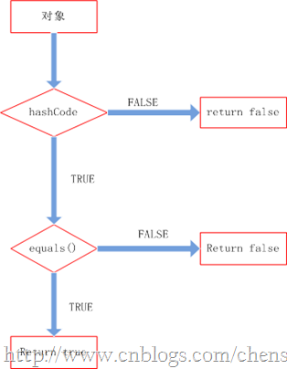
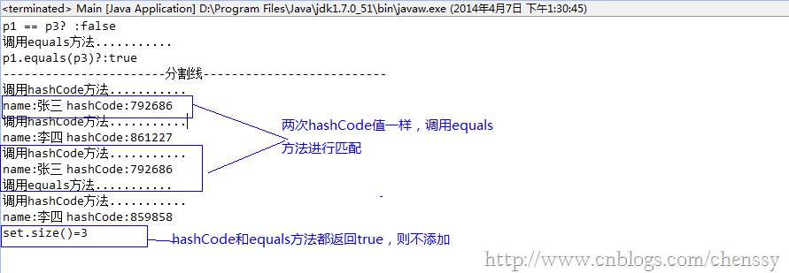

##Java提高篇（二六）-----hashCode

##
## 

##
## 在前面三篇博文中LZ讲解了（HashMap、HashSet、HashTable），在其中LZ不断地讲解他们的put和get方法，在这两个方法中计算key的hashCode应该是最重要也是最精华的部分，所以下面LZ揭开hashCode的“神秘”面纱。
##hashCode的作用

##
## 要想了解一个方法的内在原理，我们首先需要明白它是干什么的，也就是这个方法的作用。在讲解数组时（java提高篇（十八）------数组），我们提到数组是java中效率最高的数据结构，但是“最高”是有前提的。第一我们需要知道所查询数据的所在位置。第二：如果我们进行迭代查找时，数据量一定要小，对于大数据量而言一般推荐集合。

##
## 在Java集合中有两类，一类是List，一类是Set他们之间的区别就在于List集合中的元素师有序的，且可以重复，而Set集合中元素是无序不可重复的。对于List好处理，但是对于Set而言我们要如何来保证元素不重复呢？通过迭代来equals()是否相等。数据量小还可以接受，当我们的数据量大的时候效率可想而知（当然我们可以利用算法进行优化）。比如我们向HashSet插入1000数据，难道我们真的要迭代1000次，调用1000次equals()方法吗？hashCode提供了解决方案。怎么实现？我们先看hashCode的源码(Object)。   	public native int hashCode();

##
## 它是一个本地方法，它的实现与本地机器有关，这里我们暂且认为他返回的是对象存储的物理位置（实际上不是，这里写是便于理解）。当我们向一个集合中添加某个元素，集合会首先调用hashCode方法，这样就可以直接定位它所存储的位置，若该处没有其他元素，则直接保存。若该处已经有元素存在，就调用equals方法来匹配这两个元素是否相同，相同则不存，不同则散列到其他位置（具体情况请参考（Java提高篇（）-----HashMap））。这样处理，当我们存入大量元素时就可以大大减少调用equals()方法的次数，极大地提高了效率。

##
## 所以hashCode在上面扮演的角色为寻域（寻找某个对象在集合中区域位置）。hashCode可以将集合分成若干个区域，每个对象都可以计算出他们的hash码，可以将hash码分组，每个分组对应着某个存储区域，根据一个对象的hash码就可以确定该对象所存储区域，这样就大大减少查询匹配元素的数量，提高了查询效率。
##hashCode对于一个对象的重要性

##
## hashCode重要么？不重要，对于List集合、数组而言，他就是一个累赘，但是对于HashMap、HashSet、HashTable而言，它变得异常重要。所以在使用HashMap、HashSet、HashTable时一定要注意hashCode。对于一个对象而言，其hashCode过程就是一个简单的Hash算法的实现，其实现过程对你实现对象的存取过程起到非常重要的作用。

##
## 在前面LZ提到了HashMap和HashTable两种数据结构，虽然他们存在若干个区别，但是他们的实现原理是相同的，这里我以HashTable为例阐述hashCode对于一个对象的重要性。

##
## 一个对象势必会存在若干个属性，如何选择属性来进行散列考验着一个人的设计能力。如果我们将所有属性进行散列，这必定会是一个糟糕的设计，因为对象的hashCode方法无时无刻不是在被调用，如果太多的属性参与散列，那么需要的操作数时间将会大大增加，这将严重影响程序的性能。但是如果较少属相参与散列，散列的多样性会削弱，会产生大量的散列“冲突”，除了不能够很好的利用空间外，在某种程度也会影响对象的查询效率。其实这两者是一个矛盾体，散列的多样性会带来性能的降低。

##
## 那么如何对对象的hashCode进行设计，LZ也没有经验。从网上查到了这样一种解决方案：设置一个缓存标识来缓存当前的散列码，只有当参与散列的对象改变时才会重新计算，否则调用缓存的hashCode，这样就可以从很大程度上提高性能。

##
## 在HashTable计算某个对象在table[]数组中的索引位置，其代码如下：  	int index = (hash &amp; 0x7FFFFFFF) % tab.length;

##
## 为什么要&amp;0x7FFFFFFF？因为某些对象的hashCode可能会为负值，与0x7FFFFFFF进行与运算可以确保index为一个正数。通过这步我可以直接定位某个对象的位置，所以从理论上来说我们是完全可以利用hashCode直接定位对象的散列表中的位置，但是为什么会存在一个key-value的键值对，利用key的hashCode来存入数据而不是直接存放value呢？这就关系HashTable性能问题的最重要的问题:Hash冲突！

##
## 我们知道冲突的产生是由于不同的对象产生了相同的散列码，假如我们设计对象的散列码可以确保99.999999999%的不重复，但是有一种绝对且几乎不可能遇到的冲突你是绝对避免不了的。我们知道hashcode返回的是int，它的值只可能在int范围内。如果我们存放的数据超过了int的范围呢？这样就必定会产生两个相同的index，这时在index位置处会存储两个对象，我们就可以利用key本身来进行判断。所以具有相索引的对象，在该index位置处存在多个对象，我们必须依靠key的hashCode和key本身来进行区分。
##hashCode与equals

##
## 在Java中hashCode的实现总是伴随着equals，他们是紧密配合的，你要是自己设计了其中一个，就要设计另外一个。当然在多数情况下，这两个方法是不用我们考虑的，直接使用默认方法就可以帮助我们解决很多问题。但是在有些情况，我们必须要自己动手来实现它，才能确保程序更好的运作。

##
## 对于equals，我们必须遵循如下规则：

##
## 对称性：如果x.equals(y)返回是“true”，那么y.equals(x)也应该返回是“true”。 

##
## 反射性：x.equals(x)必须返回是“true”。 

##
## 类推性：如果x.equals(y)返回是“true”，而且y.equals(z)返回是“true”，那么z.equals(x)也应该返回是“true”。 

##
## 一致性：如果x.equals(y)返回是“true”，只要x和y内容一直不变，不管你重复x.equals(y)多少次，返回都是“true”。 

##
## 任何情况下，x.equals(null)，永远返回是“false”；x.equals(和x不同类型的对象)永远返回是“false”。 

##
## 对于hashCode，我们应该遵循如下规则：

##
## 1. 在一个应用程序执行期间，如果一个对象的equals方法做比较所用到的信息没有被修改的话，则对该对象调用hashCode方法多次，它必须始终如一地返回同一个整数。

##
## 2. 如果两个对象根据equals(Object o)方法是相等的，则调用这两个对象中任一对象的hashCode方法必须产生相同的整数结果。

##
## 3. 如果两个对象根据equals(Object o)方法是不相等的，则调用这两个对象中任一个对象的hashCode方法，不要求产生不同的整数结果。但如果能不同，则可能提高散列表的性能。

##
## 至于两者之间的关联关系，我们只需要记住如下即可：

##
## 如果x.equals(y)返回“true”，那么x和y的hashCode()必须相等。 

##
## 如果x.equals(y)返回“false”，那么x和y的hashCode()有可能相等，也有可能不等。 

##
## 理清了上面的关系我们就知道他们两者是如何配合起来工作的。先看下图：

##
## 

##
## 整个处理流程是：

##
## 1、判断两个对象的hashcode是否相等，若不等，则认为两个对象不等，完毕，若相等，则比较equals。

##
## 2、若两个对象的equals不等，则可以认为两个对象不等，否则认为他们相等。

##
## 实例：  	public class Person {    private int age;    private int sex;    //0：男，1：女    private String name;        private final int PRIME = 37;        Person(int age ,int sex ,String name){        this.age = age;        this.sex = sex;        this.name = name;    	}    /** 省略getter、setter方法 **/        @Override    public int hashCode() {        System.out.println("调用hashCode方法...........");        int hashResult = 1;        hashResult = (hashResult + Integer.valueOf(age).hashCode() + Integer.valueOf(sex).hashCode()) * PRIME;        hashResult = PRIME * hashResult + ((name == null) ? 0 : name.hashCode());         System.out.println("name:"+name +" hashCode:" + hashResult);                return hashResult;    	}    /**     * 重写hashCode()     */    public boolean equals(Object obj) {        System.out.println("调用equals方法...........");                if(obj == null){            return false;        	}        if(obj.getClass() != this.getClass()){            return false;        	}        if(this == obj){            return true;        	}        Person person = (Person) obj;                if(getAge() != person.getAge() || getSex()!= person.getSex()){            return false;        	}                if(getName() != null){            if(!getName().equals(person.getName())){                return false;            	}        	}        else if(person != null){            return false;        	}        return true;    	}	}

##
## 该Bean为一个标准的Java Bean，重新实现了hashCode方法和equals方法。  	public class Main extends JPanel {    public static void main(String[] args) {        Set<Person> set = new HashSet<Person>();                Person p1 = new Person(11, 1, "张三");        Person p2 = new Person(12, 1, "李四");        Person p3 = new Person(11, 1, "张三");        Person p4 = new Person(11, 1, "李四");                //只验证p1、p3        System.out.println("p1 == p3? :" + (p1 == p3));        System.out.println("p1.equals(p3)?:"+p1.equals(p3));        System.out.println("-----------------------分割线--------------------------");        set.add(p1);        set.add(p2);        set.add(p3);        set.add(p4);        System.out.println("set.size()="+set.size());    	}	}

##
## 运行结果如下：

##
## 

##
## 从上图可以看出，程序调用四次hashCode方法，一次equals方法，其set的长度只有3。add方法运行流程完全符合他们两者之间的处理流程。

##
## 更多请关注：

##
## >>>>>>>>>Java提高篇（十三）------equals()

##
## >>>>>>>>>Java提高篇（二三）------HashMap

##
## >>>>>>>>>Java提高篇（二四）------HashSet

##
## >>>>>>>>>Java提高篇（二五）------HashTable