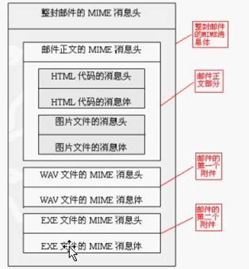
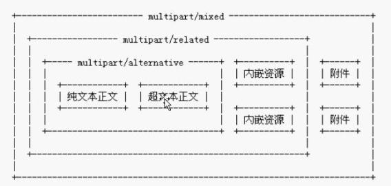
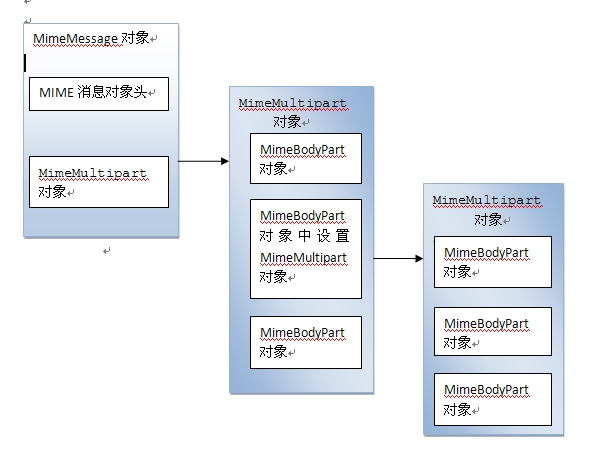

前面两篇博客都只是最基本的邮件最简单的邮件发送了，在实际的电子邮件中我们一般都会涉及到更加复杂电子邮件结构，例如有附件、邮件正文里面包含图片、包含歌曲等等，在这个时候我们就必须要对邮件的结构有着很清晰的认识。在进行复合邮件开发之前需要对复合邮件的结构有一定的了解。

复合邮件的整体结构

上面这幅图片展示了一封复合邮件的整体结构，我们可以看出一封复杂的电子邮件由多个部分组成。它有一个头部和正文，但是正文并不是像以前那么简单了，而是由几个部分组成。头部需要起到一个指示的作用，它需要说明正文需要使用什么样的分隔符来分开，正文几个部分之间使用什么样的组合关系。对于上面电子邮件它由三个部分组成，每一部分都有自己头和体，第一部分也由两个部分组成。

复合邮件的组合关系

正文部分之间有多种组合关系。组合关系如下图：

alternative:选择关系。上面的纯文本和超文本之间就是一种选择关系。

related:关联关系。假如上面的超文本正文是展示一幅图片，那么我们在发送邮件的时候必须要将这幅图片包含到邮件中，也就是所谓的内嵌资源，这个内嵌资源是给超文本用的。所以他们两者之间是一个关联关系。

mixed:混合关系。在纯文本、超文本和内嵌资源组成一个整体和，他们与附件并列着，两者之间就是一个混合关系了。

复合邮件组织结构的API

MimeMessage类表示整封电子邮件。

MimeBodyPart类表示邮件的一个MiME消息。

MimeMultipart类表示一个由多个MIME消息组合成的组合MIME消息。

下面一个实例：该邮件里面包含两个附件、正文部分包括纯文本和超文本，超文本表示展示一张图片。源代码如下：

    
    
     1 public class JavaMail_03 {
     2 
     3     public static void main(String[] args) throws Exception {
     4         Properties props = new Properties();
     5         props.setProperty("mail.smtp.auth", "true");
     6         props.setProperty("mail.transport.protocol", "smtp");
     7         props.setProperty("mail.host", "smtp.163.com");
     8         Session session = Session.getInstance(props,
     9                 new Authenticator(){
    10                     protected PasswordAuthentication getPasswordAuthentication(){
    11                         return new PasswordAuthentication("*****","******");
    12                     }
    13         });
    14         
    15         Message message = new MimeMessage(session);
    16         message.setSubject("第三个JavaMail测试程序");
    17         message.setFrom(new InternetAddress("\""+MimeUtility.encodeText("陈明")+"\"<chenssy995812509@163.com>"));
    18         message.setRecipients(RecipientType.TO, new Address[]{new InternetAddress("995812509@qq.com")});
    19         
    20         //邮件正文
    21         MimeMultipart multipart = new MimeMultipart("mixed");
    22         message.setContent(multipart);
    23         /*
    24          * 创建邮件的内容
    25          * 包括一个邮件正文和两个附件
    26          */
    27         MimeBodyPart content = new MimeBodyPart();      //邮件内容
    28         MimeBodyPart attch1 = new MimeBodyPart();      //附件1
    29         MimeBodyPart attch2 = new MimeBodyPart();      //附件2
    30         //将邮件内容添加到multipart中
    31         multipart.addBodyPart(content);
    32         multipart.addBodyPart(attch1);
    33         multipart.addBodyPart(attch2);
    34         
    35         //设置附件1
    36         DataSource ds1 = new FileDataSource("G:\\电子书\\oracle口令.txt");
    37         DataHandler dh1 = new DataHandler(ds1);
    38         attch1.setDataHandler(dh1);
    39         attch1.setFileName("oracle.txt");
    40         //设置附件2
    41         DataSource ds2 = new FileDataSource("G:\\电子书\\账号.txt");
    42         DataHandler dh2 = new DataHandler(ds2);
    43         attch2.setDataHandler(dh2);
    44         attch2.setFileName(MimeUtility.encodeText("账号.txt"));
    45         /*
    46          * 设置内容（正文）---是一个复杂体
    47          * 包括HTML正文和显示一张图片
    48          */
    49         MimeMultipart bodyMultipart = new MimeMultipart("related");
    50         content.setContent(bodyMultipart);
    51         //构造正文
    52         MimeBodyPart htmlBody = new MimeBodyPart();
    53         MimeBodyPart gifBody = new MimeBodyPart();
    54         bodyMultipart.addBodyPart(htmlBody);
    55         bodyMultipart.addBodyPart(gifBody);
    56     
    57         //设置图片
    58         DataSource gifds = new FileDataSource("F:\\图片\\图片\\4.jpg");
    59         DataHandler gifdh = new DataHandler(gifds);
    60         gifBody.setDataHandler(gifdh);
    61         gifBody.setHeader("Content-ID", "<"+gifds.getName()+">");
    62         //gifBody.setHeader("Content-Location", "http://www.itcast.cn/logo.gif");
    63         //设置HTML正文
    64         htmlBody.setContent("这是我的第三个JavaMail测试哦!包括了附件和图片，有点儿复杂... " +
    65                 "显示的图片", "text/html;charset=UTF-8");
    66         
    67         
    68         message.saveChanges();        //生成邮件
    69         Transport.send(message);
    70     }
    71 
    72 }

