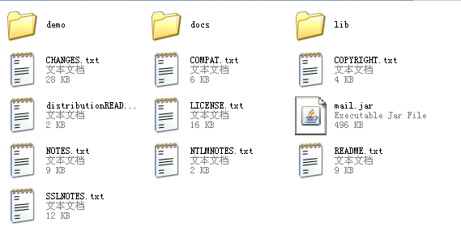
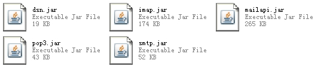
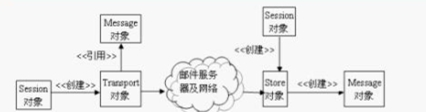

##Java邮件开发-----javaMail（一）

##
##前面介绍了电子邮件系统的基本知识，那篇博客知识对基础理论知识做一些简要介绍，并不妨碍我们做邮件开发。现在开始Java邮件开发。

##
##

##
##一、JavaMail简介
JavaMail，顾名思义，提供给开发者处理电子邮件相关的编程接口。它是Sun发布的用来处理email的API。它可以方便地执行一些常用的邮件传输。JavaMail API是Sun公司为方便Java开发人员在应用程序中实现邮件发送和接收功能而提供的一套标准开发包，它支持一些常用的邮件协议，如：SMTP、POP3、IMAP。开发人员使用JavaMail API编写邮件处理软件时，无须考虑邮件协议底层的实现细节，只要调用JavaMail开发包中相应的API类就可以了。

二、JavaMail开发环境
在进行JavaMail开发之前必须要导入相应的jar包。该jar包可以到oracle的官网上面下载：http://www.oracle.com/technetwork/java/javamail/index.html。
下载完成后解压可以得到如下一个目录：
 

其中mail.jar：就是开发javamail程序所必须要用到的核心开发包。
demo子目录：示例程序。
demo子目录：示例程序。
lib子目录：该目录下包含5个独立的邮件开发包：smtp.jar、pop3.jar、imap.jar和mailapi.jar，这5个jar文件是对mail.jar文件的分类包装。其中mailapi.jar封装了创建邮件内容和面向普通开发人员调用邮件发送和接收的API类，其它三个jar文件则是封装了它们名称相对应协议的服务实现程序。。在编译Java邮件程序时，只需要mailapi.jar文件即可，但是，在运行时必须要有相应邮件协议的底层服务实现程序。如果应用程序中只需要使用到邮件发送功能，则可以只安装smtp.jar和mailapi.jar这两个文件，如果应用程序只需要使用邮件的接收功能，则可以只安装pop3.jar或imap.jar和mailapi.jar这两个jar文件，而不用安装整个mail.jar文件。
Lib目录如下：
 
三、JavaMail API的介绍
JavaMail API按其功能划分通常分为如下三大类“：
 1、创建和解析邮件内容的API。Message类是创建和解析邮件的核心API。它的实例对象代表了一封电子邮件。
 2、发送邮件的API。Transport类是发送邮件的核心API类，它的实例对象代表实现了某个邮件发送协议的邮件发送对象，如SMTP协议。
 3、接收邮件的API。Store类是接收邮件的核心API类，它的实例对象代表了实现某个邮件接收协议的邮件接收对象，例如POP3协议。
JavaMail的工作流程如下：
 
在这个工作流程中，Message、Session、Transport、Store四个对象紧密相连的完成一封电子邮件的发送和接收。我们只需要了解这个四个核心API的功能和作用，知道他们的工作关系和电子邮件的工作流程，就能够很容易的编写出JavaMail来了。对于JavaMail的辅助类而言，当我们需要他们的时候可以顺藤摸瓜，查看文档来解决。

核心API的介绍：
 Message
Message 类是创建和解析邮件的核心API，它的实例对象代表一封电子邮件。在客户端发送邮件时，先穿件邮件的API，将创建的邮件的数据封装到Message对象中，然后把这个对象传递给邮件发送API发送出去。在客户端接收到邮件时，邮件接收API把接收的油价数据装在Message的实例对象中，客户端在使用邮件解析API从这个对象中解析出来接收到的邮件数据。

Session
Session 类用于定义整个应用程序所需的环境信息，以及收集客户端与邮件服务器建立网络连接的会话信息，如邮件服务器的主机名、端口号、采用的邮件发送和接收协议等。Session对象根据这些会话信息构建邮件收发的Store和Transport对象，以及为客户端创建Message对象提供信息支持。
Transport Transport 类是发送邮件的核心API类，它的实例对象，代表实现了某个邮件发送协议的邮件发送对象，例如SMTP 协议。客户端程序创建好Message对象后，只需要使用邮件发送API得到 Transport 对象，然后把 Message 对象传递给 Transport 对象，并调用它的发送方法，就可以把邮件发送给指定的SMTP服务器。StoreStore 类是接收邮件的核心API类，它的实例对象代表实现某个邮件接收协议的邮件接收对象，例如POP3和IMAP协议。客户端程序接收邮件时，只需要使用邮件接收API得到Store对象，然后调用Store对象的接收方法，就可以从指定的 POP3服务器中获得邮件数据，并把这些邮件数据封装到表示邮件的Message对象中。

##
##

##
##四、实例

	 1 public class JavaMail_01 {
 2     public static void main(String[] args) throws Exception {
 3         Properties props = new Properties();
 4         props.setProperty("mail.smtp.auth", "true");
 5         props.setProperty("mail.transport.protocol", "smtp");
 6         
 7         Session session = Session.getInstance(props);
 8         session.setDebug(true);
 9         
10         Message msg = new MimeMessage(session);
11         msg.setSubject("这是一个测试程序....");
12         msg.setText("你好!这是我的第一个javamail程序---陈明");
13         msg.setFrom(new InternetAddress("******@163.com"));
14 
15         Transport transport = session.getTransport();
16         transport.connect("smtp.163.com", 25, "*******", "********");
17          transport.sendMessage(msg,new Address[]{new InternetAddress("chenssy995812509@sina.cn")	});
18 
19         System.out.println("邮件发送成功...");
20         transport.close();
21     	}
22 	}


##
##

##
##