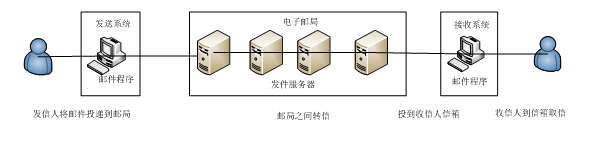

##Java邮件开发-----电子邮件的基本概念介绍

##
##电子邮件用于网上的信心传递和交流，它是最重要的Internet服务之一。据统计Internet有30%的业务是电子邮件有关的。同时我们也不可否认它在我们的日常生活、工作办公方面扮演着很重要的角色。譬如：许多办公自动化项目(OA)中都要附带发送邮件的功能，如果还要使用OutLook等手工方式就不适合，在这个高速的时代，我们需要提供工作效率，让工作能够自动化。同时在许多网站中也都需要附带发送邮件的功能：给新注册的用户发送一封包含其注册信息的欢迎E-Mail、将网站的最新活动信息通过E-Mail发送给所有的注册会员等等。

##
##

##
## 在开始电子邮件开发前：我们需要明白一下几个概念：电子邮件系统、邮件服务器、电子邮件、邮件客户端软件、邮件传输协议、电子邮件的传输过程。

##
##

##
##电子邮件系统

##
##与传统的邮政服务相类似，电子邮件系统由电子邮局、电子邮件发送、接收系统组成。发送者和接收者通过电子邮件发送、接收系统来发送和接收电子邮件，他们实际上是运行在计算机上的邮件客户端程序。电子邮局起着一个桥梁的作用，它实际上是运行在服务器上的邮件服务器程序。电子邮件的处理流程也和邮政服务相类似。

##
##

##
##  

##
##邮件服务器

##
##邮件服务器是一种用来负责电子邮件收发管理的设备。在Internet上提供了大量的电子邮件服务器，如：126、163、hotmail…。

##
##电子邮件服务器主要提供的功能：

##
## 1、 接收用户投递的邮件。

##
## 2、 将用户投递进来的邮件转发给目标邮件服务器。

##
## 3、 接收其他电子邮件服务器转发来的邮件并该邮件存储到其管理的用户邮中。

##
## 4、 为前来读取邮件的用户提供读取邮件的服务。

##
##邮件服务器构成了电子邮件系统的核心。每个收信人都有一个位于某个邮件服务器上的邮箱(mailbox)。Bob的邮箱用于管理和维护已经发送给他的邮件消息。一个邮件消息的典型旅程是从发信人的用户代理开始，邮件发信人的邮件服务器，中转到收信人的邮件服务器，然后投递到收信人的邮箱中。当Bob想查看自己的邮箱中的邮件消息时，存放该邮箱的邮件服务器将以他提供的用户名和口令认证他。Alice的邮件服务器还得处理Bob的邮件服务器出故障的情况。如果Alice的邮件服务器无法把邮件消息立即递送到Bob的邮件服务器，Alice的服务器就把它们存放在消息队列(message queue)中，以后再尝试递送。这种尝试通常每30分钟左右执行一次：要是过了若干天仍未尝试成功，该服务器就把这个消息从消息队列中去除掉，同时以另一个邮件消息通知发信人(即Alice)。

##
##

##
##电子邮件

##
##电子邮件是一种通过网络实现相互传送和接收信息的现代化通信方式。它是—种用电子手段提供信息交换的通信方式，是Internet应用最广的服务，通过网络的电子邮件系统，用户可以用非常低廉的价格，以非常快速的方式，与世界上任何一个角落的网络用户联系，这些电子邮件可以是文字、图像、声音等各种方式。同时，用户可以得到大量免费的新闻、专题邮件，并实现轻松的信息搜索。

##
##电子邮件由信封和内容两个部分组成。信封又称邮件头，电子邮件服务器根据信封上的信心来传递邮件的。内容称为邮件体，它用于提供邮件的具体内容。

##
##Internet上的电子邮件地址全球唯一，其格式为“邮箱名@邮件服务器域名”。域（邮件域）是电子邮件服务器的基本管理单位，邮件服务以域为基础，每个邮箱对应一个用户。其中邮件服务器域名必须是已注册的DNS域名，并且必须要与MX(邮件交换机)记录匹配。DNS用于将域名、主机名解析为IP地址。MX记录指向该域名的邮件服务器主机记录，为邮件服务专用。

##
##

##
##邮件客户端软件

##
##邮件客户端软件负责与邮件服务器通讯，主要用于帮助用户将邮件发送给SMTP服务器和POP3/IMAP邮件服务器读取用户的电子邮件。邮件客户端软件通常集撰写、发送、接收邮件于一体。

##
##

##
##

##
##电子邮箱

##
##每一个电子邮件服务器之上都可以开始多个电子邮箱，电子邮箱也称之为E-Mail地址。它类似于现实生活中的通讯地址，用户通过它接受别人发来的电子邮件和向别人发送电子邮件。

##
##电子邮箱的获得需要在电子邮件服务器上进行申请，确切的说，电子邮箱其实就是用户在邮件服务器上申请的一个账户。邮件服务器把接收到的邮件保持到为某个账户所分配的邮箱空间中，用户通过其申请的用户名和密码登陆到邮件服务器上查看该地址已经收到的电子邮件。

##
##

##
##电子邮件的传输过程

##
##电子邮件系统采用客户/服务器模式。电子邮件传送需要用到以下3个重要模块：

##
##MUA（Mail User Agent，邮件用户代理）：用户通过它与电子邮件服务器打交道。MUA实际上就是邮件客户端软件。

##
##MTA（Mail Transfer Agent，邮件传输代理）：它主要负责处理所有接收和发送的邮件，为MUA或者MTA提供邮件发送服务，接收其他MTA发送过来的邮件。

##
##MDA（Mail Delivery Agent，邮件投递代理）：它负责邮件本地投递。当MTA决定某邮件发送本地用户时，MTA将邮件交给MDA程序进行分发，也就是说投递到用户的。

##
##具体的传递过程如下：

##
## 1、 发件人利用MUA将邮件发送给MTA。

##
## 2、MTA收到邮件后判断收件人是不是本地账户，如果是本地账户，交由MDA投送到该账户的邮箱中，完成发送过程，跳到第5步。如果不是则执行下一步骤。

##
## 3、MTA根据其邮件中继转发设置来决定如何转发邮件。

##
## 4、 最终目的的MTA将受到的交给他的MDA处理，有MDA将邮件投递到收件人的邮箱中。

##
## 5、 收件人利用MUA通过POP/IMAP协议连接到邮箱所在的服务器，请求查看自己的收件箱是否有邮件，如果有邮件，将会通过它传送个收件人的MUA。

##
##注意：提示邮件访问服务的是POP或者IMAP服务器软件，而并非当初收下邮件的MTA，两者的角色是分离的。

##
##

##
##邮件传输协议

##
##电子邮件服务传输主要是用到以下3中网络协议

##
## SMTP(简单邮件传输协议)

##
##SMTP是Simple Mail Transfer Protocol。标准TCP端口是25。MUA将邮件发送到MTA，MTA将邮件发送给下一个MTA，都是要使用SMTP。SMTP的目标是可靠高效地传送邮件，它独立于传送子系统而且仅要求一条可以保证传送数据单元顺序的通道。

##
##SMTP是一个“单向”的协议，它不能用户从其他邮件服务器收取邮件。它本身是采用客户/服务器模式，负责发送邮件的SMTP进程就是SMTP客户端，负责接收邮件的SMTP进程就是SMTP服务器。一个完整的SMTP通信过程主要包括建立连接、传送邮件、释放连接三个过程。

##
##建立连接：首先由发件人将要发送的邮件发送到邮件缓存，SMTP客户端定期扫描邮件缓存，一旦发现有邮件，就与SMTP服务器建立TCP连接，然后发送HRLLO命令以附上发送方的主机名。

##
##传送邮件：SMTP客户端使用MAIL命令开始传送邮件，该命令提供发件人的地址；然后执行RCPT命令，并提供收件人地址；最后执行DATA命令传送邮件内容。

##
##释放连接：邮件传送完毕后，SMTP客户端发送OUT命令请求关闭TCP连接。

##
## POP（邮局协议）

##
## POP是Post Office Protocol。标准TCP端口为110。主要用于电子邮件的接收。MUA经由POP协议连接到MTA的用户收件箱，以读取或下载用户在收件箱中邮件。

##
##目前用的较多的POP协议是POP3。POP3使用 TCP 作为传输协议。

##
##IMAP（Internet信息访问协议）

##
##IMAP是Internet Message Access Protocol。标准TCP端口为143，它也是让MUA从MTA收取邮件。目标球IMAP协议的版本为IMAP4。

##
##POP和IMAP两者都可以用于收取邮件，都是采用客户/服务器模式，两者最主要的区别就在于他们检索邮件的方式不同。使用POP时，邮件驻留在服务器中个，一旦接收邮件，邮件都从服务器上下载到用户计算机上。而IMAP则能够然该用户了解到服务器上存储邮件的情况，已下载的邮件仍然滞留在服务器中，以便于实现邮件归档和共享。

##
##

##
##