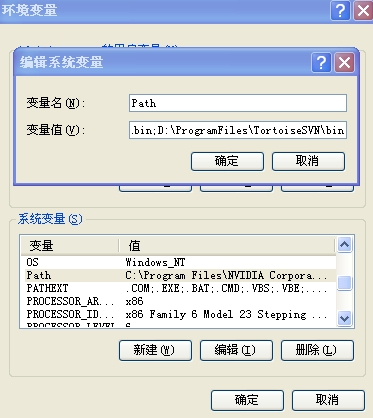

##Myeclipse下安装和使用SVN（一）

##
## 最近做毕业设计花了两天的时间做的，突然发现思路错了，可以有更好的办法。没有办法我就开始删了，好不容易还原了，发现其他原来没有错的地方有错了，而且还是一个莫名其妙的错误，但是还原过去又是不可能的了。谁叫我没有安装SVN呢。于是我便决定了来学习学习SVN。

##
## 一、SVN简介

##
##1.1、 什么是SVN

##
## 有一个简单但不十分精确比喻：

##
## SVN = 版本控制 + 备份服务器

##
## 简单的说，您可以把SVN当成您的备份服务器，更好的是，他可以帮您记住每次上传到这个服务器的档案内容。并且自动的赋予每次的变更一个版本。

##
##Svn（Subversion）是近年来崛起的版本管理工具，在当前的开源项目里(J2EE)，几乎95%以上的项目都用到了SVN。Subversion项目的初衷是为了替换当年开源社区最为流行的版本控制软件CVS，在CVS的功能的基础上有很多的提升同时也能较好的解决CVS系统的一些不足。

##
##

##
##TortoiseSVN是Subversion的Windows扩展。它使你避免接触Subversion枯燥而且不方便的CommandLine。它完全嵌入WindowsExplorer，使用时只需在正常的窗口里右键操作就可以了

##
##Subversion为版本控制软件的服务器端。

##
##TortoiseSVN为版本控制软件的客户端。

##
##

##
## 1.2、为什么要使用SVN

##
##1、备份工作档案是十分重要的。您永远不知道计算机上的硬盘何时会坏掉。

##
##  2、版本控管非常重要。您无法保证手头上最新版本永远都是对的。

##
## 3、伙伴间的数据同步也是非常重要的。很多时候，除了您个人外，还有其它的伙伴也需要您的档案。

##
## 4、如果没有一个好的办法，备份不同版本是很耗费硬盘空间的。
SVN能帮我们解决上面的问题吗？答案是肯定的：

##
## 1、SVN Repository可以是自己计算机上的一个目录，或者是随身碟（不建议这样用）。当然也可以是公司的服务器。

##
## 2、SVN有很棒的版本控管机制。所有上传的版本都会帮您记录下来。日后您可以随时取得某一个时刻的版本。而且，也有版本分支及合并等好用的功能。

##
## 3、SVN可以让不同的开发者存取同样的档案，并且利用SVN Server作为档案同步的机制。也就是说，您有档案更新时，无须将档案寄给您的开发成员。只需要告诉他新的版本已经在SVN Server上面，请他自己去SVN Server上面就可以取得最新版本。而且，SVN Server也可以做到当您上传新版本后，自动发信给相关的成员。

##
## 4、SVN的存放档案方式是采用差异备份的方式。也就是说，他只会备份有不同的地方。所以很省硬盘空间。此外，他也可以针对所谓的非文字文件进行差异备份。

##
##

##
## 
 二、SVN的下载和安装
 2.1、服务器
 服务器Subversion可以再官方网站上面下载，我使用的版本是：Setup-Subversion-1.7.5.msi。载好服务器端软件后，双击Setup-Subversion-1.7.5.ms运行安装程序，这个没什么好说的，一路Next下去就好了，所以默认安装目录我D\ProgramFiles\Subversion\。
如何验证在我们的服务器上就成功安装了Subversion呢？Subversion在安装时，同JAVA的开发环境(JDK)的安装一样，同样会自动的把安装目录下的bin目录设置到系统的系统变量中去。如果你是使用的绿色版，那么设置系统变量这个步骤就得你自己手动的来设置了，如：
 
如果我们在doc下面执行svnserve--version
如果能够正常的显示版本信息就代表安装成功了。如：
 
2.2、客户端
客户端软件TortoiseSVN也是可以再官方网站上面下载的，我使用的版本是：TortoiseSVN-1.7.6.22632-win32-svn-1.7.4.msi。傻瓜式安装。
如果客户端软件安装成功了，单击鼠标右键会出现如下图：
 
三、建立本机Repository
Repository即源码的集中存放处，所有修改后提交的源码就是保存在这里，并在其中记录所有的修改版本，分支版本，版本合并，以及并发修改处理等。
这里有两种方式建立Repository
第一种：使用SVN服务器命令：svnadmin
如下：svnadmin create D:\workspace\svnRepository
第二种：在相应目录下先建立一个文件夹：如svnRepository。然后然后在此文件夹上右键，选择TortoiseSVN->Create repository here。
创建完成后，会在这个目录下自动创建一些目录和文件。

 
目录说明：
db目录:就是所有版本控制癿数据存放文件。
hooks目录:放置hook脚本文件癿目录。
locks目录:用来放置Subversion文件库锁定数据癿目录，用来追踪存取文件库癿客户端。
format文件是一个文本文件，里面只放了一个整数，表示当前文件库配置癿版本号。
 conf目录:是这个仓库癿配置文件（仓库癿用户访问帐号、权限等）。
