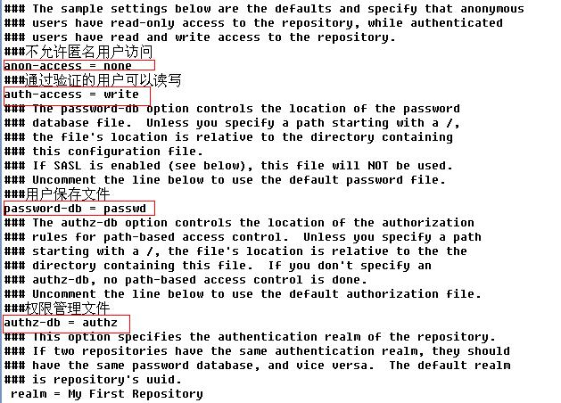
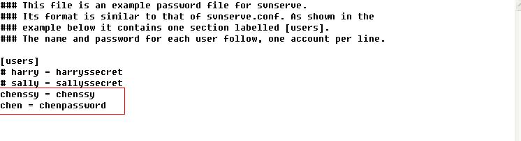
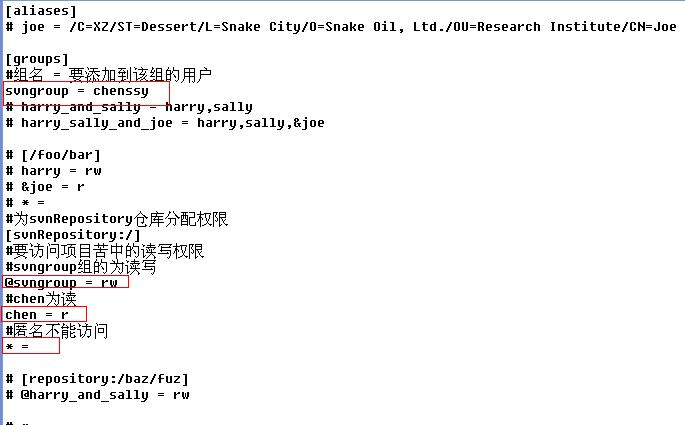
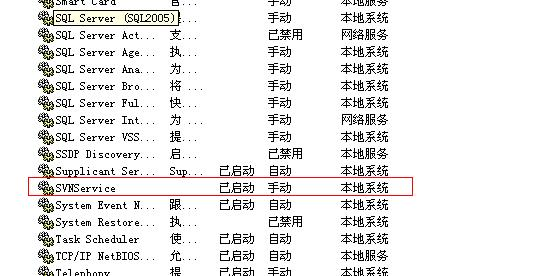
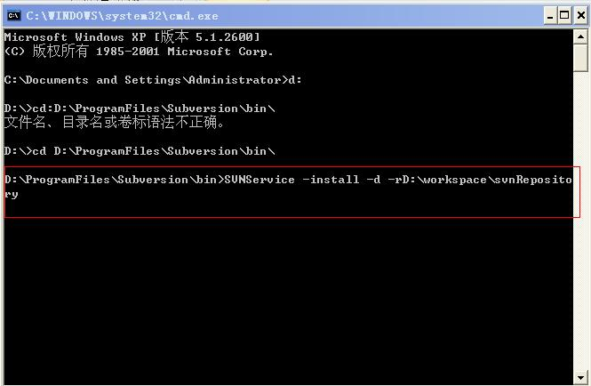
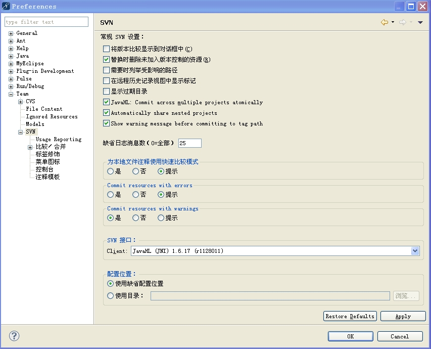
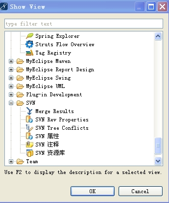

##Myeclipse下安装和使用SVN（二）一、SVN服务器配置
这里配置只需要配置服务器即可。打开目录：D:\workspace\svnRepository\conf。这里有三个文件：authz、passwd、svnserve.conf。需要配置。
 authz:主要是做复杂的群组权限控制。
Passwd:存放项目成员账户信息
svnserve.conf：定义所有认证和授权政策。

第一步对svnserve.conf文件作如下修改，找到以下四行：
 #anon-access=read
 #auth-access=write
 #password-db=passwd
 #authz-db=authz
将这四行前癿“#”号去掉,并修改如下：
 anon-access=none-----不允许匿名用户访问
 auth-access=write ------通过验证癿用户可以读写
 password-db=passwd--用户保存文件

##
## anthz-db=authz qu--------管理文件

##
## 

##
##第二步：在passwd中添加这样一行：

##
## chenssy = chenssy (左边是用户名、右边是密码)

##
## chen = chenpassword

##
##

##
## 

##
## 第三步：对authz做如下修改

##
## [groups]

##
## svngroup=chenssy

##
## @svngroup = rw(定义组svngroup下癿所有用户拥有读写权限)

##
## chen=r 定义用户chen 拥有读权限

##
## * = 其他用户无任何权限

##
## 

##
## 

##
## 二、启动服务器端服务

##
## 启动服务器服务有两种方式

##
##第一种：命令行启动，我们使用服务器端命令svnserve。

##
##Svnserve –d –rD:\workspace\svnRepository。

##
##回车是没有什么反应的，但是我们不能关闭命令行窗口，关闭后服务也就关闭了。

##
##如何查看服务器有没有启动成功呢？输入netstat –an查看端口：3690即可。

第二种：安装svn后配置windows自动启动服务
sc createSVNService binpath="D:\ProgramFiles\Subversion\bin\svnserve.exe --service -root D:\workspace\svnRepository" displayname="SVNService" start=auto depend=Tcpip
 binpath指定svnserve的路径和命令
 start=auto表示服务自动启动。注意：等于号的左边无空格，而右边必须有一个空格
 Displayname、start、depend
 在此命令中-r(--root)项目版本仓库的根目录
启动服务：netstartSVNService
查看服务是否添加成功.可以再window下的服务中可以看到刚刚创建的服务：
 

对于创建window自动启动服务还有一种方式：
下载一个SVNService.exe。并将其复制到Subversion目录下。然后在命令行中转到SVNService.exe。执行如下命令SVNService –install –d -r D:\workspace\svnRepository即可实现。
 

删除服务：
sc delete服务名

三、在myeclipse中安装SVN插件
方法一：1.打开HELP->MyEclipse Configuration Center，切换到SoftWare标签页。2.点击Add Site 打开对话框，在对话框Name输入SVN，URL中输入：http://subclipse.tigris.org/update_1.6.x3. 在左边栏中找到Personal Site中找到SVN展开。将Core SVNKit Library,Optional JNA Library,Subclipse添加(右键Add to Profile)Subclipse下面的Subclipse Integration for Mylyn 3.0可以不添加。4.在右下角窗格(Pending Changes )中点击Apply。5.安装重启后MyEclipse即可。
方法二：安装subclipse, SVN 插件1、从官网下载site-1.6.9.zip文件,网址是:subclipse.tigris.org,2、从中解压出features与plugins文件夹，复制到D:\ProgramFiles\Genuitec\MyEclipse-8.6\myPlugin\svn里面，其它的*.xml文件不要。（新建文件夹/myplugins/svn）3、在D:\ProgramFiles\Genuitec\MyEclipse-8.6\MyEclipse8.6\dropins下新建文件svn.link,内容是:path=D:\\ProgramFiles\\Genuitec\\MyEclipse-8.6\\myPlugin\\svn 保存。（注意svn.link中的是双斜杠）4、删除D:\ProgramFiles\Genuitec\MyEclipse-8.6\configuration\org.eclipse.update文件夹
5、重启myeclipse就一切正常了

 方法三：
 1、在MyEclipse的安装目录下找到dropin目录，在其中新建一文件夹，取名“svn”，当然，也可以直接把那几个文件复制过来。

##
## 2、启动MyEclipse，稍等片刻，出现错误，不用管他，直接点ok。

##
## 

##
## 

##
## 

##
##

