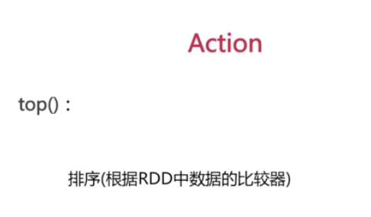

scala> val
rdd1=sc.parallelize(Array("coffe","coffe","hellp","hellp","pandas","mokey") )  
rdd1: org.apache.spark.rdd.RDD[String] = ParallelCollectionRDD[8] at
parallelize at <console>:24  
  
scala> val
rdd1=sc.parallelize(Array("coffe","coffe","hellp","hellp","pandas","mokey"))  
rdd1: org.apache.spark.rdd.RDD[String] = ParallelCollectionRDD[9] at
parallelize at <console>:24  
  
scala> val
rdd2=sc.parallelize(Array("coe","coe","help","help","pandas","mokey"))  
rdd2: org.apache.spark.rdd.RDD[String] = ParallelCollectionRDD[10] at
parallelize at <console>:24  
  
scala> val rdd1_distinct=rdd1.distinct()  
rdd1_distinct: org.apache.spark.rdd.RDD[String] = MapPartitionsRDD[13] at
distinct at <console>:25  
  
scala> rdd1_distinct.foreach(println)  
hellp  
mokey  
pandas  
coffe  
  
scala> val rdd_union=rdd1.union(rdd2)  
rdd_union: org.apache.spark.rdd.RDD[String] = UnionRDD[14] at union at
<console>:27  
  
scala> rdd1_union.foreach(println)  
<console>:24: error: not found: value rdd1_union  
rdd1_union.foreach(println)  
^  
  
scala> rdd_union.foreach(println)  
pandas  
mokey  
coffe  
hellp  
coffe  
hellp  
pandas  
mokey  
coe  
help  
help  
coe  
  
scala> val rdd_intersection=rdd1.intersession(rdd2)  
<console>:27: error: value intersession is not a member of
org.apache.spark.rdd.RDD[String]  
val rdd_intersection=rdd1.intersession(rdd2)  
^  
  
scala> val rdd_intersection=rdd1.intersection(rdd2)  
rdd_intersection: org.apache.spark.rdd.RDD[String] = MapPartitionsRDD[20] at
intersection at <console>:27  
  
scala> rdd_intersection.foreach(println)  
mokey  
pandas  
  
scala> val rdd_sub=rdd1.subtract(rdd2)  
rdd_sub: org.apache.spark.rdd.RDD[String] = MapPartitionsRDD[24] at subtract
at <console>:27  
  
scala> rdd_sub.foreach(prinln)  
<console>:26: error: not found: value prinln  
rdd_sub.foreach(prinln)  
^  
  
scala> rdd_sub.foreach(println)  
coffe  
coffe  
hellp  
hellp  
  
scala>  
  

scala> val rdd=sc.parallelize(Array(1,2,2,3))  
rdd: org.apache.spark.rdd.RDD[Int] = ParallelCollectionRDD[25] at parallelize
at <console>:24  
  
scala> rdd.collect()  
res16: Array[Int] = Array(1, 2, 2, 3)  
  
scala> rdd.reduce((x,y)=>x+y)  
res18: Int = 8  
  

scala> rdd.take(2)  
res19: Array[Int] = Array(1, 2)  
  
scala> rdd.take(3)  
res20: Array[Int] = Array(1, 2, 2)  
  
scala>

scala> rdd.top(1)  
res21: Array[Int] = Array(3)  
  
scala> rdd.top(2)  
res22: Array[Int] = Array(3, 2)  
  
scala> rdd.top(3)  
res23: Array[Int] = Array(3, 2, 2)  
  

  
  

