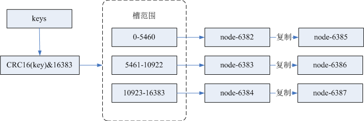
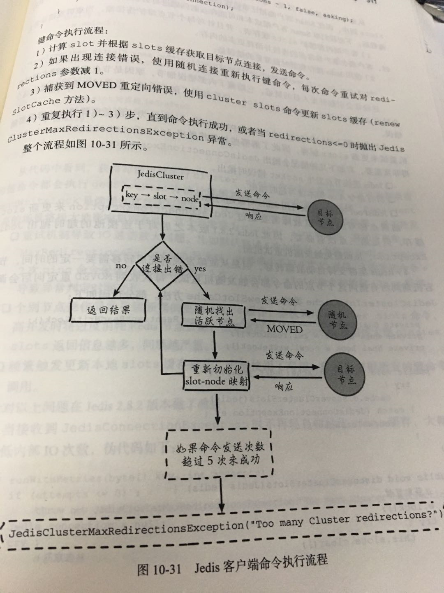

## 前言

上篇[Redis
Sentinel安装与部署，实现redis的高可用](http://www.cnblogs.com/youzhibing/p/8466491.html)实现了redis的高可用，针对的主要是master宕机的情况，我们发现所有节点的数据都是一样的，那么一旦数据量过大，redi也会效率下降的问题。redis3.0版本正式推出后，有效地解决了Redis分布式方面的需求，当遇到单机内存、并发、流量等瓶颈时，可以采用Cluster架构方法达到负载均衡的目的。

而此篇将带领大家实现Redis Cluster的搭建， 并进行简单的客户端操作。

github地址：<https://github.com/youzhibing/redis>

## 环境准备

redis版本：redis-3.0.0

linux：centos6.7

ip：192.168.11.202，不同的端口实现不同的redis实例

客户端jedis，基于spring-boot

## redis cluster环境搭建

###  节点准备

192.168.11.202:6382,192.168.11.202:6383,192.168.11.202:6384,192.168.11.202:6385,192.168.11.202:6386,192.168.11.202:6387搭建初始集群

192.168.11.202:6388，192.168.11.202:6389扩容时用到

redis-6382.conf

    
    
    port 6382
    bind 192.168.11.202
    requirepass "myredis"
    daemonize yes
    logfile "6382.log"
    dbfilename "dump-6382.rdb"
    dir "/opt/soft/redis/cluster_data"
    
    masterauth "myredis"
    cluster-enabled yes
    cluster-node-timeout 15000
    cluster-config-file "nodes-6382.conf"

View Code

redis-6383.conf

    
    
    port 6383
    bind 192.168.11.202
    requirepass "myredis"
    daemonize yes
    logfile "6383.log"
    dbfilename "dump-6383.rdb"
    dir "/opt/soft/redis/cluster_data"
    
    masterauth "myredis"
    cluster-enabled yes
    cluster-node-timeout 15000
    cluster-config-file "nodes-6383.conf"

View Code

redis-6384.conf

    
    
    port 6384
    bind 192.168.11.202
    requirepass "myredis"
    daemonize yes
    logfile "6384.log"
    dbfilename "dump-6384.rdb"
    dir "/opt/soft/redis/cluster_data"
    
    masterauth "myredis"
    cluster-enabled yes
    cluster-node-timeout 15000
    cluster-config-file "nodes-6384.conf"

View Code

redis-6385.conf

    
    
    port 6385
    bind 192.168.11.202
    requirepass "myredis"
    daemonize yes
    logfile "6385.log"
    dbfilename "dump-6385.rdb"
    dir "/opt/soft/redis/cluster_data"
    
    masterauth "myredis"
    cluster-enabled yes
    cluster-node-timeout 15000
    cluster-config-file "nodes-6385.conf"

View Code

redis-6386.conf

    
    
    port 6386
    bind 192.168.11.202
    requirepass "myredis"
    daemonize yes
    logfile "6386.log"
    dbfilename "dump-6386.rdb"
    dir "/opt/soft/redis/cluster_data"
    
    masterauth "myredis"
    cluster-enabled yes
    cluster-node-timeout 15000
    cluster-config-file "nodes-6386.conf"

View Code

redis-6387.conf

    
    
    port 6387
    bind 192.168.11.202
    requirepass "myredis"
    daemonize yes
    logfile "6387.log"
    dbfilename "dump-6387.rdb"
    dir "/opt/soft/redis/cluster_data"
    
    masterauth "myredis"
    cluster-enabled yes
    cluster-node-timeout 15000
    cluster-config-file "nodes-6387.conf"

View Code

启动全部节点

    
    
    [root@slave1 redis_cluster]# cd /opt/redis-3.0.0/redis_cluster/
    [root@slave1 redis_cluster]# ./../src/redis-server redis-6382.conf 
    [root@slave1 redis_cluster]# ./../src/redis-server redis-6383.conf 
    [root@slave1 redis_cluster]# ./../src/redis-server redis-6384.conf 
    [root@slave1 redis_cluster]# ./../src/redis-server redis-6385.conf 
    [root@slave1 redis_cluster]# ./../src/redis-server redis-6386.conf 
    [root@slave1 redis_cluster]# ./../src/redis-server redis-6387.conf

View Code

###  创建集群

节点全部启动后，每个节点目前只能识别出自己的节点信息，彼此之间并不知道对方的存在；

采用redis-trib.rb来实现集群的快速搭建，redis-
trib.rb是采用Rudy实现的集群管理工具，内部通过Cluster相关命令帮我们简化集群创建、检查、槽迁移和均衡等常见运维操作。

有兴趣的朋友可以采用cluster 命令一步一步的手动实现redis cluster的搭建，就可以明白redis-trib.rb是如何快速实现redis
cluster的搭建的。

搭建命令如下，其中--replicas 1表示每个主节点配置1个从节点

    
    
    [root@slave1 src]# cd /opt/redis-3.0.0/src/
    [root@slave1 src]# ./redis-trib.rb create --replicas 1 192.168.11.202:6382 192.168.11.202:6383 192.168.11.202:6384 192.168.11.202:6385 192.168.11.202:6386 192.168.11.202:6387　 

创建过程中会给出主从节点角色分配的计划，如下所示

    
    
    >>> Creating cluster
    Connecting to node 192.168.11.202:6382: OK
    Connecting to node 192.168.11.202:6383: OK
    Connecting to node 192.168.11.202:6384: OK
    Connecting to node 192.168.11.202:6385: OK
    Connecting to node 192.168.11.202:6386: OK
    Connecting to node 192.168.11.202:6387: OK
    >>> Performing hash slots allocation on 6 nodes...
    Using 3 masters:
    192.168.11.202:6382
    192.168.11.202:6383
    192.168.11.202:6384
    Adding replica 192.168.11.202:6385 to 192.168.11.202:6382
    Adding replica 192.168.11.202:6386 to 192.168.11.202:6383
    Adding replica 192.168.11.202:6387 to 192.168.11.202:6384
    M: 0ec055f9daa5b4f570e6a4c4d46e5285d16e0afe 192.168.11.202:6382
       slots:0-5460 (5461 slots) master
    M: 3771e67edab547deff6bd290e1a07b23646906ee 192.168.11.202:6383
       slots:5461-10922 (5462 slots) master
    M: 10b3789bb30889b5e6f67175620feddcd496d19e 192.168.11.202:6384
       slots:10923-16383 (5461 slots) master
    S: 7649466ec006e0902a7f1578417247a6d5540c47 192.168.11.202:6385
       replicates 0ec055f9daa5b4f570e6a4c4d46e5285d16e0afe
    S: 4f36b08d8067a003af45dbe96a5363f348643509 192.168.11.202:6386
       replicates 3771e67edab547deff6bd290e1a07b23646906ee
    S: a583def1e6a059e4fdb3592557fd6ab691fd61ec 192.168.11.202:6387
       replicates 10b3789bb30889b5e6f67175620feddcd496d19e
    Can I set the above configuration? (type "yes" to accept): 

为什么192.168.11.202:6382 192.168.11.202:6383
192.168.11.202:6384是主节点，请看注意点中第1点；当我们同意这份计划之后，输入yes，redis-
trib.rb开始执行节点握手和槽分配操作，输出如下

    
    
    >>> Nodes configuration updated
    >>> Assign a different config epoch to each node
    >>> Sending CLUSTER MEET messages to join the cluster
    Waiting for the cluster to join...
    >>> Performing Cluster Check (using node 192.168.11.202:6382)
    M: 0ec055f9daa5b4f570e6a4c4d46e5285d16e0afe 192.168.11.202:6382
       slots:0-5460 (5461 slots) master
    M: 3771e67edab547deff6bd290e1a07b23646906ee 192.168.11.202:6383
       slots:5461-10922 (5462 slots) master
    M: 10b3789bb30889b5e6f67175620feddcd496d19e 192.168.11.202:6384
       slots:10923-16383 (5461 slots) master
    M: 7649466ec006e0902a7f1578417247a6d5540c47 192.168.11.202:6385
       slots: (0 slots) master
       replicates 0ec055f9daa5b4f570e6a4c4d46e5285d16e0afe
    M: 4f36b08d8067a003af45dbe96a5363f348643509 192.168.11.202:6386
       slots: (0 slots) master
       replicates 3771e67edab547deff6bd290e1a07b23646906ee
    M: a583def1e6a059e4fdb3592557fd6ab691fd61ec 192.168.11.202:6387
       slots: (0 slots) master
       replicates 10b3789bb30889b5e6f67175620feddcd496d19e
    [OK] All nodes agree about slots configuration.
    >>> Check for open slots...
    >>> Check slots coverage...
    [OK] All 16384 slots covered.

16384个槽全部被分配，集群创建成功。

###  集群完整性检查

redis-trib.rb check命令可以完成检查工作，check命令只需给出集群中任意一个节点地址就可以完成整个集群的检查工作，如下

redis-trib.rb check 192.168.11.202:6382， 输出结果如下

    
    
    Connecting to node 192.168.11.202:6382: OK
    Connecting to node 192.168.11.202:6385: OK
    Connecting to node 192.168.11.202:6383: OK
    Connecting to node 192.168.11.202:6384: OK
    Connecting to node 192.168.11.202:6387: OK
    Connecting to node 192.168.11.202:6386: OK
    >>> Performing Cluster Check (using node 192.168.11.202:6382)
    M: 0ec055f9daa5b4f570e6a4c4d46e5285d16e0afe 192.168.11.202:6382
       slots:0-5460 (5461 slots) master
       1 additional replica(s)
    S: 7649466ec006e0902a7f1578417247a6d5540c47 192.168.11.202:6385
       slots: (0 slots) slave
       replicates 0ec055f9daa5b4f570e6a4c4d46e5285d16e0afe
    M: 3771e67edab547deff6bd290e1a07b23646906ee 192.168.11.202:6383
       slots:5461-10922 (5462 slots) master
       1 additional replica(s)
    M: 10b3789bb30889b5e6f67175620feddcd496d19e 192.168.11.202:6384
       slots:10923-16383 (5461 slots) master
       1 additional replica(s)
    S: a583def1e6a059e4fdb3592557fd6ab691fd61ec 192.168.11.202:6387
       slots: (0 slots) slave
       replicates 10b3789bb30889b5e6f67175620feddcd496d19e
    S: 4f36b08d8067a003af45dbe96a5363f348643509 192.168.11.202:6386
       slots: (0 slots) slave
       replicates 3771e67edab547deff6bd290e1a07b23646906ee
    [OK] All nodes agree about slots configuration.
    >>> Check for open slots...
    >>> Check slots coverage...
    [OK] All 16384 slots covered.

View Code

[OK] All 16384 slots covered.表示集群所有的槽都已分配到节点。

引入了槽之后，整个数据流向如下图所示：

至于为什么引入槽，请看注意点中第3点

###  redis cluster简单操作

连接集群，随便连接某个节点都可以；-c 集群支持，支持自动重定向

[root@slave1 redis_cluster]# ./../src/redis-cli -h 192.168.11.202 -p 6382 -a
myredis -c

_连接上redis cluster后就可以执行相关redis命令了，如下_

    
    
    192.168.11.202:6382> get name
     -> Redirected to slot [5798] located at 192.168.11.202:6388
    "youzhibing"
    192.168.11.202:6388> set weight 112
    -> Redirected to slot [16280] located at 192.168.11.202:6384
    OK
    192.168.11.202:6384> get weight
    "112"
    192.168.11.202:6384> 

## 客户端（Jedis）连接与操作

redis-cluster.properties

    
    
    #cluster
    redis.cluster.host=192.168.11.202
    redis.cluster.port=6382,6383,6384,6385,6386,6387
    #redis读写超时时间（毫秒）
    redis.cluster.socketTimeout=1000
    #redis连接超时时间（毫秒）
    redis.cluster.connectionTimeOut=3000
    #最大尝试连接次数
    redis.cluster.maxAttempts=10
    #最大重定向次数
    redis.cluster.maxRedirects=5
    #master连接密码
    redis.password=myredis
    
    # 连接池
    # 连接池最大连接数（使用负值表示没有限制）
    redis.pool.maxActive=150
    # 连接池中的最大空闲连接
    redis.pool.maxIdle=10
    # 连接池中的最小空闲连接
    redis.pool.minIdle=1
    # 获取连接时的最大等待毫秒数,小于零:阻塞不确定的时间,默认-1
    redis.pool.maxWaitMillis=3000
    # 每次释放连接的最大数目
    redis.pool.numTestsPerEvictionRun=50
    # 释放连接的扫描间隔（毫秒）
    redis.pool.timeBetweenEvictionRunsMillis=3000
    # 连接最小空闲时间（毫秒）
    redis.pool.minEvictableIdleTimeMillis=1800000
    # 连接空闲多久后释放, 当空闲时间>该值 且 空闲连接>最大空闲连接数 时直接释放（毫秒）
    redis.pool.softMinEvictableIdleTimeMillis=10000
    # 在获取连接的时候检查有效性, 默认false
    redis.pool.testOnBorrow=true
    # 在空闲时检查有效性, 默认false
    redis.pool.testWhileIdle=true
    # 在归还给pool时，是否提前进行validate操作
    redis.pool.testOnReturn=true
    # 连接耗尽时是否阻塞, false报异常,ture阻塞直到超时, 默认true
    redis.pool.blockWhenExhausted=true

View Code

RedisClusterConfig.java

    
    
    package com.lee.redis.config.cluster;
    
    import java.util.HashSet;
    import java.util.Set;
    
    import org.slf4j.Logger;
    import org.slf4j.LoggerFactory;
    import org.springframework.beans.factory.annotation.Value;
    import org.springframework.context.annotation.Bean;
    import org.springframework.context.annotation.Configuration;
    import org.springframework.context.annotation.PropertySource;
    import org.springframework.util.StringUtils;
    
    import redis.clients.jedis.HostAndPort;
    import redis.clients.jedis.JedisCluster;
    import redis.clients.jedis.JedisPoolConfig;
    
    import com.alibaba.fastjson.JSON;
    import com.lee.redis.exception.LocalException;
    
    @Configuration
    @PropertySource("redis/redis-cluster.properties")
    public class RedisClusterConfig {
    
        private static final Logger LOGGER = LoggerFactory.getLogger(RedisClusterConfig.class);
        
        // pool
        @Value("${redis.pool.maxActive}")
        private int maxTotal;
        @Value("${redis.pool.maxIdle}")
        private int maxIdle;
        @Value("${redis.pool.minIdle}")
        private int minIdle;
        @Value("${redis.pool.maxWaitMillis}")
        private long maxWaitMillis;
        @Value("${redis.pool.numTestsPerEvictionRun}")
        private int numTestsPerEvictionRun;
        @Value("${redis.pool.timeBetweenEvictionRunsMillis}")
        private long timeBetweenEvictionRunsMillis;
        @Value("${redis.pool.minEvictableIdleTimeMillis}")
        private long minEvictableIdleTimeMillis;
        @Value("${redis.pool.softMinEvictableIdleTimeMillis}")
        private long softMinEvictableIdleTimeMillis;
        @Value("${redis.pool.testOnBorrow}")
        private boolean testOnBorrow;
        @Value("${redis.pool.testWhileIdle}")
        private boolean testWhileIdle;
        @Value("${redis.pool.testOnReturn}")
        private boolean testOnReturn;
        @Value("${redis.pool.blockWhenExhausted}")
        private boolean blockWhenExhausted;
        
        // cluster
        @Value("${redis.cluster.host}")
        private String host;
        @Value("${redis.cluster.port}")
        private String port;
        @Value("${redis.cluster.socketTimeout}")
        private int socketTimeout;
        @Value("${redis.cluster.connectionTimeOut}")
        private int connectionTimeOut;
        @Value("${redis.cluster.maxAttempts}")
        private int maxAttempts;
        @Value("${redis.cluster.maxRedirects}")
        private int maxRedirects;
        @Value("${redis.password}")
        private String password;
        
        @Bean
        public JedisPoolConfig jedisPoolConfig() {
            JedisPoolConfig jedisPoolConfig = new JedisPoolConfig();
            jedisPoolConfig.setMaxTotal(maxTotal);
            jedisPoolConfig.setMaxIdle(maxIdle);
            jedisPoolConfig.setMinIdle(minIdle);
            jedisPoolConfig.setMaxWaitMillis(maxWaitMillis);
            jedisPoolConfig.setNumTestsPerEvictionRun(numTestsPerEvictionRun);
            jedisPoolConfig
                    .setTimeBetweenEvictionRunsMillis(timeBetweenEvictionRunsMillis);
            jedisPoolConfig
                    .setMinEvictableIdleTimeMillis(minEvictableIdleTimeMillis);
            jedisPoolConfig
                    .setSoftMinEvictableIdleTimeMillis(softMinEvictableIdleTimeMillis);
            jedisPoolConfig.setTestOnBorrow(testOnBorrow);
            jedisPoolConfig.setTestWhileIdle(testWhileIdle);
            jedisPoolConfig.setTestOnReturn(testOnReturn);
            jedisPoolConfig.setBlockWhenExhausted(blockWhenExhausted);
    
            return jedisPoolConfig;
        }
        
        @Bean
        public JedisCluster jedisCluster(JedisPoolConfig jedisPoolConfig) {
            
            if (StringUtils.isEmpty(host)) {
                LOGGER.info("redis集群主机未配置");
                throw new LocalException("redis集群主机未配置");
            }
            if (StringUtils.isEmpty(port)) {
                LOGGER.info("redis集群端口未配置");
                throw new LocalException("redis集群端口未配置");
            }
            String[] hosts = host.split(",");
            String[] portArray = port.split(";");
            if (hosts.length != portArray.length) {
                LOGGER.info("redis集群主机数与端口数不匹配");
                throw new LocalException("redis集群主机数与端口数不匹配");
            }
            Set<HostAndPort> redisNodes = new HashSet<HostAndPort>();
            for (int i = 0; i < hosts.length; i++) {
                String ports = portArray[i];
                String[] hostPorts = ports.split(",");
                for (String port : hostPorts) {
                    HostAndPort node = new HostAndPort(hosts[i], Integer.parseInt(port));
                    redisNodes.add(node);
                }
            }
            LOGGER.info("Set<RedisNode> : {}", JSON.toJSONString(redisNodes), true);
            
            return new JedisCluster(redisNodes, connectionTimeOut, socketTimeout, maxAttempts, password, jedisPoolConfig);
        }
    }

View Code

ApplicationCluster.java

    
    
    package com.lee.redis;
    
    import org.springframework.boot.Banner;
    import org.springframework.boot.SpringApplication;
    import org.springframework.boot.autoconfigure.EnableAutoConfiguration;
    import org.springframework.context.annotation.ComponentScan;
    import org.springframework.context.annotation.Configuration;
    
    @Configuration
    @EnableAutoConfiguration
    @ComponentScan(basePackages={"com.lee.redis.config.cluster"})
    public class ApplicationCluster {
        public static void main(String[] args) {
            
            SpringApplication app = new SpringApplication(ApplicationCluster.class);
            app.setBannerMode(Banner.Mode.OFF);            // 是否打印banner
            // app.setApplicationContextClass();        // 指定spring应用上下文启动类
            app.setWebEnvironment(false);
            app.run(args);
        }
    }

View Code

RedisClusterTest.java

    
    
    package com.lee.redis;
    
    import java.util.List;
    import java.util.Map;
    
    import org.junit.Test;
    import org.junit.runner.RunWith;
    import org.slf4j.Logger;
    import org.slf4j.LoggerFactory;
    import org.springframework.beans.factory.annotation.Autowired;
    import org.springframework.boot.test.context.SpringBootTest;
    import org.springframework.test.context.junit4.SpringRunner;
    
    import com.alibaba.fastjson.JSON;
    
    import redis.clients.jedis.JedisCluster;
    import redis.clients.jedis.JedisPool;
    
    @RunWith(SpringRunner.class)
    @SpringBootTest(classes = ApplicationCluster.class)
    public class RedisClusterTest {
        private static final Logger LOGGER = LoggerFactory.getLogger(RedisClusterTest.class);
        
        @Autowired
        private JedisCluster jedisCluster;
        
        @Test
        public void initTest() {
            String name = jedisCluster.get("name");
            LOGGER.info("name is {}", name);
            
            // list操作
            long count = jedisCluster.lpush("list:names", "陈芸");    // lpush的返回值是在 push操作后的 list 长度
            LOGGER.info("count = {}", count);
            long nameLen = jedisCluster.llen("list:names");
            LOGGER.info("list:names lens is {}", nameLen);
            List<String> nameList = jedisCluster.lrange("list:names", 0, nameLen);
            LOGGER.info("names : {}", JSON.toJSONString(nameList));
        }
    }

View Code

执行RedisClusterTest.java中的initTest方法， 结果如下

    
    
    ......
    2018-03-06 09:56:05|INFO|com.lee.redis.RedisClusterTest|name is youzhibing
    2018-03-06 09:56:05|INFO|com.lee.redis.RedisClusterTest|count = 3
    2018-03-06 09:56:05|INFO|com.lee.redis.RedisClusterTest|list:names lens is 3
    2018-03-06 09:56:05|INFO|com.lee.redis.RedisClusterTest|names : ["陈芸","沈复","沈复"]
    ......

## 集群的伸缩与故障转移

###  cluster扩容

新增节点：192.168.11.202:6388, 192.168.11.202:6389， 配置文件与之前的基本一致

redis-6388.conf

    
    
    port 6388
    bind 192.168.11.202
    requirepass "myredis"
    daemonize yes
    logfile "6388.log"
    dbfilename "dump-6388.rdb"
    dir "/opt/soft/redis/cluster_data"
    
    masterauth "myredis"
    cluster-enabled yes
    cluster-node-timeout 15000
    cluster-config-file "nodes-6388.conf"

View Code

redis-6389.conf

    
    
    port 6389
    bind 192.168.11.202
    requirepass "myredis"
    daemonize yes
    logfile "6389.log"
    dbfilename "dump-6389.rdb"
    dir "/opt/soft/redis/cluster_data"
    
    masterauth "myredis"
    cluster-enabled yes
    cluster-node-timeout 15000
    cluster-config-file "nodes-6389.conf"

View Code

启动6388、6389节点

    
    
    [root@slave1 redis_cluster]# cd /opt/redis-3.0.0/redis_cluster/
    [root@slave1 redis_cluster]# ./../src/redis-server redis-6388.conf 
    [root@slave1 redis_cluster]# ./../src/redis-server redis-6389.conf

View Code

加入集群：

    
    
    [root@slave1 redis_cluster]# ./../src/redis-trib.rb add-node 192.168.11.202:6388 192.168.11.202:6382
    #将6389添加成6388的从节点
    [root@slave1 redis_cluster]# ./../src/redis-trib.rb add-node --slave --master-id e073db09e7aaed3c20d133726a26c8994932262c 192.168.11.202:6389 192.168.11.202:6382

迁移槽和数据

采用redis-trib-rb reshard命令执行槽重分片：[root@slave1 redis_cluster]# ./../src/redis-
trib.rb reshard 192.168.11.202:6382

当出现 How many slots do you want to move (from 1 to 16384)? 提示我们想移动多少个槽，我们输入4096

当出现What is the receiving node ID? 提示我们哪个主节点接收新移动的槽， 我们输入6388的节点id：
_e073db09e7aaed3c20d133726a26c8994932262c，目标节点只能指定一个（节点id可以拷贝的哦）_

_之后输入源节点的id，用done结束，这里我用的all，就是从之前的全部主节点中移动4096个槽到6388_

_数据迁移之前会打印出所有的槽从源节点到目标节点的计划，确认无误后输入yes执行迁移工作_

_若迁移过程没有出错，那么迁移则顺利完成_

###  cluster故障转移

6388上的所有key

    
    
    192.168.11.202:6388> keys *
    1) "list:names"
    2) "name"
    192.168.11.202:6388>

杀掉6388进程

    
    
    [root@slave1 redis_cluster]# ps -ef | grep redis-server | grep 6388
    root       8280     1  0 Mar05 ?        00:05:07 ./../src/redis-server 192.168.11.202:6388 [cluster]
    [root@slave1 redis_cluster]# kill -9 8280
    
    #集群节点查看
    [root@slave1 redis_cluster]# ./../src/redis-cli -h 192.168.11.202 -p 6382 -a myredis -c
    192.168.11.202:6382> cluster nodes
    4f36b08d8067a003af45dbe96a5363f348643509 192.168.11.202:6386 slave 3771e67edab547deff6bd290e1a07b23646906ee 0 1520304517911 5 connected
    0ec055f9daa5b4f570e6a4c4d46e5285d16e0afe 192.168.11.202:6382 myself,master - 0 0 1 connected 1394-5460
    a583def1e6a059e4fdb3592557fd6ab691fd61ec 192.168.11.202:6387 slave 10b3789bb30889b5e6f67175620feddcd496d19e 0 1520304514886 6 connected
    10b3789bb30889b5e6f67175620feddcd496d19e 192.168.11.202:6384 master - 0 1520304516904 3 connected 12318-16383
    3771e67edab547deff6bd290e1a07b23646906ee 192.168.11.202:6383 master - 0 1520304513879 2 connected 7106-10922
    e073db09e7aaed3c20d133726a26c8994932262c 192.168.11.202:6388 master,fail - 1520304485678 1520304484473 10 disconnected 0-1393 5461-7105 10923-12317
    37de0d2dc1c267760156d4230502fa96a6bba64d 192.168.11.202:6389 slave e073db09e7aaed3c20d133726a26c8994932262c 0 1520304515895 10 connected
    7649466ec006e0902a7f1578417247a6d5540c47 192.168.11.202:6385 slave 0ec055f9daa5b4f570e6a4c4d46e5285d16e0afe 0 1520304518923 4 connected
    192.168.11.202:6382> 
    
    #查询key name
    192.168.11.202:6382> get name
    -> Redirected to slot [5798] located at 192.168.11.202:6389
    "youzhibing"
    192.168.11.202:6389> keys *
    1) "list:names"
    2) "name"
    192.168.11.202:6389> 

6389已经成为主节点，承担着之前6388的角色，集群状态还是ok的， 对外提供的服务不受任何影响

重新启动6388服务

    
    
    [root@slave1 redis_cluster]# ./../src/redis-server redis-6388.conf
    
    #查看集群节点
    192.168.11.202:6389> cluster nodes
    0ec055f9daa5b4f570e6a4c4d46e5285d16e0afe 192.168.11.202:6382 master - 0 1520304789567 1 connected 1394-5460
    37de0d2dc1c267760156d4230502fa96a6bba64d 192.168.11.202:6389 myself,master - 0 0 12 connected 0-1393 5461-7105 10923-12317
    7649466ec006e0902a7f1578417247a6d5540c47 192.168.11.202:6385 slave 0ec055f9daa5b4f570e6a4c4d46e5285d16e0afe 0 1520304788061 1 connected
    a583def1e6a059e4fdb3592557fd6ab691fd61ec 192.168.11.202:6387 slave 10b3789bb30889b5e6f67175620feddcd496d19e 0 1520304787556 3 connected
    3771e67edab547deff6bd290e1a07b23646906ee 192.168.11.202:6383 master - 0 1520304786550 2 connected 7106-10922
    e073db09e7aaed3c20d133726a26c8994932262c 192.168.11.202:6388 slave 37de0d2dc1c267760156d4230502fa96a6bba64d 0 1520304786047 12 connected
    10b3789bb30889b5e6f67175620feddcd496d19e 192.168.11.202:6384 master - 0 1520304785542 3 connected 12318-16383
    4f36b08d8067a003af45dbe96a5363f348643509 192.168.11.202:6386 slave 3771e67edab547deff6bd290e1a07b23646906ee 0 1520304788561 2 connected
    192.168.11.202:6389>

可以看到6388启动成功后，仍在集群中，只是是作为6389的从节点了

###  cluster收缩

1、我们下线6389和6388节点

通过集群节点信息我们知道6389负责槽：0-1393 5461-7105 10923-12317，
现在将0-1393迁移到6382，5461-7105迁移到6383， 10923-12317迁移到6384

    
    
    How many slots do you want to move (from 1 to 16384)?1394
    What is the receiving node ID? 0ec055f9daa5b4f570e6a4c4d46e5285d16e0afe
    Please enter all the source node IDs.
      Type "all" to use all the nodes as source nodes for the hash slots.
      Type "done" once you entered all the source nodes IDs.
    Source node #1:37de0d2dc1c267760156d4230502fa96a6bba64d
    Source node #2:done
    ......
    Do you want to proceed with the proposed reshard plan (yes/no)? yes
    
    
    How many slots do you want to move (from 1 to 16384)? 1645
    What is the receiving node ID? 3771e67edab547deff6bd290e1a07b23646906ee
    Please enter all the source node IDs.
      Type "all" to use all the nodes as source nodes for the hash slots.
      Type "done" once you entered all the source nodes IDs.
    Source node #1:37de0d2dc1c267760156d4230502fa96a6bba64d
    Source node #2:done
    ......
    Do you want to proceed with the proposed reshard plan (yes/no)? yes
    
    
    How many slots do you want to move (from 1 to 16384)?1395
    What is the receiving node ID? 10b3789bb30889b5e6f67175620feddcd496d19e
    Please enter all the source node IDs.
      Type "all" to use all the nodes as source nodes for the hash slots.
      Type "done" once you entered all the source nodes IDs.
    Source node #1:37de0d2dc1c267760156d4230502fa96a6bba64d
    Source node #2:done
    ......
    Do you want to proceed with the proposed reshard plan (yes/no)? yes

View Code

槽节点迁移完之后，集群节点信息，发现6388已经没有分配槽了

    
    
    192.168.11.202:6382> cluster nodes
    3771e67edab547deff6bd290e1a07b23646906ee 192.168.11.202:6383 master - 0 1520333368013 16 connected 5461-10922
    0ec055f9daa5b4f570e6a4c4d46e5285d16e0afe 192.168.11.202:6382 myself,master - 0 0 13 connected 0-5460
    10b3789bb30889b5e6f67175620feddcd496d19e 192.168.11.202:6384 master - 0 1520333372037 17 connected 10923-16383
    4f36b08d8067a003af45dbe96a5363f348643509 192.168.11.202:6386 slave 3771e67edab547deff6bd290e1a07b23646906ee 0 1520333370024 16 connected
    a583def1e6a059e4fdb3592557fd6ab691fd61ec 192.168.11.202:6387 slave 10b3789bb30889b5e6f67175620feddcd496d19e 0 1520333370525 17 connected
    37de0d2dc1c267760156d4230502fa96a6bba64d 192.168.11.202:6389 slave e073db09e7aaed3c20d133726a26c8994932262c 0 1520333369017 15 connected
    7649466ec006e0902a7f1578417247a6d5540c47 192.168.11.202:6385 slave 0ec055f9daa5b4f570e6a4c4d46e5285d16e0afe 0 1520333367008 13 connected
    e073db09e7aaed3c20d133726a26c8994932262c 192.168.11.202:6388 master - 0 1520333371031 15 connected

2、忘记节点

由于集群内的节点不停地通过Gossip消息彼此交换节点信息，因此需要通过一种健壮的机制让集群内所有节点忘记下线的节点。也就是说让其他节点不再与要下线的节点进行Gossip消息交换。

利用redis-trib.rb del-node命令实现节点下线，先下线从节点再下线主节点，避免不必要的全量复制。命令如下

    
    
    [root@slave1 redis_cluster]# ./../src/redis-trib.rb del-node 192.168.11.202:6389 37de0d2dc1c267760156d4230502fa96a6bba64d
    [root@slave1 redis_cluster]# ./../src/redis-trib.rb del-node 192.168.11.202:6388 e073db09e7aaed3c20d133726a26c8994932262c

集群节点信息如下

    
    
    192.168.11.202:6382> cluster nodes
    3771e67edab547deff6bd290e1a07b23646906ee 192.168.11.202:6383 master - 0 1520333828887 16 connected 5461-10922
    0ec055f9daa5b4f570e6a4c4d46e5285d16e0afe 192.168.11.202:6382 myself,master - 0 0 13 connected 0-5460
    10b3789bb30889b5e6f67175620feddcd496d19e 192.168.11.202:6384 master - 0 1520333827377 17 connected 10923-16383
    4f36b08d8067a003af45dbe96a5363f348643509 192.168.11.202:6386 slave 3771e67edab547deff6bd290e1a07b23646906ee 0 1520333826880 16 connected
    a583def1e6a059e4fdb3592557fd6ab691fd61ec 192.168.11.202:6387 slave 10b3789bb30889b5e6f67175620feddcd496d19e 0 1520333829892 17 connected
    7649466ec006e0902a7f1578417247a6d5540c47 192.168.11.202:6385 slave 0ec055f9daa5b4f570e6a4c4d46e5285d16e0afe 0 1520333827879 13 connected

16384个槽节点都有分布，集群状态ok， 节点6389和6388下线成功

## 注意点

1、创建集群的时候，redis-
trib.rb会尽可能保证主从节点不分配在同一机器下，因此会重新排序节点顺序；节点列表顺序用于确定主从角色，先主节点之后是从节点

2、redis-trib.rb创建集群的时候，节点地址必须是不包含任何槽 / 数据的节点，否则会拒绝创建集群

3、虚拟槽的采用主要是针对一致性哈希分区的不足而提出的，一致性哈希分区不适用少量节点的情况，而虚拟槽的范围（redis cluster槽范围是0 ~
16383）一般远大于节点数的，然后每个节点负责一定数量的槽，这样就规避掉了少量节点的问题，因为在数据与节点之间多了一层虚拟槽的映射

4、Jedis连接redis cluster的时候，配置redis-
cluster节点的时候只需要配置任意一个可达的节点即可，不一定全部节点都配置上，因为每个节点都有整个集群的信息；Jedis键命令执行流程如下图，
有兴趣的朋友可以查看Jedis源码； 当然，全部节点都配置是更全面的做法

5、集群的伸缩与故障转移对客户端没有影响，只要整个集群状态是ok，那么客户端的请求都是能够得到正常响应的

6、只有保证16384个槽节点都能分配到节点上，那么集群状态就是ok，才能正常对外提供服务；所以
无论是集群扩容还是收缩，都必须保证16384个槽能正确的分配到节点上

## 参考

《Redis开发与运维》

http://www.redis.cn/topics/sentinel.html

