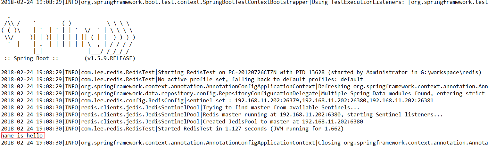

## 前言

对于生产环境，高可用是避免不了要面对的问题，无论什么环境、服务，只要用于生产，就需要满足高可用；此文针对的是redis的高可用。

接下来会有系列文章，该系列是对[spring-
session实现分布式集群session的共享](http://www.cnblogs.com/youzhibing/p/7348337.html)的完整阐述，同时也引伸出缓存的实现；而此篇是该系列的第一篇。

github地址：<https://github.com/youzhibing/redis>

## 环境准备

redis版本：redis-3.0.0

linux：centos6.7

ip：192.168.11.202， 一台服务器上搭建搭建全部redis实例，包括数据节点实例以及哨兵(sentinel)实例

客户端jedis，基于spring-boot

## redis主从复制

搭建一主二从的主从环境

###  1、redis安装

安装很简单，网上资料很多，redis官网也有说明；主要就是3步：解压，make，make install

###  2、数据节点配置文件

redis解压后，redis home目录下有redis配置的样例文件，我们不直接在此文件上就行修改，在redis
home目录下新建文件夹master_slave，将配置文件都放于此目录下

master配置文件：redis-6379.conf

    
    
    port 6379
    bind 192.168.11.202
    requirepass "myredis"
    daemonize yes
    logfile "6379.log"
    dbfilename "dump-6379.rdb"
    dir "/opt/soft/redis/data"
    
    #如若master设置了认证密码，那么所有redis数据节点都配置上masterauth属性
    masterauth "myredis"  
    

slave-1配置文件：redis-6380.conf

    
    
    port 6380
    bind 192.168.11.202
    requirepass "myredis"
    daemonize yes
    logfile "6380.log"
    dbfilename "dump-6380.rdb"
    dir "/opt/soft/redis/data"
    
    #如若master设置了认证密码，那么所有redis数据节点都配置上masterauth属性
    masterauth "myredis"
    slaveof 192.168.11.202 6379

slave-2配置文件：redis-6381.conf

    
    
    port 6381
    bind 192.168.11.202
    requirepass "myredis"
    daemonize yes
    logfile "6381.log"
    dbfilename "dump-6381.rdb"
    dir "/opt/soft/redis/data"
    
    #如若master设置了认证密码，那么所有redis数据节点都配置上masterauth属性
    masterauth "myredis"
    slaveof 192.168.11.202 6379

###  3、节点启动

如下相关路径需要根据自己的情况进行改动，可能和我的不一样

    
    
    [root@slave1 master_slave]# cd /opt/redis-3.0.0/master_slave/
    [root@slave1 master_slave]# ./../src/redis-server redis-6379.conf 
    [root@slave1 master_slave]# ./../src/redis-server redis-6380.conf 
    [root@slave1 master_slave]# ./../src/redis-server redis-6381.conf

确认主从关系

    
    
    [root@slave1 master_slave]# ./../src/redis-cli -h 192.168.11.202 -p 6379 -a myredis info replication
    # Replication
    role:master
    connected_slaves:2
    slave0:ip=192.168.11.202,port=6380,state=online,offset=393,lag=0
    slave1:ip=192.168.11.202,port=6381,state=online,offset=393,lag=0
    master_repl_offset:393
    repl_backlog_active:1
    repl_backlog_size:1048576
    repl_backlog_first_byte_offset:2
    repl_backlog_histlen:392

还可以从从节点视角来看：[root@slave1 master_slave]# ./../src/redis-cli -h 192.168.11.202
-p 6380 -a myredis info replication

如若进行顺利，按如上配置，一主二从环境搭建完毕

###  4、从节点作用

主要两个作用：1、作为主节点的一个备份，一旦主节点出现故障，从节点可以作为后备"顶"上来，并且保证数据尽量不丢失（主从复制是最终一致性）；2、从节点可以拓展主节点的能力，一旦主节点不能支撑大并发的读操作，从节点可以在一定程度上帮助主节点分担读压力

###  5、主从复制问题

1、一旦主节点出现故障，需要手动将一个从节点晋升为主节点，同时需要修改应用方的主节点地址，还需要命令其他从节点去复制新的主节点，整个过程需要人工干预

2、主节点的写能力受到单机的限制

3、主节点的存储能力受到单机的限制

## redis sentinel部署

此片主要讲通过sentinel解决上述问题1，问题2、3则在下篇博客进行说明

###  1、3个sentinel节点的配置文件基本一致，区别的只是端口

sentinel-26379.conf

    
    
    port 26379
    daemonize yes
    logfile "26379.log"
    dir "/opt/soft/redis/data"
    sentinel monitor mymaster 192.168.11.202 6380 2
    #redis数据master节点设置了认证，则需要如下配置
    sentinel auth-pass mymaster myredis
    sentinel down-after-milliseconds mymaster 30000
    sentinel parallel-syncs mymaster 1
    sentinel failover-timeout mymaster 180000

sentinel-26380.conf

    
    
    port 26380
    daemonize yes
    logfile "26379.log"
    dir "/opt/soft/redis/data"
    sentinel monitor mymaster 192.168.11.202 6380 2
    #redis数据master节点设置了认证，则需要如下配置
    sentinel auth-pass mymaster myredis
    sentinel down-after-milliseconds mymaster 30000
    sentinel parallel-syncs mymaster 1
    sentinel failover-timeout mymaster 180000

sentinel-26381.conf

    
    
    port 26381
    daemonize yes
    logfile "26379.log"
    dir "/opt/soft/redis/data"
    sentinel monitor mymaster 192.168.11.202 6380 2
    #redis数据master节点设置了认证，则需要如下配置
    sentinel auth-pass mymaster myredis
    sentinel down-after-milliseconds mymaster 30000
    sentinel parallel-syncs mymaster 1
    sentinel failover-timeout mymaster 180000

###  2、启动sentinel

    
    
    [root@slave1 master_slave]# ./../src/redis-sentinel sentinel-26379.conf 
    [root@slave1 master_slave]# ./../src/redis-sentinel sentinel-26380.conf 
    [root@slave1 master_slave]# ./../src/redis-sentinel sentinel-26381.conf

###  3、sentinel确认

    
    
    [root@slave1 master_slave]# ./../src/redis-cli -h 192.168.11.202 -p 26379 info Sentinel
    # Sentinel
    sentinel_masters:1
    sentinel_tilt:0
    sentinel_running_scripts:0
    sentinel_scripts_queue_length:0
    master0:name=mymaster,status=ok,address=192.168.11.202:6379,slaves=2,sentinels=3

Redis Sentinel 最终拓扑结构

###  4、高可用测试

手动停掉6379实例或者kill掉6379实例

    
    
    [root@slave1 master_slave]# ./../src/redis-cli -h 192.168.11.202 -p 6379 -a myredis
    192.168.11.202:6379> shutdown

查看26379.log

master节点已经自动切换到192.168.11.202:6380了，重启6379，6379则是6378的从节点了。

    
    
    [root@slave1 master_slave]# ./../src/redis-cli -h 192.168.11.202 -p 6380 -a myredis
    192.168.11.202:6380> info replication
    # Replication
    role:master
    connected_slaves:2
    slave0:ip=192.168.11.202,port=6381,state=online,offset=80802,lag=1
    slave1:ip=192.168.11.202,port=6379,state=online,offset=80802,lag=1
    master_repl_offset:80945
    repl_backlog_active:1
    repl_backlog_size:1048576
    repl_backlog_first_byte_offset:2
    repl_backlog_histlen:80944　

## 客户端（Jedis）连接

基于spring-boot开发，spring-boot-test测试， 这两者本文不做说明，网上资料很多，不熟悉的自行去补充； 工程结构如下图

pom.xml

    
    
    <project xmlns="http://maven.apache.org/POM/4.0.0" xmlns:xsi="http://www.w3.org/2001/XMLSchema-instance"
        xsi:schemaLocation="http://maven.apache.org/POM/4.0.0 http://maven.apache.org/xsd/maven-4.0.0.xsd">
        <modelVersion>4.0.0</modelVersion>
    
        <groupId>com.lee</groupId>
        <artifactId>redis</artifactId>
        <version>0.0.1-SNAPSHOT</version>
        <packaging>jar</packaging>
    
        <name>redis</name>
        <url>http://maven.apache.org</url>
    
        <properties>
            <project.build.sourceEncoding>UTF-8</project.build.sourceEncoding>
        </properties>
    
        <parent>
            <groupId>org.springframework.boot</groupId>
            <artifactId>spring-boot-starter-parent</artifactId>
            <version>1.5.9.RELEASE</version>
        </parent>
    
        <dependencies>
            <dependency>
                <groupId>org.springframework.boot</groupId>
                <artifactId>spring-boot-starter-data-redis</artifactId>
            </dependency>
            
            <dependency>
                <groupId>org.springframework.boot</groupId>
                <artifactId>spring-boot-starter-test</artifactId>
                <scope>test</scope>
            </dependency>
            
            <!-- 日志过滤器 -->
            <dependency>
                <groupId>org.codehaus.janino</groupId>
                <artifactId>janino</artifactId>
            </dependency>
        </dependencies>
    </project>

View Code

redis-sentinel.properties

    
    
    redis.masterName=mymaster
    redis.sentinels=192.168.11.202:26379,192.168.11.202:26380,192.168.11.202:26381
    redis.timeout=10000
    #连接master需要用到的密码，如果redis数据节点开启了连接认证
    redis.password=myredis
    
    # 连接池
    # 连接池最大连接数（使用负值表示没有限制）
    redis.pool.maxActive=150
    # 连接池中的最大空闲连接
    redis.pool.maxIdle=10
    # 连接池中的最小空闲连接
    redis.pool.minIdle=1
    # 获取连接时的最大等待毫秒数,小于零:阻塞不确定的时间,默认-1
    redis.pool.maxWaitMillis=3000
    # 每次释放连接的最大数目
    redis.pool.numTestsPerEvictionRun=50
    # 释放连接的扫描间隔（毫秒）
    redis.pool.timeBetweenEvictionRunsMillis=3000
    # 连接最小空闲时间（毫秒）
    redis.pool.minEvictableIdleTimeMillis=1800000
    # 连接空闲多久后释放, 当空闲时间>该值 且 空闲连接>最大空闲连接数 时直接释放（毫秒）
    redis.pool.softMinEvictableIdleTimeMillis=10000
    # 在获取连接的时候检查有效性, 默认false
    redis.pool.testOnBorrow=true
    # 在空闲时检查有效性, 默认false
    redis.pool.testWhileIdle=true
    # 在归还给pool时，是否提前进行validate操作
    redis.pool.testOnReturn=true
    # 连接耗尽时是否阻塞, false报异常,ture阻塞直到超时, 默认true
    redis.pool.blockWhenExhausted=true

View Code

RedisConfig.java

    
    
    package com.lee.redis.config;
    
    import java.util.Arrays;
    import java.util.HashSet;
    import java.util.Set;
    
    import org.slf4j.Logger;
    import org.slf4j.LoggerFactory;
    import org.springframework.beans.factory.annotation.Value;
    import org.springframework.context.annotation.Bean;
    import org.springframework.context.annotation.Configuration;
    import org.springframework.context.annotation.PropertySource;
    
    import redis.clients.jedis.JedisPoolConfig;
    import redis.clients.jedis.JedisSentinelPool;
    
    @Configuration
    @PropertySource("redis/redis-sentinel.properties")
    public class RedisConfig {
        private static final Logger LOGGER = LoggerFactory.getLogger(RedisConfig.class);
        
        @Value("${redis.masterName}")
        private String masterName;
        @Value("${redis.sentinels}")
        private String sentinels;
        @Value("${redis.timeout}")
        private int timeout;
        @Value("${redis.password}")
        private String password;
        
        @Value("${redis.pool.maxActive}")
        private int maxTotal;
    
        @Value("${redis.pool.maxIdle}")
        private int maxIdle;
    
        @Value("${redis.pool.minIdle}")
        private int minIdle;
    
        @Value("${redis.pool.maxWaitMillis}")
        private long maxWaitMillis;
    
        @Value("${redis.pool.numTestsPerEvictionRun}")
        private int numTestsPerEvictionRun;
    
        @Value("${redis.pool.timeBetweenEvictionRunsMillis}")
        private long timeBetweenEvictionRunsMillis;
    
        @Value("${redis.pool.minEvictableIdleTimeMillis}")
        private long minEvictableIdleTimeMillis;
    
        @Value("${redis.pool.softMinEvictableIdleTimeMillis}")
        private long softMinEvictableIdleTimeMillis;
    
        @Value("${redis.pool.testOnBorrow}")
        private boolean testOnBorrow;
    
        @Value("${redis.pool.testWhileIdle}")
        private boolean testWhileIdle;
    
        @Value("${redis.pool.testOnReturn}")
        private boolean testOnReturn;
    
        @Value("${redis.pool.blockWhenExhausted}")
        private boolean blockWhenExhausted;
        
        @SuppressWarnings({ "unchecked", "rawtypes" })
        @Bean
        public JedisSentinelPool jedisSentinelPool(JedisPoolConfig poolConfig) {
            LOGGER.info("sentinel set : {}", sentinels);
            Set sentinelSet = new HashSet(Arrays.asList(sentinels.split(",")));
            JedisSentinelPool jedisPool = new JedisSentinelPool(masterName, sentinelSet, poolConfig, timeout, password);
            return jedisPool;
        }
        
        @Bean
        public JedisPoolConfig jedisPoolConfig() {
            JedisPoolConfig jedisPoolConfig = new JedisPoolConfig();
            jedisPoolConfig.setMaxTotal(maxTotal);
            jedisPoolConfig.setMaxIdle(maxIdle);
            jedisPoolConfig.setMinIdle(minIdle);
            jedisPoolConfig.setMaxWaitMillis(maxWaitMillis);
            jedisPoolConfig.setNumTestsPerEvictionRun(numTestsPerEvictionRun);
            jedisPoolConfig
                    .setTimeBetweenEvictionRunsMillis(timeBetweenEvictionRunsMillis);
            jedisPoolConfig
                    .setMinEvictableIdleTimeMillis(minEvictableIdleTimeMillis);
            jedisPoolConfig
                    .setSoftMinEvictableIdleTimeMillis(softMinEvictableIdleTimeMillis);
            jedisPoolConfig.setTestOnBorrow(testOnBorrow);
            jedisPoolConfig.setTestWhileIdle(testWhileIdle);
            jedisPoolConfig.setTestOnReturn(testOnReturn);
            jedisPoolConfig.setBlockWhenExhausted(blockWhenExhausted);
    
            return jedisPoolConfig;
        }
    }

View Code

Application.java

    
    
    package com.lee.redis;
    
    import org.springframework.boot.Banner;
    import org.springframework.boot.SpringApplication;
    import org.springframework.boot.autoconfigure.EnableAutoConfiguration;
    import org.springframework.context.annotation.ComponentScan;
    import org.springframework.context.annotation.Configuration;
    
    @Configuration
    @EnableAutoConfiguration
    @ComponentScan
    public class Application {
    
        public static void main(String[] args) {
            
            SpringApplication app = new SpringApplication(Application.class);
            app.setBannerMode(Banner.Mode.OFF);            // 是否打印banner
            // app.setApplicationContextClass();        // 指定spring应用上下文启动类
            app.setWebEnvironment(false);
            app.run(args);
        }
    }

View Code

RedisTest.java

    
    
    package com.lee.redis;
    
    import org.junit.Test;
    import org.junit.runner.RunWith;
    import org.slf4j.Logger;
    import org.slf4j.LoggerFactory;
    import org.springframework.beans.factory.annotation.Autowired;
    import org.springframework.boot.test.context.SpringBootTest;
    import org.springframework.test.context.junit4.SpringRunner;
    
    import redis.clients.jedis.Jedis;
    import redis.clients.jedis.JedisSentinelPool;
    
    @RunWith(SpringRunner.class)
    @SpringBootTest(classes = Application.class)
    public class RedisTest {
    
        private static final Logger LOGGER = LoggerFactory.getLogger(RedisTest.class);
        
        @Autowired
        private JedisSentinelPool sentinelPool;
        
        @Test
        public void getNameTest() {
            Jedis jedis = null;
            try {
                jedis = sentinelPool.getResource();
                String name = jedis.get("name");
                System.out.println("name is " + name);
            } catch(Exception e) {
                LOGGER.error(e.getMessage(), e);
            } finally {
                if (jedis != null) {
                    jedis.close();
                }
            }
            
        }
        
    }

View Code

更多详情请上我的github

运行RedisTest.java的getNameTest方法（name属性已经在redis中设置，没设置的需要提前设置），得到结果：

## 注意点

1、有人可能会有这样的疑问：为什么通过sentinel来获取redis的连接，而不是直接连接master来获取redis连接呢？

试想一下，客户端直接通过master节点获取redis连接，如果master节点挂掉了，虽然Redis
Sentinel可以完成故障转移，但是客户端无法获取这个变化，那么客户端就无法获取redis连接了；

最了解master节点信息的就是Sentinel节点集合，所以通过sentinel来获取redis连接就能满足高可用的要求了。

2、redis master的故障转移不影响客户端连接代码， 但是转移期间内，通过sentinel是获取不到主节点的连接的，
因为转移期间内master节点还没被选举出来；

## 参考

《Redis开发与运维》

http://www.redis.cn/topics/sentinel.html

