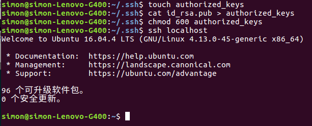
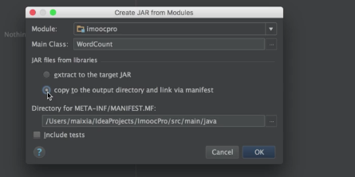
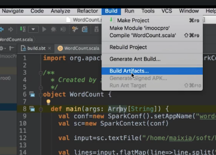

simon@simon-Lenovo-G400:~/.ssh$ touch authorized_keys  
simon@simon-Lenovo-G400:~/.ssh$ cat id_rsa.pub > authorized_keys  
simon@simon-Lenovo-G400:~/.ssh$ chmod 600 authorized_keys  
simon@simon-Lenovo-G400:~/.ssh$ ssh localhost  
Welcome to Ubuntu 16.04.4 LTS (GNU/Linux 4.13.0-45-generic x86_64)  
  
* Documentation: https://help.ubuntu.com  
* Management: https://landscape.canonical.com  
* Support: https://ubuntu.com/advantage  
  
96 个可升级软件包。  
0 个安全更新。  
  
simon@simon-Lenovo-G400:~$  

先导入Spark开发包

