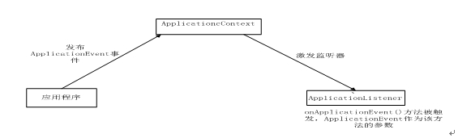

##Spring 读书笔记-----Spring容器（二）

##
## 一、使用ApplicationContext

##
## 前面介绍了，我们一般不会使用BeanFactory实例作为Spring容器，而是使用ApplicationContext实例作为容器，它增强了BeanFactory的功能。

##
## ApplicationContext允许以声明式方式操作容器，无须手动创建它。在Web应用启动时自动创建ApplicationContext。当然，也可以采用编程方式创建ApplicationContext。

##
## 除了提供BeanFactory所支持的全部功能外，ApplicationContext还有如下功能：

##
## 1、 ApplicationContext继承MessageSource接口，因此提供国际化支持。

##
## 2、 资源访问。

##
## 3、 事件机制。

##
## 4、 载入多个配置文件。

##
## 5、 以声明式的方式启动，并创建Spring容器。

##
## 当系统创建ApplicationContext容器时，默认会预初始化所有的singleton Bean。也就是说，当ApplicationContext容器初始化完成后，容器中所有singleton Bean也实例化完成，这就意味着：系统前期创建ApplicationContext时将有较大的系统开销，但一旦ApplicationContext初始化完成，程序后面获取singleton Bean实例时将拥有较好的性能。

##
##

##
##  二、ApplicationContext的国际化支持

##
## ApplicationContext接口继承MessageSource接口，因此具备国际化功能。MessageSource接口中定义了三个方法用于国际化功能。

##
## String getMessage(Stringcode,Object[] args,Locale loc);

##
## StringgetMessage(String code,Object[] args,String default,Locale loc);

##
## StringgetMessage(MessageSourceResolvable resolvable,Local loc);

##
## ApplicationContext正是通过这三个方法来实现国际化的。当程序创建ApplicationContext容器时，Spring会自动查找在配置文件中名为messageSource的bean实例，一旦找到这个Bean实例，上述三个方法的调用被委托给该MessageSource Bean。如果没有该Bean，ApplicationContext会查找其父定义中的messagesource Bean，如果找到，它会作为messageSource Bean使用。但是如果无法找到messageSource，系统将会创建一个空的staticMessageSource Bean，该Bean的能接受上述三个方法的调用。

##
## 在Spring中配置messagesourceBean时通常使用ResourceBundleMessageSource.如下：

	 1 <?xml version="1.0" encoding="UTF-8"?>
 2 <beans xmlns:xsi="http://www.w3.org/2001/XMLSchema-instance"
 3     xmlns="http://www.springframework.org/schema/beans"
 4     xsi:schemaLocation="http://www.springframework.org/schema/beans
 5     http://www.springframework.org/schema/beans/spring-beans-3.0.xsd">
 6     <bean id="messsageSource" class="org.springframework.context.support.ResourceBundleMessageSource">
 7         <property name="basenames">
 8             <list>
 9                 <value>.....</value>
10                 <value>.....</value>
11                 <value>.....</value>
12             </list>
13         </property>
14     </bean>
15 </beans>


##
##

##
## 三、ApplicationContext的事件机制

##
## ApplicationContext的事件机制是观察者设计模式的实现，通过ApplicationEvent类和ApplicationListener接口，可以实现ApplicationContext的事件处理。如果容器中有一个ApplicationListener Bean，每当ApplicationContext发布 ApplicationEvent时，ApplicationListenerBean就会自动触发。

##
## Spring的事件框架有如下两个重要成员：

##
##  1、 ApplicationEvent：容器事件，必须由ApplicationContext发布。

##
##  2、 ApplicationListener：监听器，可由容器中的任何监听器Bean担任。

##
## Spring的事件机制需要事件源、事件和事件监听器组成。只是此处的事件是ApplicationContext，且事件必须由java程序显示触发。下图简单示范了ApplicationContext的事件流程。

##
##   

##
## 下面实例展示了Spring容器的事件机制。

##
## 1）、定义一个ApplicationEvent类，其对象就是Spring容器事件。

##
##

	 1 public class EmailEvent extends ApplicationEvent {
 2     private static final long serialVersionUID = 1L;
 3     
 4     private String address;
 5     private String text;
 6 
 7     // 定义一个带参的构造函数
 8     public EmailEvent(Object source) {
 9         super(source);
10     	}
11 
12     public EmailEvent(Object source, String address, String text) {
13         super(source);
14         this.address = address;
15         this.text = text;
16     	}
17 
18     public String getAddress() {
19         return address;
20     	}
21 
22     public void setAddress(String address) {
23         this.address = address;
24     	}
25 
26     public String getText() {
27         return text;
28     	}
29 
30     public void setText(String text) {
31         this.text = text;
32     	}
33 
34 	}


##
##

##
## 容器事件的监听器类必须实现ApplicationListener接口，它的实现方法如下：

##
## onAPplicationEvent(ApplicationEventevent):每当容器内发生任何事件时，此方法都会被触发。

##
##

##
## 2）、编写该容器的监听器类。

	 1 public class EmailNotifier implements ApplicationListener{
 2 
 3     //该方法会在容器发生事件时触发
 4     public void onApplicationEvent(ApplicationEvent event) {
 5         if(event instanceof EmailEvent){
 6             //只处理EmailEvent，发送email通知
 7             EmailEvent emailEvent = (EmailEvent) event;
 8             System.out.println("需要发送邮件的接收地址为:"+emailEvent.getAddress());
 9             
10             System.out.println("需要发送邮件的邮件正文是:"+emailEvent.getText());
11         	}
12         else {
13             //容器内置事件不作任何处理
14             System.out.println("容器本身的事件:"+event);
15         	}
16     	}
17 
18 	}
19 
20   


##
##

##
## 3）、将监听器类配置在容器中。

##
## 在为Spring容器注册监听器时，我们只需在Spring配置文件中配置一个实现了ApplicationListener的Bean即可，Spring容器会把这个Bean当做容器事件的监听器。

	 1 <?xml version="1.0" encoding="UTF-8"?>
 2 <beans xmlns:xsi="http://www.w3.org/2001/XMLSchema-instance"
 3     xmlns="http://www.springframework.org/schema/beans"
 4     xsi:schemaLocation="http://www.springframework.org/schema/beans
 5     http://www.springframework.org/schema/beans/spring-beans-3.0.xsd">
 6     
 7     <!-- 配置监听器 -->
 8     <bean class="com.app.listener.EmailNotifier"/>
 9 
10 </beans>


##
## 通过上面的3个步骤就可以实现Spring容器的事件了。当系统创建Spring容器，加载Spring容器时会自动触发容器事件，容器事件监听器可以监听到这些事件。同时我们也可以调用ApplicationContext的pulishEvent()方法来主动触发容器事件。

	 1 public class SpringTest {
 2 
 3     public static void main(String[] args) {
 4         ApplicationContext ctx = new ClassPathXmlApplicationContext("bean.xml");
 5         //创建一个ApplicationEvent对象
 6         EmailEvent emailEvent = new EmailEvent("hell","spring_test@163.com","this is a test");
 7         
 8         //主动触发容器事件
 9         ctx.publishEvent(emailEvent);
10     	}
11 
12 	}


##
## 如果Bean想发布事件，则Bean必须获得其容器的引用。如果程序中没有直接获取容器的引用，则应该让Bean实现ApplicationContextAware或BeanFactoryAware接口，从而获得容器的引用。

##
## 除了我们可以自己实现Spring容器的事件外，Spring也提供了几个内置事件：

##
## 1、 ContextRefreshedEvent：ApplicationContext容器初始化或者刷新时触发该事件。

##
## 2、 ContextStartedEvent：当使用ConfigurableApplicationContext接口的start()方法启动ApplicationContext容器时触发该事件。

##
## 3、 ContextClosedEvent：当使用ConfigurableApplicationContext接口的close()方法关闭ApplicationContext容器时触发该事件。

##
## 4、 ContextStopedEvent: 当使用ConfigurableApplicationContext接口的stop()方法停止ApplicationContext容器时触发该事件。

##
##