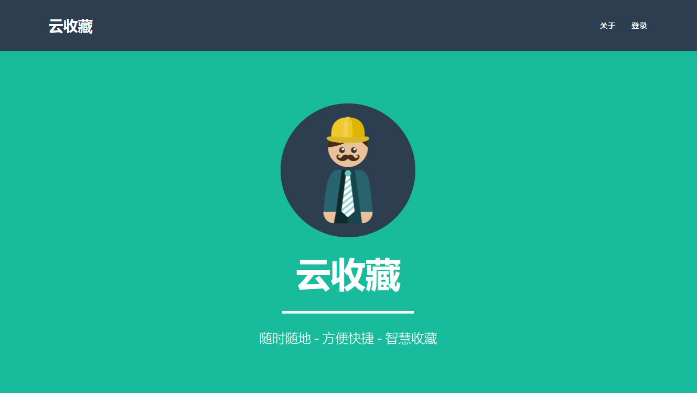
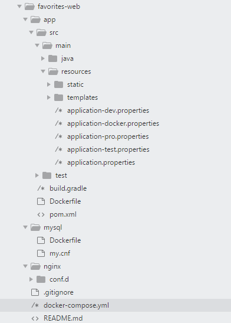

云收藏项目已经开源2年多了，作为当初刚开始学习 Spring Boot
的练手项目，使用了很多当时很新的技术，现在看来其实很多新技术是没有必要使用的，但做为学习案例来讲确实是一个绝佳的 Spring Boot 实践。

从开源到现在，写了一些教程给大家介绍如何部署云收藏，如何在IDE中运行云收藏，但是仍然有很多的朋友不知道如何使用，如何部署？就像“请提供一份云收藏数据结构”
这样的问题我至少都回答了一百多次，并且在 github 关闭了近十个类似的问题。

这也从另外一个方面可以看出，部署云收藏项目对一些朋友还是比较复杂，现在有了 Docker
我们就可以愉快的解决这个问题，只需三步就可以部署云收藏项目，打造专属个人的收藏系统。

## [云收藏](https://github.com/cloudfavorites/favorites-web)

一些朋友可能还不了解[云收藏](http://favorites.ren)，给大家简单介绍一下：

云收藏是一个使用 Spring Boot
构建的开源网站，可以让用户在线随时随地收藏的一个网站，在网站上分类整理收藏的网站或者文章，可以作为稍后阅读的一个临时存放。作为一个开放开源的软件，可以让用户从浏览器将收藏夹内容导入到云收藏，也支持随时将云收藏收集的文章导出去做备份。

**产品主页**

[http://favorites.ren](http://favorites.ren/)

**项目主页**

<https://github.com/cloudfavorites/favorites-web>

**产品截图**

核心功能点：

  * 收藏、分类、检索文章
  * 导出、导出（包活从浏览器中）
  * 可以点赞、分享、讨论
  * 注册、登录、个人账户
  * 临时收藏、查看别人收藏
  * 其它...

项目使用技术：

  * Vue
  * Bootstrap
  * jQuery
  * Thymeleaf
  * Spring Data Jpa
  * Spring Boot Mail
  * WebJars
  * Mysql
  * Tomcat
  * ~~Redis~~

> Redis 后期去掉是由于服务器资源有限和部署麻烦

## 项目改造

**依赖环境**

准备一台系统为 Centos 7 以上的服务器，系统需要安装 Docker 和 Docker Compos 环境，安装方法可以参考前面两篇文章：

  * [Docker(一)：Docker入门教程](http://www.ityouknow.com/docker/2018/03/07/docker-introduction.html)
  * [Docker(四)：Docker 三剑客之 Docker Compose](http://www.ityouknow.com/docker/2018/03/22/docker-compose.html)

**Docker 化改造**

项目改造后的项目机构图如下：

因为上一篇文章[Spring Boot 2.0(五)：Docker Compose + Spring Boot + Nginx + Mysql
实践](http://www.ityouknow.com/springboot/2018/03/28/dockercompose-springboot-
mysql-nginx.html) 已经介绍了此类项目结构和内容含义，因此这里主要描述新增内容。

**`docker-compose.yaml` 文件**

我们首先来看一下`docker-compose.yaml`文件：

    
    
    version: "3"
    services:
      nginx:
       container_name: favorites-nginx
       image: nginx:1.13
       restart: always
       ports:
       - 80:80
       - 443:443
       volumes:
         - ./nginx/conf.d:/etc/nginx/conf.d
         - /tmp/logs:/var/log/nginx
         
        
      mysql:
       build: ./mysql
       environment:
         MYSQL_DATABASE: favorites
         MYSQL_ROOT_PASSWORD: root
         MYSQL_ROOT_HOST: "%"
         TZ: Asia/Shanghai
       ports:
       - "3306:3306"
       volumes:
         - ./mysql_data:/var/lib/mysql
       restart: always
          
      app:
        restart: always
        build: ./app
        working_dir: /app
        volumes:
          - ./app:/app
          - ~/.m2:/root/.m2
          - /tmp/logs:/usr/local/logs
        expose:
          - "8080"
        command: mvn clean spring-boot:run -Drun.profiles=docker
        depends_on:
          - nginx
          - mysql

相对上一篇内容本次的`docker-compose.yaml`文件主要新增了两部分的内容：

  * 1、将 Nginx 和 app 的日志映射到宿主机上，方便我们查看日志
  * 2、将 Mysql 的数据存储映射到宿主机上，这样的好处是不至于将集群关掉之后数据丢失

`docker-compose.yaml`文件中，日志部分：

    
    
    version: "3"
    services:
      nginx:
       volumes:
         - /tmp/logs:/var/log/nginx
      app:
       volumes:
         - /tmp/logs:/usr/local/logs

分别将 Nginx 和云收藏项目日志映射到宿主机的`/tmp/logs`，方便我们查看项目日志。

**定制 mysql 初始化信息**

`docker-compose.yaml`文件中，Mysql 变化内容：

    
    
    version: "3"
    services:
      mysql:
       build: ./mysql
       environment:
         TZ: Asia/Shanghai
       volumes:
         - ./mysql_data:/var/lib/mysql

我将有变化的内容都摘了出来，mysql 新增了 TZ 环境变量将时区指向上海，另外我们将 Mysql 镜像内容提出来，放到项目的 mysql
目录下单独构建。mysql 目录下有两个文件，一个是 Dockerfile 定义 Mysql 镜像，一个是 my.cnf 文件定义 Mysql 编码等信息。

my.cnf 文件内容

    
    
    #省略一部分
    ...
    character_set_server=utf8
    character_set_filesystem=utf8
    collation-server=utf8_general_ci
    init-connect="SET NAMES utf8"
    init_connect="SET collation_connection = utf8_general_ci"
    skip-character-set-client-handshake

此文件主要的作用是让 Mysql 支持 UTF-8.

Dockerfile 文件内容

    
    
    FROM mysql/mysql-server:5.7
    COPY my.cnf /etc/my.cnf

使用 Mysql5.7 版本，并且将同目录下的 my.cnf 拷贝到服务器`/etc/my.cnf`中

**这样 Mysql 的相关信息就定义好了。**

**其它**

其它内容变化不大，nginx 目录下存放着 Nginx 的配置文件，项目新增`application-
docker.properties`文件，将数据库连接部分修改即可。

改造完成之后，我们只需要将项目拷贝到部署服务器然后执行：`docker-compose up`就可以启动。

## 部署

我已经将项目的改造内容提交到 github 上面，这样大家部署的时候仅需要三步，即可成功部署云收藏项目。

1、下载源码解压

下载最新发布版本

    
    
    wget https://github.com/cloudfavorites/favorites-web/archive/favorites-1.1.1.zip

解压

    
    
    unzip favorites-1.1.1.zip

进入目录

    
    
    cd favorites-web-favorites-1.1.1/

2、修改配置文件

修改文件`application-docker.properties`

    
    
    vi app/src/main/resources/application-docker.properties

修改内容如下

    
    
    favorites.base.path=http://xx.xxx.xx.xx/ 

> 地址为部署服务器的地址

3、启动项目

配置完成后，后台启动

    
    
    [root@~]# docker-compose up -d
    Creating network "favoriteswebfavorites111_default" with the default driver
    Creating favorites-nginx                  ... done
    Creating favoriteswebfavorites111_mysql_1 ... done
    Creating favoriteswebfavorites111_app_1   ... done

启动完成后，浏览器访问上面配置地址：`http://xx.xxx.xx.xx/`，就可以看到云收藏的首页了。

**辅助内容**

启动后想查看某个容器内的服务运行情况，可以使用以下命令进入：

使用`docker ps`查看宿主机上面运行的 Docker 容器

    
    
    [root@VM_73_217_centos ~]# docker ps
    CONTAINER ID        IMAGE                            COMMAND                  CREATED             STATUS                  PORTS                                      NAMES
    a466ce6e58a5        favoriteswebfavorites111_app     "/usr/local/bin/mv..."   16 hours ago        Up 16 hours             8080/tcp                                   favoriteswebfavorites111_app_1
    1b4f1b912de0        nginx:1.13                       "nginx -g "daemon ..."   16 hours ago        Up 16 hours             0.0.0.0:80->80/tcp, 0.0.0.0:443->443/tcp   favorites-nginx
    65b481bb7741        favoriteswebfavorites111_mysql   "/entrypoint.sh my..."   16 hours ago        Up 16 hours (healthy)   0.0.0.0:3306->3306/tcp, 33060/tcp          favoriteswebfavorites111_mysql_1

根据上面查询的 Docker 容器 ID 信息，执行下面命令

    
    
    docker exec -ti CONTAINER_ID  bash
    #比如进入项目容器中
    [root@VM_73_217_centos ~]# docker exec -ti a466ce6e58a5 bash
    root@a466ce6e58a5:/app# ps -ef|grep java
    ...

退出容器执行以下命令：

    
    
    root@a466ce6e58a5:/app# exit
    exit
    [root@VM_73_217_centos ~]# 

这样以后如果我们想部署云收藏项目就变的非常简单，仅仅需要三步可以愉快的搭建自己的收藏系统了，小伙伴们赶紧动起手来。

