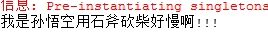

Java应用（从applets的小范围到全套n层服务端企业应用）是一种典型的依赖型应用，它就是由一些互相适当地协作的对象构成的。因此，我们说这些对象间存在依赖关系。加入A组件调用了B组件的方法，我们就可以称A组件依赖于B组件。我们通过使用依赖注入，Java
EE应用中的各种组件不需要以硬编码方式耦合在一起，甚至无需使用工厂模式。当某个Java实例需要其他Java
实例时，系统自动提供所需要的实例，无需程序显示获取，这种自动提供java实例我们谓之为依赖注入，也可以称之为控制反转（Inversion of
Control IoC）。

其实不管是控制反转还是依赖注入，他们都可以这样理解：当某个Java实例（调用者）需要另一个Java实例（被调用者）时，在传统的程序设计过程中，通常有调用者来创建被调用者的实例。但是在依赖注入/控制反转模式下，创建被调用者的工作不再是有调用者来完成，而是由Spring容器来完成，然后注入调用者。

对于Spring而言，Spring采用动态、灵活的方式来管理各种对象。对象与对象之间的具体实现都是透明的。Spring的依赖注入对调用者和被调用者几乎没有任何要求，完全支持对POJO之间依赖关系的管理。

依赖注入通常有如下两种：

1、 设置注入：IoC容器使用属性的setter方法来注入被依赖的实例。

2、 构造注入：IoC容器使用构造器来注入被依赖的实例。

一、设值注入

设值注入是指IoC容器使用属性的setter方法来注入被依赖的实例。这种注入方式比较简单、直观。

下面是Person接口，该接口定义了一个Person规范。

    
    
    1 public interface Person {
    2     //定义使用斧子的方法
    3     public void useAxe();
    4 }
    
    
            Axe接口：
    
    
    1 public interface Axe {
    2     //Axe接口里面有个砍的方法
    3     public String chop();
    4 }
    
    
          Person的实现类。
    
    
     1 public class Chinese implements Person {
     2     private Axe axe;
     3     private String name;
     4 
     5     // 设值注入所需的setter方法
     6     public void setAxe(Axe axe) {
     7         this.axe = axe;
     8     }
     9 
    10     public void setName(String name) {
    11         this.name = name;
    12     }
    13 
    14     // 实现Person接口的userAxe方法
    15     public void useAxe() {
    16         // 调用axe的chop方法，表明Person对象依赖于Axe对象
    17         System.out.println("我是"+name+"用"+axe.chop());
    18     }
    19 
    20 }
    
    
      上面的代码实现了Person接口的userAxe()方法，实现该方法时调用了axe的的chop()方法，这就是典型的依赖关系。

在这里Spring容器的作用就是已松耦合的方式来管理这种调用关系。在上面的Chinese类中，Chinese类并不知道它要调用的axe实例在哪里，也不知道axe实例是如何实现的，它只是需要调用一个axe实例，这个Axe实例将由Spring容器负责注入。

Axe的实现类：StoneAxe类

    
    
    1 public class StoneAxe implements Axe{
    2 
    3     public String chop() {
    4         return "石斧砍柴好慢啊!!!";
    5     }
    6 
    7 }
    
    
       直到这里，程序依然不知道Chinese类和Axe实例耦合，Spring也不知道！实际上，Spring需要使用XML配置文件来指定实例之间的依赖关系。

Spring采用了XML文件作为配置文件。

对于本应用的XML配置文件如下：

    
    
     1 <?xml version="1.0" encoding="UTF-8"?>
     2 <beans xmlns:xsi="http://www.w3.org/2001/XMLSchema-instance"
     3     xmlns="http://www.springframework.org/schema/beans"
     4     xsi:schemaLocation="http://www.springframework.org/schema/beans
     5     http://www.springframework.org/schema/beans/spring-beans-3.0.xsd">
     6 
     7     <!-- 配置Chinese实例，其实现类是Chinese -->
     8     <bean id="chinese" class="com.spring.service.impl.Chinese">
     9         <!-- 将StoneAxe注入给axe属性 -->
    10         <property name="axe" ref="stoneAxe" />
    11         <property name="name" value="孙悟空"/>
    12     </bean>
    13     
    14     
    15     <!-- 配置stoneAxe实例 -->
    16     <bean id="stoneAxe" class="com.spring.service.impl.StoneAxe" />
    17 </beans>
    
    
        
      在配置文件中，Spring配置Bean实例通常会指定两个属性：

id：指定该Bean的唯一标识，程序会通过id属性值来访问该Bean实例。

class：指定该Bean的实现类，此处不可再用接口，必须是实现类，Spring容器会使用XML解析器读取该属性值，并利用反射来创建该实现类的实例。

从上面可以看出Bean于Bean之间的依赖关系放在配置文件里组织，而不是写在代码里。通过配置文件的指定，Spring能够精确地为每个Bean注入属性。因此，配置文件里的<bean…/>元素的class属性值不能是接口，而必须是真正的实现类。

Spring会自动接管每个<bean…/>定义里的<property
…/>元素定义，Spring会在调用无参数的构造器、创建默认的Bean实例后，调用相应的setter方法为程序注入属性值。<property…/>定义的属性值将不再有该Bean来主动设置、管理，而是接受Spring的注入。

每个Bean的id属性是该Bean的唯一标识，程序通过id属性访问Bean，Bean与Bean的依赖关系也是通过id属性关联。

测试程序：

    
    
     1 public class BeanTest {
     2     public static void main(String[] args) {
     3         //创建Spring容器
     4         ApplicationContext ctx = new ClassPathXmlApplicationContext("bean.xml");
     5         //获取Chinese实例
     6         Person person = ctx.getBean("chinese",Person.class);
     7         person.useAxe();
     8     }
     9 
    10 }
    
    
     

执行上面的程序，执行结果如下：

主程序调用Person的userAxe()方法时，该方法的方法体内需要使用Axe实例，但程序没有任何地方将特定的Person实例和Axe实例耦合在一起，也就是说程序没有为Person实例传入Axe实例,Axe实例有Spring在运行期间注入。

Person实例不仅不需要了解Axe实例的具体实现，甚至无须了解Axe的创建过程。Spring容器根据配置文件的指定，创建Person实例时，不仅创建了Person的默认实例，同时也为该实例依赖注入其所依赖的Axe实例。

Bean与Bean之间的依赖关系有Spring管理，Spring采用setter方法为目标Be阿玛尼注入所依赖的Bean，这种方式被称之为设值注入。

从上面的实例我们可以看出，依赖注入以配置文件管理Bean实例之间的耦合，让Bean实例之间的耦合从代码层次分离出来。

Spring IoC容器有如下3个基本要点：

1、 应用程序的各个组件面向接口编程。面向接口编程可以将各个组件的耦合提升到接口层次，从而有利于项目后期的扩展。

2、 应用程序的各组件不再由程序主动产生，而是由Spring容器来负责产生，并初始化。

3、
Spring采用配置文件、或者Annotation来管理Bean的实现类、依赖关系，Spring容器则根据配置文件，利用反射机制来创建时间，并为之注入依赖关系。

二、构造注入

构造注入就是利用构造器来设置依赖关系的方式。

Japanese类：

    
    
     1 public class Japanese implements Person{
     2 
     3     private Axe axe;
     4     //默认构造器
     5     public Japanese(){
     6         
     7     }
     8     
     9     //构造注入所需的带参数构造器
    10     public Japanese(Axe axe){
    11         this.axe = axe;
    12     }
    13     
    14     public void useAxe() {
    15         System.out.println(axe.chop());
    16     }
    
    
       上面的Chinese类并没有setter方法，仅仅只是提供了一个带Axe属性的构造器，Spring将通过该构造器为Chinese注入所依赖的Bean实例。

构造注入的配置文件需要做一些修改。为了使用构造注入，使用<constructor-arg…/>元素来指定构造器的参数。如下

    
    
     1 <?xml version="1.0" encoding="UTF-8"?>
     2 <beans xmlns:xsi="http://www.w3.org/2001/XMLSchema-instance"
     3     xmlns="http://www.springframework.org/schema/beans"
     4     xsi:schemaLocation="http://www.springframework.org/schema/beans
     5     http://www.springframework.org/schema/beans/spring-beans-3.0.xsd">
     6 
     7     <!-- 配置Japanese实例 -->
     8     <bean id="japanese" class="com.spring.service.impl.Japanese">
     9         <!-- 使用构造注入 ，为Japanese实例注入SteelAxe实例-->
    10         <constructor-arg ref="stoneAxe"/>
    11     </bean>
    12     
    13     <!-- 配置stoneAxe实例 -->
    14     <bean id="stoneAxe" class="com.spring.service.impl.StoneAxe" />
    15 </beans>
    
    
     

上面的配置文件使用<contructor-
arg…/>元素指定了一个构造器参数，该参数类型是Axe，这指定Spring调用Chinese类里带一个Axe参数的构造器来创建chinese实例，因为使用了有参数的构造器创建实例，所以当Bean实例被创建完成后，该Bean的依赖关系也就已经设置完成。

他的执行效果与设值注入的执行效果一样。但是还是有点却别：创建Person实例中Axe的属性时机不同—设值注入式先通过无参数的构造器创建一个Bean实例，然后调用它的setter方法注入依赖关系，而构造注入则是直接调用有参数的构造器，当Bean实例创建完成后，依赖关系也已经完成。

三、两种注入方式的对比

Spring支持两种依赖注入方式，这两种依赖注入方式并没有好坏之分，只是适合的场景有所不同。

设值注入有如下优点：

1、 与传统的JavaBean的写法更相似，程序开发人员更加容易理解，接受。通过setter方法设定依赖关系显得更加直观、自然。

2、
对于复杂的依赖关系，如果采用构造注入，会导致构造器过于臃肿，难以阅读。Spring在创建Bean实例时，需要同时实例化其依赖的全部实例，因此导致性能下降。而设值注入，则可以避免这些问题。

3、 尤其是在某些属性可选的情况下，多参数的构造器更加笨重。

但是构造器也有如下优势：

1、 构造注入可以再构造器中决定依赖关系的注入顺序，优先依赖的优先注入。

2、
对于依赖关系无须变化的Bean，构造注入更有用处。因为没有setter方法，所有的依赖关系全部在构造器中设定，因此，无须担心后续的代码对依赖关系产生破坏。

3、 依赖关系只能在构造器中设定，则只有组件的创建者才能改变组件的依赖关系。对组件的调用者而言，组件内部的依赖关系完全透明，更加符合高内聚的原则。

通过上面的对比。所以建议用以设值注入为主，构造注入为辅的注入策略。对于依赖关系无须变化的注入，尽量采用构造注入；而其他的依赖关系，则考虑设值注入。

读李刚《轻量级 Java EE 企业应用实战》

