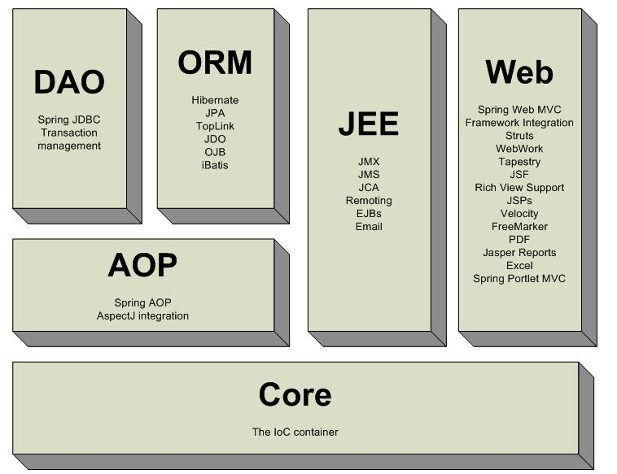
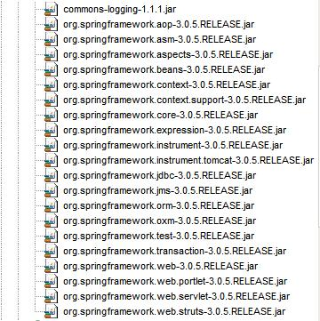
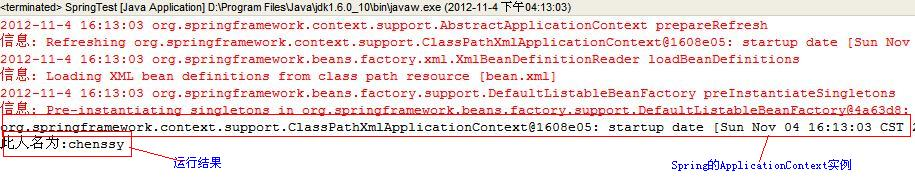

一、Spring介绍

Spring是一个轻量级的Java
EE容器，它也是一种从实际需求出发，着眼于轻便，灵活，易于开发，易测试和易部署的轻量级开发框架。Spring它完成了大量开发中的通用步骤，留给开发者的仅仅是与特定应用相关的部分，从而大大提高了企业应用的开发效率。

Spring为企业应用的开发提供了一个轻量级的解决方案。该方案包括：基于依赖注入的核心控制，基于AOP的声明式的事务管理，与持久层技术的耦合，以及优秀的Web
MVC框架等。它致力于为Java EE 应用各层的解决方案。

使用Spring具有如下优点：

1、低倾入式设计，代码的污染低。

2、独立于各种应用服务器，基于Spring框架的应用，可以真正实现Write Once、Run Anywhere的承诺。

3、Spring的DI容器降低了业务对象替换的复杂性，提高了组件之间的解耦。

4、Spring的AOP支持允许将一些通用任务如安全、事务、日志等进行集中式处理，提供了更好的复用。

5、Spring的ORM和DAO提供了与第三方持久层矿建的良好整合，并简化了底层的数据库访问。

6、Spring的高度开发性，并不强制应用完全依赖于Spring，开发者可以自由选择Spring框架的部分或全部。

概述图：

二、部署第一个Spring框架

1、将Spring项目开发需要的jar包全部倒入到web应用的WEB-INF/lib路径下。

2、编写主程序，该主程序用于初始化Spring容器，Spring容器是Spring应用的核心，该容器负责管理容器中的java组件。

    
    
    1 //创建Spring的ApplicationContext
    2      ApplicationContext ctx = new ClassPathXmlApplicationContext("bean.xml");
    3     //输出Spring容器
    4     System.out.println(ctx);

ApplicationContext实例就是Spring容器，它包含了很多功能，Spring框架中的绝大部分功能都是通过它实现的。一旦获得了Spring容器，就可以通过该容器访问Spring容器中Bean。

3、编写Java Bean类，该类让Spring容器管理。

    
    
     1 public class PersonService {
     2     private String name;
     3 
     4     public void setName(String name) {
     5         this.name = name;
     6     }
     7     
     8     //测试Person类的info方法
     9     public void info(){
    10         System.out.println("此人名为:"+name);
    11     }
    12 }

4、将编写的Java Bean类部署在Spring文件中

    
    
    1 <!-- 将PersonService类部署成Spring容器中的Bean  -->
    2     <bean id="personService" class="com.spring.service.PersonService">
    3         <property name="name" value="chenssy"/>
    4     </bean>

5、测试

在主程序中的main方法增加如下代码，即可测试。

    
    
    1         PersonService p = ctx.getBean("personService",PersonService.class);
    2         p.info();

运行测试程序得到如下结果：

