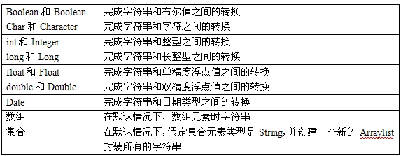

##Struts 2读书笔记------Struts 2的类型转换

##
## 所有的MVC框架，都需要负责解析HTTP请求参数，并将请求参数传给控制器组件。由于HTTP请求参数都是字符串类型，但是java是强类型的语言。，因此MVC框架必须将这些字符串参数转换成相应的数据类型。

##
## Struts2提供了非常强大的类型转换机制。Struts2的类型转换可以基于ONGL表达式，只要把HTTP参数命名为合法的ONGL表达式，就可以充分利用Struts2的类型转换机制。

##
##

##
## 1、Struts2内建的类型转换器

##
## Struts2可以完成大多数常用的类型转换。这些常用的类型转换时通过Struts2内建的类型转换器完成的。如下：
 

##
## 2、基于ONGL的类型转换

##
## 借助于ONGL，Struts2允许以另一种简单方式将请求参数转换成复合类型。

	 1 public class LoginAction implements Action {
 2 
 3     private UserBean user;
 4     private String tip;
 5 
 6     public UserBean getUser() {
 7         return user;
 8     	}
 9 
10     public void setUser(UserBean user) {
11         this.user = user;
12     	}
13 
14     public String getTip() {
15         return tip;
16     	}
17 
18     public void setTip(String tip) {
19         this.tip = tip;
20     	}
21 
22     //处理请求方法
23     public String execute() throws Exception {
24         if(getUser().getName().equals("chenssy")&amp;&amp;getUser().getPassword().equals("chentmt")){
25             setTip("转换成功");
26             return SUCCESS;
27         	}
28         else{
29             setTip("转换失败");
30             return ERROR;
31         	}
32     	}
33 
34 	}


##
##

##
## Struts2接收到HTTP请求参数后，需要将这些参数封装成UserBean对象。但是我们无需作任何的处理，只需要在定义表单域是使用ONGL表达式来定义表单域的name属性。

	1  <s:form action="Login">
2         <s:textfield name="user.name" label="用户名"></s:textfield>
3         <s:textfield name="user.password" label="密码"></s:textfield>
4         <s:submit value="转换" ></s:submit>
5         <s:submit value="重置" ></s:submit>
6    </s:form>


##
##

##
## 对于请求参数名是采用user.name和user.password---这就是ONGL表达式的形式。Struts2会相应的参数赋值给Action实例的user的相应的属性。

##
##通过上面的方式，Struts2可以将普通请求参数转换成复合型类型对象，但是一般要注意下面几点。

##
## 1、因为Struts2将通过反射来创建一个复合类的实例，因此系统必须为该复合类提供无参数的构造器。

##
## 2、如果希望使用user.name请求参数的形式为Action实例的user属性的name属性赋值，则必须为user属性对象的复合类提供setName()方法。