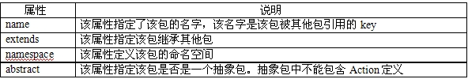
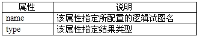

##Struts 2读书笔记-----struts 的action配置

##
## 当实现Action处理类后，我们就可以在struts.xml文件中配置该Action了。配置Action的目的就是让Struts2知道哪个Action处理哪个请求。也就是完成用户请求和Action之间的对应关系。

##
## 在Action映射中可以指定resulttypes、异常处理器及拦截器，但是，只有Action的name属性是必需指定的，该属性石引用该包的唯一标识。其他属性也可以在package范围内进行定义，供该package下配置的所有Action引用

##
## 

##
## 1、包和命名空间

##
## Struts2使用包来组织、管理Action。定义Action通过使用<package.../>下的<action.../>子元素来完成。

##
## 在struts.xml文件中，<package.../>元素用于定义包配置。每个<package.../>元素定义了一个包配置。它有如下属性：

##
## 

##
## Struts2之所以提命名空间主要是为了处理同一个Web应用中包含同名Action的情形。由于Struts2以包的形式来管理Action，故同一个包里面不能有同名的Action。

##
## 如果配置<package.../>时没有指定namespace属性，则该包下的所有Action都处于默认的包空间下。

##
## 有如下struts.xml配置

##
##

	 1 <package name="mystruts1" extends="struts-default">
 2         <action name="*Action" class="com.action.LoginAction" >
 3             ......
 4         </action>
 5     </package>
 6     <!-- 配置名为mystruts2，该包继续了Struts 2的默认包，指定命名空间为/book  -->
 7     <package name="mystruts2" extends="struts-default" namespace="/book">
 8         <action name="getBooks" class="com.action.GetBooksAction">
 9             ......
10         </action>
11     </package>


##
##

##
## 当某个包指定了命名空间后，该包下所有的Action处理的URL应该是命名空间+Action名。如：

##
## http://localhost:8080/struts_05/book/getBooks.action

##
## Struts_05为应用名；book是该Action所在包对应的命名空间，而getBooks是Action名

##
##

##
## 2、Action的基本配置

##
## 除了上面的配置外，我们还要指定一个class属性。该属性指定了该Action的实现类。如果没有指定该属性，系统就会默认使用系统的ActionSupport类。

##
## 我们在配置<action.../>时，还可以为它指定method属性。该属性指定Action调用指定方法。

	<action name="login" class="com.app.action.LoginAction" method="login" />


##
##

##
## 上面实例定义了一个名为login的Action，method属性指定了处理用户请求的方法为login

##
## 当然也可以不用指定method属性。系统会默认调用execute方法来处理用户请求。

##
## 处理用户请求的方法都应该存在一个相同的方法签名：方法形参列表为空，方法返回值为string。

	 1 <!-- 配置名为mystruts1，处理类LoginAction 默认使用execute方法处理请求 -->
 2     <package name="mystruts1" extends="struts-default">
 3         <action name="*Action" class="com.action.LoginAction" >
 4             ......
 5         </action>
 6     </package>
 7     <!-- 配置名为mystruts2，处理类为GetBooksAction，指定处理方法为getBooks -->
 8     <package name="mystruts2" extends="struts-default" >
 9         <action name="getBooks" class="com.action.GetBooksAction" method="getBooks">
10             ......
11         </action>
12     </package> 


##
##

##
##

##
##3、配置处理结果

##
##Action只是一个逻辑控制器，它并不直接对浏览者生产任何响应。因此，Action处理完用户请求后，Action需要将指定的试图资源呈现给用户。因此，配置Action时，应该配置逻辑试图和物理视图资源之间的对应关系。

##
##结果配置是告诉Struts2：当Action处理用户请求结束后，系统下一步做什么，系统下一步应该调用哪个物理视图资源来显示处理结果。

##
##配置<result.../>元素时一般需要指定如下两个属性：

##
## 

##
##<result.../>元素配置如下：

	1 <action name="login" class="com.app.action.LoginAction>
2     <!-- 为success的逻辑视图配置Result。type属性指定结果类型  --->     <result name="success" type="dispatcher">/welcome.jsp</result>
3  </action>  


##
##

##
##

##
##一般情况下，Struts2允许省略指定结果类型

	<action name="login" class="com.app.action.LoginAction>
    <!-- 为success的逻辑视图配置Result。省略type  --->     
       <result name="success">/welcome.jsp</result>
 </action> 


##
##

##
##Struts2还可以省略逻辑试图名name属性

	1 <action name="login" class="com.app.action.LoginAction>
2     <!-- 为success的逻辑视图配置Result。省略type、name  --->     
3        <result >/welcome.jsp</result> 
4 </action> 


##
##

##
##如果我们省略了<result.../>元素的name属性，系统将会采用默认的name属性值，默认的name属性值为success.

##
##