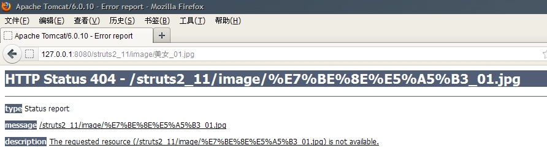
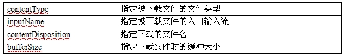
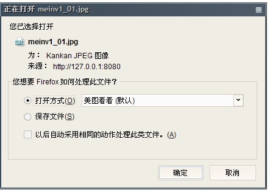
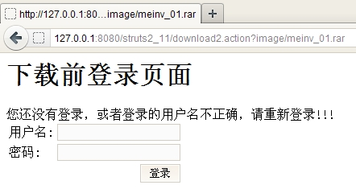

##Struts 2读书笔记-----使用Struts 2控制文件下载

##
## 一般来说，文件下载只需要直接在页面给出一个超级链接，该链接的href属性值等于要下载文件的文件名，就可以实现文件下载，如：<ahref=”checkbox.rar”>checkbox.rar</a>。但是这样下载存在着一些缺陷：如果该文件的文件名是中文文件名时，下载则会导致下载失败；如果在下载时需要对用户的身份进行判断，来验证用户是否有权限来下载该文件时，那么单独的超级链接是不可能实现的。这个时候，我们需要用Struts2来控制文件下载。

##
## Struts2提供了stream结果类型，该结果类型就是专门用于支持文件下载功能的。通过Struts2的文件下载支持，允许系统控制浏览者下载文件的权限，实现文件名是非西欧字符的文件下载。

##
## 首先介绍利用Struts2实现简单的文件下载：

	 1 public class FileDownloadAction implements Action { 
 2 
 3     public InputStream getInputStream() throws Exception { 
 4 
 5         return new ByteArrayInputStream("Struts 2 下载示例".getBytes()); 
 6 
 7     	} 
 8 
 9     public String execute() throws Exception { 
10 
11         return SUCCESS; 
12 
13     	} 
14 
15 	}


##
## 该类只是一个简单的Action处理类。它提供了一个返回inputStream输入流的方法。该输入流代表了下载文件的入口。这个方法用来给被下载的数据提供输入流。

##
##

##
## 一、利用Struts2实现文件名非西欧字符文件下载

##
## 有如下一个下载页面代码：

	1 <a href="download1.action?image/美女_01.jpg" >下载图片</a>
2 <a href="download2.action?image/meinv_01.rar">下载压缩文件</a>


##
##

##
## 上面页面中包含了两个下载的链接。但是第一个链接资源的文件名为中文，这时如果我们单击第一个超级练级，将会出现如下页面：

##
## 

##
##从上面的页面中我们可以看到大量的%字符，很明显，这种文件名师不能够实现下载的。这时我们可以使用Struts2的文件下载支持来下载该文件。

##
##1、实现文件下载的Action

##
##Struts2的文件下载Action需要提供一个返回InputStream流的方法。

##
##代码如下：

##
##

	 1 public class FileDownloadAction extends ActionSupport{
 2     //该属性可以在配置文件中动态指定该属性值
 3     private String inputPath;
 4 
 5     public void setInputPath(String inputPath) {
 6         this.inputPath = inputPath;
 7     	}
 8     
 9     /*定义一个返回inputStream的方法
10      * 该方法将作为下载文件的入口，且需要配置stream类型结果是指定inputName参数
11      * inputName参数的值就是方法去掉get前缀、首字母小写的字符串
12      */
13     public InputStream getTargetFile() throws Exception{
14         //servletContext提供getResourceAsStream()方法
15         //返回指定文件对应的输入流
16         return ServletActionContext.getServletContext().getResourceAsStream(inputPath);
17     	}
18 
19     @Override
20     public String execute() throws Exception {
21         return SUCCESS;
22     	}
23 	}


##
##

##
##

##
##上面的Action中包含了一个getTargetFile()方法，该方法返回一个InputStream输入流。这个输入流返回的是下载目标文件的入口。该方法的方法名为getTargetFile，则stream类型的结果映射中inputName参数值是targetFile.

##
##注：返回InputStream的方法需要配置Stream类型结果时指定inputName参数；该参数值就是方法吗去掉get前缀，首字母小写的字符串。

##
##2、配置Action

##
##配置文件下载的Action关键是需要配置一个类型为stream的结果，该stream类型的结果将使用文件下载作为响应。配置时需要指定以下四个属性

##
## 

##
##由于Stream结果类型的逻辑试图是返回给客服端一个输入流，因此不需要指定location属性。

##
##配置如下：

##
##

	 1         <action name="download1" class="com.app.action.FileDownloadAction">
 2             <!-- 指定被下载资源的位置 -->
 3             <param name="inputPath">\image\美女_01.jpg</param>
 4             <!-- 配置结果类型为stream的结果 -->
 5             <result name="success" type="stream">
 6                 <!-- 指定下载文件的文件类型 -->
 7                 <param name="contentType">image/jpg</param>
 8                 <!-- 指定由getTargetFile()方法返回被下载文件的inputStream -->
 9                 <param name="inputName">targetFile</param>
10                 <param name="contentDisposition">attachment;filename="meinv1_01.jpg"</param>
11                 <!-- 指定下载文件的缓冲大小 -->
12                 <param name="bufferSize">4096</param>
13             </result>
14         </action>


##
##

##
##

##
##通过上面的配置后，就可以实现包含中文文件名的文件下载了。如果在点击就可以实现下载了。如下：

##
## 

##
##二、下载前的授权控制

##
##有时用户下载文件之前，我们需要对用户的身份进行验证，判断用户是否具有权限来下载该文件。这时我们通过Struts2的文件下载支持，就可以实现下载前的授权控制。

##
##下面的Action，首先通过判断session里面的user属性是否为chenssy，如果用户通过了验证就允许下载，否则直接返回登录界面。

##
##代码如下：

##
##

	 1 public class AuthorityDownAction implements Action {
 2 
 3     private String inputPath;
 4 
 5     public void setInputPath(String inputPath) {
 6         this.inputPath = inputPath;
 7     	}
 8 
 9     public InputStream getTargetFile() throws Exception{
10         //ServletContext提供了getResourceAsStream()方法
11         return ServletActionContext.getServletContext().getResourceAsStream(inputPath);
12     	}
13     public String execute() throws Exception {
14         //取得ActionContext实例
15         ActionContext ctx = ActionContext.getContext();
16         //通过ActionContext访问用户的HttpSession
17         Map session = ctx.getSession();
18         String user = (String) session.get("user");
19         //判断session里的user是否通过检查
20         if(user!=null&amp;&amp;user.equals("chenssy")){
21             return SUCCESS;
22         	}
23         ctx.put("tip", "您还没有登录，或者登录的用户名不正确，请重新登录!!!");
24         return LOGIN;
25     	}
26 
27 	}


##
##

##
##

##
##上面的Action在校验失败后，会返回一个login逻辑视图名，所以在配置该Action时，还需要配置一个名为login的结果。

	 1                   <action name="download2" class="com.app.action.AuthorityDownAction">
 2             <!-- 定义被下载文件的物理资源 -->
 3             <param name="inputPath">\image\meinv_01.rar</param>
 4             <result name="success" type="stream">
 5                 <!-- 指定下载文件的文件类型 -->
 6                 <param name="contentType">application/rar</param>
 7                 <!-- 指定由getTargetFile()方法返回被下载文件的InputStream -->
 8                 <param name="inputName">targetFile</param>
 9                 <param name="contentDisposition">filename="meinv_01.rar"</param>
10                 <!-- 指定下载文件的缓冲大小 -->
11                 <param name="bufferSize">4096</param>
12             </result>
13             <result name="login">/login.jsp</result>
14         </action>


##
##

##
##通过上面的配置后，就可以实现用户的授权控制。如果用户不登录、或者用户名不正确，在下载该资源时，就会返回到登录界面。

##
##如下：

##
## 

##
##对于处理登录请求的Action如下：

##
##

	 1 public class LoginAction extends ActionSupport {
 2 
 3     private String username;
 4     private String password;
 5 
 6     public String getUsername() {
 7         return username;
 8     	}
 9 
10     public void setUsername(String username) {
11         this.username = username;
12     	}
13 
14     public String getPassword() {
15         return password;
16     	}
17 
18     public void setPassword(String password) {
19         this.password = password;
20     	}
21 
22     @Override
23     public String execute() throws Exception {
24         return SUCCESS;
25     	}
26 
27 	}


##
##

##
##

##
## 对于该Action，它只是一个简单的处理类。它的execute方法没有进行任何处理，直接返回success，表示任何用户名都可以登录成功，进入到下载界面，但是从AuthorityDownAction 处理类中可以看到只有用户名为chengssy的用户可以下载成功。其他任何用户下载该资源都不会成功。

##
## 如果登录成功了，需要返回到下载页面，所以该Action的配置如下：

##
##

	1 <action name="login" class="com.app.action.LoginAction">
2     <result name="success">/download.jsp</result>
3 </action>


##
##

##
##

##
## 通过上面的一些配置后，用户再输入"chengssy"，一旦完成了登录，用户的session里username的值就会是：chenssy,这时就可以完成文件的下载了。

##
##