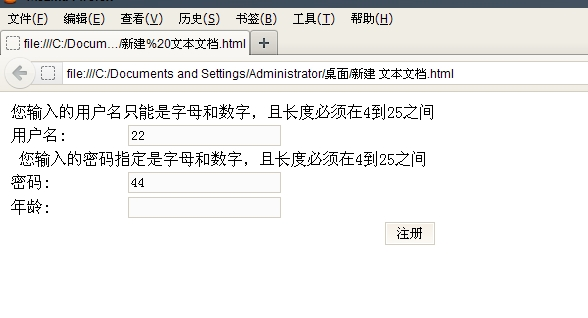
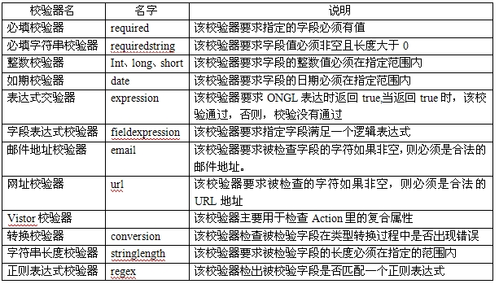
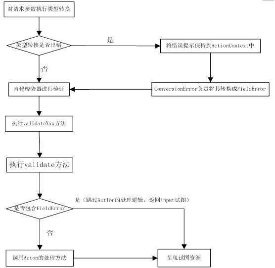

##Struts 2读书笔记-----使用Struts 2的输入校验

##
## 输入校验是所有的Web应用必须处理的问题。一个健壮的应用系统必须可以阻止一些非法的输入，防止这些非法的输入进入系统。这样才可以保证系统不受到影响。

##
## 输入校验可以分为客服端校验和服务器端校验。

##
##

##
## 服务器校验：

##
##服务器校验是整个应用阻止非法数据的最后的防线，主要是通过在应用中编程实现。

##
##Struts2提供了基于验证框架的输入校验，在这种校验方式下，所有的输入校验只需要编写简单的配置文件，Struts2的验证框架将会负责进行服务器校验。

##
##如下表单：

##
##假定在该应用中要求这三个请求参数必须满足如下要求：

##
##1、name和password只能是字母和数组，且长度必须在4到16之间。

##
##2、年龄必须是1到150之间的整数。

##
##

	1 <s:form action="regist" >
2         <s:textfield name="name" label="用户名"></s:textfield>
3         <s:textfield name="password" label="密码"></s:textfield>
4         <s:textfield name="age" label="年龄"></s:textfield>
5         <s:submit value="注册"></s:submit>
6     </s:form>


##
##

##
##

##
##下面是该请求的Action代码：

	 1 public class RegistAction extends ActionSupport {
 2     private String name;
 3     private String password;
 4     private int age;
 5 
 6     //省略上面三个属性的getter和setter方法
 7     public String execute() throws Exception {
 8         
 9         return SUCCESS;
10     	}


##
##上面的Action中包含的execute方法，之间返回success字符串，不需要做任何的处理，所以这个Action不具备任何输入校验的功能。

##
##但是通过为该Action指定一个校验文件后，既可以利用Struts2的输入校验功能对该Action进行校验。

##
##该校验文件应该遵守以下的命名规则：

##
##<Actionname>-validation.xml

##
##且该文件应该保持在和Action相同的路径下。

##
##校验文件如下：

##
##

	 1             <validators>
 2         <!-- 校验Action的name属性 -->
 3         <field name="name">
 4             <!-- 指定name属性必须满足的必填规则 -->
 5             <field-validator type="requiredstring">
 6                 <param name="trim">true</param>
 7                 <message>必须输入名字</message>
 8             </field-validator>
 9             <!-- 指定name属性必须匹配正则表达式 -->
10             <field-validator type="regex">
11                 <param name="expression"><![CDATA[(\w{4,25	})]]></param>
12                 <message>您输入的用户名只能是字母和数字，且长度必须在4到25之间</message>
13             </field-validator>
14         </field>
15         
16         <!-- 校验Action的password属性 -->
17         <field name="password">
18             <!-- 指定password属性必须满足必填的规则 -->
19             <field-validator type="requiredstring">
20                 <param name="trim">true</param>
21                 <message>必须输入密码</message>
22             </field-validator>
23             <!-- 指定password属性必须满足匹配指定的正则表达式 -->
24             <field-validator type="regex">
25                 <param name="expression"><![CDATA[(\w{4,25	})]]></param>
26                 <message>您输入的密码指定是字母和数字，且长度必须在4到25之间</message>
27             </field-validator>
28         </field>
29         
30         <!-- 校验Action的age属性 -->
31         <field name="age">
32             <field-validator type="int">
33                 <param name="min">1</param>
34                 <param name="max">150</param>
35                 <message>年龄必须在1到150之间</message>
36             </field-validator>
37         </field>
38     </validators>


##
##

##
##

##
##当输入校验失败后，Struts2是自动返回名为“input”的result,因此需要在struts.xml中配置名为"input"的Result.

##
##如下：

##
##

	1           <package name="myaction" extends="struts-default">
2         <action name="regist" class="com.app.action.RegistAction" >
3             <result name="input">/regist.jsp</result>
4             <result name="success">/welcome.jsp</result>
5         </action>
6     </package>


##
##

##
##

##
##指定了校验失败后应用会跳转到的物理资源页面后，这样我们就可以在该页面中添加<s:fielderror/>来输出错误提示

##
##当用户提交请求时，Struts2的校验框架会根据该文件对用户请求进行校验。如果用户的输入不满足校验规则，浏览器就会显示相应的错误提示：

##
## 

##
##

##
##客服端校验：

##
##对于客服端校验非常简单，只需改变如下两个地方：

##
##1、将输入页面的表单元素全部改为使用Struts2标签来生成表单。

##
## 2、为该<s:form..../>元素增加validate="true"属性

##
##对于客服端校验有三个地方需要注意：

##
##1、Struts2的<s:form.../>元素有一个theme属性，不要将该属性指定为simple。

##
##2、浏览者不能直接访问启用客服端校验的表单页面，这样会引起异常。我们可以把启用客服端校验的表单页面放到WEB-INF路径下，让浏览者访问所有资源之间都先经过它的核心Filter

##
##3、启动客服端校验的表单页面的action和namespace要分开写。

##
##例题和服务器校验差不多。这里就不展示了......

##
##

##
## 校验风格

##
##Struts2提供了两种方式来配置校验规则：

##
##一种是字段优先，称为字段校验器风格

##
##一种是校验器优先，称为非字段校验器风格

##
##

##
##字段校验器器配置

##
##对于字段校验器配置，这是一种以字段优先的配置方式

##
##使用字段校验器配置风格时，每个字段校验规则大致遵守如下形式：

	 1 <field name="被校验的字段">
 2     <field-validator type="校验器名">
 3     <!-- 此处需要为不同校验器指定数量不等的校验参数-->
 4     <param name="参数名">参数值</param>
 5     ......
 6     <!-- 校验失败后的提示信息，其中key指定国际化信息的key-->
 7     <message key="I18Nkey">校验失败后的提示信息</message>
 8     </field-validator>
 9     <!-- 如果该字段需要满足多个规则，下面可以配置多个校验器-->
10 </field>


##
##

##
##非字段校验器配置

##
##对于非字段校验器配置风格，是一种以校验器优先的配置方式。

##
##对于采用非字段校验器风格的校验规则文件，<validators.../>元素下有多个<validator.../>元素，每个<validator.../>元素都有如下格式：

	1 <validator type="校验器名">
2     <param name="fieldname">需要被校验的字段</param>
3     <!-- 此处需要为不同校验器指定数量不等的校验参数-->
4     <param name="参数名">参数值</param>
5     .....
6     <!-- 校验失败后的提示信息，其中key指定国际化信息的key-->
7     <message key="I18Nkey">校验失败后的提示信息</message>
8  </validator>


##
##由于使用非字段校验器的配置风格是，采用的是校验器优先的方式，故必须为<validator.../>配置一个fieldName参数，该参数的值就是被校验的Action的属性名

##
##

##
##短路校验器

##
##校验规则文件的<validator..../>元素和<field-validator.../>元素可以指定一个可选的额short-circuit属性，这个属性指定该校验器是否是短路校验器。该属性的默认值是false，即默认非短路校验器。

##
##对于校验错误的信息输出时，有时它会不友好的把所有的信息全部输出来。

##
##如：
你必须输入密码!!!

您输入的密码只能是字母和数字，且长度必须在4到16之间!!!


##
##这种提示信息是很不友好的。而且第二条信息完全是多余的。所以，对于浏览者而言，如果校验错误，只需要输出相对应的错误提示信息，而不是一次输出所有的校验错误提示信息。

##
##为了达到那种效果，我们可以使用短路校验器。

##
##采用短路校验器只需要在<validator.../>元素或<field-validator.../>元素中增加short-circuit="ture"即可。

##
##如下:

	 1         <validators>
 2         <!-- 校验Action的name属性 -->
 3         <field name="name">
 4             <!-- 指定name属性必须满足的必填规则 -->
 5             <field-validator type="requiredstring" short-circuit="true">
 6                 <param name="trim">true</param>
 7                 <message>必须输入名字</message>
 8             </field-validator>
 9             <!-- 指定name属性必须匹配正则表达式 -->
10             <field-validator type="regex">
11                 <param name="expression"><![CDATA[(\w{4,25	})]]></param>
12                 <message>您输入的用户名只能是字母和数字，且长度必须在4到25之间</message>
13             </field-validator>
14         </field>
15     </validators>


##
##

##
##

##
##校验顺序和短路

##
##校验器增加了短路的特性后，校验器的执行顺序就非常重要了。因为前面的执行的校验器可能会阻止后面的校验器的执行。

##
##校验器的执行顺序如下：

##
## 1、所有非字段风格的校验器优先于字段风格的校验器

##
## 2、所有非字段风格的校验器中，排在前面的优先执行

##
## 3、所有字段风格的校验器中，排在前面的会优先执行

##
##校验器短路的原则是：

##
## 1、所有非字段校验器是最先执行的。如果某个非字段校验器校验失败，则该字段上所有字段校验器都不会获得校验的机会。

##
## 2、非字段校验器的校验失败，不会阻止其他非字段校验的执行

##
## 3、如果一个字段校验器校验失败后，则该字段下且排在该校验失败的校验器之后的其他字段校验器不会获得校验的机会。

##
## 4、字段校验器都不会阻止非字段校验器的执行。

##
##

##
##内建校验器

##
##Struts2提供了大量的内建校验器，这些内建校验器可以满足大部分应用的校验需求。

##
##在xwork-core-2.2.1.jar文件中的com\opensymphony\xwork2\validator\validators路径下的default.xml文件，该文件就是Struts2默认的校验器注册文件。

##
##

	 1 <validators>
 2     <validator name="required" class="com.opensymphony.xwork2.validator.validators.RequiredFieldValidator"/>
 3     <validator name="requiredstring" class="com.opensymphony.xwork2.validator.validators.RequiredStringValidator"/>
 4     <validator name="int" class="com.opensymphony.xwork2.validator.validators.IntRangeFieldValidator"/>
 5     <validator name="long" class="com.opensymphony.xwork2.validator.validators.LongRangeFieldValidator"/>
 6     <validator name="short" class="com.opensymphony.xwork2.validator.validators.ShortRangeFieldValidator"/>
 7     <validator name="double" class="com.opensymphony.xwork2.validator.validators.DoubleRangeFieldValidator"/>
 8     <validator name="date" class="com.opensymphony.xwork2.validator.validators.DateRangeFieldValidator"/>
 9     <validator name="expression" class="com.opensymphony.xwork2.validator.validators.ExpressionValidator"/>
10     <validator name="fieldexpression" class="com.opensymphony.xwork2.validator.validators.FieldExpressionValidator"/>
11     <validator name="email" class="com.opensymphony.xwork2.validator.validators.EmailValidator"/>
12     <validator name="url" class="com.opensymphony.xwork2.validator.validators.URLValidator"/>
13     <validator name="visitor" class="com.opensymphony.xwork2.validator.validators.VisitorFieldValidator"/>
14     <validator name="conversion" class="com.opensymphony.xwork2.validator.validators.ConversionErrorFieldValidator"/>
15     <validator name="stringlength" class="com.opensymphony.xwork2.validator.validators.StringLengthFieldValidator"/>
16     <validator name="regex" class="com.opensymphony.xwork2.validator.validators.RegexFieldValidator"/>
17     <validator name="conditionalvisitor" class="com.opensymphony.xwork2.validator.validators.ConditionalVisitorFieldValidator"/>
18 </validators>


##
##

##
##

##
##通过上面可以发现，注册一个校验器只需要通过一个<validator.../>元素即可注册一个校验器，每一个<validator.../>元素的name属性指定该校验器的名字，class属性指定该校验器的实现类。

##
## 常用的内建校验器

##
##
 

##
##

##
##

##
##手动完成输入校验

##
## 对于一些特殊的校验要求，对于Struts2校验器可以无法满足，这时可能需要在Struts2中进行手动校验。由于Struts2提供了良好的可扩展性，所有允许通过手动方式完成自定义校验。

##
## 1、重写validte()方法

##
## 我们可以通过重写ActionSupport类的validate()方法来进行校验

##
## 下面是重写validate()方法的RegistAction代码：

##
##

	 1 public class RegistAction extends ActionSupport {
 2     private String name;
 3     private String pass;
 4     private int age;
 5  //省略三个属性的getter和setter方法    
 6     public void validate(){
 7         System.out.println("进入validate 方法进行校验"+name);
 8         
 9         if(!name.contains("ssy")){
10             addFieldError("user", "您的用户名必须包括ssy!!!");
11           	}
12     	}
13 	}


##
##

##
##

##
## 在validate方法中，一旦发现校验失败后，就会把校验失败提示通过addFieldError方法添加进系统的FieldError中。如果Struts2发现系统的FieldError不为空，将会自动跳转到input逻辑试图，因此必须在struts.xml文件中为该Action的input逻辑试图指定试图资源。

##
## 当然为了显示错误信息，应该在相应的jsp页面增加如下代码：

	1 <s:fielderror/>


##
##

##
##

##
##2、重写validateXxx()方法

##
## 如果我们的输入校验只想校验某个处理逻辑，那么重写validate方法显然不够，因为validate方法无法准确知道需要校验哪个处理方法，实际上，如果我们重写validate方法，则该方法就会校验所有的处理逻辑。

##
## 为了实现校验指定处理逻辑，Struts2的Action提供了一个validateXxx方法，其中xxx既是Action对应的处理逻辑方法。

##
## 如下：

##
## 为RegistAction增减一个regist方法，并且增加一个validateRegist()方法；

##
##

	 1 public class RegistAction extends ActionSupport {
 2     private String name;
 3     private String pass;
 4     private int age;
 5 
 6     //省略三个属性的getter和setter方法
 7     public void validate(){
 8         System.out.println("进入validate 方法进行校验"+name);
 9         
10         if(!name.contains("ssy")){
11             addFieldError("user", "您的用户名必须包括ssy!!!");
12         	}
13     	}
14     
15     public String regist(){
16         return SUCCESS;
17     	}
18     
19     public void validateRegist(){
20         System.out.println("进入validateRegist方法进行校验"+name);
21         System.out.println("1111111111111");
22         if(!name.contains("tmt")){
23             addFieldError("user", "您的用户名必须包含tmt");
24         	}
25     	}
26 	}


##
##

##
##

##
## 上面的代码中指定RegistAction的regist方法处理用户请求。如果用户再次向regist提交请求，该请求将交给RegistAction的regist处理逻辑处理，那么不仅validate()方法会进行输入校验，validateRegist()方法也会执行输入校验。

##
## 通过上面的页面显示：我们知道，如果该Action内除了validate方法外，还有该方法对应的validateXxx方法，则该方法会在validate方法之前被调用。

##
##

##
## 总结：

##
## Struts2的输入校验需要经过以下几个步骤：

##
## 1、类型转换器负责对字符串的请求参数执行类型转换，并将这些值设置为Action的属性值。

##
## 2、在执行类型转换过程中可能出现异常，如果出现异常，将异常信息保存到ActionContext中。conversionError拦截器负责将其封装到FieldError里，然后执行第三步；如果转换过程中没有异常信息，则直接进入第三步。

##
## 3、使用Struts2应用配置的校验器进行输入校验

##
## 4、通过反射调用validateXxx()方法，其中Xxx是即将处理用户请求的处理逻辑所对应的方法。

##
## 5、调用Action类里的validate方法。

##
## 6、如果经过上面5步都没有出现FieldError，将调用Action里处理用户请求的处理方法；如果出现了FieldError，系统将会转入input逻辑视图所指定的视图资源。

##
## 流程如下：
 

##
##

##
##

##
##