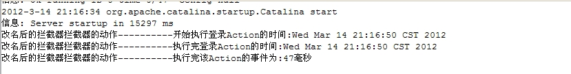
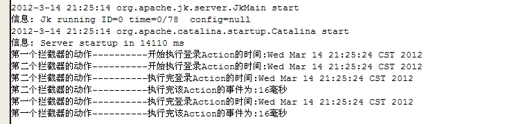

##Struts 2读书笔记-----拦截器之拦截器的使用

##
## 一旦定义了拦截器和拦截器栈后，就可以使用这个拦截器或拦截器栈来拦截器Action了。拦截器的拦截行为将会在Action的execute方法执行之前执行。

##
##一、实现拦截器类

##
## 虽然Struts2框架提供了许多拦截器，这些拦截器也实现了Struts2的大部分功能。但是用户仍然可以开发自己的拦截器。

##
## 实现自己的拦截器，应该实现com.opensymphoney.xwork2.interceptor.Interceptor接口

##
## 该接口包含三个方法：init()、destroy()、interceptor(ActionInvocationinvocation)；

##
## init()：在该拦截器被实例化之后，在该拦截器执行拦截之前，系统将会回调该方法。该方法主要用于初始化资源。对于每一个拦截器而言，其init()方法只会执行一次。

##
## destroy()：该方法在拦截器实例被销毁之前被系统回调。该方法用于销毁init()方法里打开的资源

##
## interceptor(ActionInvocationinvocation)：该方法是用户需要实现的拦截动作。该方法会返回一个字符串，系统将会跳转到该逻辑视图对应的实际视图资源，不会调用被拦截的Action。

##
## Struts2还提供了一个AbstractInterceptor类，该类提供了一个init和destroy方法的空实现，如果我们实现的拦截器不需要打开资源，则可以无须实现这两个方法。由此可见，继承AbstractInterceptor类来实现自定义拦截器会更加简单。

##
## 下面实现一个简单的拦截器：

	 1 public class SimpleInterceptor extends AbstractInterceptor {
 2     // 简单拦截器的名字
 3     private String name;
 4 
 5     public void setName(String name) {
 6         this.name = name;
 7     	}
 8 
 9     @Override
10     public String intercept(ActionInvocation invocation) throws Exception {
11         //取得被拦截的Action实例
12         LoginAction action = (LoginAction) invocation.getAction();
13         //打印执行开始的实现
14         System.out.println(name+"拦截器的动作----------开始执行登录Action的时间:"+new Date());
15         //取得开始执行Action的时间
16         long start = System.currentTimeMillis();
17         //执行该拦截器的后一个拦截器
18         //如果该拦截器没有其他拦截器，则直接执行Action的execute方法
19         String result = invocation.invoke();
20         //打印执行结束的时间
21         System.out.println(name+"拦截器的动作----------执行完登录Action的时间:"+new Date());
22         long end = System.currentTimeMillis();
23         System.out.println(name+"拦截器的动作----------执行完该Action的事件为:"+(end-start)+"毫秒");
24         
25         return result;
26     	}
27 	}


##
##当我们实现interceptor方法时，可以获得ActionInvocation参数，这个参数可以获得被拦截的Action实例，一旦取得了Action实例，几乎获得了全部的控制权。

##
##

##
##二、使用拦截器

##
##实现了拦截器类后，就是配置拦截器，使用拦截器。使用拦截器需要以下两个步骤：

##
## 1、通过<interceptor.../>元素来定义拦截器。

##
## 2、通过<interceptor-ref.../>元素来使用拦截器。

##
##拦截器的配置如下:

##
##

	 1 <package name="mystruts" extends="struts-default">
 2         <!-- 应用所需使用的拦截器都在改元素下配置 -->
 3         <interceptors>
 4             <!-- 配置没有simple拦截器 -->
 5             <interceptor name="mysimple" class="com.app.interceptor.SimpleInterceptor">
 6                 <!-- 为该拦截器指定参数值 -->
 7                 <param name="name">简单拦截器</param>
 8             </interceptor>
 9         </interceptors>
10         
11         <action name="login" class="com.app.action.LoginAction">
12             <result name="error">/error.jsp</result>
13             <result name="success">/welcome.jsp</result>
14             <!-- 配置系统的默认拦截器 -->
15             <interceptor-ref name="defaultStack"></interceptor-ref>
16             <!-- 应用自定义的mysimple拦截器 -->
17             <interceptor-ref name="mysimple">
18                 <param name="name">改名后的拦截器</param>
19             </interceptor-ref>
20         </action>
21     </package>


##
##

##
##

##
##这个拦截器只是一个简单地在控制台打印一些文本，获取被拦截方法的执行时间信息。

##
##当浏览者在浏览器中对该Action发送请求时，该拦截器将会拦截该Action的execute方法，将会在控制台看到如下结果：

##
## 

##
##三、拦截方法的拦截器

##
##在默认情况下，如果我们为某个Action定义了拦截器，则这个拦截器会拦截该Action内所有方法，但是有时我们不需要拦截所有方法，只需要拦截指定的方法。此时需要使用Struts2拦截器的方法过滤特性。

##
##为了实现方法的过滤的特性，Struts2提供了一个MethodFilterInterceptor类，该类是AbstractInterceptor类的子类如果用户需要自己实现的拦截器支持方法过滤特性，则应该继承MethodFilterInterceptor。并且需要重写doIntercept(ActionInvocationinvocation)方法。

##
##实际上实现方法过滤的拦截器与实现普通拦截器并没没什么区别。所以这里就不展示代码了。

##
##在MethodFilterInterceptor类中，增加了如下两个方法：

##
##1、publicvoidsetExcludeMethods(StringexcludeMethods)：排除需要过滤的方法，所有在excludeMethods字符串中列出的方法都不会被拦截

##
##2、publicvoidsetIncludeMethods(StringincludeMethods)：设置需要过滤的方法，所有在includeMethods字符串中列出的方法都会被拦截。

##
##注：如果一个方法同时在excludeMethods和includeMethods中列出，则该方法会被拦截。

##
##通过上面两个方法，我们可以在配置文件中指定需要被拦截，或者不被拦截的方法。

##
##如下：

##
##

	1                            <interceptor-ref name="myfilter">
2                 <!-- 指定execute方法不需要被拦截 -->
3                 <param name="excludeMethods">execute</param>
4                 <!-- 指定login方法需要被拦截 -->
5                 <param name="includeMethods">login</param>
6             </interceptor-ref>


##
##

##
##

##
##如果需要同时指定多个方法不需要被拦截器拦截，则多个方法之间以英文逗号隔开

##
##如下:

##
##

	1 <interceptor-ref name="myfilter">
2      <!-- 指定execute方法和login方法不需要被拦截 -->
3      <param name="excludeMethods">execute,login</param>
4 </interceptor-ref>


##
##

##
##

##
##如果excludeMethods参数和includeMethods参数同时知道指定了一个方法名，则该方法会被拦截器拦截。

##
##如下:

##
##

	1                             <interceptor-ref name="myfilter">
2                 <!-- 指定execute方法和login方法不需要被拦击 -->
3                 <param name="excludeMethods">execute,login</param>
4                 <!-- 指定login方法需要被拦截 -->
5                 <param name="includeMethods">login</param>
6             </interceptor-ref>


##
##

##
##

##
##上面的配置中通过excludeMethods参数指定execute和login方法不需要被拦截，includeMethods参数指定login方法需要被拦截，则拦截器会拦截login方法。

##
##

##
##四、拦截器的执行顺序

##
##随着系统中配置拦截器的顺序不同，系统执行拦截器的顺序也会不同。通常认为：先配置的拦截器，会先获得执行机会，但是有时候也会存在一些特殊的情况。

##
##有如下的配置文件：

##
##

	 1 <package name="mystruts" extends="struts-default">
 2         <!-- 应用所需使用的拦截器都在改元素下配置 -->
 3         <interceptors>
 4             <!-- 配置没有simple拦截器 -->
 5             <interceptor name="mysimple" class="com.app.interceptor.SimpleInterceptor">
 6                 <!-- 为该拦截器指定参数值 -->
 7                 <param name="name">简单拦截器</param>
 8             </interceptor>
 9         </interceptors>
10         
11         <action name="login" class="com.app.action.LoginAction">
12             <result name="error">/error.jsp</result>
13             <result name="success">/welcome.jsp</result>
14             <!-- 配置系统的默认拦截器 -->
15             <interceptor-ref name="defaultStack"></interceptor-ref>
16             <!-- 应用自定义的mysimple拦截器 -->
17             <interceptor-ref name="mysimple">
18                 <param name="name">第一个</param>
19             </interceptor-ref>
20             <interceptor-ref name="mysimple">
21                 <param name="name">第二个</param>
22             </interceptor-ref>
23         </action>
24     </package>


##
##

##
##

##
##通过上面的配置文件中我们可以看到，对于上面的名为login的Action，有两次使用了mysimple拦截器拦截该Action。两个拦截器名分别为：第一个、第二个。

##
##当用户再浏览器中向该Action发送请求时，就会看到如下效果：

##
## 从上面的效果中可以看到，对于在execute方法之前的动作，第一个拦截器会先起作用，也就是说配置在前面的拦截器会先起作用；对于在execute方法之后的动作，则第二个拦截器先起作用，也就是说，配置在后的拦截器会先起作用。

##
##所有可以得到如下结论：在Action的控制方法执行之前，位于拦截器链前面的拦截器会先起作用。在Action控制方法执行之后，位于拦截器链后面的拦截器会先起作用