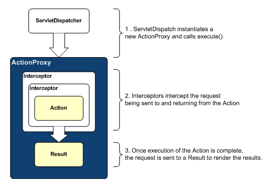

##Struts 2读书笔记-----拦截器之拦截器的配置

##
## 拦截器体系是Struts2框架的重要组成部分，我们可以把Struts2理解成一个空容器，而大量的内建拦截器完成了该框架的大部分操作。

##
## Struts2拦截器是可插拔式的设计：如果我们需要使用某个拦截器，只需要在配置文件中应用该拦截器即可；如果不需要使用该拦截器，只需要在配置文件中取消应用拦截器。但是不管是否应用某个拦截器，对于Struts2框架都不会有任何影响。
 

##
## 拦截器与Action的关系

##
##以下主要讲一些关于拦截器的配置

##
##1、配置拦截器

##
##在struts.xml文件中定义拦截器只需要为拦截器类指定一个拦截器名，就可以完成拦截器的定义。定义拦截器使用<interceptor.../>元素，如下：

##
##

	1 <!-- 通过指定拦截器名和拦截器实现类来定义拦截器-->
2  <interceptor name="拦截器名" class="拦截器实现类" />      如果还需要在配置拦截器时传入拦截器参数。可以在<interceptor.../>元素中使用<param.../>子元素。如下：
3 
4   <interceptor name="拦截器名" class="拦截器实现类">
5     <param name="参数名">参数值</param>
6      ........
7    </interceptor>


##
##

##
##

##
##

##
##2、配置拦截器栈

##
##除了配置拦截器，还可以把多个拦截器连在一起组成拦截器栈。定义拦截器栈使用<interceptor-stack.../>元素，拦截器栈是由多个拦截器组成。因此需要在<interceptor-stack.../>元素中使用<interceptor-ref.../>元素来定义多个拦截器引用。

##
## 配置拦截器栈如下：

	1     <interceptor-stack name="拦截器栈名">
2     <interceptor-ref name="拦截器名" />
3     <interceptor-ref name="拦截器名" />
4     .........
5     </interceptor-stack>


##
##

##
##

##
##从上面的结构中可以看出，一个拦截器栈是由多个拦截器组成的。但是从程序功能上看，拦截器和拦截器栈是统一的，它们包含的方法都会在Action的execute方法执行之前执行。

##
## 由于拦截器栈和拦截器的功能几乎完全相同，所以我们可以将拦截器栈当成一个更大的拦截器。

##
## 拦截器栈中也可以包含拦截器栈。

##
## 配置如下：

##
##

	    <interceptor-stack name="拦截器栈一">
    <interceptor-ref name="拦截器一" />
    <interceptor-ref name="拦截器二" />
    .......
    </interceptor-stack>
    <interceptor-stack name="拦截器栈二">
    <interceptor-ref name="拦截器三" />
    <interceptor-ref name="拦截器栈一" />
    .......
    </interceptor-stack>


##
##

##
##

##
##在上面的配置片段中，第二个拦截器栈包含了第一个拦截器栈，其实质的情况就是拦截器栈二由三个拦截器组成：拦截器一、拦截器二、拦截器三。

##
##系统为拦截器指定参数有如下两个时机：

##
##1、定义拦截器时指定参数值：这种参数值将作为拦截器参数的默认参数值。

##
## 2、使用拦截器时指定参数值：在配置Action时为拦截器参数指定值。

##
##下面是在配置拦截器栈时为拦截器动态指定参数值：

##
##

	    <interceoptor-stack name="拦截器栈一">
          <interceptor-ref name="拦截器一" />
          <!-- 为拦截器分别定义了两个参数值-->
             <param name="参数一">参数值</param>
        <param name="参数二">参数值</param>
     </interceptor>
    <interceptor-ref name="拦截器二" />
     ..................
     </interceptor-stack>
    <interceptor-stack name="拦截器栈二">
        <interceptor-ref name="拦截器三"  />
        <interceptor-ref name="拦截器栈一" />
        ...............
    </interceptor-stack>


##
##

##
##

##
##注：如果在两个时机为同一个参数指定不同的参数值，则使用拦截器时指定的参数值将会覆盖默认的参数值。

##
##3、配置默认拦截器

##
##当配置一个包时，可以为其指定默认拦截器。一旦为某个包指定了默认拦截器，如果该包中的Action没有显示指定拦截器，则默认的拦截器将会起到作用。如果我们为该包中的Action显示应用了某个拦截器，则默认的拦截器不会起作用。

##
##配置默认拦截器使用<default-interceptor-ref.../>元素，该元素作为<package.../>元素的子元素使用，为该包下的所有Action配置默认的拦截器。而且每个<package../>元素中只能包含一个<default-interceptor-ref.../>子元素，即没一个包只能指定一个默认拦截器。如果我们需要多个拦截器共同作为默认拦截器，则应该将这些拦截器定义成一个拦截器栈，然后把这个拦截器栈配置成默认拦截器即可。

##
##默认拦截器配置如下：


##
##

	 1  <package name="包名">
 2     <interceptors>
 3     <!-- 定义拦截器-->
 4     <interceptor .../>
 5     <!-- 定义拦截器栈-->
 6     <interceptor-stack .../>
 7     </interceptors>
 8   <!-- 配置该包下的默认拦截器-->
 9 <default-interceptor-ref name="拦截器名或者拦截器栈名" />
10 <!-- 配置多个Action-->
11 <action ../>
12 .........
13 </package>


##
##

##
##

##
##配置默认拦截器是一种拦截器的方式——避免在每个Action中单独配置拦截器，通过在该包下配置拦截器，可以实现为该包下所以Action同时配置相同的拦截器。

##
##经过上面的介绍。可以看出与拦截器相关的配置元素如下：

##
##<interceptor.../>元素:该元素用于定义拦截器，所有的拦截器和拦截器栈都在该元素下定义。该元素包含<interceptor.../>和<interceptor-stack.../>子元素，分别用于定义拦截器和拦截器栈。

##
##<interceptor.../>元素:该元素用于定义单个的拦截器，定义拦截器是只需要指定两个属性：name和class，分别指定拦截器的名字和实现类。

##
##<interceptor-stack.../>元素：该元素用于定义拦截器栈，该元素中包含多个<interceptor-ref.../>用于将多个拦截器或拦截器栈组合成一个新的拦截器栈。

##
##<interceptor-ref.../>元素：该元素引用一个拦截器或拦截器栈，表明应用指定拦截器。该元素只需要指定一个name属性，该属性值为一个已经定义的拦截器或拦截器栈。

##
##<param.../>元素：该元素用于为拦截器指定参数。

##
##<default-interceptor-red.../>该元素为指定包配置默认拦截器。
