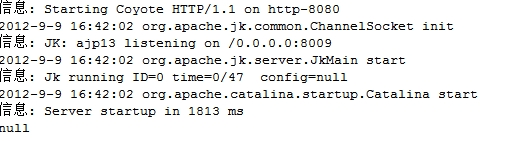
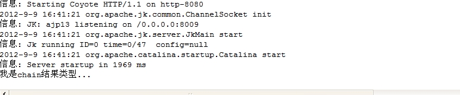

##Struts2从一个action转到另一个action的两种方法 .

##
## 在Struts2中，Action处理完用户请求后，将会返回一个字符串对象，这个字符串对象就是一个逻辑视图名。Struts2通过配置逻辑视图名和物理视图之间的映射关系，一旦系统收到Action返回的某个逻辑视图名，系统就会把相应的物理视图呈现给浏览者。

##
## 

##
## Struts2的结果类型决定了Action处理结束后，下一步将会调用那种视图资源来呈现处理结果。默认是dispatcher，该结果类型指定使用JSP作为视图资源。但是我们会有这样的要求：要求从一个Action转到另一个Action中去。

##
##

##
##从一个Action直接跳到另一个Action中，Struts提供了两种结果类型可以实现：chain、redirect。

##
## 

##
## 我们从Servlet中学到重定向是不能保留参数的，也就是说重定向了，request对象就会无效了。同样redirect就像Servlet中的重定向，它也不能够保留request对象保存的参数。但是chain可以。所以两种的区别就在于chain能够保留request对象，而redirect不可以。

##
##

##
## struts.xml的配置

	 1 <package name="mystruts1" extends="struts-default" namespace="/mystruts1">
 2         <!-- 第一个Action -->
 3         <action name="test_*" class="com.action.TestAction" method="{1	}">
 4             <result name="text_chain" type="chain">result_resultChain</result>
 5             <result name="text_redirect" type="redirect">result_resultRedirect</result>
 6         </action>
 7         
 8         <!-- 第二个Action -->
 9         <action name="result_*"  class="com.action.ResultAction" method="{1	}"></action>
10     </package>


##
##Action1：

	 1 public class TestAction {
 2     public String testChain(){
 3         HttpServletRequest request = (HttpServletRequest) ActionContext.getContext().get(ServletActionContext.HTTP_REQUEST);
 4         request.setAttribute("param", "我是chain结果类型...");
 5         return "text_chain";
 6     	}
 7     
 8     public String testRedirect(){
 9         HttpServletRequest request = (HttpServletRequest) ActionContext.getContext().get(ServletActionContext.HTTP_REQUEST);
10         request.setAttribute("param", "我是redirect结果类型...");
11         return "text_redirect";
12     	}
13 	}


##
##Action2：

	 1 public class ResultAction {
 2 
 3     public String resultChain(){
 4         HttpServletRequest request = (HttpServletRequest) ActionContext.getContext().get(ServletActionContext.HTTP_REQUEST);
 5         System.out.println(request.getAttribute("param"));
 6         return null;
 7     	}
 8     
 9     
10     public String resultRedirect(){
11         HttpServletRequest request = (HttpServletRequest) ActionContext.getContext().get(ServletActionContext.HTTP_REQUEST);
12         System.out.println(request.getAttribute("param"));
13         return null;
14     	}
15 	}


##
##部署项目后，当在浏览器中输入：http://localhost:8080/struts2_01/mystruts1/result_resultRedirect.action。结果如下

##
## 

##
##得到为null。由此可见Redirect并不能获取request对象保存的参数。

##
##

##
##当输入http://localhost:8080/struts2_01/mystruts1/result_testChain.action，得到如下结果：

##
## 

##
##得到了正确的结果，所有chain可以获得Request对象保存的参数。

##
##所以：

##
##1. 需要保存前一个action的属性信息时使用，保存住action1的request对象:

	1 <result type= "chain " name="a2">action2</result> 


##
##2. 不保存前一个action的参数可以用这种方法: 

	1       <result  type= "redirectAction "> action2</result> 


##
##