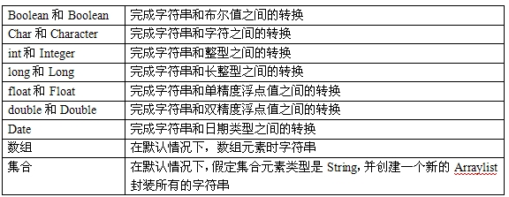

所有的MVC框架，都需要负责解析HTTP请求参数，并将请求参数传给控制器组件。由于HTTP请求参数都是字符串类型，但是java是强类型的语言。，因此MVC框架必须将这些字符串参数转换成相应的数据类型。

Struts 2提供了非常强大的类型转换机制。Struts
2的类型转换可以基于ONGL表达式，只要把HTTP参数命名为合法的ONGL表达式，就可以充分利用Struts 2的类型转换机制。

1、Struts 2内建的类型转换器

Struts 2可以完成大多数常用的类型转换。这些常用的类型转换时通过Struts 2内建的类型转换器完成的。如下：

2、基于ONGL的类型转换

借助于ONGL，Struts 2允许以另一种简单方式将请求参数转换成复合类型。

    
    
     1 public class LoginAction implements Action {
     2 
     3     private UserBean user;
     4     private String tip;
     5 
     6     public UserBean getUser() {
     7         return user;
     8     }
     9 
    10     public void setUser(UserBean user) {
    11         this.user = user;
    12     }
    13 
    14     public String getTip() {
    15         return tip;
    16     }
    17 
    18     public void setTip(String tip) {
    19         this.tip = tip;
    20     }
    21 
    22     //处理请求方法
    23     public String execute() throws Exception {
    24         if(getUser().getName().equals("chenssy")&&getUser().getPassword().equals("chentmt")){
    25             setTip("转换成功");
    26             return SUCCESS;
    27         }
    28         else{
    29             setTip("转换失败");
    30             return ERROR;
    31         }
    32     }
    33 
    34 }

Struts 2
接收到HTTP请求参数后，需要将这些参数封装成UserBean对象。但是我们无需作任何的处理，只需要在定义表单域是使用ONGL表达式来定义表单域的name属性。

    
    
    1  <s:form action="Login">
    2         <s:textfield name="user.name" label="用户名"></s:textfield>
    3         <s:textfield name="user.password" label="密码"></s:textfield>
    4         <s:submit value="转换" ></s:submit>
    5         <s:submit value="重置" ></s:submit>
    6    </s:form>

对于请求参数名是采用user.name和user.password---这就是ONGL表达式的形式。Struts
2会相应的参数赋值给Action实例的user的相应的属性。

通过上面的方式，Struts 2可以将普通请求参数转换成复合型类型对象，但是一般要注意下面几点。

1、因为Struts 2将通过反射来创建一个复合类的实例，因此系统必须为该复合类提供无参数的构造器。

2、如果希望使用user.name请求参数的形式为Action实例的user属性的name属性赋值，则必须为user属性对象的复合类提供setName()方法。

