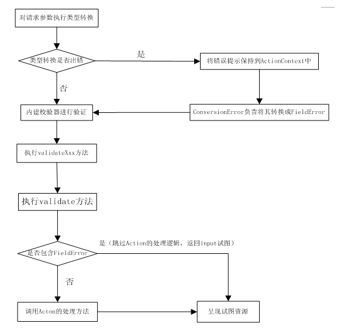

历时三个星期的时间终于把Struts 2
给看完了。中间断断续续的学习，在这个过程中学到了很多东西，也真正的明白了时间是挤出来的。大三了课程越来越来多了，有自己学校的课程要学习，又是各种各样的实验，时间的真的是太紧了。这个时间，利用一切的空余时间来学习编程。这个过程的苦和乐真的只有经历了才明白...

不多说了，下面是对这三个星期学习Struts 2的知识总结：

一、Struts 2应用的开发步骤

1、首先要先下载Struts 2的jar包，将必须的类库放入到Web应用下的WEB-INF/lib路径下。

2、配置web应用的web.xml配置文件，配置Struts 2的核心Filter

3、定义处理用户请求的Action类

4、配置Action

5、配置处理结果和物理试图资源之间的对应关系

二、Struts 2的配置

1、Action访问Servlet API

Struts 2提供了一个ActionContext，Struts 2的action可以通过该类来访问Servlet API

该类包含了以下几个常用的方法：getApplication、getContext、getParameters、getSession、setApplication、setSession通过上面几个方法我们获得servlet的对象，并可以对其进行相应的操作。

当然Action还可以直接访问Servlet API。不过需要实现相应的接口：

ServletContextAware、ServletRequestAware、ServletResponseAware，实现上面的接口仅仅只需要实现相应的setXxxxxXxxxx方法就可以了。

2、配置Action

package

Struts 2是使用包来组织管理Action和拦截器等的，每个包可以配置多个Action、多个拦截器、多个拦截器引用，我们可以将包看做是他们的一个集合。

配置包<package.../>元素的时候必须指定name属性。该属性是引用该包的唯一标识。

<package..../>元素有如下几个属性：name、extends、namespace、abstract。

配置如下：

    
    
    	<package name="mypackage" extends="struts-default">
    	.....................
    	</package>

Action

定义Action的时候，像配置<package.../>元素一样，也要指定一个name属性，该name属性的名字就是该Action的名字。但是Action还要指定一个class属性。该属性指该Action的实现类。

注：class属性并不是必须的，如果我们不为Action指定class属性，系统会默认使用系统的ActionSupport类。

一个简单的Action的配置如下：

    
    
    	<package name="lee">
    		<action name="login" class="com.app.action.LoginAction"></action>	
    	</package>

Action只是一个逻辑控制器。它并不会直接作用于浏览器，也就是说他不会直接对浏览者生成任何响应。所以，Action处理完用户请求后，Action需要将指定的视图资源呈现个用户。故，在配置Action的时候应该配置逻辑视图和物理视图资源之间的对应关系。

配置action的时候，一般还要指定method属性。该属性指定实现用户请求的方法。如果不指定method属性，系统默认使用execut方法来处理用户的请求。

对于method属性，我们还可以使用通配符。

如下：

    
    
    <action name="*Action" class="com.app.action.LoginAction" method="{1}" />

result

每个<result.../>元素定义逻辑试图和物理试图之间的一次映射。

<result.../>元素应该定义一个name属性。该属性指定所配置的逻辑视图名，也就是相应的action返回的逻辑视图名。当然也可以不需要指定name属性，这时系统会默认使用success。

<result.../>元素还存在一个type属性，该属性指定结果类型。Struts
2支持的结果类型有：Chain、dispatcher、freemarker、httpheader、redirect、stream、velocity、xslt、plainText。当不指定type属性时，系统默认dispatcher。

<result.../>元素的配置片段如下：

    
    
    	<action name="login">
    			<!-- 配置默认结果，省略type属性，默认dispatcher -->
    			<result>/welcome.jsp</result>
    	</action>

上面的配置比较简单，但是这是Struts 2最基本配置。

三、Struts 2的异常处理

我们在实现execute方法的时候，该方法是将异常直接抛出，交给Struts 2框架来处理。

这就意味着，我们在处理用户请求的时候，可以不需要对异常进行处理，直接抛出交给Strust 2处理，Struts
2接收到Action抛出的异常之后，将会根据struts.xml文件配置的异常映射关系，转入到指定的视图资源。

Strut 2的异常处理机制是通过在struts.xml文件中配置<exception-
mapping.../>元素完成的。配置该元素时，需要指定如下两个属性：exception、result。

如下：

    
    
    	<!-- 定义全局异常映射 -->
    		<global-exception-mappings>
    			<!-- 当Action中遇到SQLException异常时，系统将会转入到name问sql的结果中 -->
    			<exception-mapping result="sql" exception="java.sql.SQLException"></exception-mapping>
    			<!-- 当Action中遇到Exception异常时，系统将会转入到name为root的结果中 -->
    			<exception-mapping result="root" exception="java.lang.Exception"></exception-mapping>
    		</global-exception-mappings>

对于异常的输出，我们采用如下方式：

    
    
    	<s:property value="exception"/>

  

四、使用Struts 2国际化

Strut 2的国际化是建立在java国际化的基础上的。对于Struts
2的国际化我们一般采用加载全局的国际化资源文件，加载全局的国际化资源文件的方式是通过配置常量来实现的。在文件中配置我们只需要配置struts.custom.i18n.resoutces常量即可。

配置struts.custom.i18n.resoutces常量时，该常量的值为全局国际化资源文件的baseName。一旦指定了全局的国际化资源文件，既可以实现程序的国际化。

在struts.xml文件中我们需要配置如下代码：

    
    
    	<!--指定Struts 2国际化资源文件的baseName为messageResource -->
    	<constant name="struts.custom.i18n.resoutces" value="messageResource" />

对于国际化资源文件，我们一般采用键值对的properties文件。为了在页面中输出国际化资源，我们可以使用Struts
2的<s:text.../>标签，该标签的name属性，指定了国际化资源文件中的key。

五、Strut 2的类型转换

Struts 2的类型转换可以基于ONGL表达式。只要我们把Http参数的命名为合法的ONGL表达式，就可以充分的利用Struts 2的类型转换机制。

对于Struts 2内建的类型转换，我们无需理会，不需要做任何特殊的处理。

自定义类型转换

对于用户自定义类型转换器，用户必须要实现TypeConverter接口。实现自定义类型转换器需要重写该方法的convertValue方法。

该方法是双向的。可以将字符串转换成复合类型，也可以将复合类型转换为字符串。该方法主要是通过toType参数来判断转换的方向。

其实基于Struts 2的自定义类型转换器，我们可以有更简单的方法实现。Struts
2提供了一个StrutsTypeString抽象类。该抽象类提供了两个方法：convertFromString和convertToString。通过实现这个两个方法就可以实现自定义类型转换了。

如下：

    
    
    	public class UserConverter extends StrutsTypeConverter{
    	       //实现将字符串类型转换为复合类型的方法
    	        public object converterFromString(Map context,String[] values,Class toClass){
    	             ..............................
    	       }
    	
    	      //实现将复合类型转换为字符串类型的方法
    	        public String converterToString(Map context,Object o){
    	             ....................
    	       }
    	}

完成了自定义类型转换器后，还要将类型转换器注册到Web应用中去：

局部类型转换器：

<proName>=<ConverterClass>

<proName>:需要进行类型转换的属性

<ConverterClass>：类型转换器的实现类

如下：

    
    
    	user = com.app.converter.UserConverter

全局类型转换器：

<propType>=<ConvertClass>

<propType>：需要进行类型转换的类型

<ConvertClass>需要进行类型转换的实现类

如下：

    
    
    	com.app.domain.User = com.app.converter.UserConverter

  

六、使用Struts 2的输入校验

Struts 2提供了基于验证框架的输入校验，在这种校验方式下，所有的输入校验只需要编写简单的配置文件，Struts
2的验证框架将会负责进行服务器校验和客服端校验。

1、编写校验规则文件

校验规则文件的根元素是<validator.../>元素，<validator.../>元素可以包含多个<field../>或<validator.../>，他们都用于配置校验规则。

配置片段：

    
    
    	<validators>
    		<!-- 校验Action的name属性 -->
    		<field name="name">
    			<!-- 指定name属性必须满足必填规则 -->
    			<field-validator type="requiredstring">
    				<param name="trim">true</param>
    				<message>必须填入名字</message>
    			</field-validator>
    		</field>
    	</validators>

对于校验规则文件的命名采用这个格式：<Action 名字>-validation.xml

对于使用客服端校验。我们只需要为<s:form.../>元素增加validate="true",就可以实现客服端校验了。但是如果我们希望Struts
2的客服端校验能够起作用，那么我们在进入相应的页面之前必先经过Struts 2 的核心Filter。

2、两种校验配置风格

Struts 2提供了两种方式来配置校验规则：字段校验器风格，非字段校验器风格

字段校验器风格：

    
    
    <field name="被校验的字段">
    	<field-validator type="校验器名">
    	<!-- 此处需要为不同校验器指定数量不等的校验参数-->
    	<param name="参数名">参数值</param>
    	......
    	<!-- 校验失败后的提示信息，其中key指定国际化信息的key-->
    	<message key="I18Nkey">校验失败后的提示信息</message>
    	</field-validator>
    	<!-- 如果该字段需要满足多个规则，下面可以配置多个校验器-->
    </field>

非字段校验器风格：

    
    
    <validator type="校验器名">
    	<param name="fieldname">需要被校验的字段</param>
    	<!-- 此处需要为不同校验器指定数量不等的校验参数-->
    	<param name="参数名">参数值</param>
    	.....
    	<!-- 校验失败后的提示信息，其中key指定国际化信息的key-->
    	<message key="I18Nkey">校验失败后的提示信息</message>
     </validator>

3、短路校验器

如果我们希望在进行输入校验的时候，对于提示信息我们并不希望一次性全部输出来，而是根据相应的错误，输出相应的提示信息。这个时候，我们就可以使用短路校验器。

采用短路校验器，只需要在<validator.../>元素或<field-validator.../>元素中增加short-
circuit="true"即可。

4、手动完成输入校验

如果需要手动完成输入校验，一般是重写ActionSupport类的validate方法，在重写这个方法的时候，一旦担心校验失败后，就需要把校验失败提示信息通过addFieldError方法添加到系统的FieldError中。除此之外，不需要做任何额外的处理。

或者重写validateXxx方法。其中的Xxx代表了Action对应的处理逻辑方法。其他的和validate方法差不多。不过需要在struts.xml文件中指定该方法。让该Action的该方法来处理这个请求。

Struts 2的输入校验需要经过以下几个步骤：

1、类型转换器负责对字符串的请求参数执行类型转换，并将这些值设置为Action的 属性值。

2、在执行类型转换过程中可能出现异常，如果出现异常，将异常信息保存到ActionContext中。conversionError拦截器负责将其封装到FieldError里，然后执行第三步；如果转换过程中没有异常信息，则直接进入第三步。

3、使用Struts 2应用配置的校验器进行输入校验

4、通过反射调用validateXxx()方法，其中Xxx是即将处理用户请求的处理逻辑所对应的方法。

5、调用Action类里的validate方法。

6、如果经过上面5步都没有出现FieldError，将调用Action里处理用户请求的处理方法；如果出现了FieldError，系统将会转入input逻辑视图所指定的视图资源。

流程如下：

七、使用Struts 2控制文件上传

为了能上传文件，我们必须将表单的method设置为POST，将enctype设置为multipart-form-
data。只有这样，浏览器才会把用户选择文件的二进制数据发送给服务器。

1、上传逻辑控制的Action

该Action包含两个属性：uploadFileName和uploadContentType，这两个属性分别用来封装上传文件的文件名、上传文件的文件类型。

控制文件上传的Action一般需要使用三个属性来封装文件域的信息：

类型为File的xxx属性封装了该文件域对应的文件内容

类型为String的xxxFileName属性封装了该文件域对应的文件的文件名

类型为String的xxxContentType属性封装了该文件域对应的文件的文件类型。

配置文件上传的Action和其他配置Action的文件差不多。

2、手动实现文件过滤

我们可以通过文件过滤来实现对上传者上传的文件进行限制。

如果需要手动实现文件过滤，需要进行如下步骤：

1）、在Action中定义一个专用于进行文件过滤的方法。

2）为了让应用程序可以动态配置允许上传的文件列表，为该Action增加一个allowTypes属性，该属性的值列出了所有允许上传的文件类型。

3）利用Struts 2的输入校验来判断用户输入的文件是否符合要求。

4）书写struts.xml配置文件

3、拦截器实现文件过滤

其实使用拦截器来实现文件过滤更加方便。毕竟手动实现，书写的代码量大了。

配置fileUpload拦截器时，需要指定两个参数：allowedTypes、maximumSize

配置代码如下:

    
    
    	<interceptor-ref name="fileUpload">
    	<param name="allowedTypes">image/png,image/gif</param>
    	<param name="maximumSize">200</param>
    	</interceptor-ref>

八、使用Struts 2控制文件下载

相对于文件上传，文件下载简单些。

Struts
2的文件下载的Action与普通的Action有点不同，该Action需要提供一个返回InputStream流的方法，该输入流代表了被下载文件的入口。一旦提供该方法，我们就可以利用该Action来实现文件下载了。

配置Action时，最关键的一点是需要配置一个类型为stream的结果，该Stream类型的结果将使用文件下载作文响应。配置stream类型的结果需要指定如下4个属性：contentType、inputName、contentDisposition、bufferSize。

注：配置stream类型的结果的时候，因为无需指定实际显示的物理资源，所以无须指定location属性，只需要指定inputName属性即可，该属性代表被下载文件的入口。

九、Struts 2的拦截器

Struts
2；拦截器是可插播式的设计：如果我们需要使用某个拦截器，只需要在配置文件应用拦截器即可；如果不需要使用该拦截器，只需要在配置文件中取消应用该拦截器—不管是否应用某个拦截器，对于Struts
2框架不糊有任何影响。

对于Struts 2而言。它把大部分核心控制器需要完成的工作按功能分开定义，每个拦截器完成一个功能。这样就可以变得更加灵活。

1、拦截器的配置

拦截器使用<interceptor.../>元素来定义，在配置的拦截器的时候，我们也可以使用<param.../>元素来设置需要传入的参数。配置如下:

    
    
    	<intercepto name="拦截器名" class="拦截器实现类">
    		<param name="参数名">参数值</param>
    	</intercepto>

<param.../>元素可以出现一次，也可以出现多次，当然也可以不用出现。

拦截器栈，一个拦截器栈是由多个拦截器组成。但是他和拦截器是统一的，只不过是由多个拦截器组成的集合。

配置如下：

    
    
    	<interceptor-stack name="拦截器栈名">
    		<interceptor-ref name="拦截器一" />
    		<interceptor-ref name="拦截器二" />
    		<!-- 在拦截器栈中配置拦截器栈 -->
    		<interceptor-ref name="拦截器栈名" />	
    	</interceptor-stack>

2、配置默认拦截器

一旦为某个包指定了默认拦截器，如果该包中的Action没有显示指定拦截器，则默认拦截器将会起作用。但是如果我们为该Action指定了某个拦截器，则默认拦截器就不会起作用了。

配置默认拦截器使用<default-interceptor-
ref.../>元素，该元素作为<package.../>元素的子元素使用，为该包下的所有Action配置默认的拦截器。

配置<default-interceptor-ref.../>元素时，需要指定一个name属性，该name属性是一个已经存在的拦截器。

配置如下:

    
    
    <default-interceptor-ref  name="拦截器名或者拦截器栈名"  />

同配置拦截器一样，可以使用<param.../>属性为该拦截器指定参数值。

3、用户自定义拦截器

如果用户要开发自己的拦截器，应该要实现Interceptor接口。该接口有三个方法：init()、destroy()、interceptor()；其中interceptor方法使用户需要实现的拦截动作。

Struts
2还提供一个更加简单的方式实现拦截器。即用户继承AbstractInterceptor类。该类提供了一个init和destroy方法的空实现。如果我们实现的拦截器不需要打开资源，则可以不需要实现这两个方法。

当我们实现上面的拦截方法interceptor(ActionInvocation
invocation)时，可以通过invocation参数获得被拦截的Action实例，一旦取得了这个Action实例，我们就几乎可以获得全部的控制器。

4、使用拦截器

使用拦截器需要两个步骤：

1）、通过<interceptor.../>元素来定义拦截器

2）、通过<intercepor-ref.../>元素来使用拦截器

配置文件如下:

    
    
    	<!-- 配置拦截器 -->
    	<interceptor name="myinterceptor" class="com.app.interceptor.SimpleInterceptor">
    		<!-- 为拦截器指定参数值 -->
    		<param name="name">拦截器一</param>
    	</interceptor> 
    	
    	<action name="simple">
    		<!-- 引用定义的拦截器 -->
    		<interceptor-ref name="myinterceptor">
    			<!-- 指定拦截器的参数值 -->
    			<param name="name">拦截器二</param>
    		</interceptor-ref>
    	</action>

5、拦截方法的拦截器

如果我们不需要拦截所有的方法，只需要拦截器指定的方法，我们可以使用拦截器的方法过滤特性。

如果用户自己需要实现拦截器支持方法过滤特性，应该继承MethodFilterInterceptor类，并且重写该类的doInterceptor方法定义对Action的拦截逻辑。

对于方法过滤的配置。它提供了两个参数：excludeMethod、includeMethods。他们分别指定了不需要拦截的方法和需要的拦截方法。

如下:

    
    
    <interceptor-ref name="myinterceptor">
    		<!-- 指定execute方法不需要拦截 -->
    		<param name="excludeMethods">execute</param>
    		<!-- 指定login方法和regist方法需要拦截 -->
    		<param name="includeMethods">regist,login</param>	
    </interceptor-ref>

注：如果excludeMethods参数和includeMethods参数同时指定一个方法名，则拦截器会拦截该方法。

6、拦截器的执行顺序

一般情况下，先配置的拦截器会先获得执行的机会。但是有时候会不有出入。

对于拦截器的执行顺序，总结下面一句话：在Action的控制方法执行之前，位于拦截器链前面的拦截器会先执行，在Action的控制方法执行之后，位于拦截器链后面的拦截器会先发生作用。

对于Strust 2 的知识点的总结就到这了吧。这里只是对Struts 2的知识点的一个粗略、简单的介绍。下面列出各个知识点的详细介绍：

1、[struts 2读书笔记-----
struts2的开发流程](http://www.cnblogs.com/chenssy/archive/2012/07/13/2589628.html)

2、[struts 2读书笔记-----关于struts 2加载常量的搜索顺序
.](http://www.cnblogs.com/chenssy/archive/2012/07/13/2589671.html)

3、[Struts 2读书笔记-----
使用Action的动态方法调用](http://www.cnblogs.com/chenssy/archive/2012/07/13/2589681.html)

4、[Struts 2读书笔记-----Action访问Servlet
API](http://www.cnblogs.com/chenssy/archive/2012/07/13/2589702.html)

5、[Struts 2 读书笔记-----
使用PreResultListener](http://www.cnblogs.com/chenssy/archive/2012/07/13/2589706.html)

6、[struts 2读书笔记-----
Convention插件与“约定”支持](http://www.cnblogs.com/chenssy/archive/2012/07/13/2589712.html)

7、[Struts 2读书笔记-----
通配符的使用](http://www.cnblogs.com/chenssy/archive/2012/07/13/2589739.html)

8、[Struts 2读书笔记-----Struts
2的异常处理](http://www.cnblogs.com/chenssy/archive/2012/07/13/2589769.html)

9、[Struts 2读书笔记------struts
2的标签](http://www.cnblogs.com/chenssy/archive/2012/07/13/2589778.html)

10、[Struts 2读书笔记-----struts
的action配置](http://www.cnblogs.com/chenssy/archive/2012/07/13/2589791.html)

11、[Struts 2读书笔记------Struts
2的类型转换](http://www.cnblogs.com/chenssy/archive/2012/07/13/2589796.html)

12、[Struts 2读书笔记-----Struts
2的自定义类型转换器](http://www.cnblogs.com/chenssy/archive/2012/07/13/2589802.html)

13、[Struts 2读书笔记-----使用Struts
2的输入校验](http://www.cnblogs.com/chenssy/archive/2012/07/13/2589815.html)

14、[Struts 2读书笔记-----使用Struts
2控制文件上传](http://www.cnblogs.com/chenssy/archive/2012/07/13/2589828.html)

15、[Struts 2读书笔记-----Struts
2实现文件过滤](http://www.cnblogs.com/chenssy/archive/2012/07/13/2589831.html)

16、[Struts 2读书笔记-----使用Struts
2控制文件下载](http://www.cnblogs.com/chenssy/archive/2012/07/13/2589844.html)

17、[Struts 2读书笔记-----
拦截器之拦截器的配置](http://www.cnblogs.com/chenssy/archive/2012/07/13/2589864.html)

18、[Struts 2读书笔记-----
拦截器之拦截器的使用](http://www.cnblogs.com/chenssy/archive/2012/07/13/2589937.html)

19、[Struts 2读书笔记-----
拦截器之示例：使用拦截器完成权限控制](http://www.cnblogs.com/chenssy/archive/2012/07/13/2589940.html)

Struts 2就到这里了，下一站：Hibernate..............

  
  
  
  
  

