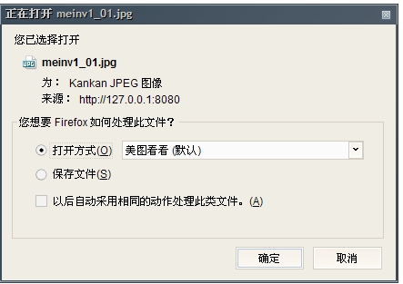

一般来说，文件下载只需要直接在页面给出一个超级链接，该链接的href属性值等于要下载文件的文件名，就可以实现文件下载，如：<a
href=”checkbox.rar”>checkbox.rar</a>。但是这样下载存在着一些缺陷：如果该文件的文件名是中文文件名时，下载则会导致下载失败；如果在下载时需要对用户的身份进行判断，来验证用户是否有权限来下载该文件时，那么单独的超级链接是不可能实现的。这个时候，我们需要用Struts
2来控制文件下载。

Struts 2提供了stream结果类型，该结果类型就是专门用于支持文件下载功能的。通过Struts
2的文件下载支持，允许系统控制浏览者下载文件的权限，实现文件名是非西欧字符的文件下载。

首先介绍利用Struts 2实现简单的文件下载：

    
    
     1 public class FileDownloadAction implements Action { 
     2 
     3     public InputStream getInputStream() throws Exception { 
     4 
     5         return new ByteArrayInputStream("Struts 2 下载示例".getBytes()); 
     6 
     7     } 
     8 
     9     public String execute() throws Exception { 
    10 
    11         return SUCCESS; 
    12 
    13     } 
    14 
    15 }

该类只是一个简单的Action处理类。它提供了一个返回inputStream输入流的方法。该输入流代表了下载文件的入口。这个方法用来给被下载的数据提供输入流。

一、利用Struts 2实现文件名非西欧字符文件下载

有如下一个下载页面代码：

    
    
    1 <a href="download1.action?image/美女_01.jpg" >下载图片</a>
    2 <a href="download2.action?image/meinv_01.rar">下载压缩文件</a>

上面页面中包含了两个下载的链接。但是第一个链接资源的文件名为中文，这时如果我们单击第一个超级练级，将会出现如下页面：

从上面的页面中我们可以看到大量的%字符，很明显，这种文件名师不能够实现下载的。这时我们可以使用Struts 2的文件下载支持来下载该文件。

1、实现文件下载的Action

Struts 2的文件下载Action需要提供一个返回InputStream流的方法。

代码如下：

    
    
     1 public class FileDownloadAction extends ActionSupport{
     2     //该属性可以在配置文件中动态指定该属性值
     3     private String inputPath;
     4 
     5     public void setInputPath(String inputPath) {
     6         this.inputPath = inputPath;
     7     }
     8     
     9     /*定义一个返回inputStream的方法
    10      * 该方法将作为下载文件的入口，且需要配置stream类型结果是指定inputName参数
    11      * inputName参数的值就是方法去掉get前缀、首字母小写的字符串
    12      */
    13     public InputStream getTargetFile() throws Exception{
    14         //servletContext提供getResourceAsStream()方法
    15         //返回指定文件对应的输入流
    16         return ServletActionContext.getServletContext().getResourceAsStream(inputPath);
    17     }
    18 
    19     @Override
    20     public String execute() throws Exception {
    21         return SUCCESS;
    22     }
    23 }

上面的Action中包含了一个getTargetFile()方法，该方法返回一个InputStream输入流。这个输入流返回的是下载目标文件的入口。该方法的方法名为getTargetFile，则stream类型的结果映射中inputName参数值是targetFile.

注：返回InputStream的方法需要配置Stream类型结果时指定inputName参数；该参数值就是方法吗去掉get前缀，首字母小写的字符串。

2、配置Action

配置文件下载的Action关键是需要配置一个类型为stream的结果，该stream类型的结果将使用文件下载作为响应。配置时需要指定以下四个属性

由于Stream结果类型的逻辑试图是返回给客服端一个输入流，因此不需要指定location属性。

配置如下：

    
    
     1         <action name="download1" class="com.app.action.FileDownloadAction">
     2             <!-- 指定被下载资源的位置 -->
     3             <param name="inputPath">\image\美女_01.jpg</param>
     4             <!-- 配置结果类型为stream的结果 -->
     5             <result name="success" type="stream">
     6                 <!-- 指定下载文件的文件类型 -->
     7                 <param name="contentType">image/jpg</param>
     8                 <!-- 指定由getTargetFile()方法返回被下载文件的inputStream -->
     9                 <param name="inputName">targetFile</param>
    10                 <param name="contentDisposition">attachment;filename="meinv1_01.jpg"</param>
    11                 <!-- 指定下载文件的缓冲大小 -->
    12                 <param name="bufferSize">4096</param>
    13             </result>
    14         </action>

通过上面的配置后，就可以实现包含中文文件名的文件下载了。如果在点击就可以实现下载了。如下：

二、下载前的授权控制

有时用户下载文件之前，我们需要对用户的身份进行验证，判断用户是否具有权限来下载该文件。这时我们通过Struts 2
的文件下载支持，就可以实现下载前的授权控制。

下面的Action，首先通过判断session里面的user属性是否为chenssy，如果用户通过了验证就允许下载，否则直接返回登录界面。

代码如下：

    
    
     1 public class AuthorityDownAction implements Action {
     2 
     3     private String inputPath;
     4 
     5     public void setInputPath(String inputPath) {
     6         this.inputPath = inputPath;
     7     }
     8 
     9     public InputStream getTargetFile() throws Exception{
    10         //ServletContext提供了getResourceAsStream()方法
    11         return ServletActionContext.getServletContext().getResourceAsStream(inputPath);
    12     }
    13     public String execute() throws Exception {
    14         //取得ActionContext实例
    15         ActionContext ctx = ActionContext.getContext();
    16         //通过ActionContext访问用户的HttpSession
    17         Map session = ctx.getSession();
    18         String user = (String) session.get("user");
    19         //判断session里的user是否通过检查
    20         if(user!=null&&user.equals("chenssy")){
    21             return SUCCESS;
    22         }
    23         ctx.put("tip", "您还没有登录，或者登录的用户名不正确，请重新登录!!!");
    24         return LOGIN;
    25     }
    26 
    27 }

上面的Action在校验失败后，会返回一个login逻辑视图名，所以在配置该Action时，还需要配置一个名为login的结果。

    
    
     1                   <action name="download2" class="com.app.action.AuthorityDownAction">
     2             <!-- 定义被下载文件的物理资源 -->
     3             <param name="inputPath">\image\meinv_01.rar</param>
     4             <result name="success" type="stream">
     5                 <!-- 指定下载文件的文件类型 -->
     6                 <param name="contentType">application/rar</param>
     7                 <!-- 指定由getTargetFile()方法返回被下载文件的InputStream -->
     8                 <param name="inputName">targetFile</param>
     9                 <param name="contentDisposition">filename="meinv_01.rar"</param>
    10                 <!-- 指定下载文件的缓冲大小 -->
    11                 <param name="bufferSize">4096</param>
    12             </result>
    13             <result name="login">/login.jsp</result>
    14         </action>

通过上面的配置后，就可以实现用户的授权控制。如果用户不登录、或者用户名不正确，在下载该资源时，就会返回到登录界面。

如下：

对于处理登录请求的Action如下：

    
    
     1 public class LoginAction extends ActionSupport {
     2 
     3     private String username;
     4     private String password;
     5 
     6     public String getUsername() {
     7         return username;
     8     }
     9 
    10     public void setUsername(String username) {
    11         this.username = username;
    12     }
    13 
    14     public String getPassword() {
    15         return password;
    16     }
    17 
    18     public void setPassword(String password) {
    19         this.password = password;
    20     }
    21 
    22     @Override
    23     public String execute() throws Exception {
    24         return SUCCESS;
    25     }
    26 
    27 }

对于该Action，它只是一个简单的处理类。它的execute方法没有进行任何处理，直接返回success，表示任何用户名都可以登录成功，进入到下载界面，但是从AuthorityDownAction
处理类中可以看到只有用户名为chengssy的用户可以下载成功。其他任何用户下载该资源都不会成功。

如果登录成功了，需要返回到下载页面，所以该Action的配置如下：

    
    
    1 <action name="login" class="com.app.action.LoginAction">
    2     <result name="success">/download.jsp</result>
    3 </action>

通过上面的一些配置后，用户再输入"chengssy"，一旦完成了登录，用户的session里username的值就会是：chenssy,这时就可以完成文件的下载了。

  

