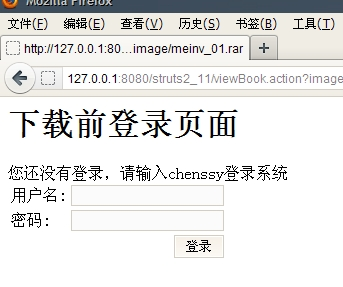

前面介绍了一些拦截器的配置和基本的使用方法，所以这次将介绍拦截器的实用功能。

实用拦截器完成权限控制

当浏览者需要执行某个操作时，应用需要先检查浏览者是否登录，以及是否有足够的权限来执行该操作。

本示例要求用户登录且必须为指定用户名才可以查看系统中的某个试图，否则用户直接转入到登录界面。

检查用户是否登录，通常都是跟踪用户的Session来完成的，通过ActionContext即可访问到session的属性，拦截器的interceptor方法的invocation参数可以很轻易地访问到请求相关的ActionContext实例。

权限检查拦截器类代码如下：

    
    
     1 public class AuthorityInterceptor extends AbstractInterceptor{
     2 
     3     //拦截Action处理的拦截方法
     4     @Override
     5     public String intercept(ActionInvocation invocation) throws Exception {
     6         //取得请求相关的ActionContext实例
     7         ActionContext ctx = invocation.getInvocationContext();
     8         Map session = ctx.getSession();
     9         //取出名为user的session属性
    10         String user = (String) session.get("user");
    11         //如果没有登录或者登录所用的用户名不是chenssy，则返回重新登录
    12         if(user!=null&&user.equals("chenssy")){
    13             return invocation.invoke();
    14         }
    15         //没有登录，将服务器提示设置成一个HttpServletRequest属性
    16         ctx.put("tip", "您还没有登录，请输入chenssy登录系统");
    17         
    18         return Action.LOGIN;
    19     }
    20 
    21 }

实现了上面的权限拦截器，就可以在所需要实现权限的Action中引用上面的拦截器。

为了使用该拦截器，在struts.xml配置文件中定义如下配置片段

    
    
    1                   <!-- 定义用户拦截器 -->
    2         <interceptors>
    3             <!-- 定义一个名为authority的拦截器-->
    4             <interceptor name="authority" class="com.app.interceptor.AuthorityInterceptor">
    5             </interceptor>
    6         </interceptors>

定义了该拦截器后，就可以在Action中应用该拦截器了。配置如下：

    
    
    1                    <action name="viewBook">
    2             <result name="success">/viewBook.jsp</result>
    3             <interceptor-ref name="authority"></interceptor-ref>
    4         </action>

上面的Action没有指定class属性，默认使用ActionSupport类，该类的execute方法返回success视图名。所以配置该Action时，只需要指定一个结果映射：success。

考虑到这个拦截器的重复使用，可能多个Action都需要跳转到login逻辑视图，故将login的结果映射定义成一个全局结果映射。配置如下：

    
    
    1                   <!-- 定义全局Result -->
    2         <global-results>
    3             <!-- 当返回login视图名时，转入到login页面 -->
    4             <result name="login">/login.jsp</result>
    5         </global-results>

当浏览者直接向该Action发送请求时，将会出现如下效果：

  
  
  

为了避免在每个Action中重复配置该拦截器，可以将该拦截器配置成一个默认拦截器栈，这个默认拦截器栈应该包含default-
stack拦截器栈和权限检查拦截器。

定义自己的默认拦截器栈的配置如下：

    
    
     1                    <interceptors>
     2             <!-- 定义权限检查拦截器 -->
     3             <interceptor name="authority" class="com.app.interceptor.AuthorityInterceptor"></interceptor>
     4             <!-- 定义一个包含权限检查的拦截器栈 -->
     5             <interceptor-stack name="mydefault">
     6                 <!-- 包含默认拦截器 -->
     7                 <interceptor-ref name="default-stack"></interceptor-ref>
     8                 <!-- 包含authority拦截器 -->
     9                 <interceptor-ref name="authority"></interceptor-ref>
    10             </interceptor-stack>
    11         </interceptors>

一旦定义了上面的mydefault拦截器栈，我们就可以使用该拦截栈了

    
    
    1 <default-interceptor-ref name="mydefault" />

一旦在某个包下定义了该默认拦截器栈，那么在该包下所有的Action都会自动增加权限检查功能。对于那些不需要使用权限控制的Action，我们可以将他们定义在另外的包中。这个包中依然使用Struts
2原有的默认拦截栈，将不会有权限控制功能

