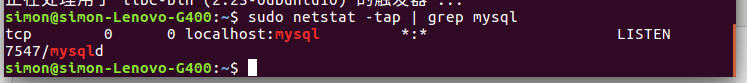

安装mysql

sudo apt-get install mysql-server

sudo apt install mysql-client

sudo apt install libmysqlclient-dev

测试是否成功

sudo netstat -tap | grep mysql

如何启动/停止/重启MySQL  
一、 启动方式  
1、使用 service 启动：service mysql start  
2、使用 mysqld 脚本启动：/etc/inint.d/mysql start  
3、使用 safe_mysqld 启动：safe_mysql&  
二、停止  
1、使用 service 启动：service mysql stop  
2、使用 mysqld 脚本启动：/etc/inint.d/mysql stop  
3、mysqladmin shutdown  
三、重启  
1、使用 service 启动：service mysql restart

2、使用 mysqld 脚本启动：/etc/inint.d/mysql restart

其实有时mysql已经正 常启动了，查看mysql是否启动命令  
ps -aux | grep mysqld  
查看mysql是否在监 听端口命令  
netstat -tl | grep mysql  
会看到如下类似内容

tcp 0 0 *:mysql *:* LISTEN

四、进入Mysql

mysql -uroot -p123456  
或者

mysql -u root -p  
enter passward:123456

