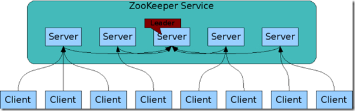

# 什么是Zookeeper，Zookeeper的作用是什么，在Hadoop及hbase中具体作用是什么

一、什么是Zookeeper  
ZooKeeper 顾名思义 动物园管理员，他是拿来管大象(Hadoop) 、 蜜蜂(Hive) 、 小猪(Pig) 的管理员， Apache Hbase和
Apache Solr 以及LinkedIn sensei 等项目中都采用到了
Zookeeper。ZooKeeper是一个分布式的，开放源码的分布式应用程序协调服务，ZooKeeper是以Fast
Paxos算法为基础，实现同步服务，配置维护和命名服务等分布式应用。  
上面的解释感觉还不够，太官方了。Zookeeper
从程序员的角度来讲可以理解为Hadoop的整体监控系统。如果namenode,HMaster宕机后，这时候Zookeeper
的重新选出leader。这是它最大的作用所在。下面详细介绍zookeeper的作用  
二、zookeeper的作用  
1.Zookeeper加强集群稳定性  
Zookeeper通过一种和文件系统很像的层级命名空间来让分布式进程互相协同工作。这些命名空间由一系列数据寄存器组成，我们也叫这些数据寄存器为znodes。这些znodes就有点像是文件系统中的文件和文件夹。和文件系统不一样的是，文件系统的文件是存储在存储区上的，而zookeeper的数据是存储在内存上的。同时，这就意味着zookeeper有着高吞吐和低延迟。  
Zookeeper实现了高性能，高可靠性，和有序的访问。高性能保证了zookeeper能应用在大型的分布式系统上。高可靠性保证它不会由于单一节点的故障而造成任何问题。有序的访问能保证客户端可以实现较为复杂的同步操作。  
2.Zookeeper加强集群持续性  
ZooKeeper Service  

组成Zookeeper的各个服务器必须要能相互通信。他们在内存中保存了服务器状态，也保存了操作的日志，并且持久化快照。只要大多数的服务器是可用的，那么Zookeeper就是可用的。  
客户端连接到一个Zookeeper服务器，并且维持TCP连接。并且发送请求，获取回复，获取事件，并且发送连接信号。如果这个TCP连接断掉了，那么客户端可以连接另外一个服务器。  
Zookeeper保证集群有序性  
Zookeeper使用数字来对每一个更新进行标记。这样能保证Zookeeper交互的有序。后续的操作可以根据这个顺序实现诸如同步操作这样更高更抽象的服务。  
Zookeeper保证集群高效  
Zookeeper的高效更表现在以读为主的系统上。Zookeeper可以在千台服务器组成的读写比例大约为10:1的分布系统上表现优异。  
数据结构和分等级的命名空间  
Zookeeper的命名空间的结构和文件系统很像。一个名字和文件一样使用/的路径表现，zookeeper的每个节点都是被路径唯一标识  
三、zookeeper在Hadoop及hbase中具体作用  
Hadoop有NameNode，HBase有HMaster，为什么还需要zookeeper，下面给大家通过例子给大家介绍。  
一个Zookeeper的集群中,3个Zookeeper节点.一个leader,两个follower的情况下,停掉leader,然后两个follower选举出一个leader.获取的数据不变.我想Zookeeper能够帮助Hadoop做到:  
Hadoop,使用Zookeeper的事件处理确保整个集群只有一个NameNode,存储配置信息等.  
HBase,使用Zookeeper的事件处理确保整个集群只有一个HMaster,察觉HRegionServer联机和宕机,存储访问控制列表等.

