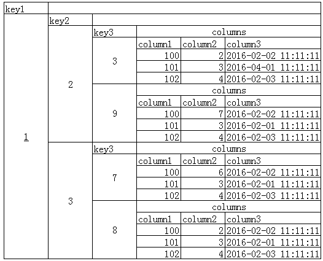

## 前言

项目中用到了cassandra，用来存储海量数据，且要有高效的查询；本博客就进行简单的介绍和进行一些基本的操作

路漫漫其修远兮，吾将上下而求索！

github：[https://github.com/youzhibing](https://github.com/youzhibing)

码云(gitee)：[https://gitee.com/youzhibing](https://gitee.com/youzhibing)

## 使用场景

是一款分布式的结构化数据存储方案(NoSql数据库)，存储结构比Key-
Value数据库（像Redis）更丰富，但是比Document数据库（如Mongodb）支持度有限；适合做数据分析或数据仓库这类需要迅速查找且数据量大的应用

相关概念：

keyspace -> table –> column，对应关系型数据库 database -> table -> column

存储结构：

_CREATE TABLE mykeyspace.mytable (_

_key1 text,_

_key2 text,_

_key3 text,_

_column1 bigint,_

_column2 int,_

_column3 timestamp,_

_PRIMARY KEY (key1, key2, key3);_

___)_

key1： partitionKey，分区主键

key2, key3 clusterKey，集群主键

## 安装

官方文档：<http://cassandra.apache.org/doc/latest/>

1、依赖：jdk、python

本博客中用到的版本分别为：jdk1.7、python2.7.10,、cassandra2.2.8，注意，我是在win7上做的演示

2、安装

jdk和python的安装我这里就不演示，大家自行安装；

Cassandra安装也很简单，将apache-cassandra-2.2.8-bin.tar.gz进行解压即可。

## 配置

官方文档：<http://cassandra.apache.org/doc/latest/getting_started/configuring.html>

Cassandra配置文件都在conf目录下，其中cassandra.yaml可以完成cassandra的大部分配置，我们主要关注以下两部分

1、Main runtime properties(主要的cassandra运行时属性)

a) cluster_name:集群名，同一集群的多个节点，集群名要一致

b) seeds: 种子节点，集群中的全部机器的ip，以逗号隔开

c) storage_port: Cassandra服务器与服务器之间连接的端口号，一般不需要修改，但要保证此端口上没有防火墙

d) listen_address: Cassandra集群中服务器与服务器之间相互通信的地址。如果留空，将默认使用服务器的机器名

e) native_transport_port: 默认的CQL本地服务端口，本地的cql客户端与服务器交互的端口

2、Changing the location of directories(相关的文件目录)

a) data_file_directories: 数据文件存放的目录，一个或多个

b) commitlog_directory: 提交信息的日志文件存放的目录

c) saved_caches_directory: 缓存存放的目录

## 运行

配置完cassandra后，启动cassandra很简单，$CASSANDRA_HOME/bin目录下双击cassandra.bat即可，那么cassandra就启动起来了，那么我们怎么与cassandra进行交互了？启动cqlsh.bat即可：双击$CASSANDRA_HOME/bin目录下的cqlsh.bat，接下来你就可以随心所欲的与cassandra交互了

## cassandra基本操作

官方文档：<http://cassandra.apache.org/doc/latest/cql/index.html>

1、查询全部的keyspace： describe keyspaces;(或desc keyspaces;)

2、创建一个keyspace：CREATE KEYSPACE IF NOT EXISTS myCas WITH REPLICATION =
{"class": "SimpleStrategy","replication_factor":1};

class : 副本配置策略(总共有三种)：

Simple Strategy(RackUnaware
Strategy)：副本不考虑机架的因素，按照Token放置在连续下几个节点。如下图所示，假如副本数为3，属于A节点的数据在B.C两个节点中也放置副本

OldNetwork Topology Strategy(RackAware
Strategy)：考虑机架的因素，除了基本的数据外，先找一个处于不同数据中心的点放置一个副本，其余N-2个副本放置在同一数据中心的不同机架中

Network Topology Strategy(DatacneterShard
Strategy)：将M个副本放置到其他的数据中心，将N-M-1的副本放置在同一数据中心的不同机架中

3、使用某个keyspace：use myCas;

4、查询全部的table：desc tables;

5、创建一张表：CREATE TABLE user (id int, user_name varchar, PRIMARY KEY (id) );

创建表的时候至少指定一个主键

6、向表中插入一条记录：INSERT INTO user (id,user_name) VALUES (1,"zhangsan");

列名必须要显示指定，如果表中已存在相同主键的记录，那么该操作会覆盖表中已存在的记录

7、查询表中全部数据：select * from user;

cassandra查询有很多限制，比如只能单表查询，不支持联表查询和子查询，查询条件只支持key查询和索引列查询，而且key有顺序的限制，等等；更多详情请自行阅读官方文档

8、简单的条件查询：select * from user where id=1;

9、创建索引：create index on user(user_name);

10、索引列查询：select * from user where user_name="zhangsan";

若没有在name上创建索引，那么此查询会报错；

11、更新表中数据：update user set user_name="lisi" where id=2;

只支持按主键更新，也就是where后只能跟主键

12、删除表中记录：delete from user where id=1;

删除某条记录中的某个字段,该字段会被设成null：delete user_name from user where id=1;

无论是删除某条记录，还是将某个字段置null，都只支持按主键删除，也就是where后只能跟主键

13、批量操作：Multiple INSERT, UPDATE and DELETE can be executed in a single
statement by grouping them through a BATCH
statement(通过batch能够执行多个insert、update以及delete)，例如：

BEGIN BATCH

INSERT INTO user (id, user_name) VALUES (2, "second user");

UPDATE user SET user_name = "ps22dhds" WHERE id = 2;

INSERT INTO user (id, user_name) VALUES (3, "lee long");

DELETE user_name FROM user WHERE id = 3;

APPLY BATCH;

## 登录认证

官方文档：<http://cassandra.apache.org/doc/latest/cql/security.html#>

不知道大家发现没有，前面的cassandra操作是在没有登录的情况下进行的，这在实际生产环境中肯定是不行的，那么接下来我们看看cassandra的登录认证

1、修改配置文件cassandra.yaml

把默认的authenticator: AllowAllAuthenticator运行所有人登录设置为用密码登录：authenticator:
PasswordAuthenticator

2、登录cassandra，然后创建新的用户

配置文件修改完后，启动cassandra(如若双击cassandra.bat启动报错，可以试着在cmd中启动cassandra)；接着启动客户端：
cqlsh.bat -ucassandra -pcassandra;

cassandra用户是默认的，客户端启动成功后，创建新的用户：create user admin with password "admin"
superuser; 新用户创建成功后，退出客户端：exit;

用新用户登录：cqlsh.bat -uadmin –padmin; 删除默认用户cassandra：drop user cassandra;

记得把默认用户删除掉；另外，可以到system_auth下的roles表中查看已有用户;

更多详情请阅读官方文档

## 后话

1、操作结果我这里就没贴上来了，希望大家自己动手去尝试

2、有什么问题，大家可以第一时间看官方文档，注意官方文档中有个这个：<http://cassandra.apache.org/doc/latest/faq/index.html>

3、cassandra版本要注意，以及它的依赖(jdk、python)的版本，不同的版本支持的内容会有所不同

4、不知道大家注意到没有，cql中where后能跟的内容很受限(相比关系型数据库)，后面跟大家详细探讨

5、下篇博客讲java操作cassandra，欢迎大家来捧场

## 参考

[赵岩的博客](http://zhaoyanblog.com/)

[官方文档](http://cassandra.apache.org/doc/latest/)

