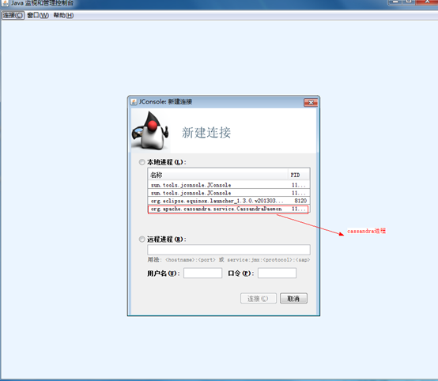
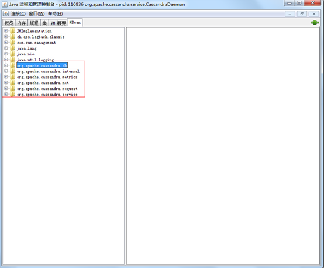
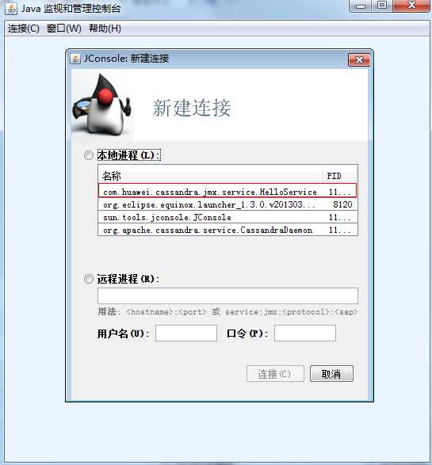
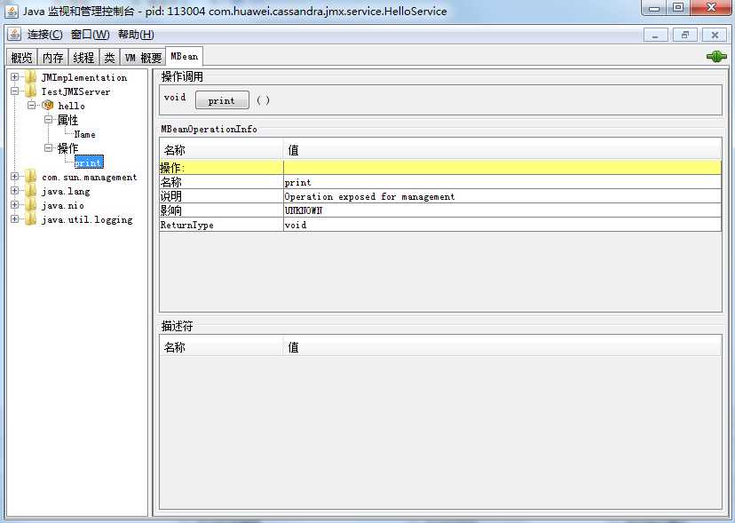
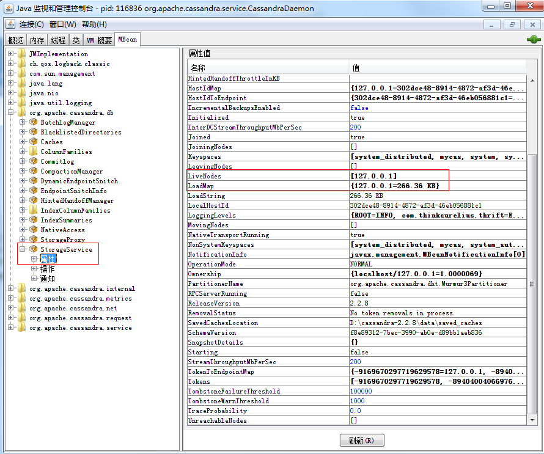

## 前言

路漫漫其修远兮，吾将上下而求索！

github：[https://github.com/youzhibing](https://github.com/youzhibing)

码云(gitee)：[https://gitee.com/youzhibing](https://gitee.com/youzhibing)

## 需求场景

项目中有这么个需求：统计集群中各个节点的数据量存储大小，不是记录数。

一开始有点无头绪，后面查看cassandra官方文档看到[Monitoring](http://cassandra.apache.org/doc/latest/operating/metrics.html#)章节，里面说到：Cassandra中的指标使用Dropwizard
Metrics库进行管理。
这些指标可以通过JMX查询，也可以使用多个内置和第三方报告插件推送到外部监控系统（Jconsole）。那么数据量存储大小是不是也是cassandra的某项指标了？
带着疑问，我通过Jconsole看到了cassandra的一些指标（先启动cassandra， 运行 -> Jconsole），如下图

数据量存储大小就在叫org.apache.cassandra.db的MBean中，具体会在之后介绍。

## JMX定义

引用[JMX超详细解读](http://www.cnblogs.com/dongguacai/p/5900507.html)中一段话：

    
    
    JMX(Java Management Extensions)是一个为应用程序植入管理功能的框架。JMX是一套标准的代理和服务，实际上，用户可以在任何Java应用程序中使用这些代理和服务实现管理。这是官方文档上的定义，我看过很多次也无法很好的理解。  
    我个人的理解是JMX让程序有被管理的功能，例如你开发一个WEB网站，它是在24小时不间断运行，那么你肯定会对网站进行监控，如每天的UV、PV是多少；又或者在业务高峰的期间，你想对接口进行限流，就必须去修改接口并发的配置值。
    
    　　应用场景：中间件软件WebLogic的管理页面就是基于JMX开发的，而JBoss则整个系统都基于JMX构架，另外包括cassandra中各项指标的管理。
    
    　　对于一些参数的修改，网上有一段描述还是比较形象的：
    
    　　1、程序初哥一般是写死在程序中，到要改变的时候就去修改代码，然后重新编译发布。
    
    　　2、程序熟手则配置在文件中（JAVA一般都是properties文件），到要改变的时候只要修改配置文件，但还是必须重启系统，以便读取配置文件里最新的值。
    
    　　3、程序好手则会写一段代码，把配置值缓存起来，系统在获取的时候，先看看配置文件有没有改动，如有改动则重新从配置里读取，否则从缓存里读取。
    
    　　4、程序高手则懂得物为我所用，用JMX把需要配置的属性集中在一个类中，然后写一个MBean，再进行相关配置。另外JMX还提供了一个工具页，以方便我们对参数值进行修改。

给我的感觉，jmx server进行监听，jmx client进行请求的发送，以此达到通信的目的；cassandra的jmx
server已经被cassandra实现，我们只需要实现jmx client，就能从cassandra进程中拿到我们需要的指标数据。

## JMX Server

###  MBean接口定义

接口的命名规范为以具体的实现类为前缀（这个规范很重要），动态代理的过程中需要用到这点。

    
    
    public interface HelloMBean
    {
        String getName();
        void setName(String name);
        
        void print();
    }

###  MBean接口实现

实现上面的接口：

    
    
    public class Hello implements HelloMBean
    {
        
        private String name;
        
        @Override
        public String getName()
        {
            return this.name;
        }
        
        @Override
        public void setName(String name)
        {
            this.name = name;
        }
        
        @Override
        public void print()
        {
            System.out.println("hello, print");
        }
        
    }

###  jmx server实现

定义一个jmx server，并启动它

    
    
    public class HelloService
    {
        private static final int RMI_PORT = 8099;  
        private static final String JMX_SERVER_NAME = "TestJMXServer";
        private static final String USER_NAME = "hello";
        private static final String PASS_WORD = "world";
        
        public static void main(String[] args) throws Exception
        {
            HelloService service = new HelloService(); 
            service.startJmxServer();
        }
        
        private void startJmxServer() throws Exception
        {
            //MBeanServer mbs = MBeanServerFactory.createMBeanServer(jmxServerName);  
            MBeanServer mbs = this.getMBeanServer(); 
          
            // 在本地主机上创建并输出一个注册实例，来接收特定端口的请求
            LocateRegistry.createRegistry(RMI_PORT, null, RMISocketFactory.getDefaultSocketFactory()); 
            
            JMXServiceURL url = new JMXServiceURL("service:jmx:rmi:///jndi/rmi://localhost:" + RMI_PORT + "/" + JMX_SERVER_NAME);  
            System.out.println("JMXServiceURL: " + url.toString());  
            
            Map<String, Object> env = this.putAuthenticator();
            
            //JMXConnectorServer jmxConnServer = JMXConnectorServerFactory.newJMXConnectorServer(url, null, mbs);   // 不加认证 
            JMXConnectorServer jmxConnServer = JMXConnectorServerFactory.newJMXConnectorServer(url, env, mbs);      // 加认证 
            jmxConnServer.start(); 
        }
        
        private MBeanServer getMBeanServer() throws Exception
        {
            MBeanServer mbs = ManagementFactory.getPlatformMBeanServer();
            ObjectName objName = new ObjectName(JMX_SERVER_NAME + ":name=" + "hello");  
            mbs.registerMBean(new Hello(), objName);
            return mbs;
        }
        
        private Map<String, Object> putAuthenticator()
        {
            Map<String,Object> env = new HashMap<String,Object>();
            JMXAuthenticator auth = createJMXAuthenticator();
            env.put(JMXConnectorServer.AUTHENTICATOR, auth);
    
            env.put("com.sun.jndi.rmi.factory.socket", RMISocketFactory.getDefaultSocketFactory());
            return env;
        }
        
        private JMXAuthenticator createJMXAuthenticator() 
        {
            return new JMXAuthenticator() 
            {
                public Subject authenticate(Object credentials) 
                {
                    String[] sCredentials = (String[]) credentials;
                    if (null == sCredentials || sCredentials.length != 2)
                    {
                        throw new SecurityException("Authentication failed!");
                    }
                    String userName = sCredentials[0];
                    String password = sCredentials[1];
                    if (USER_NAME.equals(userName) && PASS_WORD.equals(password)) 
                    {
                        Set<JMXPrincipal> principals = new HashSet<JMXPrincipal>();
                        principals.add(new JMXPrincipal(userName));
                        return new Subject(true, principals, Collections.EMPTY_SET,
                                Collections.EMPTY_SET);
                    }
                    throw new SecurityException("Authentication failed!");
                }
            };
        }
    }

View Code

点下print按钮，你会发现控制台会打印：hello, print

cassandra的jmx server已经自己实现了，我们不需要实现它，我们需要实现的是调用它。

## JMX client

这个是我们需要关注和实现的

###  client端接口定义

接口中定义的方法是我们需要调用的，方法名必须与server端暴露的方法一样，通过server端动态生成client端的实例，实例中的方法只包括client端接口中定义的方法（若server端暴露的是属性，那么直接在属性前加get，后面cassandra部分会讲到）

    
    
    public interface HelloClientMBean
    {
        void print();　　　　　　　　　　// 方法定义与server端暴露的方法一致
    }

###  连接jmx server

    
    
    public class HelloClient implements AutoCloseable
    {
        private static final String fmtUrl = "service:jmx:rmi:///jndi/rmi://[%s]:%d/TestJMXServer";
        private static final String ssObjName = "TestJMXServer:name=hello";
        private static final int defaultPort = 1099;                       // cassandra默认端口是7199
        final String host;
        final int port;
        private String username;
        private String password;
        
        private JMXConnector jmxc;
        private MBeanServerConnection mbeanServerConn;
        private HelloMBean hmProxy;
        
        /**
         * Creates a connection using the specified JMX host, port, username, and password.
         *
         * @param host hostname or IP address of the JMX agent
         * @param port TCP port of the remote JMX agent
         * @throws IOException on connection failures
         */
        public HelloClient(String host, int port, String username, String password) throws IOException
        {
            assert username != null && !username.isEmpty() && password != null && !password.isEmpty()
                   : "neither username nor password can be blank";
    
            this.host = host;
            this.port = port;
            this.username = username;
            this.password = password;
            connect();
        }
        
        /**
         * Creates a connection using the specified JMX host and port.
         *
         * @param host hostname or IP address of the JMX agent
         * @param port TCP port of the remote JMX agent
         * @throws IOException on connection failures
         */
        public HelloClient(String host, int port) throws IOException
        {
            this.host = host;
            this.port = port;
            connect();
        }
        
        /**
         * Creates a connection using the specified JMX host and default port.
         *
         * @param host hostname or IP address of the JMX agent
         * @throws IOException on connection failures
         */
        public HelloClient(String host) throws IOException
        {
            this.host = host;
            this.port = defaultPort;
            connect();
        }
        
        /**
         * Create a connection to the JMX agent and setup the M[X]Bean proxies.
         *
         * @throws IOException on connection failures
         */
        private void connect() throws IOException
        {
            JMXServiceURL jmxUrl = new JMXServiceURL(String.format(fmtUrl, host, port));
            Map<String,Object> env = new HashMap<String,Object>();
            if (username != null)
            {
                String[] creds = { username, password };
                env.put(JMXConnector.CREDENTIALS, creds);
            }
    
            env.put("com.sun.jndi.rmi.factory.socket", getRMIClientSocketFactory());
    
            jmxc = JMXConnectorFactory.connect(jmxUrl, env);
            mbeanServerConn = jmxc.getMBeanServerConnection();
    
            try
            {
                ObjectName name = new ObjectName(ssObjName);
                hmProxy = JMX.newMBeanProxy(mbeanServerConn, name, HelloMBean.class);
            }
            catch (MalformedObjectNameException e)
            {
                throw new RuntimeException(
                        "Invalid ObjectName? Please report this as a bug.", e);
            }
        }
        
        private RMIClientSocketFactory getRMIClientSocketFactory() throws IOException
        {
            if (Boolean.parseBoolean(System.getProperty("ssl.enable")))
                return new SslRMIClientSocketFactory();
            else
                return RMISocketFactory.getDefaultSocketFactory();
        }
        
        public void print()
        {
            hmProxy.print();
        }
    
        @Override
        public void close() throws Exception 
        {
            jmxc.close();
        }
    }

View Code

###  接口调用

    
    
    public class JmxClient
    {
        public static void main(String[] args) throws Exception
        {
            HelloClient client = new HelloClient("localhost", 8099, "hello", "world");
            client.print();
            client.close();
        }
        
    }

会在控制台打印：hello, print。

## 统计cassandra集群中各个节点的数据量存储大小

回到我们的项目需求，如何实现呢？ 也分3步

###  client端接口定义

因为我们只关心数据量存储大小，所以我们只需要在接口定义一个方法

    
    
    public interface StorageServiceMBean
    {
        /** Human-readable load value.  Keys are IP addresses. */
        public Map<String, String> getLoadMap();　　　　　　　　　　　　// cassandra端暴露的是属性LoadMap，那么此方法名由get加LoadMap组成， 那么getLoad方法就可以获取LoadMap的值
    
    
    }　

###  连接jmx server

cassandra-env.sh配置文件中有cassandra的JMX默认端口：JMX_PORT="7199"

    
    
    public class CassNodeProbe implements AutoCloseable
    {
        private static final String fmtUrl = "service:jmx:rmi:///jndi/rmi://[%s]:%d/jmxrmi";
        private static final String ssObjName = "org.apache.cassandra.db:type=StorageService";
        private static final int defaultPort = 7199;
        final String host;
        final int port;
        private String username;
        private String password;
        
        private JMXConnector jmxc;
        private MBeanServerConnection mbeanServerConn;
        private StorageServiceMBean ssProxy;
        
        /**
         * Creates a NodeProbe using the specified JMX host, port, username, and password.
         *
         * @param host hostname or IP address of the JMX agent
         * @param port TCP port of the remote JMX agent
         * @throws IOException on connection failures
         */
        public CassNodeProbe(String host, int port, String username, String password) throws IOException
        {
            assert username != null && !username.isEmpty() && password != null && !password.isEmpty()
                   : "neither username nor password can be blank";
    
            this.host = host;
            this.port = port;
            this.username = username;
            this.password = password;
            connect();
        }
        
        /**
         * Creates a NodeProbe using the specified JMX host and port.
         *
         * @param host hostname or IP address of the JMX agent
         * @param port TCP port of the remote JMX agent
         * @throws IOException on connection failures
         */
        public CassNodeProbe(String host, int port) throws IOException
        {
            this.host = host;
            this.port = port;
            connect();
        }
        
        /**
         * Creates a NodeProbe using the specified JMX host and default port.
         *
         * @param host hostname or IP address of the JMX agent
         * @throws IOException on connection failures
         */
        public CassNodeProbe(String host) throws IOException
        {
            this.host = host;
            this.port = defaultPort;
            connect();
        }
        
        /**
         * Create a connection to the JMX agent and setup the M[X]Bean proxies.
         *
         * @throws IOException on connection failures
         */
        private void connect() throws IOException
        {
            JMXServiceURL jmxUrl = new JMXServiceURL(String.format(fmtUrl, host, port));
            Map<String,Object> env = new HashMap<String,Object>();
            if (username != null)
            {
                String[] creds = { username, password };
                env.put(JMXConnector.CREDENTIALS, creds);
            }
    
            env.put("com.sun.jndi.rmi.factory.socket", getRMIClientSocketFactory());
    
            jmxc = JMXConnectorFactory.connect(jmxUrl, env);
            mbeanServerConn = jmxc.getMBeanServerConnection();
    
            try
            {
                ObjectName name = new ObjectName(ssObjName);
                ssProxy = JMX.newMBeanProxy(mbeanServerConn, name, StorageServiceMBean.class);
            }
            catch (MalformedObjectNameException e)
            {
                throw new RuntimeException(
                        "Invalid ObjectName? Please report this as a bug.", e);
            }
        }
        
        private RMIClientSocketFactory getRMIClientSocketFactory() throws IOException
        {
            if (Boolean.parseBoolean(System.getProperty("ssl.enable")))
                return new SslRMIClientSocketFactory();
            else
                return RMISocketFactory.getDefaultSocketFactory();
        }
        
        public Map<String, String> getCassClusterStorage()
        {
            return ssProxy.getLoadMap();
        }
    
        @Override
        public void close() throws Exception 
        {
            jmxc.close();
        }
    }

View Code

###  接口调用

    
    
    public class JMXTest
    {
        
        public static void main(String[] args) throws Exception
        {
            CassNodeProbe prode = new CassNodeProbe("127.0.0.1");
            Map<String, String> nodeStorages = prode.getCassClusterStorage();
            System.out.println(nodeStorages);
            prode.close();
        }
        
    }

最后得到结果：{127.0.0.1=266.36 KB}

cassandra的jmx 认证访问我就不做演示了，大家自己去实现。

## cassandra-all

cassandra给我们提供了工具jar，也就是cassandra jmx client实现，jmx
server暴露的在这个工具jar中都有对应的请求方式；

如若大家用到的很少则可以自己实现，而不需要用cassandra-all，当然我们可以拷贝cassandra-
all中我们需要的代码到我们的工程中，那么我们就可以不用引用此jar，但是又满足了我们的需求

    
    
    <dependency>
        <groupId>org.apache.cassandra</groupId>
        <artifactId>cassandra-all</artifactId>
        <version>2.1.14</version>
    </dependency>

**[工程附件](http://files.cnblogs.com/files/youzhibing/jmx_src.rar)**

## 参考

<http://www.cnblogs.com/FlyAway2013/p/jmx.html>

http://www.cnblogs.com/dongguacai/p/5900507.html

