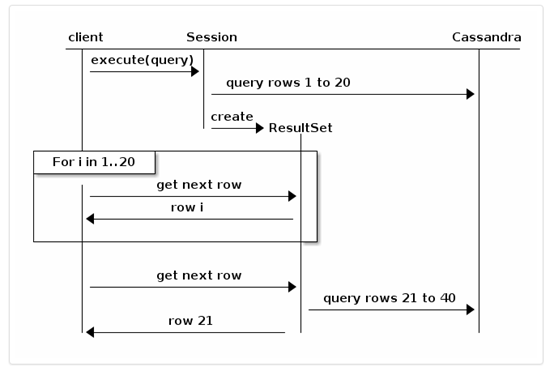
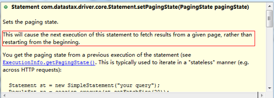

## 前言

接着上篇博客，我们来谈谈java操作cassandra分页，需要注意的是这个分页与我们平时所做的页面分页是不同的，具体有啥不同，大家耐着性子往下看。

上篇博客讲到了cassandra的分页，相信大家会有所注意：下一次的查询依赖上一次的查询(上一次查询的最后一条记录的全部主键)，不像mysql那样灵活，所以只能实现上一页、下一页这样的功能，不能实现第多少页那样的功能（硬要实现的话性能就太低了）。

我们先看看[驱动官方给的分页做法](http://docs.datastax.com/en/developer/java-
driver/3.0/manual/paging/)

如果一个查询得到的记录数太大，一次性返回回来，那么效率非常低，并且很有可能造成内存溢出，使得整个应用都奔溃。所以了，驱动对结果集进行了分页，并返回适当的某一页的数据。

路漫漫其修远兮，吾将上下而求索！

github：[https://github.com/youzhibing](https://github.com/youzhibing)

码云(gitee)：[https://gitee.com/youzhibing](https://gitee.com/youzhibing)

## 设置抓取大小

抓取大小指的是一次从cassandra获取到的记录数，换句话说，就是每一页的记录数；我们能够在创建cluster实例的时候给它的fetch
size指定一个默认值，如果没有指定，那么默认是5000

    
    
    // At initialization:
    Cluster cluster = Cluster.builder()
        .addContactPoint("127.0.0.1")
        .withQueryOptions(new QueryOptions().setFetchSize(2000))
        .build();
    
    // Or at runtime:
    cluster.getConfiguration().getQueryOptions().setFetchSize(2000);

另外，statement上也能设置fetch size

    
    
    Statement statement = new SimpleStatement("your query");
    statement.setFetchSize(2000);

如果statement上设置了fetch size，那么statement的fetch size将起作用，否则则是cluster上的fetch
size起作用。

注意：设置了fetch size并不意味着cassandra总是返回准确的结果集(等于fetch size)，它可能返回比fetch
size稍微多一点或者少一点的结果集。

## 结果集迭代

fetch size限制了每一页返回的结果集的数量，如果你迭代某一页，驱动会在后台自动的抓取下一页的记录。如下例，fetch size = 20：

默认情况下，后台自动抓取发生在最后一刻，也就是当某一页的记录被迭代完的时候。如果需要更好的控制，ResultSet接口提供了以下方法：

getAvailableWithoutFetching() and isFullyFetched() to check the current state;

fetchMoreResults() to force a page fetch;

以下是如何使用这些方法提前预取下一页，以避免在某一页迭代完后才抓取下一页造成的性能下降：

    
    
    ResultSet rs = session.execute("your query");
    for (Row row : rs) {
        if (rs.getAvailableWithoutFetching() == 100 && !rs.isFullyFetched())
            rs.fetchMoreResults(); // this is asynchronous
        // Process the row ...
        System.out.println(row);
    }

## 保存并重新使用分页状态

有时候，将分页状态保存起来，对以后的恢复是非常有用的，想象一下：有一个无状态Web服务，显示结果列表，并显示下一页的链接，当用户点击这个链接的时候，我们需要执行与之前完全相同的查询，除了迭代应该从上一页停止的位置开始；相当于记住了上一页迭代到了哪了，那么下一页从这里开始即可。

为此，驱动程序会暴露一个PagingState对象，该对象表示下一页被提取时我们在结果集中的位置。

    
    
    ResultSet resultSet = session.execute("your query");
    // iterate the result set...
    PagingState pagingState = resultSet.getExecutionInfo().getPagingState();  
    
    // PagingState对象可以被序列化成字符串或字节数组
    String string = pagingState.toString();
    byte[] bytes = pagingState.toBytes();

PagingState对象被序列化后的内容可以持久化存储起来，也可用作分页请求的参数，以备后续再次被利用，反序列化成对象即可：

    
    
    PagingState.fromBytes(byte[] bytes);
    PagingState.fromString(String str);

请注意，分页状态只能使用完全相同的语句重复使用（相同的查询，相同的参数）。而且，它是一个不透明的值，只是用来存储一个可以被重新使用的状态值，如果尝试修改其内容或将其使用在不同的语句上，驱动程序会抛出错误。

具体我们来看下代码，下例是模拟页面分页的请求，实现遍历teacher表中的全部记录：

接口：

    
    
    import java.util.Map;
    
    import com.datastax.driver.core.PagingState;
    
    public interface ICassandraPage
    {
        Map<String, Object> page(PagingState pagingState);
    
    }

View Code

主体代码：

    
    
    import java.util.ArrayList;
    import java.util.HashMap;
    import java.util.List;
    import java.util.Map;
    
    import com.datastax.driver.core.PagingState;
    import com.datastax.driver.core.ResultSet;
    import com.datastax.driver.core.Row;
    import com.datastax.driver.core.Session;
    import com.datastax.driver.core.SimpleStatement;
    import com.datastax.driver.core.Statement;
    import com.huawei.cassandra.dao.ICassandraPage;
    import com.huawei.cassandra.factory.SessionRepository;
    import com.huawei.cassandra.model.Teacher;
    
    public class CassandraPageDao implements ICassandraPage
    {
        private static final Session session = SessionRepository.getSession();
        
        private static final String CQL_TEACHER_PAGE = "select * from mycas.teacher;";
        
        @Override
        public Map<String, Object> page(PagingState pagingState)
        {
            final int RESULTS_PER_PAGE = 2;
            Map<String, Object> result = new HashMap<String, Object>(2);
            List<Teacher> teachers = new ArrayList<Teacher>(RESULTS_PER_PAGE);
    
            Statement st = new SimpleStatement(CQL_TEACHER_PAGE);
            st.setFetchSize(RESULTS_PER_PAGE);
            
            // 第一页没有分页状态
            if (pagingState != null)
            {            
                st.setPagingState(pagingState);
            }
            
            ResultSet rs = session.execute(st);
            result.put("pagingState", rs.getExecutionInfo().getPagingState());
            
            //请注意，我们不依赖RESULTS_PER_PAGE，因为fetch size并不意味着cassandra总是返回准确的结果集
            //它可能返回比fetch size稍微多一点或者少一点，另外，我们可能在结果集的结尾
            int remaining = rs.getAvailableWithoutFetching();
            for (Row row : rs)
            {
                Teacher teacher = this.obtainTeacherFromRow(row);
                teachers.add(teacher);
                
                if (--remaining == 0) 
                {
                    break;
                }
            }
            result.put("teachers", teachers);
            return result;
        }
    
        private Teacher obtainTeacherFromRow(Row row)
        {
            Teacher teacher = new Teacher();
            teacher.setAddress(row.getString("address"));
            teacher.setAge(row.getInt("age"));
            teacher.setHeight(row.getInt("height"));
            teacher.setId(row.getInt("id"));
            teacher.setName(row.getString("name"));
            
            return teacher;
        }
     
    }

View Code

测试代码：

    
    
    import java.util.Map;
    
    import com.datastax.driver.core.PagingState;
    import com.huawei.cassandra.dao.ICassandraPage;
    import com.huawei.cassandra.dao.impl.CassandraPageDao;
    
    public class PagingTest
    {
        
        public static void main(String[] args)
        {
            ICassandraPage cassPage = new CassandraPageDao();
            Map<String, Object> result = cassPage.page(null);
            PagingState pagingState = (PagingState) result.get("pagingState");
            System.out.println(result.get("teachers"));
            while (pagingState != null)
            {
                // PagingState对象可以被序列化成字符串或字节数组
                System.out.println("==============================================");
                result = cassPage.page(pagingState);
                pagingState = (PagingState) result.get("pagingState");
                System.out.println(result.get("teachers"));
            }
        }
        
    }

View Code

我们来看看Statement的setPagingState(pagingState)方法：

## 偏移查询

保存分页状态，能够保证从某一页移动到下一页很好地运行（也可以实现上一页），但是它不满足随机跳跃，比如直接跳到第10页，因为我们不知道第10页的前一页的分页状态。像这样需要偏移查询的特点，并不被cassandra原生支持，理由是偏移查询效率低下(性能与跳过的行数呈线性反比)，所以cassandra官方不鼓励使用偏移量。如果非要实现偏移查询，我们可以在客户端模拟实现。但是性能还是呈线性反比，也就说偏移量越大，性能越低，如果性能在我们的接受范围内，那还是可以实现的。例如，每一页显示10行，最多显示20页，这就意味着，当显示第20页的时候，最多需要额外的多抓取190行，但这也不会对性能造成太大的降低，所以数据量不大的话，模拟实现偏移查询还是可以的。

举个例子，假设每页显示10条记录，fetch size 是50，我们请求第12页(也就是第110行到第119行)：

1、第一次执行查询，结果集包含0到49行，我们不需要用到它，只需要分页状态；

2、用第一次查询得到的分页状态，执行第二次查询；

3、用第二次查询得到的分页状态，执行第三次查询。结果集包含100到149行；

4、用第三次查询得到的结果集，先过滤掉前10条记录，然后读取10条记录，最后丢弃剩下的记录，读取的10条记录则是第12页需要显示的记录。

我们需要尝试着找到最佳的fetch size来达到最佳平衡：太小就意味着后台更多的查询；太大则意味着返回了更大的信息量以及更多不需要的行。

另外，cassandra本身不支持偏移量查询。在满足性能的前提下，客户端模拟偏移量的实现只是一种妥协。官方建议如下：

1、使用预期的查询模式来测试代码，以确保假设是正确的

2、设置最高页码的硬限制，以防止恶意用户触发跳过大量行的查询

## 总结

Cassandra对分页的支持有限，上一页、下一页比较好实现。不支持偏移量的查询，硬要实现的话，可以采用客户端模拟的方式，但是这种场景最好不要用在cassandra上，因为cassandra一般而言是用来解决大数据问题，而偏移量查询一旦数据量太大，性能就不敢恭维了。

在我的项目中，索引修复用到了cassandra的分页，场景如下：cassandra的表不建二级索引，用elasticsearch实现cassandra表的二级索引，那么就会涉及到索引的一致性修复的问题，这里就用到了cassandra的分页，对cassandra的某张表进行全表遍历，逐条与elasticsearch中的数据进行匹对，若elasticsearch中不存在，则在elasticsearch中新增，若存在而又不一致，则在elasticsearch中修复。具体elasticsearch怎么样实现cassandra的索引功能，在我后续博客中会专门的讲解，这里就不多说了。而在cassandra表进行全表遍历的时候就需要用到分页，因为表中数据量太大，亿级别的数据不可能一次全部加载到内存中。

[工程附件](http://files.cnblogs.com/files/youzhibing/src.rar)

