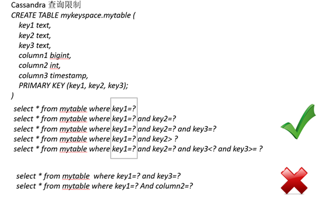
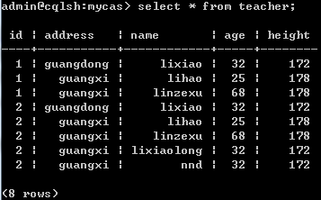
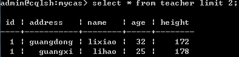
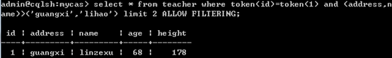
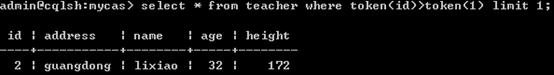

## 前言

本次就给大家讲讲cassandra的高级操作：索引、排序和分页；处于性能的考虑，cassandra对这些支持都比较简单，所以我们不能希望cassandra完全适用于我们的逻辑，而是应该将我们的逻辑设计的更适合于cassandra

路漫漫其修远兮，吾将上下而求索！

github：[https://github.com/youzhibing](https://github.com/youzhibing)

码云(gitee)：[https://gitee.com/youzhibing](https://gitee.com/youzhibing)

## 索引与排序

Cassandra对查询的支持很弱，只支持主键列及索引列的查询，而且主键列还有各种限制，不过查询弱归弱，但它还是支持索引和排序的。

###  cassandra的查询约束

第一主键 只能用=号查询

第二主键 支持= > < >= <=

索引列 只支持=号

###  索引查询

Cassandra支持创建二级索引，可以创建在除了第一主键(分区键：partition
key)之外所有的列上；不同的cassandra版本对集合列的索引的支持也是不同的，有的支持有的不支持，大家可以去看下官方文档的[Changes](http://cassandra.apache.org/doc/latest/cql/changes.html?highlight=changes)，2.1版本开始，可以建立集合索引

建一张teacher表：

    
    
    create table teacher(
        id int,
        address text,
        name text,
        age int,
        height int,
        primary key(id,address,name)
    );

向teacher表中插入数据：

    
    
    insert into teacher(id,address,name,age,height) values(1,"guangdong","lixiao",32,172);
    insert into teacher(id,address,name,age,height) values(1,"guangxi","linzexu",68,178);
    insert into teacher(id,address,name,age,height) values(1,"guangxi","lihao",25,178);
    insert into teacher(id,address,name,age,height) values(2,"guangxi","lixiaolong",32,172);
    insert into teacher(id,address,name,age,height) values(2,"guangdong","lixiao",32,172);
    insert into teacher(id,address,name,age,height) values(2,"guangxi","linzexu",68,178);
    insert into teacher(id,address,name,age,height) values(2,"guangxi","lihao",25,178);
    insert into teacher(id,address,name,age,height) values(2,"guangxi","nnd",32,172);

**建索引** ：

    
    
    CREATE INDEX idx_teacher_age on teacher(age);

**索引列只可以用=号查询** ，所以

    
    
    select * from teacher where age=32;              //可以
    select * from teacher where age>32;              //不行

如果查询条件里，有一个是根据索引查询，那其它非索引非主键字段，可以通过加一个ALLOW FILTERING来过滤实现

    
    
    select * from teacher where age=32 and height>30 ALLOW FILTERING;

先根据age=32过滤出结果集，然后再对结果集进行height>30过滤

###  排序

建一张tt表：

    
    
    create table tt(
        id int,
        address text,
        name text,
        age int,
        height int,
        primary key(id,address,name)
    )WITH CLUSTERING ORDER BY(address DESC, name ASC);

向tt表中插入数据：

    
    
    insert into tt(id,address,name,age,height) values(1,"guangdong","lixiao",32,172);
    insert into tt(id,address,name,age,height) values(1,"guangxi","linzexu",68,178);
    insert into tt(id,address,name,age,height) values(1,"guangxi","lihao",25,178);
    insert into tt(id,address,name,age,height) values(2,"guangxi","lixiaolong",32,172);
    insert into tt(id,address,name,age,height) values(2,"guangdong","lixiao",32,172);
    insert into tt(id,address,name,age,height) values(2,"guangxi","linzexu",68,178);
    insert into tt(id,address,name,age,height) values(2,"guangxi","lihao",25,178);
    insert into tt(id,address,name,age,height) values(2,"guangxi","nnd",32,172);

**Cassandra支持排序，但也是限制重重**

a、 必须有第一主键的=号查询；cassandra的第一主键是决定记录分布在哪台机器上，也就是说cassandra只支持单台机器上的记录排序。

b、 只能根据第二、三、四…主键进行有序的，相同的排序。

有序：order by后面只能是先二、再三、再四…这样的顺序，有四，前面必须有三；有三，前面必须有二，以此类推。

相同的顺序：参与排序的主键要么与建表时指定的顺序一致，要么全部相反，具体会体现在下面的示例中

c、 不能有索引查询

**正确示例** ：

    
    
    SELECT * FROM teacher WHERE id=1 ORDER BY address ASC;
    SELECT * FROM teacher WHERE id=1 ORDER BY address ASC, name ASC;
    SELECT * FROM teacher WHERE id=1 AND address="guangxi" ORDER BY address ASC;
    SELECT * FROM teacher WHERE id=1 AND address="guangxi" ORDER BY address ASC, name ASC;
    SELECT * FROM teacher WHERE id=1 ORDER BY address DESC;
    SELECT * FROM teacher WHERE id=1 ORDER BY address DESC, name DESC;
    SELECT * FROM teacher WHERE id=1 AND address="guangxi" ORDER BY address DESC;
    SELECT * FROM teacher WHERE id=1 AND address="guangxi" ORDER BY address DESC, name DESC;
    
    
    SELECT * FROM tt WHERE id=1 ORDER BY address DESC;
    SELECT * FROM tt WHERE id=1 ORDER BY address DESC, name ASC;
    SELECT * FROM tt WHERE id=1 AND address="guangxi" ORDER BY address DESC;
    SELECT * FROM tt WHERE id=1 AND address="guangxi" ORDER BY address DESC, name ASC;
    SELECT * FROM tt WHERE id=1 ORDER BY address ASC;
    SELECT * FROM tt WHERE id=1 ORDER BY address ASC, name DESC;
    SELECT * FROM tt WHERE id=1 AND address="guangxi" ORDER BY address ASC;
    SELECT * FROM tt WHERE id=1 AND address="guangxi" ORDER BY address ASC, name DESC;

**错误示例** ：

    
    
    SELECT * FROM teacher ORDER BY address DESC;                        //没有第一主键 不行
    SELECT * FROM teacher WHERE id=1 ORDER BY name DESC;                //必须以第二主键开始排序
    SELECT * FROM teacher WHERE id=1 ORDER BY address DESC, name ASC;   //不是与建表时指定的排序一致或者完全相反 (默认是address ASC, name ASC)
    SELECT * FROM teacher WHERE age=1 ORDER BY address DESC;            //不能有索引
    SELECT * FROM tt WHERE id=1 ORDER BY address DESC, name DESC;       //不是与建表时指定的排序一致或者完全相反 (建表时指定了address DESC, name ASC)

其实cassandra的任何查询，最后的结果都是有序的，默认与建表时指定的排序规则一致（例如teacher表是address ASC,name
ASC，而tt表则是address DESC,name ASC），因为它内部就是这样存储的。所以你对teacher表使用address DESC, name
ASC 或者address ASC，name DESC排序，对tt表使用address DESC, name DESC 或者address ASC，name
ASC排序，cassandra都是比较为难的。

当然这个默认存储排序方式，是可以在建表的时候指定的，就想tt表那样。

## 分页查询

一说分页，我很容易就想到了mysql中的limit，恰巧cassandra也是用它来实现分页的，但是cassandra的limit没有mysql的那么强大，它只能限制查询结果的条数，而不能指定从哪里开始，那么问题就来了：cassandra到底要怎么实现分页了？

上面我们已经分析了，要实现分页还差一个条件：起始点；cassandra中通过token函数来确定起始点，具体这个token函数是干嘛的，大家自行去补脑。接下来我直接看例子，看完例子，相信大家会对token有一定的认知了。

先看下teacher表中的全部数据：

一共8条数据，那么我们就按一页2条记录(pageSize=2)来查出全部数据

###  第一次查询

起始查询比较好理解：select * from teacher limit 2;结果如下：

此时，需要将上面查询得到的结果的最后一条记录的主键id,address,name的值记录1,guagnxi,lihao记录下来，下次查询需要用到

###  第二次查询

select * from teacher where token(id)=token(1) and
(address,name)>("guangxi","lihao") limit 2 ALLOW FILTERING; 结果如下：

只查询出了1条记录，不够2条，继续查询，这时语句应该这么写：select * from teacher where token(id)>token(1)
limit 1;结果如下：

将2,guangdong,lixiao记录下来，供下次查询用

###  后续查询

和第二次查询一样，先查询token(id)相等（where
token(id)=token(1)），直到出现查询的记录数小于pageSize，再查询token(id)大的（token(id)>token(1)）

###  总结

1、第一次查询，得到的记录数若小于pageSize，那么就说明后面没数据，若等于pageSize，那就不知道是否还有数据，则需要进行第二次查询。

2、第二次查询，先从token(id)=开始查，若在token(id)=的查询中出现记录数(searchedCounts)小于pageSize，则转向token(id)>的开始查，若token(id)>的查询记录数小于(pageSize
– searchedCounts)，那么就说明没有数据了，若token(id)>的查询记录数等于(pageSize –
searchedCounts)，那么重复第二次查询。

综上所述，知道后面没有数据的点只有两个，1、第一次查询的时候；2、token(id)>的时候，其他时候都不能断定后面没有数据

cassandra
的分页查询，主要是通过查询结果的默认的排列顺序来实现的，本文的例子是没有查询条件的情况，有查询条件的情况，也是一样的。你只要知道了cassandra的默认查询结果的排序规则，就知道如何具体的分页查询了，默认排序在建表的时候是可以指定的，就想tt表那样，对tt的分页查询我就不演示了，希望大家自己去实现tt表的分页查询，里面有很多有趣的东西哦！
tt表的默认排序规则与teacher表是不同的，那么tt表的分页与teacher表是有区别的！

## 参考

[cassandra2.0 如何实现分页查询](http://zhaoyanblog.com/archives/164.html)

[cassandra的索引查询和排序](http://zhaoyanblog.com/archives/499.html)

