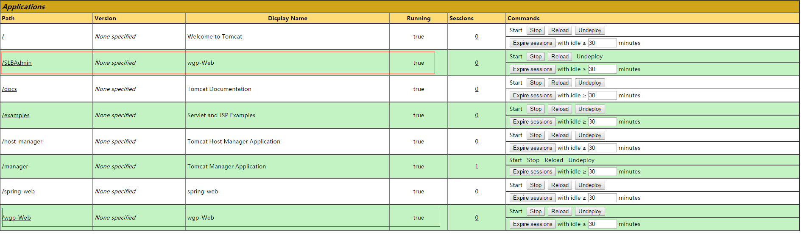
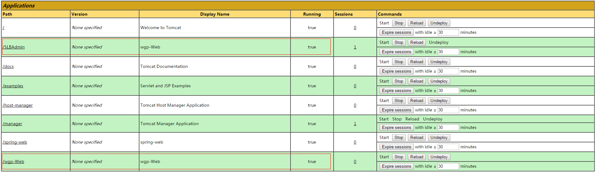
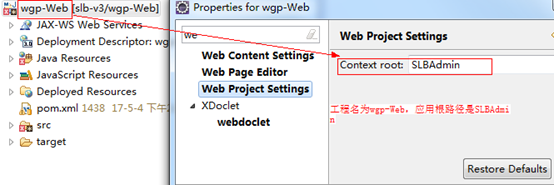
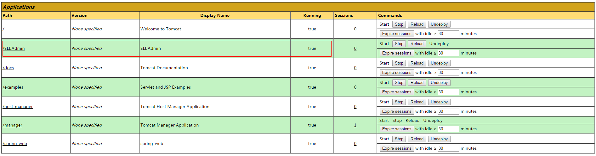

## 前言

最近项目中有个定时任务的需求，定时检查mysql数据与etcd数据的一致性，具体实现细节就不说了，今天要说的就是实现过程中遇到了druid抛出的异常，以及解决的过程

路漫漫其修远兮，吾将上下而求索！

github：[https://github.com/youzhibing](https://github.com/youzhibing)

码云(gitee)：[https://gitee.com/youzhibing](https://gitee.com/youzhibing)

## 异常

详细信息

    
    
    五月 05, 2017 4:16:00 下午 com.alibaba.druid.proxy.DruidDriver warn
    警告: register druid-driver mbean error
    javax.management.InstanceAlreadyExistsException: com.alibaba.druid:type=DruidDriver
        at com.sun.jmx.mbeanserver.Repository.addMBean(Repository.java:437)
        at com.sun.jmx.interceptor.DefaultMBeanServerInterceptor.registerWithRepository(DefaultMBeanServerInterceptor.java:1898)
        at com.sun.jmx.interceptor.DefaultMBeanServerInterceptor.registerDynamicMBean(DefaultMBeanServerInterceptor.java:966)
        at com.sun.jmx.interceptor.DefaultMBeanServerInterceptor.registerObject(DefaultMBeanServerInterceptor.java:900)
        at com.sun.jmx.interceptor.DefaultMBeanServerInterceptor.registerMBean(DefaultMBeanServerInterceptor.java:324)
        at com.sun.jmx.mbeanserver.JmxMBeanServer.registerMBean(JmxMBeanServer.java:522)
        at com.alibaba.druid.proxy.DruidDriver.registerDriver(DruidDriver.java:99)
        at com.alibaba.druid.proxy.DruidDriver$1.run(DruidDriver.java:84)
        at java.security.AccessController.doPrivileged(Native Method)
        at com.alibaba.druid.proxy.DruidDriver.<clinit>(DruidDriver.java:81)
        at com.alibaba.druid.pool.DruidDataSource.init(DruidDataSource.java:579)
        at com.alibaba.druid.pool.DruidDataSource.getConnection(DruidDataSource.java:986)
        at com.alibaba.druid.pool.DruidDataSource.getConnection(DruidDataSource.java:982)
        at com.alibaba.druid.pool.DruidDataSource.getConnection(DruidDataSource.java:102)
        at org.springframework.jdbc.datasource.DataSourceTransactionManager.doBegin(DataSourceTransactionManager.java:211)
        at org.springframework.transaction.support.AbstractPlatformTransactionManager.getTransaction(AbstractPlatformTransactionManager.java:373)
        at org.springframework.transaction.interceptor.TransactionAspectSupport.createTransactionIfNecessary(TransactionAspectSupport.java:447)
        at org.springframework.transaction.interceptor.TransactionAspectSupport.invokeWithinTransaction(TransactionAspectSupport.java:277)
        at org.springframework.transaction.interceptor.TransactionInterceptor.invoke(TransactionInterceptor.java:96)
        at org.springframework.aop.framework.ReflectiveMethodInvocation.proceed(ReflectiveMethodInvocation.java:179)
        at org.springframework.aop.framework.CglibAopProxy$DynamicAdvisedInterceptor.intercept(CglibAopProxy.java:656)
        at com.huawei.wgp.task.TaskDbEtcdConsistencyCheck$$EnhancerBySpringCGLIB$$e1d6d636.consistencyCheck(<generated>)
        at sun.reflect.NativeMethodAccessorImpl.invoke0(Native Method)
        at sun.reflect.NativeMethodAccessorImpl.invoke(NativeMethodAccessorImpl.java:57)
        at sun.reflect.DelegatingMethodAccessorImpl.invoke(DelegatingMethodAccessorImpl.java:43)
        at java.lang.reflect.Method.invoke(Method.java:606)
        at org.springframework.scheduling.support.ScheduledMethodRunnable.run(ScheduledMethodRunnable.java:65)
        at org.springframework.scheduling.support.DelegatingErrorHandlingRunnable.run(DelegatingErrorHandlingRunnable.java:54)
        at org.springframework.scheduling.concurrent.ReschedulingRunnable.run(ReschedulingRunnable.java:81)
        at java.util.concurrent.Executors$RunnableAdapter.call(Executors.java:471)
        at java.util.concurrent.FutureTask.run(FutureTask.java:262)
        at java.util.concurrent.ScheduledThreadPoolExecutor$ScheduledFutureTask.access$201(ScheduledThreadPoolExecutor.java:178)
        at java.util.concurrent.ScheduledThreadPoolExecutor$ScheduledFutureTask.run(ScheduledThreadPoolExecutor.java:292)
        at java.util.concurrent.ThreadPoolExecutor.runWorker(ThreadPoolExecutor.java:1145)
        at java.util.concurrent.ThreadPoolExecutor$Worker.run(ThreadPoolExecutor.java:615)
        at java.lang.Thread.run(Thread.java:745)
    
    五月 05, 2017 4:16:00 下午 com.alibaba.druid.stat.DruidDataSourceStatManager error
    严重: register mbean error
    javax.management.InstanceAlreadyExistsException: com.alibaba.druid:type=DruidDataSourceStat
        at com.sun.jmx.mbeanserver.Repository.addMBean(Repository.java:437)
        at com.sun.jmx.interceptor.DefaultMBeanServerInterceptor.registerWithRepository(DefaultMBeanServerInterceptor.java:1898)
        at com.sun.jmx.interceptor.DefaultMBeanServerInterceptor.registerDynamicMBean(DefaultMBeanServerInterceptor.java:966)
        at com.sun.jmx.interceptor.DefaultMBeanServerInterceptor.registerObject(DefaultMBeanServerInterceptor.java:900)
        at com.sun.jmx.interceptor.DefaultMBeanServerInterceptor.registerMBean(DefaultMBeanServerInterceptor.java:324)
        at com.sun.jmx.mbeanserver.JmxMBeanServer.registerMBean(JmxMBeanServer.java:522)
        at com.alibaba.druid.stat.DruidDataSourceStatManager.addDataSource(DruidDataSourceStatManager.java:139)
        at com.alibaba.druid.pool.DruidDataSource$1.run(DruidDataSource.java:1446)
        at java.security.AccessController.doPrivileged(Native Method)
        at com.alibaba.druid.pool.DruidDataSource.registerMbean(DruidDataSource.java:1442)
        at com.alibaba.druid.pool.DruidDataSource.init(DruidDataSource.java:706)
        at com.alibaba.druid.pool.DruidDataSource.getConnection(DruidDataSource.java:986)
        at com.alibaba.druid.pool.DruidDataSource.getConnection(DruidDataSource.java:982)
        at com.alibaba.druid.pool.DruidDataSource.getConnection(DruidDataSource.java:102)
        at org.springframework.jdbc.datasource.DataSourceTransactionManager.doBegin(DataSourceTransactionManager.java:211)
        at org.springframework.transaction.support.AbstractPlatformTransactionManager.getTransaction(AbstractPlatformTransactionManager.java:373)
        at org.springframework.transaction.interceptor.TransactionAspectSupport.createTransactionIfNecessary(TransactionAspectSupport.java:447)
        at org.springframework.transaction.interceptor.TransactionAspectSupport.invokeWithinTransaction(TransactionAspectSupport.java:277)
        at org.springframework.transaction.interceptor.TransactionInterceptor.invoke(TransactionInterceptor.java:96)
        at org.springframework.aop.framework.ReflectiveMethodInvocation.proceed(ReflectiveMethodInvocation.java:179)
        at org.springframework.aop.framework.CglibAopProxy$DynamicAdvisedInterceptor.intercept(CglibAopProxy.java:656)
        at com.huawei.wgp.task.TaskDbEtcdConsistencyCheck$$EnhancerBySpringCGLIB$$e1d6d636.consistencyCheck(<generated>)
        at sun.reflect.NativeMethodAccessorImpl.invoke0(Native Method)
        at sun.reflect.NativeMethodAccessorImpl.invoke(NativeMethodAccessorImpl.java:57)
        at sun.reflect.DelegatingMethodAccessorImpl.invoke(DelegatingMethodAccessorImpl.java:43)
        at java.lang.reflect.Method.invoke(Method.java:606)
        at org.springframework.scheduling.support.ScheduledMethodRunnable.run(ScheduledMethodRunnable.java:65)
        at org.springframework.scheduling.support.DelegatingErrorHandlingRunnable.run(DelegatingErrorHandlingRunnable.java:54)
        at org.springframework.scheduling.concurrent.ReschedulingRunnable.run(ReschedulingRunnable.java:81)
        at java.util.concurrent.Executors$RunnableAdapter.call(Executors.java:471)
        at java.util.concurrent.FutureTask.run(FutureTask.java:262)
        at java.util.concurrent.ScheduledThreadPoolExecutor$ScheduledFutureTask.access$201(ScheduledThreadPoolExecutor.java:178)
        at java.util.concurrent.ScheduledThreadPoolExecutor$ScheduledFutureTask.run(ScheduledThreadPoolExecutor.java:292)
        at java.util.concurrent.ThreadPoolExecutor.runWorker(ThreadPoolExecutor.java:1145)
        at java.util.concurrent.ThreadPoolExecutor$Worker.run(ThreadPoolExecutor.java:615)
        at java.lang.Thread.run(Thread.java:745)

View Code

出现场景

当前开发只是定时任务，那么工程启动后一直在等定时任务的启动，没有进行其他任何的操作，而一旦定时任务启动就出现如上异常信息，但是定时任务正常执行完成，并且不影响应用的其他任何服务，就和没抛异常一样！

## druid分析

程序员多多少少都有强迫症，看不得出现异常。虽说上述的异常不影响应用，但抛出来了就给我一种不爽的感觉，强迫自己解决它。

所有的异常信息都将矛头指向了druid，那么我们就从druid下手。很幸运，网上这方面的资料有不少，最后在druid的github上找到了[javax.management.InstanceAlreadyExistsException异常的问题](https://github.com/alibaba/druid/issues/1200)和[CentOS
release 6.5
总是抛InstanceAlreadyExistsException](https://github.com/alibaba/druid/issues/538)这两篇issue，一篇说把spring的自动探测关闭掉，一篇说应用容器中同一实例被启动了两遍，引起的并发执行了两个定时任务；同一实例被启动了两遍，这个应该不可能，就不去探究了（真不用探究吗）；那么我们将spring的自动探测关闭掉试试，结果定时任务还是执行了两遍。按照网上提供的其他方式也没能解决这个问题，本以为这个问题要求助领导了，可上天还是眷顾我的。

一次偶然的巧合，我在定时任务启动前，从浏览器请求了我的应用，再当定时任务启动的时候，异常没有产生，更巧合的是，数据库中的数据在浏览器上显示重复了，也就说定时任务产生了两份相同的数据插入到了数据库中，定时任务还是执行了两次！
这么说来，异常的产生和druid没关系，很有可能是定时任务的原因。

那么问题就转移了，从druid转移到定时任务了。

## 定时任务分析  

###  不加定时任务

    
    
    <?xml version="1.0" encoding="UTF-8"?>
    <beans xmlns="http://www.springframework.org/schema/beans" xmlns:xsi="http://www.w3.org/2001/XMLSchema-instance"
        xmlns:context="http://www.springframework.org/schema/context" xmlns:task="http://www.springframework.org/schema/task"
        xsi:schemaLocation="http://www.springframework.org/schema/beans
        http://www.springframework.org/schema/beans/spring-beans-3.1.xsd
        http://www.springframework.org/schema/context
        http://www.springframework.org/schema/context/spring-context-3.1.xsd
        http://www.springframework.org/schema/task
        http://www.springframework.org/schema/task/spring-task-3.1.xsd">
    
        <!-- <bean id="taskDbEtcdConsistencyCheck" class="com.yzb.wgp.task.TaskDbEtcdConsistencyCheck" />
        <task:scheduled-tasks scheduler="schedulerDbEtcdConsistencyCheck">
            <task:scheduled ref="taskDbEtcdConsistencyCheck" method="consistencyCheck" cron="0 58 23 * * ?" />
        </task:scheduled-tasks>
        <task:scheduler id="schedulerDbEtcdConsistencyCheck" pool-size="2" /> -->
    </beans>

结果是：启动之后，不请求应用则dataSource-1不初始化，请求应用，dataSource-1只初始化一次

    
    
    五月 08, 2017 8:56:12 上午 com.alibaba.druid.pool.DruidDataSource info
    
    信息: {dataSource-1} inited

这个很好理解，连接池采用了懒加载，真正用到的时候才初始化

###  加定时任务

####  a)、定时任务启动前，向应用SLBAdmin发送请求

结果是：请求的时候初始化dataSource-1一次，接着执行一次定时任务，然后又初始化一次dataSource-1，最后执行一次定时任务

    
    
    五月 08, 2017 9:21:02 上午 com.alibaba.druid.pool.DruidDataSource info
    信息: {dataSource-1} inited
    定时任务...
    五月 08, 2017 9:22:00 上午 com.alibaba.druid.pool.DruidDataSource info
    信息: {dataSource-1} inited
    定时任务...

这就有了疑问：

1、定时任务为什么启动了2次

2、dataSource-1为什么会初始化2次，照理说应该只初始化一次，这个两次是怎么出现的了，感觉初始化3次都比初始化2次好理解(一次初始化对应所有前端请求，另外2次初始化分别对应两次定时任务)

3、没有抛异常：javax.management.InstanceAlreadyExistsException，这又是为什么了

####  b)、定时任务启动前，不向应用SLBAdmin发送任何请求

结果是：先出现异常 ，再初始化dataSource-1两次，最后定时任务执行两次

    
    
    异常信息：略，在上面有
    五月 08, 2017 9:38:00 上午 com.alibaba.druid.pool.DruidDataSource info
    信息: {dataSource-1} inited
    五月 08, 2017 9:38:00 上午 com.alibaba.druid.pool.DruidDataSource info
    信息: {dataSource-1} inited
    定时任务...
    定时任务...

这也有了疑问：

1、这里为什么出现异常，而且这个异常没有终止应用程序，应用程序还是能够正常提供服务

2、为什么是初始化dataSource-1两次后调用两次定时任务，而不是像a)那样初始化一次dataSource-1，调用一次定时任务，再初始化一次dataSource-1，再调用一次定时任务

###  分析

    
    
    　　<bean id="taskDbEtcdConsistencyCheck" class="com.yzb.wgp.task.TaskDbEtcdConsistencyCheck" />
        <task:scheduled-tasks>
            <task:scheduled ref="taskDbEtcdConsistencyCheck" method="consistencyCheck" cron="0 07 10 * * ?" />
        </task:scheduled-tasks>
        <task:scheduler id="schedulerConsistencyCheck" pool-size="1"/>
    
    
    System.out.println("Thread-id=" + Thread.currentThread().getId() + " ThreadName=" + Thread.currentThread().getName() + " : 定时任务...");

将执行定时任务的线程id及线程名打印出来，配置及打印代码如上，结果和 2、加定时任务 一样， 只是有我们需要的信息：

    
    
    Thread-id=17 ThreadName=pool-1-thread-1 : 定时任务...
    Thread-id=18 ThreadName=pool-2-thread-1 : 定时任务...

线程id不同，线程池也不同，那么就说明这是两个不同的线程(线程名相同只是spring采用了默认的命名规则，如果我们在配置文件中指定线程的名字，那么线程名也是相同的)，这就证明不是同一个线程调用了两次目标方法，那么问题又来了：怎么会产生两个定时任务的线程了

####  我们来列举下可能两个线程的产生的场景：

i、配置了两个定时任务，目标类和目标方法是同一个，同时同一时间点执行，像如下配置

    
    
    <bean id="taskDbEtcdConsistencyCheck" class="com.huawei.wgp.task.TaskDbEtcdConsistencyCheck" />
        
        <task:scheduled-tasks>
            <task:scheduled ref="taskDbEtcdConsistencyCheck" method="consistencyCheck" cron="0 07 10 * * ?" />
            <task:scheduled ref="taskDbEtcdConsistencyCheck" method="consistencyCheck" cron="0 07 10 * * ?" />
        </task:scheduled-tasks>
        <task:scheduler id="schedulerConsistencyCheck" pool-size="2"/>

ii、应用中只有一个定时任务，但是应用被tomcat启动了两遍

i场景很容易排除，定时任务的配置文件内容很少，很容易排查；但是ii场景是怎么产生的了，那么我们去看下tomcat的应用列表

## tomcat应用列表

###  不加定时任务

###  定时任务启动前，向应用SLBAdmin发送请求

定时任务启动前，不向应用SLBAdmin发送请求

注意上面三张图片中标红的地方，理论上来讲，每张图片的第二处标红的地方是不应该出现的，也就是Path为wgp-
Web的那一行应该是不存在的，那么它是怎么出现的了？ 我们来看下我们的工程

这种不一致是怎么产生的了，工程名和发布路径一开始都是叫wgp-
Web，后面发布路径改成了SLBAdmin，而工程名没有改，就导致了这种不一致。那么我们将工程名也改成SLBAdmin，再看看tomcat应用列表

应用列表正常，而SLBAdmin应用也达到了预料中的正常，既没有抛出异常，定时任务也只在定点执行了一次。

## 疑问解答

###  定时任务启动前，向应用SLBAdmin发送请求

1、定时任务为什么启动了2次

解答：应用容器中同一实例被启动了两遍，导致并发执行了两个定时任务。

2、dataSource-1为什么会初始化2次，照理说应该只初始化一次，这个两次是怎么出现的了，感觉初始化3次都比初始化2次好理解(一次初始化对应所有前端请求，另外2次初始化分别对应两次定时任务)

解答：因为在定时任务启动前请求了应用SLBAdmin，spring初始化了SLBAdmin的dataSource-1，当SLBAdmin定时任务启动的时候，就不会再去初始化SLBAdmin的dataSource-1了；但是容器中还存在wgp-
Web的定时任务，当到达定点时，SLBAdmin的定时任务和wgp-Web的定时任务会同时并发启动，由于wgp-
Web的dataSource-1还没有初始化，所以定时任务执行时初始化wgp-Web的dataSource-1。

3、没有抛异常：javax.management.InstanceAlreadyExistsException，这又是为什么了

解答：dataSource-1的初始化不是同时并发进行的，SLBAdmin在请求的时候初始化dataSource-1，在定时任务执行前，而wgp-
Web是在定时任务启动的时候初始化的，
spring会根据这个时间差来使得两次连接池的获取指向同一个连接池。这个答案是我猜想的，真正知道原因的朋友可以留个言！

###  定时任务启动前，不向应用SLBAdmin发送请求

1、这里为什么出现异常，而且这个异常没有终止应用程序，应用程序还是能够正常提供服务

解答：dataSource-1的初始化是同时并发进行的，这个更应该说是spring的bug，spring将实现了符合MBean规范的beans注册到mbeanserver中，但没处理好异常，所以悲剧了；
也就是说druid是没有问题的，那么服务是能正常提供的。

2、为什么是初始化dataSource-1两次后调用两次定时任务，而不是像a)那样初始化一次dataSource-1，调用一次定时任务，再初始化一次dataSource-1，再调用一次定时任务

解答：两个定时任务是在同一个定点执行，所以dataSource-1的初始化是同时并发进行的；
而a)中SLBAdmin是在定时任务执行前响应了请求，并初始化了dataSource-1，wgp-Web是在定时任务执行时初始化的dataSource-1。

为什么之前的版本没有出现这个问题了：之前的版本没有定时任务，另外，转测试版本和上线版本的Path与Display Name是一致的，都是SLBAdmin

## 总结

问题产生的根本原因还真是：同一实例被启动了两遍，Path为/SLBAdmin启动一次，Path为/wgp-Web启动一次，

开发过程中最好保证工程名与发布路径保证一直，避免不必要的麻烦

## 参考

https://github.com/alibaba/druid/issues/1200

https://github.com/alibaba/druid/issues/538

http://jingyan.baidu.com/article/48206aeaf9422e216ad6b39b.html

https://my.oschina.net/superkangning/blog/467487

