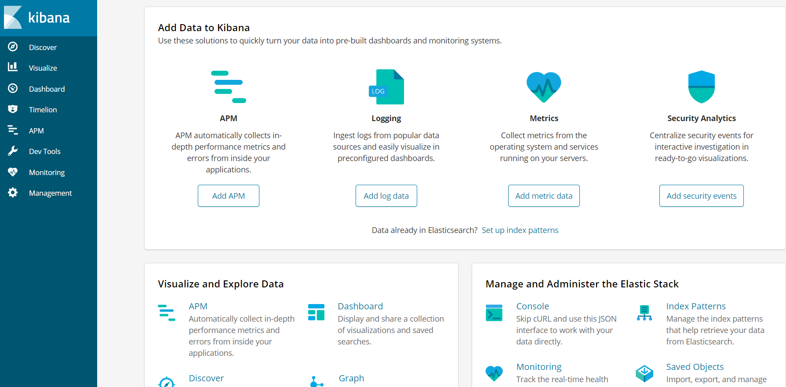
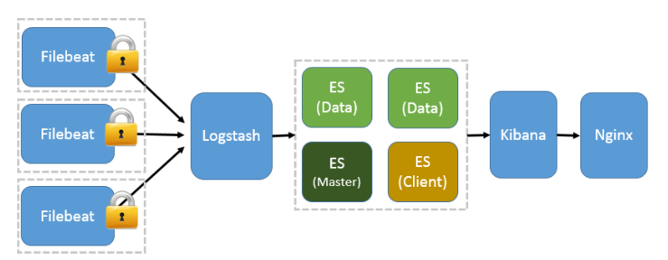
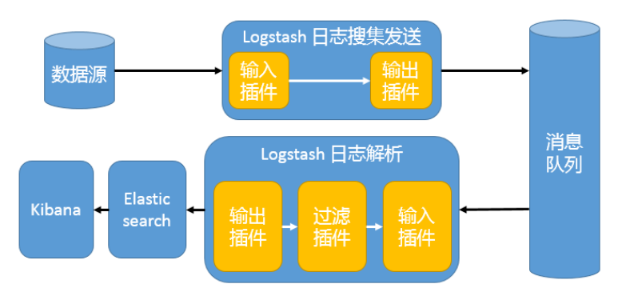

## 前言

刚从事开发那段时间不习惯输出日志，认为那是无用功，徒增代码量，总认为自己的代码无懈可击；老大的叮嘱、强调也都视为耳旁风，最终导致的结果是我加班排查问题，花的时间还挺长的，要复现问题、排查问题等，幸亏那是公司内部员工用的系统，时间长一点也没什么大问题，但是如果是针对客户的，时间就代表很多东西了，那造成的影响就非常大了。自那以后养成了输出日志的习惯。

但是后来发现，仅仅只是输出日志文件，对于排查问题来说，还是很费时，因为要在一个庞大的日志文件中过滤出我们需要的信息也十分耗时；那么此时基于日志文件的日志系统就被需要了。

至于需不需要搭建日志系统、以及搭建一个怎样的日志系统，需要根据我们的业务实际情况而定，例如公司内部员工用的一个不重要的系统，那么日志文件可能就够了；而对于针对客户的、直接与公司利益挂钩的，我认为不仅要搭建日志系统，更要输出更详细的日志信息到日志文件，提供运维的效率。

elk + filebeat 各个组件的功能

Elasticsearch：分布式搜索和分析引擎，具有高可伸缩、高可靠和易管理等特点。基于 Apache Lucene
构建，能对大容量的数据进行接近实时的存储、搜索和分析操作。通常被用作某些应用的基础搜索引擎，使其具有复杂的搜索功能；  
Logstash：数据收集引擎。它支持动态的从各种数据源搜集数据，并对数据进行过滤、分析、丰富、统一格式等操作，然后存储到用户指定的位置；  
Kibana：数据分析和可视化平台。通常与 Elasticsearch 配合使用，对其中数据进行搜索、分析和以统计图表的方式展示；  
Filebeat：一个轻量级开源日志文件数据搜集器，基于 Logstash-Forwarder 源代码开发，是对它的替代。在需要采集日志数据的 server
上安装 Filebeat，并指定日志目录或日志文件后，Filebeat 就能读取数据，迅速发送到 Logstash 进行解析，亦或直接发送到
Elasticsearch 进行集中式存储和分析；

本文不会对各个组件做详细的介绍与使用说明，如果想对各个组件有更详细的了解，那么需要大伙自行去学习，官网的资料就很不错。

## 环境准备

192.168.1.110：logstash + java

192.168.1.111：filebeat + redis + mysql + jdk + tomcat8

192.168.1.112：kibana

192.168.1.113：elasticsearch + java

## 日志系统搭建

相关安装包大家自行准备，去官网下载即可；elk+filebeat我用的都是6.3.2版本，jdk用的1.8版本，mysql是5.7，tomcat是8.5.30

###  Elasticsearch

依赖jdk，jdk的 搭建可参考我的
另一篇博客：[virtualBox安装centos，并搭建tomcat](https://www.cnblogs.com/youzhibing/p/5031080.html)

[root@cent0s7-03 opt]# tar -zxvf elasticsearch-6.3.2.tar.gz

[root@cent0s7-03 opt]# cd elasticsearch-6.3.2

修改配置，支持远程访问：

修改elasticsearch的home目录/config/elasticsearch.yml，打开配置项network.host:，并将其值设置成0.0.0.0；

但是需要增加系统配置来支持：

[root@cent0s7-03 bin]# vi /etc/security/limits.conf

新增如下配置

    
    
    * soft nofile 65536
    * hard nofile 131072
    * soft nproc 2048
    * hard nproc 4096

[root@cent0s7-03 bin]# vi /etc/sysctl.conf

新增如下配置

    
    
    vm.max_map_count=262144

[root@cent0s7-03 bin]# sysctl -p

启动elasticsearch

[root@cent0s7-03 bin]# ./elasticsearch

发现报错，如下

    
    
    [2018-08-19T10:26:33,685][WARN ][o.e.b.ElasticsearchUncaughtExceptionHandler] [] uncaught exception in thread [main]
    org.elasticsearch.bootstrap.StartupException: java.lang.RuntimeException: can not run elasticsearch as root
        at org.elasticsearch.bootstrap.Elasticsearch.init(Elasticsearch.java:140) ~[elasticsearch-6.3.2.jar:6.3.2]
        at org.elasticsearch.bootstrap.Elasticsearch.execute(Elasticsearch.java:127) ~[elasticsearch-6.3.2.jar:6.3.2]
        at org.elasticsearch.cli.EnvironmentAwareCommand.execute(EnvironmentAwareCommand.java:86) ~[elasticsearch-6.3.2.jar:6.3.2]
        at org.elasticsearch.cli.Command.mainWithoutErrorHandling(Command.java:124) ~[elasticsearch-cli-6.3.2.jar:6.3.2]
        at org.elasticsearch.cli.Command.main(Command.java:90) ~[elasticsearch-cli-6.3.2.jar:6.3.2]
        at org.elasticsearch.bootstrap.Elasticsearch.main(Elasticsearch.java:93) ~[elasticsearch-6.3.2.jar:6.3.2]
        at org.elasticsearch.bootstrap.Elasticsearch.main(Elasticsearch.java:86) ~[elasticsearch-6.3.2.jar:6.3.2]
    Caused by: java.lang.RuntimeException: can not run elasticsearch as root
        at org.elasticsearch.bootstrap.Bootstrap.initializeNatives(Bootstrap.java:104) ~[elasticsearch-6.3.2.jar:6.3.2]
        at org.elasticsearch.bootstrap.Bootstrap.setup(Bootstrap.java:171) ~[elasticsearch-6.3.2.jar:6.3.2]
        at org.elasticsearch.bootstrap.Bootstrap.init(Bootstrap.java:326) ~[elasticsearch-6.3.2.jar:6.3.2]
        at org.elasticsearch.bootstrap.Elasticsearch.init(Elasticsearch.java:136) ~[elasticsearch-6.3.2.jar:6.3.2]
        ... 6 more

View Code

这是出于系统安全考虑设置的条件。由于ElasticSearch可以接收用户输入的脚本并且执行，为了系统安全考虑，建议创建一个单独的用户用来运行ElasticSearch。

[root@cent0s7-03 bin]# groupadd elk

[root@cent0s7-03 bin]# useradd elsearch -g elk

[root@cent0s7-03 bin]# cd /opt

[root@cent0s7-03 opt]# chown -R elsearch:elk elasticsearch-6.3.2

[root@cent0s7-03 opt]# su elsearch

[elsearch@cent0s7-03 opt]$ cd elasticsearch-6.3.2/bin

[elsearch@cent0s7-03 bin]$ ./elasticsearch (加-d，则表示后端运行)

访问：http://192.168.1.113:9200，出现如下信息

    
    
    {
      "name" : "8dBt-dz",
      "cluster_name" : "elasticsearch",
      "cluster_uuid" : "gGH8gMvjTm62yyjob3aeZA",
      "version" : {
        "number" : "6.3.2",
        "build_flavor" : "default",
        "build_type" : "tar",
        "build_hash" : "053779d",
        "build_date" : "2018-07-20T05:20:23.451332Z",
        "build_snapshot" : false,
        "lucene_version" : "7.3.1",
        "minimum_wire_compatibility_version" : "5.6.0",
        "minimum_index_compatibility_version" : "5.0.0"
      },
      "tagline" : "You Know, for Search"
    }

表示单节点的elasticsearch搭建起来了

###  Kibana

[root@centos7-02 opt]# tar -zxvf kibana-6.3.2-linux-x86_64.tar.gz

[root@centos7-02 opt]# mv kibana-6.3.2-linux-x86_64 kibana6.3.2

修改配置文件：kibana.yml

[root@centos7-02 opt]# vi kibana6.3.2/config/kibana.yml

主要改改两项：

    
    
    server.host: "0.0.0.0"
    elasticsearch.url: "http://192.168.1.113:9200"

支援远程访问和从elasticsearch获取数据

[root@centos7-02 opt]# ./kibana6.3.2/bin/kibana

启动日志如下

    
    
      log   [11:09:00.993] [info][status][plugin:kibana@6.3.2] Status changed from uninitialized to green - Ready
      log   [11:09:01.032] [info][status][plugin:elasticsearch@6.3.2] Status changed from uninitialized to yellow - Waiting for Elasticsearch
      log   [11:09:01.034] [info][status][plugin:xpack_main@6.3.2] Status changed from uninitialized to yellow - Waiting for Elasticsearch
      log   [11:09:01.042] [info][status][plugin:searchprofiler@6.3.2] Status changed from uninitialized to yellow - Waiting for Elasticsearch
      log   [11:09:01.045] [info][status][plugin:ml@6.3.2] Status changed from uninitialized to yellow - Waiting for Elasticsearch
      log   [11:09:01.106] [info][status][plugin:tilemap@6.3.2] Status changed from uninitialized to yellow - Waiting for Elasticsearch
      log   [11:09:01.107] [info][status][plugin:watcher@6.3.2] Status changed from uninitialized to yellow - Waiting for Elasticsearch
      log   [11:09:01.123] [info][status][plugin:license_management@6.3.2] Status changed from uninitialized to green - Ready
      log   [11:09:01.125] [info][status][plugin:index_management@6.3.2] Status changed from uninitialized to yellow - Waiting for Elasticsearch
      log   [11:09:01.243] [info][status][plugin:timelion@6.3.2] Status changed from uninitialized to green - Ready
      log   [11:09:01.245] [info][status][plugin:graph@6.3.2] Status changed from uninitialized to yellow - Waiting for Elasticsearch
      log   [11:09:01.248] [info][status][plugin:monitoring@6.3.2] Status changed from uninitialized to green - Ready
      log   [11:09:01.250] [info][status][plugin:security@6.3.2] Status changed from uninitialized to yellow - Waiting for Elasticsearch
      log   [11:09:01.251] [warning][security] Generating a random key for xpack.security.encryptionKey. To prevent sessions from being invalidated on restart, please set xpack.security.encryptionKey in kibana.yml
      log   [11:09:01.255] [warning][security] Session cookies will be transmitted over insecure connections. This is not recommended.
      log   [11:09:01.280] [info][status][plugin:grokdebugger@6.3.2] Status changed from uninitialized to yellow - Waiting for Elasticsearch
      log   [11:09:01.300] [info][status][plugin:dashboard_mode@6.3.2] Status changed from uninitialized to green - Ready
      log   [11:09:01.304] [info][status][plugin:logstash@6.3.2] Status changed from uninitialized to yellow - Waiting for Elasticsearch
      log   [11:09:01.326] [info][status][plugin:apm@6.3.2] Status changed from uninitialized to green - Ready
      log   [11:09:01.330] [info][status][plugin:console@6.3.2] Status changed from uninitialized to green - Ready
      log   [11:09:01.332] [info][status][plugin:console_extensions@6.3.2] Status changed from uninitialized to green - Ready
      log   [11:09:01.334] [info][status][plugin:metrics@6.3.2] Status changed from uninitialized to green - Ready
      log   [11:09:01.644] [warning][reporting] Generating a random key for xpack.reporting.encryptionKey. To prevent pending reports from failing on restart, please set xpack.reporting.encryptionKey in kibana.yml
      log   [11:09:01.651] [info][status][plugin:reporting@6.3.2] Status changed from uninitialized to yellow - Waiting for Elasticsearch
      log   [11:09:01.697] [info][listening] Server running at http://0.0.0.0:5601
      log   [11:09:01.819] [info][status][plugin:elasticsearch@6.3.2] Status changed from yellow to green - Ready
      log   [11:09:01.852] [info][license][xpack] Imported license information from Elasticsearch for the [data] cluster: mode: basic | status: active
      log   [11:09:01.893] [info][status][plugin:xpack_main@6.3.2] Status changed from yellow to green - Ready
      log   [11:09:01.893] [info][status][plugin:searchprofiler@6.3.2] Status changed from yellow to green - Ready
      log   [11:09:01.894] [info][status][plugin:ml@6.3.2] Status changed from yellow to green - Ready
      log   [11:09:01.894] [info][status][plugin:tilemap@6.3.2] Status changed from yellow to green - Ready
      log   [11:09:01.895] [info][status][plugin:watcher@6.3.2] Status changed from yellow to green - Ready
      log   [11:09:01.895] [info][status][plugin:index_management@6.3.2] Status changed from yellow to green - Ready
      log   [11:09:01.895] [info][status][plugin:graph@6.3.2] Status changed from yellow to green - Ready
      log   [11:09:01.896] [info][status][plugin:security@6.3.2] Status changed from yellow to green - Ready
      log   [11:09:01.897] [info][status][plugin:grokdebugger@6.3.2] Status changed from yellow to green - Ready
      log   [11:09:01.897] [info][status][plugin:logstash@6.3.2] Status changed from yellow to green - Ready
      log   [11:09:01.898] [info][status][plugin:reporting@6.3.2] Status changed from yellow to green - Ready
      log   [11:09:01.916] [info][kibana-monitoring][monitoring-ui] Starting all Kibana monitoring collectors
      log   [11:09:01.926] [info][license][xpack] Imported license information from Elasticsearch for the [monitoring] cluster: mode: basic | status: active

View Code

几个警告不影响功能，不出现error就可以正常服务。

访问：http://192.168.1.112:5601，出现下图

###  Logstash

依赖jdk，jdk的 搭建可参考我的
另一篇博客：[virtualBox安装centos，并搭建tomcat](https://www.cnblogs.com/youzhibing/p/5031080.html)

[root@centos7-01 opt]# tar -zxvf logstash-6.3.2.tar.gz

新增配置文件：first-pipeline.conf

[root@centos7-01 opt]# vi logstash-6.3.2/config/first-pipeline.conf

    
    
    input {
        stdin {}
        beats {
            port => 5044
        }
    }
    output {
        elasticsearch {
            hosts => ["192.168.1.113:9200"]
        }
        stdout {
            codec => rubydebug
        }
    }

View Code

监听5044端口，filebeat会从此端口向logstash写入数据；logstash处理数据之后（filter，实例中没有展示）再输出到elasticsearch

[root@centos7-01 opt]# ./logstash-6.3.2/bin/logstash -f
/opt/logstash-6.3.2/config/first-pipeline.conf

启动日志如下

    
    
    Sending Logstash"s logs to /opt/logstash-6.3.2/logs which is now configured via log4j2.properties
    [2018-09-03T20:59:05,050][WARN ][logstash.config.source.multilocal] Ignoring the "pipelines.yml" file because modules or command line options are specified
    [2018-09-03T20:59:06,072][INFO ][logstash.runner          ] Starting Logstash {"logstash.version"=>"6.3.2"}
    [2018-09-03T20:59:11,487][INFO ][logstash.pipeline        ] Starting pipeline {:pipeline_id=>"main", "pipeline.workers"=>1, "pipeline.batch.size"=>125, "pipeline.batch.delay"=>50}
    [2018-09-03T20:59:12,222][INFO ][logstash.outputs.elasticsearch] Elasticsearch pool URLs updated {:changes=>{:removed=>[], :added=>[http://192.168.1.113:9200/]}}
    [2018-09-03T20:59:12,230][INFO ][logstash.outputs.elasticsearch] Running health check to see if an Elasticsearch connection is working {:healthcheck_url=>http://192.168.1.113:9200/, :path=>"/"}
    [2018-09-03T20:59:12,574][WARN ][logstash.outputs.elasticsearch] Restored connection to ES instance {:url=>"http://192.168.1.113:9200/"}
    [2018-09-03T20:59:12,669][INFO ][logstash.outputs.elasticsearch] ES Output version determined {:es_version=>6}
    [2018-09-03T20:59:12,672][WARN ][logstash.outputs.elasticsearch] Detected a 6.x and above cluster: the `type` event field won"t be used to determine the document _type {:es_version=>6}
    [2018-09-03T20:59:12,775][INFO ][logstash.outputs.elasticsearch] New Elasticsearch output {:class=>"LogStash::Outputs::ElasticSearch", :hosts=>["//192.168.1.113:9200"]}
    [2018-09-03T20:59:12,810][INFO ][logstash.outputs.elasticsearch] Using mapping template from {:path=>nil}
    [2018-09-03T20:59:12,862][INFO ][logstash.outputs.elasticsearch] Attempting to install template {:manage_template=>{"template"=>"logstash-*", "version"=>60001, "settings"=>{"index.refresh_interval"=>"5s"}, "mappings"=>{"_default_"=>{"dynamic_templates"=>[{"message_field"=>{"path_match"=>"message", "match_mapping_type"=>"string", "mapping"=>{"type"=>"text", "norms"=>false}}}, {"string_fields"=>{"match"=>"*", "match_mapping_type"=>"string", "mapping"=>{"type"=>"text", "norms"=>false, "fields"=>{"keyword"=>{"type"=>"keyword", "ignore_above"=>256}}}}}], "properties"=>{"@timestamp"=>{"type"=>"date"}, "@version"=>{"type"=>"keyword"}, "geoip"=>{"dynamic"=>true, "properties"=>{"ip"=>{"type"=>"ip"}, "location"=>{"type"=>"geo_point"}, "latitude"=>{"type"=>"half_float"}, "longitude"=>{"type"=>"half_float"}}}}}}}}
    [2018-09-03T20:59:13,758][INFO ][logstash.inputs.beats    ] Beats inputs: Starting input listener {:address=>"0.0.0.0:5044"}
    The stdin plugin is now waiting for input:
    [2018-09-03T20:59:13,852][INFO ][logstash.pipeline        ] Pipeline started successfully {:pipeline_id=>"main", :thread=>"#<Thread:0x2ff95604 run>"}
    [2018-09-03T20:59:13,958][INFO ][logstash.agent           ] Pipelines running {:count=>1, :running_pipelines=>[:main], :non_running_pipelines=>[]}
    [2018-09-03T20:59:14,066][INFO ][org.logstash.beats.Server] Starting server on port: 5044
    [2018-09-03T20:59:14,562][INFO ][logstash.agent           ] Successfully started Logstash API endpoint {:port=>9600}

View Code

###  Filebeat

[root@centos7 opt]# tar -zxvf filebeat-6.3.2-linux-x86_64.tar.gz

[root@centos7 opt]# mv filebeat-6.3.2-linux-x86_64 filebeat6.3.2

配置filebeat .yml

[root@centos7 opt]# vi filebeat6.3.2/filebeat.yml

配置之后，内容如下

    
    
    ###################### Filebeat Configuration Example #########################
    
    # This file is an example configuration file highlighting only the most common
    # options. The filebeat.reference.yml file from the same directory contains all the
    # supported options with more comments. You can use it as a reference.
    #
    # You can find the full configuration reference here:
    # https://www.elastic.co/guide/en/beats/filebeat/index.html
    
    # For more available modules and options, please see the filebeat.reference.yml sample
    # configuration file.
    
    #=========================== Filebeat inputs =============================
    
    filebeat.inputs:
    
    # Each - is an input. Most options can be set at the input level, so
    # you can use different inputs for various configurations.
    # Below are the input specific configurations.
    
    - type: log
    
      # Change to true to enable this input configuration.
      enabled: true
    
      # Paths that should be crawled and fetched. Glob based paths.
      paths:
        - /log/*.log
        #- c:\programdata\elasticsearch\logs\*
    
      # Exclude lines. A list of regular expressions to match. It drops the lines that are
      # matching any regular expression from the list.
      #exclude_lines: ["^DBG"]
    
      # Include lines. A list of regular expressions to match. It exports the lines that are
      # matching any regular expression from the list.
      #include_lines: ["^ERR", "^WARN"]
    
      # Exclude files. A list of regular expressions to match. Filebeat drops the files that
      # are matching any regular expression from the list. By default, no files are dropped.
      #exclude_files: [".gz$"]
    
      # Optional additional fields. These fields can be freely picked
      # to add additional information to the crawled log files for filtering
      #fields:
      #  level: debug
      #  review: 1
    
      ### Multiline options
    
      # Mutiline can be used for log messages spanning multiple lines. This is common
      # for Java Stack Traces or C-Line Continuation
    
      # The regexp Pattern that has to be matched. The example pattern matches all lines starting with [
      #multiline.pattern: ^\[
    
      # Defines if the pattern set under pattern should be negated or not. Default is false.
      #multiline.negate: false
    
      # Match can be set to "after" or "before". It is used to define if lines should be append to a pattern
      # that was (not) matched before or after or as long as a pattern is not matched based on negate.
      # Note: After is the equivalent to previous and before is the equivalent to to next in Logstash
      #multiline.match: after
    
    
    #============================= Filebeat modules ===============================
    
    filebeat.config.modules:
      # Glob pattern for configuration loading
      path: ${path.config}/modules.d/*.yml
    
      # Set to true to enable config reloading
      reload.enabled: false
    
      # Period on which files under path should be checked for changes
      #reload.period: 10s
    
    #==================== Elasticsearch template setting ==========================
    
    # setup.template.settings:
      # index.number_of_shards: 3
      #index.codec: best_compression
      #_source.enabled: false
    
    #================================ General =====================================
    
    # The name of the shipper that publishes the network data. It can be used to group
    # all the transactions sent by a single shipper in the web interface.
    #name:
    
    # The tags of the shipper are included in their own field with each
    # transaction published.
    #tags: ["service-X", "web-tier"]
    
    # Optional fields that you can specify to add additional information to the
    # output.
    #fields:
    #  env: staging
    
    
    #============================== Dashboards =====================================
    # These settings control loading the sample dashboards to the Kibana index. Loading
    # the dashboards is disabled by default and can be enabled either by setting the
    # options here, or by using the `-setup` CLI flag or the `setup` command.
    #setup.dashboards.enabled: false
    
    # The URL from where to download the dashboards archive. By default this URL
    # has a value which is computed based on the Beat name and version. For released
    # versions, this URL points to the dashboard archive on the artifacts.elastic.co
    # website.
    #setup.dashboards.url:
    
    #============================== Kibana =====================================
    
    # Starting with Beats version 6.0.0, the dashboards are loaded via the Kibana API.
    # This requires a Kibana endpoint configuration.
    # setup.kibana:
    
      # Kibana Host
      # Scheme and port can be left out and will be set to the default (http and 5601)
      # In case you specify and additional path, the scheme is required: http://localhost:5601/path
      # IPv6 addresses should always be defined as: https://[2001:db8::1]:5601
      #host: "localhost:5601"
    
    #============================= Elastic Cloud ==================================
    
    # These settings simplify using filebeat with the Elastic Cloud (https://cloud.elastic.co/).
    
    # The cloud.id setting overwrites the `output.elasticsearch.hosts` and
    # `setup.kibana.host` options.
    # You can find the `cloud.id` in the Elastic Cloud web UI.
    #cloud.id:
    
    # The cloud.auth setting overwrites the `output.elasticsearch.username` and
    # `output.elasticsearch.password` settings. The format is `<user>:<pass>`.
    #cloud.auth:
    
    #================================ Outputs =====================================
    
    # Configure what output to use when sending the data collected by the beat.
    
    #-------------------------- Elasticsearch output ------------------------------
    # output.elasticsearch:
      # Array of hosts to connect to.
      # hosts: ["localhost:9200"]
    
      # Optional protocol and basic auth credentials.
      #protocol: "https"
      #username: "elastic"
      #password: "changeme"
    
    #----------------------------- Logstash output --------------------------------
    output.logstash:
      # The Logstash hosts
      hosts: ["192.168.1.110:5044"]
    
      # Optional SSL. By default is off.
      # List of root certificates for HTTPS server verifications
      #ssl.certificate_authorities: ["/etc/pki/root/ca.pem"]
    
      # Certificate for SSL client authentication
      #ssl.certificate: "/etc/pki/client/cert.pem"
    
      # Client Certificate Key
      #ssl.key: "/etc/pki/client/cert.key"
    
    #================================ Logging =====================================
    
    # Sets log level. The default log level is info.
    # Available log levels are: error, warning, info, debug
    logging.level: info
    
    # At debug level, you can selectively enable logging only for some components.
    # To enable all selectors use ["*"]. Examples of other selectors are "beat",
    # "publish", "service".
    #logging.selectors: ["*"]
    
    #============================== Xpack Monitoring ===============================
    # filebeat can export internal metrics to a central Elasticsearch monitoring
    # cluster.  This requires xpack monitoring to be enabled in Elasticsearch.  The
    # reporting is disabled by default.
    
    # Set to true to enable the monitoring reporter.
    #xpack.monitoring.enabled: false
    
    # Uncomment to send the metrics to Elasticsearch. Most settings from the
    # Elasticsearch output are accepted here as well. Any setting that is not set is
    # automatically inherited from the Elasticsearch output configuration, so if you
    # have the Elasticsearch output configured, you can simply uncomment the
    # following line.
    #xpack.monitoring.elasticsearch:

View Code

主要是配置filebeat.inputs，采集哪些日志；关闭output.elasticsearch，打开output.logstash，将收集到的信息推送到logstash。

[root@centos7 opt]# ./filebeat6.3.2/filebeat -e -c
./filebeat6.3.2/filebeat.yml

启动日志如下

    
    
    2018-09-03T21:10:38.748+0800    INFO    instance/beat.go:492    Home path: [/opt/filebeat6.3.2] Config path: [/opt/filebeat6.3.2] Data path: [/opt/filebeat6.3.2/data] Logs path: [/opt/filebeat6.3.2/logs]
    2018-09-03T21:10:38.780+0800    INFO    instance/beat.go:499    Beat UUID: 07d523d5-68ef-4470-a99d-5476bbc8535d
    2018-09-03T21:10:38.780+0800    INFO    [beat]    instance/beat.go:716    Beat info    {"system_info": {"beat": {"path": {"config": "/opt/filebeat6.3.2", "data": "/opt/filebeat6.3.2/data", "home": "/opt/filebeat6.3.2", "logs": "/opt/filebeat6.3.2/logs"}, "type": "filebeat", "uuid": "07d523d5-68ef-4470-a99d-5476bbc8535d"}}}
    2018-09-03T21:10:38.781+0800    INFO    [beat]    instance/beat.go:725    Build info    {"system_info": {"build": {"commit": "45a9a9e1561b6c540e94211ebe03d18abcacae55", "libbeat": "6.3.2", "time": "2018-07-20T04:18:19.000Z", "version": "6.3.2"}}}
    2018-09-03T21:10:38.781+0800    INFO    [beat]    instance/beat.go:728    Go runtime info    {"system_info": {"go": {"os":"linux","arch":"amd64","max_procs":1,"version":"go1.9.4"}}}
    2018-09-03T21:10:38.800+0800    INFO    [beat]    instance/beat.go:732    Host info    {"system_info": {"host": {"architecture":"x86_64","boot_time":"2018-09-03T15:40:54+08:00","containerized":true,"hostname":"centos7","ips":["127.0.0.1/8","::1/128","192.168.1.111/24","fe80::3928:4541:b030:bea4/64"],"kernel_version":"3.10.0-862.el7.x86_64","mac_addresses":["08:00:27:e9:d7:da"],"os":{"family":"redhat","platform":"centos","name":"CentOS Linux","version":"7 (Core)","major":7,"minor":5,"patch":1804,"codename":"Core"},"timezone":"CST","timezone_offset_sec":28800,"id":"acc3d28b9c824b55b6cdd5c8c2a46705"}}}
    2018-09-03T21:10:38.803+0800    INFO    [beat]    instance/beat.go:761    Process info    {"system_info": {"process": {"capabilities": {"inheritable":null,"permitted":["chown","dac_override","dac_read_search","fowner","fsetid","kill","setgid","setuid","setpcap","linux_immutable","net_bind_service","net_broadcast","net_admin","net_raw","ipc_lock","ipc_owner","sys_module","sys_rawio","sys_chroot","sys_ptrace","sys_pacct","sys_admin","sys_boot","sys_nice","sys_resource","sys_time","sys_tty_config","mknod","lease","audit_write","audit_control","setfcap","mac_override","mac_admin","syslog","wake_alarm","block_suspend"],"effective":["chown","dac_override","dac_read_search","fowner","fsetid","kill","setgid","setuid","setpcap","linux_immutable","net_bind_service","net_broadcast","net_admin","net_raw","ipc_lock","ipc_owner","sys_module","sys_rawio","sys_chroot","sys_ptrace","sys_pacct","sys_admin","sys_boot","sys_nice","sys_resource","sys_time","sys_tty_config","mknod","lease","audit_write","audit_control","setfcap","mac_override","mac_admin","syslog","wake_alarm","block_suspend"],"bounding":["chown","dac_override","dac_read_search","fowner","fsetid","kill","setgid","setuid","setpcap","linux_immutable","net_bind_service","net_broadcast","net_admin","net_raw","ipc_lock","ipc_owner","sys_module","sys_rawio","sys_chroot","sys_ptrace","sys_pacct","sys_admin","sys_boot","sys_nice","sys_resource","sys_time","sys_tty_config","mknod","lease","audit_write","audit_control","setfcap","mac_override","mac_admin","syslog","wake_alarm","block_suspend"],"ambient":null}, "cwd": "/opt", "exe": "/opt/filebeat6.3.2/filebeat", "name": "filebeat", "pid": 1579, "ppid": 1454, "seccomp": {"mode":"disabled"}, "start_time": "2018-09-03T21:10:37.710+0800"}}}
    2018-09-03T21:10:38.803+0800    INFO    instance/beat.go:225    Setup Beat: filebeat; Version: 6.3.2
    2018-09-03T21:10:38.804+0800    INFO    pipeline/module.go:81    Beat name: centos7
    2018-09-03T21:10:38.816+0800    INFO    instance/beat.go:315    filebeat start running.
    2018-09-03T21:10:38.816+0800    INFO    [monitoring]    log/log.go:97    Starting metrics logging every 30s
    2018-09-03T21:10:38.817+0800    INFO    registrar/registrar.go:117    Loading registrar data from /opt/filebeat6.3.2/data/registry
    2018-09-03T21:10:38.821+0800    INFO    registrar/registrar.go:124    States Loaded from registrar: 1
    2018-09-03T21:10:38.821+0800    WARN    beater/filebeat.go:354    Filebeat is unable to load the Ingest Node pipelines for the configured modules because the Elasticsearch output is not configured/enabled. If you have already loaded the Ingest Node pipelines or are using Logstash pipelines, you can ignore this warning.
    2018-09-03T21:10:38.821+0800    INFO    crawler/crawler.go:48    Loading Inputs: 1
    2018-09-03T21:10:38.822+0800    INFO    log/input.go:118    Configured paths: [/log/*.log]
    2018-09-03T21:10:38.822+0800    INFO    input/input.go:88    Starting input of type: log; ID: 8294414020995878211 
    2018-09-03T21:10:38.866+0800    INFO    crawler/crawler.go:82    Loading and starting Inputs completed. Enabled inputs: 1
    2018-09-03T21:10:38.867+0800    INFO    cfgfile/reload.go:122    Config reloader started
    2018-09-03T21:10:38.867+0800    INFO    cfgfile/reload.go:214    Loading of config files completed.
    2018-09-03T21:10:38.883+0800    INFO    log/harvester.go:228    Harvester started for file: /log/spring-boot-integrate.log.2018-08-21.log
    2018-09-03T21:11:08.819+0800    INFO    [monitoring]    log/log.go:124    Non-zero metrics in the last 30s    {"monitoring": {"metrics": {"beat":{"cpu":{"system":{"ticks":50,"time":{"ms":54}},"total":{"ticks":70,"time":{"ms":83},"value":70},"user":{"ticks":20,"time":{"ms":29}}},"info":{"ephemeral_id":"faaf6d3e-8fff-4670-9dca-c51b48b134c8","uptime":{"ms":30102}},"memstats":{"gc_next":5931008,"memory_alloc":3006968,"memory_total":4960192,"rss":15585280}},"filebeat":{"events":{"added":93,"done":93},"harvester":{"open_files":1,"running":1,"started":1}},"libbeat":{"config":{"module":{"running":0},"reloads":1},"output":{"events":{"acked":91,"batches":1,"total":91},"read":{"bytes":6},"type":"logstash","write":{"bytes":5990}},"pipeline":{"clients":1,"events":{"active":0,"filtered":2,"published":91,"retry":91,"total":93},"queue":{"acked":91}}},"registrar":{"states":{"current":1,"update":93},"writes":{"success":3,"total":3}},"system":{"cpu":{"cores":1},"load":{"1":0.05,"15":0.05,"5":0.03,"norm":{"1":0.05,"15":0.05,"5":0.03}}}}}}

View Code

采集的是/log下的所有的log文件，我们就用工程：[spring-boot-
integrate](https://gitee.com/youzhibing/spring-boot-2.0.3/tree/master/spring-
boot-integrate)来产生log文件（对应的就是我们的项目产生的日志文件）；spring-boot-
integrate依赖127.0.0.1的redis和mysql，需要把redis和mysql启动起来（注意我的redis是配置了密码的，mysql用的数据库是spring-
boot，sql文件在工程中）。

[root@centos7 redis-3.2.12]# cd /usr/local/redis-3.2.12/

[root@centos7 redis-3.2.12]# ./src/redis-server redis.conf

[root@centos7 local]# service mysqld start

启动我们的spring-boot-integrate

用maven生成war包，将spring-boot-
integrate.war包拷贝到tomcat的webapps，启动tomcat即可；注意tomcat版本需要8及以上；

[root@centos7 opt]# cd /usr/local/apache-tomcat-8.5.33/

[root@centos7 apache-tomcat-8.5.33]# ./bin/startup.sh

访问：http://192.168.1.111:8080/spring-boot-integrate，如下图

说明应用启动成功，我们可以参照：[spring-boot-2.0.3不一样系列之shiro -
搭建篇](https://www.cnblogs.com/youzhibing/p/9536384.html)，访问应用，多产生一些日志数据。

## 效果

最终数据到kibana进行可视化展示，我们看看我们刚刚的日志在kibana中的展示情况

## 总结

架构图

一般而言，架构图如下

由nginx对外暴露访问接口，并提供负载均衡功能。本文中没有集成nginx，大家可以自己去实现，集成nginx也不难。

另外也没有集成消息中间件

这种架构适合于日志规模比较庞大的情况。但由于 Logstash 日志解析节点和 Elasticsearch
的负荷比较重，可将他们配置为集群模式，以分担负荷。引入消息队列，均衡了网络传输，从而降低了网络闭塞，尤其是丢失数据的可能性，但依然存在 Logstash
占用系统资源过多的问题。

2、基于docker的搭建

ELK版本迭代非常快，如果能基于docker做成镜像，基于docker搭建，既方便ELK的统一搭建、也方便ELK的升级；有兴趣的小伙伴可以试着搭建。

3、组件组合

本文只是简单的实现了ELK + Filebeat各个组件都是单节点的集成，相当于搭建了最基础版本；当然有了这个基础版本，再搭建某些组件的集群版本也不难了。

另外，组件之间是可以灵活组合的，有些组件也不是必须的，我们可以根据我们业务量的需求来搭建合适的日志系统。

4、组件详情

本文只是讲elk+filebeat的搭建，各个组件的详情没有具体介绍，需要大家自己去了解了；各个组件的内容还是挺多的，更好的了解各个组件，对搭建高性能的日志系统有很大帮助。

## 参考

[谈日志的重要性】运维中被低估的日志](https://blog.csdn.net/hj7jay/article/details/53483219)

[集中式日志系统 ELK 协议栈详解](https://www.ibm.com/developerworks/cn/opensource/os-cn-
elk/)

[ELK+Filebeat
集中式日志解决方案详解](https://www.ibm.com/developerworks/cn/opensource/os-cn-elk-
filebeat/index.html)

[从零开始搭建ELK+GPE监控预警系统](https://www.cnblogs.com/smallSevens/p/7860461.html)

